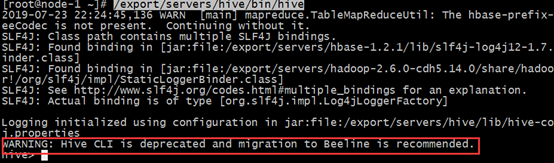

# Apache Hive数仓（离线数仓）

# 学习目标

在实际工作中，主要是完成指标分析。离线数仓 => Hive/Spark，SQL boy/girl

Hive  on  MR

Hive  on  Tez

Hive  on  Spark

① 搞清楚数仓（面向分析、导入、查询）、高延迟与数据库（增删改查）、低延迟区别

② 数仓分层（ODS源数据层、DW层数仓层、DA数据应用层）

③ 方便数据分析、进行血缘追踪、把复杂问题简单化...

④ Hive主要有两部分：元数据metadata => MySQL里面、元数据服务metastore（连接MySQL、管理元数据）

Client(hive/beeline)  =>  hiveserver2(10000) => metastore => mysql

实际文件保存在HDFS集群中

Hive（SQL） =>  MR

⑤ Hive安装

# 一、 数据仓库概述

## 1、什么是数据仓库（数仓）

[数据仓库](http://baike.baidu.com/item/数据仓库)，英文名称为Data Warehouse，可简写为[DW](http://baike.baidu.com/item/DW/1264123)或DWH。数据仓库的目的是构建==**面向分析**==的集成化数据环境，为企业提供==**决策支持**==（Decision Support）。它出于分析性报告和决策支持目的而创建。

> MySQL数据库 => 面向事务的集成化数据环境；但是DW则是面向分析的集成化数据环境，主要实现数据的写入与数据分析，很少有数据的修改操作！

数据仓库==本身并不“生产”任何数据，同时自身也不需要“消费”任何的数据==，数据来源于外部，并且开放给外部应用，这也是为什么叫“仓库”，而不叫“工厂”的原因。


## 2、数据仓库的主要特征

数据仓库是**面向主题**的（Subject-Oriented ）、**集成**的（Integrated）、**非易失**的（Non-Volatile）和**时变**的（Time-Variant ）数据集合，用以支持管理决策 。

### ☆ 面向主题（确认要分析什么，什么就是主题）

主题是一个抽象的概念，是较高层次上企业信息系统中的数据综合、归类并进行分析利用的抽象。


### ☆ 集成性

通过对分散、独立、异构的数据库数据进行抽取、清理、转换和汇总便得到了数据仓库的数据

数据仓库中的综合数据不能从原有的数据库系统直接得到。因此在数据进入数据仓库之前，必然要经过统一与综合，这一步是数据仓库建设中最关键、最复杂的一步，所要完成的工作有：

（1）要统一源数据中所有矛盾之处，如字段的同名异义、异名同义、单位不统一、字长不一致，等等。

（2）进行数据综合和计算。数据仓库中的数据综合工作可以在从原有数据库抽取数据时生成，但许多是在数据仓库内部生成的，即进入数据仓库以后进行综合生成的。

下图说明一个保险公司综合数据的简单处理过程，其中数据仓库中与“保险”主题有关的数据来自于多个不同的操作型系统。这些系统内部数据的命名可能不同，数据格式也可能不同。把不同来源的数据存储到数据仓库之前，需要去除这些不一致。


### ☆ 非易失性（不可更新性）

操作型数据库主要服务于日常的业务操作，使得数据库需要不断地对数据实时更新，以便迅速获得当前最新数据，不至于影响正常的业务运作。在数据仓库中只要保存过去的业务数据，不需要每一笔业务都实时更新数据仓库，而是根据商业需要每隔一段时间把一批较新的数据导入数据仓库。

==数据仓库的数据反映的是一段相当长的时间内历史数据的内容（离线数据）==

数据非易失性主要是针对应用而言。数据仓库的用户对数据的操作大多是数据查询或比较复杂的挖掘，一旦数据进入数据仓库以后，一般情况下被较长时间保留。==数据仓库中一般有大量的查询操作，但修改和删除操作很少==。因此，数据经加工和集成进入数据仓库后是极少更新的，通常只需要定期的加载和更新。

> 数仓：① 离线 => Hive ② 实时 => Flink

### ☆ 时变性

离线数仓：侧重于离线两个字，历史数据分析

实时数仓：侧重于实时两个字，实时数据分析

数据仓库包含各种粒度的历史数据。数据仓库中的数据可能与某个特定日期、星期、月份、季度或者年份有关。==数据仓库的目的是通过分析企业过去一段时间业务的经营状况，挖掘其中隐藏的模式==。

虽然数据仓库的用户不能修改数据，但并不是说数据仓库的数据是永远不变的。分析的结果只能反映过去的情况，当业务变化后，挖掘出的模式会失去时效性。因此数据仓库的数据需要更新，以适应决策的需要。从这个角度讲，数据仓库建设是一个项目，更是一个过程 。数据仓库的数据随时间的变化表现在以下几个方面：

① 数据仓库的数据时限一般要远远长于操作型数据的数据时限。

② 操作型系统存储的是当前数据，而数据仓库中的数据是历史数据。

③ 数据仓库中的数据是按照时间顺序追加的，它们都带有时间属性。

> 面向主题分析，经常要与时间相关，所以SQL语句经常需要对时间进行分析查询

## 3、数据仓库与数据库区别

很多人在学习数仓时，都会认为这是不是就是大号的数据库呢？答：这是错误的理解，两者是完全不同的

数据库与数据仓库的区别实际讲的是OLTP与OLAP的区别。

数仓：OLAP（"A"，分析）=> 分析（查）

数据库：OLTP（"T"，事务） => 事务（增删改）


操作型处理，叫联机事务处理OLTP（On-Line **Transaction** Processing，），也可以称面向交易的处理系统，它是针对具体业务在数据库联机的日常操作，通常对少数记录进行查询、修改。用户较为关心操作的响应时间、数据的安全性、完整性和并发支持的用户数等问题。传统的数据库系统作为数据管理的主要手段，主要用于操作型处理。

分析型处理，叫联机分析处理OLAP（On-Line **Analytical** Processing）一般针对某些主题的历史数据进行分析，支持管理决策。

首先要明白，数据仓库的出现，并不是要取代数据库：
	数据库是面向事务的设计，数据仓库是面向主题设计的。
	数据库一般存储业务数据，数据仓库存储的一般是历史数据。
	数据库设计是尽量避免冗余，一般针对某一业务应用进行设计，比如一张简单的User表，记录用户名、密码等简单数据即可，符合业务应用，但是不符合分析。数据仓库在设计是有意引入冗余，依照分析需求，分析维度、分析指标进行设计。
	数据库是为捕获数据而设计，数据仓库是为分析数据而设计。

==数据仓库，是在数据库已经大量存在的情况下，为了进一步挖掘数据资源、为了决策需要而产生的，它决不是所谓的“大型数据库”==。


**对比：数据库（OLTP）与数据仓库（OLAP）区别**

答：

明确一点，数据仓库的出现不是用于代替数据库的，是两种完全不同的应用。


① 数据库是事务型OLTP处理，支持增删改查操作；数据仓库是面向主题OLAP型应用，主要是查询操作，很少有更新与删除

② 数据量不同，数据库数据量较少；数据仓库往往是海量数据（底层是HDFS）

③ 存储数据时效性不同，数据库往往是当前数据，数仓往往历史数据（离线）

④ 查询速度也有很大区别，数据库往往是低延迟，数据仓库往往是高延迟查询

## 4、数据仓库分层架构（重点）

按照数据流入流出的过程，数据仓库架构可分为三层——**源数据**、**数据仓库**、**数据应用。**


数据仓库的数据来源于不同的源数据，并提供多样的数据应用，数据自下而上流入数据仓库后向上层开放应用，而数据仓库只是中间集成化数据管理的一个平台。

	源数据层（ODS）：此层数据无任何更改，直接沿用外围系统数据结构和数据，不对外开放；为临时存储层，是接口数据的临时存储区域，为后一步的数据处理做准备。
	数据仓库层（DW）：也称为细节层，DW层的数据应该是一致的、准确的、干净的数据，即对源系统数据进行了清洗（去除了杂质）后的数据。
	数据应用层（DA或APP）：前端应用直接读取的数据源；根据报表、专题分析需求而计算生成的数据。


数据仓库从各数据源获取数据及在数据仓库内的数据转换和流动都可以认为是ETL（抽取Extra, 转化Transfer, 装载Load）的过程，ETL是数据仓库的流水线，也可以认为是数据仓库的血液，它维系着数据仓库中数据的新陈代谢，而数据仓库日常的管理和维护工作的大部分精力就是保持ETL的正常和稳定。


ODS：源数据层，主要负责原始数据的存储

DW：数据仓库层，主要负责对ODS层的数据进行清洗、转换、分析

DA/APP/RPT：数据应用层，主要负责对主题分析的结果进行最终的展现

> 强调：所谓的分层就是把海量数据分不同的数据库进行存放。ods数据库、dw数据库、rpt数据库


==为什么要对数据仓库分层？==

==用空间换时间，通过大量的预处理来提升应用系统的用户体验（效率），因此数据仓库会存在大量冗余的数据；不分层的话，如果源业务系统的业务规则发生变化将会影响整个数据清洗过程，工作量巨大。==

通过数据分层管理可以简化数据清洗的过程，因为把原来一步的工作分到了多个步骤去完成，相当于把一个复杂的工作拆成了多个简单的工作，把一个大的黑盒变成了一个白盒，每一层的处理逻辑都相对简单和容易理解，这样我们比较容易保证每一个步骤的正确性，当数据发生错误的时候，往往我们只需要局部调整某个步骤即可。

```powershell
面试题：你们项目是如何进行分层的，为什么要进行数仓分层？
第一个问题：
我们的项目一般分为三层：① ODS源数据层（采集源数据）② DW数据仓库层（数据清洗与数据分析）③ DA数据应用层（把分析结果对应外部应用）

第二个问题：
① 清晰的数据结构
② 实现血缘追踪（数据治理中的一个概念）
③ 减少重复开发
④ 把复杂问题简单化：大问题拆解若干个小问题 => 美团点评 153张数据表 => 12张数据表
⑤ 屏蔽原始数据异常
```

## 5、ETL与ELT

数据仓库从各数据源获取数据及在数据仓库内的数据转换和流动都可以认为是ETL（==抽取Extract, 转化Transform , 装载Load==）的过程。

但是在实际操作中将数据加载到仓库却产生了两种不同做法：ETL和ELT。

### ☆ ETL

我们来回顾一下ETL的流程：

① 首先从源端拉取数据，这个过程就是extract。通常我们所熟知的Kettle，Sqoop这些数据同步工具就是干这个事情的。

② 当从源端拉取数据后，并没有直接灌入到目标表，大家可以理解成是先放到一个缓冲区，在这个区域内进行一些符合目标系统标准的预处理，比如我们建设数仓的时候对于数据同步后会把一些空值置为一些默认值，以此来保障数据完整性，对于不同源端的同一种含义的字段信息会进行统一格式转换，对于敏感数据会进行加密等等这些操作，一般是在入仓之前处理掉的。大家也可以当作是在ODS层。

③ 当预处理完之后，将数据写入到目标系统中，那么这个时候也就是真正的入仓，也就是说仓中的数据都是要符合数仓标准的。


那么这种流程有什么好处呢？

① 首先入仓之后的数据肯定是已经标准化的了，那么对于下游的使用方是不是很方便了呢？比如说分析师想要统计一些指标，直接使用数仓的表是不是可以省略掉复杂的数据规范处理。

② 对于一些敏感数据，如果在入仓之前就进行加密处理，这种模式更加符合日常处理流程。

③ 目前市面上有很多集成的ETL工具，可以很容易实施并完成这一整套的流程，而不需要过于复杂的操作。


任何事物都有正反两面，既然ETL有以上的好处，那么肯定是有一些缺点的。这里以敏感数据加密场景为例：比如敏感数据在入仓之前，要对敏感数据进行一些定制的加密算法处理，而这种算法需要调用三方接口或者外部接口才能够完成，那么大家思考一下，如果敏感数据量达到上千万，那么ETL整个流程所需的耗时是不是肯定会很长？

### ☆ ELT

使用ELT，数据在从数据源中提取后立即加载。==没有专门的临时数据库（没有缓冲区）==，这意味着数据会立即加载到单一的集中存储库中。数据在数据仓库系统中进行转换，以便与商业智能工具（BI工具）一起使用。==大数据时代数仓这个特点很明显==。


如上图所示，我们来介绍下ELT的流程：
① 和ETL中的E作用一样，即从源端系统抽取数据，比如Mysql,Oracle等等。
② 该步骤的流程就和ETL不一样了，T和L进行了位置置换，这里是先加载到目标系统，大家也可以理解成是数据入了仓。
③ 当数据入了仓之后，再进行T操作，也就是进行转换。也就是说数据转换标准化操作由缓冲区转移到了仓中进行。


那么T和L进行置换之后，有什么好处呢？
① 首先针对于ETL模式下介绍的敏感数据加密的例子就得到了很好的效率提升，借助于我们目前所使用的大数据技术，比如定义UDF之类的在仓中进行加密处理，那么速度肯定会比在ETL模型下要快。这也就是说ELT其实是适用于大数据量集的。

② 站在消费方来说，当要使用数据的时候，无需等待转换标准化处理完成入仓之后才能使用，而是可以直接在仓中访问原始数据，但是这样一来会加重分析师对数据清洗的操作。

③ 目前大多数公司都有现成的平台来建设数仓，而且随着云上数仓的模式逐渐成熟，ELT受益于这种平台生态系统，这样一来转换过程通常是自动化或者说是配置化的，所以在维护方面带来了便利。

# 二、Apache Hive（离线数仓）

## 1、Hive概述

Hive是==基于Hadoop==的一个数据仓库工具，可以将结构化的数据文件==映射==为一张数据库表，并提供类==SQL查询==功能。

本质是将==SQL转换为MapReduce==程序。

主要用途：用来做离线数据分析，比直接用MapReduce开发效率更高。


早期开发MapReduce只能通过Java语言，语法比较复杂，学习成本高。

大数据专家汇总在一起，开发了一个软件叫做Hive（Facebook） => Hive => 把类似SQL语言（HiveSQL）=> 编译成Hadoop中的MapReduce。

## 2、为什么使用Hive

直接使用Hadoop MapReduce处理数据所面临的问题： 

​	□ 人员学习成本太高 

​	□ MapReduce实现复杂查询逻辑开发难度太大 

使用Hive ：

​	□ 操作接口采用类SQL语法（HQL），提供快速开发的能力

​	□ 避免了去写MapReduce，减少开发人员的学习成本

​	□ 功能扩展很方便

## 3、Hive架构

### ☆ Hive架构图


Hive主要由两部分数据组成 => 元数据（数据库、数据表等结构），实际数据存储在HDFS或HBase中。


### ☆ Hive组件

**用户接口**：包括 CLI、JDBC/ODBC、WebGUI。其中，CLI(command line interface)为shell命令行；JDBC/ODBC是Hive的JAVA实现，与传统数据库JDBC类似；WebGUI是通过浏览器访问Hive。

**元数据存储**（mestore服务 => metadata元数据）：通常是存储在关系数据库如 mysql/derby中。Hive 将元数据存储在数据库中。Hive 中的元数据包括表的名字，表的列和分区及其属性，表的属性（是否为外部表等），表的数据所在目录等。

**解释器、编译器、优化器、执行器**（hiveserver2驱动）：完成 HQL 查询语句从语法分析、词法分析、编译、优化以及查询计划的生成。生成的查询计划存储在 HDFS 中，并在随后有 MapReduce 调用执行。

简单来说：==解析器、编译器、优化器、执行器==就是把HiveSQL翻译成MapReduce过程！

### ☆  Hive与Hadoop的关系

Hive不能独立存在，必须要依赖Hadoop才能运行！

Hive中的分析的数据来源于HDFS，执行的计算模型需要依赖于MapReduce。

==Hive利用HDFS存储数据，利用MapReduce查询分析数据。==

## 4、Hive与传统数据库对比

hive用于海量数据的离线数据分析（往往分析的过去某一个时间段的数据）。

hive具有sql数据库的外表，但应用场景完全不同，hive只适合用来做批量数据统计分析。

更直观的对比请看下面这幅图：


MySQL：OLTP

Hive ：数据仓库 => OLAP

# 三、Hive安装部署

Hive安装前需要安装好==JDK和Hadoop==，配置好环境变量。如果需要使用==mysql==来存储元数据，则需要mysql也安装好。

Hive数据分为两部分：元数据（数据库、数据表结构 => MySQL）、实际数据（HDFS中）

## 1、metadata（元数据） 、metastore （元数据服务）

**Metadata**即元数据。元数据包含用Hive创建的database、table、表的字段等元信息。元数据存储在关系型数据库中。如hive内置的Derby、第三方如MySQL等。

注意：元数据只有数据库、数据表结构，但是没有数据（实际数据放在HDFS中）


**Metastore**即元数据服务。作用是：客户端连接metastore服务，metastore再去连接MySQL数据库来存取元数据。有了metastore服务，就可以有多个客户端同时连接，而且这些客户端不需要知道MySQL数据库的用户名和密码，只需要连接metastore 服务即可。


## 2、metastore三种配置方式

metastore服务配置有3种模式：==内嵌模式、本地模式、远程模式==。区分3种配置方式的关键是弄清楚两个问题：
	Metastore服务是否需要单独配置、单独启动？
	Metadata是存储在内置的derby中，还是第三方RDBMS,比如Mysql。


本系列课程中使用企业推荐模式--远程模式部署。

### ☆ 内嵌模式

**内嵌模式**使用的是内嵌的Derby数据库来存储元数据，也不需要额外起Metastore服务。

数据库和Metastore服务都嵌入在主Hive Server进程中。这个是默认的，配置简单，但是一次只能一个客户端连接，适用于用来实验，不适用于生产环境。

解压hive安装包 bin/hive 启动即可使用

缺点：不同路径启动hive，每一个hive拥有一套自己的元数据，无法共享。


### ☆ 本地模式

**本地模式**采用外部数据库来存储元数据，目前支持的数据库有：MySQL、Postgres、Oracle、MS SQL Server.在这里我们使用MySQL。

本地模式不需要单独起metastore服务，用的是跟hive在同一个进程里的metastore服务。也就是说当你启动一个hive 服务，里面默认会帮我们启动一个metastore服务。

hive根据hive.metastore.uris 参数值来判断，**如果为空，则为本地模式**。

缺点是：每启动一次hive服务，都内置启动了一个metastore。


本地模式下hive的配置只需要指定mysql的相关信息即可。

### ☆ 远程模式（重点）

**远程模式**下，需要单独起metastore服务，然后每个客户端都在配置文件里配置连接到该metastore服务。远程模式的metastore服务和hive运行在不同的进程里。

在生产环境中，建议用远程模式来配置Hive Metastore。

在这种情况下，其他依赖hive的软件都可以通过Metastore访问hive。


远程模式下，需要配置==hive.metastore.uris==参数来指定metastore服务运行的机器ip和端口，并且==**需要单独手动启动metastore服务**==。

## 3、Hive metastore远程模式安装部署

课程中采用**远程模式部署hive的metastore服务**。在node1机器上安装。

注意：以下两件事在启动hive之前必须确保正常完成。

① ==选择某台机器提前安装mysql,确保具有远程访问的权限。==

② ==启动hadoop集群，确保集群正常健康==

> mysql默认已经在node1上安装完毕了，账号root，密码123456

### ☆ Hadoop中添加用户代理配置（默认快照中已经配置完成）

```xml
stop-all.sh

# 修改hadoop 配置文件 etc/hadoop/core-site.xml,加入如下配置项
cd /export/server/hadoop-3.3.0/etc/hadoop
vim core-site.xml
追加如下内容：

<property>
    <name>hadoop.proxyuser.root.hosts</name>
    <value>*</value>
</property>
<property>
    <name>hadoop.proxyuser.root.groups</name>
    <value>*</value>
</property>
```

### ☆ 上传安装包并解压

```powershell
mv apache-hive-3.1.2-bin.tar.gz /export/server/
cd /export/server/
tar -xf apache-hive-3.1.2-bin.tar.gz

# 解决Hive与Hadoop之间guava版本差异（容易踩坑）
cd /export/server/apache-hive-3.1.2-bin/
rm -rf lib/guava-19.0.jar
cp /export/server/hadoop-3.3.0/share/hadoop/common/lib/guava-27.0-jre.jar ./lib/
```

### ☆ 修改配置文件hive-env.sh(环境变量)

```powershell
cd /export/server/apache-hive-3.1.2-bin/conf
mv hive-env.sh.template hive-env.sh

vim hive-env.sh
# 尾部追加如下内容
export HADOOP_HOME=/export/server/hadoop-3.3.0
export HIVE_CONF_DIR=/export/server/apache-hive-3.1.2-bin/conf
export HIVE_AUX_JARS_PATH=/export/server/apache-hive-3.1.2-bin/lib
```

### ☆ 添加配置文件hive-site.xml

```xml
cd /export/server/apache-hive-3.1.2-bin/conf
vim hive-site.xml

# 然后写入如下内容
<configuration>
<!-- 存储元数据mysql相关配置 -->
<property>
	<name>javax.jdo.option.ConnectionURL</name>
	<value>jdbc:mysql://node1:3306/hive3?createDatabaseIfNotExist=true&amp;useSSL=false</value>
</property>

<property>
	<name>javax.jdo.option.ConnectionDriverName</name>
	<value>com.mysql.jdbc.Driver</value>
</property>

<!-- MySQL账号 -->   
<property>
	<name>javax.jdo.option.ConnectionUserName</name>
	<value>root</value>
</property>

<!-- MySQL密码 -->
<property>
	<name>javax.jdo.option.ConnectionPassword</name>
	<value>123456</value>
</property>

<!-- H2S运行绑定host -->
<property>
    <name>hive.server2.thrift.bind.host</name>
    <value>node1</value>
</property>

<!-- 远程模式部署metastore metastore地址 -->
<property>
    <name>hive.metastore.uris</name>
    <value>thrift://node1:9083</value>
</property>

<!-- 关闭元数据存储授权  --> 
<property>
    <name>hive.metastore.event.db.notification.api.auth</name>
    <value>false</value>
</property>
</configuration>
```

HDFS => 8020

MySQL => 3306

Hive本身（HiveServer2）也有客户端访问端口 => 10000

> 注意：Hive中的元数据根据上方的配置，后期会自动存放在hive3数据库中

### ☆ 上传MySQL驱动

Python ==pymysql包== MySQL

Java  ==mysql-connector-java-5.1.32.jar驱动==  MySQL

```powershell
#上传mysql jdbc驱动到/root目录下
mysql-connector-java-5.1.32.jar

mv /root/mysql-connector-java-5.1.32.jar /export/server/apache-hive-3.1.2-bin/lib/
```

### ☆ 初始化元数据（重点）=> hive3数据库 => 初始化74张数据表

```powershell
cd /export/server/apache-hive-3.1.2-bin/

bin/schematool -initSchema -dbType mysql -verbos
#初始化成功会在mysql中创建一个hive3数据库，然后里面存在74张数据表
```

### ☆ 创建hive存储目录（Hive => HDFS存储/MapReduce计算）

```powershell
start-all.sh    # 启动集群

hadoop fs -mkdir /tmp
hadoop fs -mkdir -p /user/hive/warehouse
hadoop fs -chmod g+w /tmp
hadoop fs -chmod g+w /user/hive/warehouse

注意：/user/hive/warehouse => 相当于Hive默认的家目录
```

Hive中数据库中的具体数据都是放置在HDFS中，具体/user/hive/warehouse目录中

操作完成后，把hive文件夹拷贝到node2和node3中（不是必须的，可以不执行，因为Hive单节点）

```powershell
cd /export/server/
scp -r apache-hive-3.1.2-bin node2:$PWD
scp -r apache-hive-3.1.2-bin node3:$PWD
```

> 注意：这不是搭建Hive集群，而是希望获得Hive的客户端，将来你在任何的机器上都可以使用beeline命令。

## 4、metastore 的启动方式（测试，不需要执行）

```powershell
#前台启动  关闭ctrl+c
/export/server/apache-hive-3.1.2-bin/bin/hive --service metastore

#前台启动开启debug日志
/export/server/apache-hive-3.1.2-bin/bin/hive --service metastore --hiveconf hive.root.logger=DEBUG,console  

注：实际工作中，我们不会前台启动，因为会导致终端无法使用（卡在终端位置），前台启动主要为了排错。
注：在终端，前台启动的程序可以使用Ctrl + C结束

#后台启动 进程挂起  关闭使用jps+ kill -9
nohup /export/server/apache-hive-3.1.2-bin/bin/hive --service metastore &
```

## 5、正式启动（后台运行）

启动两个服务：metastore元数据服务、hive2客户端 => node1机器上

```powershell
保证hadoop提前已经启动
start-all.sh

nohup /export/server/apache-hive-3.1.2-bin/bin/hive --service metastore &
nohup /export/server/apache-hive-3.1.2-bin/bin/hive --service hiveserver2 &

jobs查看两者是否成功运行

netstat -naltp |grep 10000（预计等待3-5分钟）


疑问：正常启动，只需要通过/export/server/apache-hive-3.1.2-bin/bin/hive --service metastore就可以实现启动操作，为什么还需要添加&连接符与nohup命令

&连接符：在Shell脚本中代表一直运行（非一次性）
nohup：把当前进程放入后台，不影响你后续的命令行操作

注：虽然是在后台运行，但是nohup命令运行成功以后会自动产生一个日志文件叫做nohup.out，如果程序有异常也可以直接cat nohup.out

扩展：如果想停止后台运行的程序怎么办？
答：可以通过kill %编号结束，如kill %1
```

服务启动完成后，等待5分钟左右，测试连接一下：


在node3上使用beeline客户端进行连接访问。

```
/export/server/apache-hive-3.1.2-bin/bin/beeline

beeline>输入 ! connect jdbc:hive2://node1:10000
Enter username for jdbc:hive2://node1:10000: root
Enter password for jdbc:hive2://node1:10000: 123456
```

扩展：如果不想每次都输入这个完整路径，可以考虑把/export/server/apache-hive-3.1.2-bin/bin添加到环境变量中。

输入命令 => 环境变量中去寻找，如果找到则直接使用，如果找不到则报错！

```powershell
vim  /etc/profile
在这个文件的尾部追加一行
export PATH=$PATH:/export/server/apache-hive-3.1.2-bin/bin

设置完成后，刷新/etc/profile文件，让其立即生效
source /etc/profile
```


退出

```powershell
!quit
```


## 6、Hive Client、Beeline Client

### ☆ 第一代客户端Hive Client(胖客户端，内置)

在hive安装包的bin目录下，有hive提供的第一代客户端 bin/hive。使用该客户端可以访问hive的metastore服务。从而达到操作hive的目的。

如果需要在其他机器上通过该客户端访问hive metastore服务，只需要在该机器的hive-site.xml配置中添加metastore服务地址即可。

scp安装包到另一个机器上，比如node3：

```powershell
scp -r /export/server/apache-hive-3.1.2-bin/ node3:/export/server/
```

`vim hive-site.xml` 内容如下：

```xml
<configuration>
    <property>
        <name>hive.metastore.uris</name>
        <value>thrift://node1:9083</value>
    </property>
</configuration>
```

使用下面的命令启动hive的客户端：

```
/export/server/apache-hive-3.1.2-bin/bin/hive
```



可以发现官方提示：第一代客户端已经不推荐使用了。


### ☆ 第二代客户端Hive Beeline Client

hive经过发展，推出了第二代客户端beeline，但是beeline客户端不是直接访问metastore服务的，而是**需要单独启动hiveserver2服务**。

在hive运行的服务器上，首先启动metastore服务，然后启动hiveserver2服务。

```powershell
start-all.sh

nohup /export/server/apache-hive-3.1.2-bin/bin/hive --service metastore &
nohup /export/server/apache-hive-3.1.2-bin/bin/hive --service hiveserver2 &
```

> 注：以上服务器启动后，耐心等待3-5分钟，Hive服务才能真正启动！！！

在node3上使用beeline客户端进行连接访问。

```
/export/server/apache-hive-3.1.2-bin/bin/beeline
beeline> ==! connect jdbc:hive2://node1:10000
Enter username for jdbc:hive2://node1:10000: root
Enter password for jdbc:hive2://node1:10000: 123456（密码随意，也可以不写）
```


退出

```powershell
!quit
```

另外在Hive中编写SQL语句结束后一定要添加一个分号；作为结尾，否则系统当前语句还没有结束！！！


小技巧：环境变量的妙用

```powershell
我们发现我们在使用Hive客户端的使用，必须填写Hive的完整路径。
/export/server/apache-hiver-3.1.2-bin/bin/beeline比较麻烦
```

这个时候我们可以把以上整个路径 => bin目录为止添加到PATH环境变量中，以后我们在任意位置都可以直接输入beeline命令即可

```powershell
echo 'export PATH=$PATH:/export/server/apache-hive-3.1.2-bin/bin' >> /etc/profile
source /etc/profile


以后连接客户端，只需要使用beeline命令即可
```

### 常见问题：

问题1：操作马虎，导致错误

文档本身已经非常完整，但是不一定和你的环境完全一致，所以你需要根据服务器的情况做细微调整。

> ① 粘贴时不切换插入模式，丢失字符  ② 笔记上的软件版本可能和你的版本有出入

问题2：不喜欢看执行结果

每条语句执行完毕后，都会产生一个结果（不提示就代表执行成功），有些情况下，报错了，小伙伴们直接忽略错误，下一步。

问题3：如何判断Hadoop集群以及Hive服务已经启动了？

```powershell
# start-all.sh
# jps
NameNode
DataNode
Resource Manager
Node Manager
```

问题4：如果以上服务没有启动，怎么办？

```powershell
原生方案：
start-all.sh
nohup /export/server/apache-hive-3.1.2-bin/bin/hive --service metastore &
nohup /export/server/apache-hive-3.1.2-bin/bin/hive --service hiveserver2 &

后台运行就代表默认情况，我们看不到进程执行的情况 => 后台 => jobs
[1]  metastore
[2]  hiveserver2
杀死Linux后台进程必须使用：
kill %后台进程编号 => kill %1或kill %2，这种杀死进程方式只能杀死在jobs中查看到的进程。

ps -ef |grep 进程名称
查看系统进程，此命令本身也会产生一个临时进程。
查看到的进程，我们要想杀死，必须使用kill 进程ID 或 kill -9 进程ID
```

问题5：服务只需要启动一次

```powershell
start-all.sh
nohup /export/server/apache-hive-3.1.2-bin/bin/hive --service metastore &
nohup /export/server/apache-hive-3.1.2-bin/bin/hive --service hiveserver2 &

jobs
[1]  metastore
[2]  hiveserver2

等待5分钟
```

## 7、环境变量的妙用

简单来说，我们目前连接Hive服务器端，先切换到Apache Hive安装目录，然后通过bin/beeline实现连接。整个过程路径较为复杂，简化以上行为：

把beeline工作目录添加到Linux的环境变量中，这样在任意位置都可以向其发起访问。

```powershell
vim  /etc/profile

# 文件尾部追加如下内容
export PATH=$PATH:/export/server/apache-hive-3.1.2-bin/bin

保存退出，然后执行source /etc/profile让其立即生效
source /etc/profile
```


## 8、使用DataGrip连接Hive3

第一步：创建一个Hive3项目


第二步：找到Apache Hive服务


第三步：设置Hive连接信息


单击Apply开始连接Hive服务器，连接成功后，如下图所示：


# 四、今日作业

```powershell
1、复习数仓基础理论知识
	什么是数仓？为何而来？
	数仓的特征
	数仓和数据库的区别
	数仓的分层架构
		每一层名字功能
		分层的好处
2、Apache Hive
	Hive的本质：基于Hadoop的数仓 把结构化文件映射成为表  重点理解映射二字？
	因为映射不成功 表就没有数据 没有数据，你sql分析啥？
	Hive的架构组件
		hive到底做了什么？
		hadoop做了什么？
		mysql充当了什么？
			存储数据  存储的是文件数据 还是元数据？
	Hive的3种部署模式
    	metadata metastore
    	区别是什么
    Hive远程模式部署安装
    	bin/hive bin/beeline  metastore服务、HS2服务的启动（前台后台）
    体验Hive
 
 3、预习后面课程资料
  hive学习的重点就是Hive SQL语法。  DDL DML 
```

