# HQL数据查询（DQL）语言

# 一、HQL基础查询（回顾）

## 1、回顾MySQL五子句

```powershell
select [*/all/distinct] from 数据表 where子句 group by子句 having子句 order by子句 limit子句;

① where子句，根据条件筛选源表中数据
② group by子句，分组子句，按照某个字段进行分组
③ having子句，针对分组后的数据在进行数据筛选
④ order by子句，排序子句，order by 字段 asc，order by 字段 desc
⑤ limit子句，限制查询数量，limit 3，也被称为分页查询子句，limit offset,number;

100条数据，分页，每页显示10数据，问第5页的SQL语句如何去编写？
select * from 数据表 limit 40,10;
```

## 2、Hive七子句（自定义）

```powershell
① cte子句
with 临时表名 as(
	select [*/all/distinct] from 数据表 ② where子句 ③ group by子句 ④ having子句 ⑤ order by子句 ⑥ [cluster by 字段 | distribute by 字段 | sort by 字段] ⑦ limit子句;
) 
select * from 临时表名;

① cte子句 => 类似之前讲过的子查询
② where子句
③ group by子句
④ having子句
⑤ order by子句
⑥ 排序子句cluster by子句/distribute by子句/sort by子句 => 可以针对组内进行排序操作
⑦ limit子句
```

## ☆ 案例：美国Covid-19新冠疫情数据

下面来准备一下语法测试环境，在附件资料中有一份数据文件《us-covid19-counties.dat》，里面记录了2021-01-28美国各个县累计新冠确诊病例数和累计死亡病例数。

在Hive中创建表，加载该文件到表中：

```sql
--step1:创建普通表t_usa_covid19
drop table t_usa_covid19;
CREATE TABLE t_usa_covid19(
       count_date string,
       county string,
       state string,
       fips int,
       cases int,
       deaths int
)
row format delimited fields terminated by ",";
--将源数据load加载到t_usa_covid19表对应的路径下
load data local inpath '/root/us-covid19-counties.dat' into table t_usa_covid19;

--step2:创建一张分区表 基于count_date日期,state州进行分区
CREATE TABLE t_usa_covid19_p(
     county string,
     fips int,
     cases int,
     deaths int
) partitioned by(count_date string,state string)
row format delimited fields terminated by ",";

--step3:使用动态分区插入将数据导入t_usa_covid19_p中
set hive.exec.dynamic.partition.mode = nonstrict;

insert into table t_usa_covid19_p partition (count_date,state)
select county,fips,cases,deaths,count_date,state from t_usa_covid19;
```

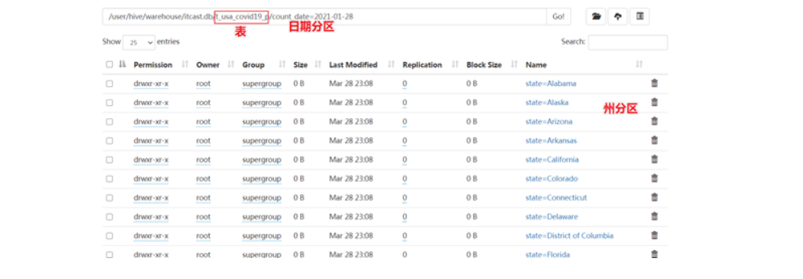

案例：

```powershell
-- 查询当前数据库
select current_database(); --省去from关键字

-- 切换数据库
use db_itheima;

-- 查询使用函数
select count(county) from t_usa_covid19_p;
select count(1) from t_usa_covid19_p;
3425
-- 问题：count(列名)和count(1)有何区别?
-- 答：两者都可以实现对数据表中的记录进行统计，在数据量相同的情况下，count(1)速度要略快于count(列名)，另外一点不同主要在于字段的值，如果字段的值为null，则count会忽略统计此行，而count(1)无论此字段是否为空，都会将其统计为1，所以这就是两者的区别。

-- 返回所有匹配的行
select state from t_usa_covid19_p;
-- 相当于
select all state from t_usa_covid19_p;

-- 返回所有匹配的行 去除重复的结果
select distinct state from t_usa_covid19_p;
-- 多个字段distinct 整体去重
select distinct county,state from t_usa_covid19_p;  -- 把country + state当做一个整体去重

-- where查询
select * from t_usa_covid19_p where state = "California" and deaths > 1000;
select * from t_usa_covid19_p where 1 > 2;  -- 1 > 2 返回false
select * from t_usa_covid19_p where 1 = 1;  -- 1 = 1 返回true

-- where条件中使用函数 找出州名字母超过10个
select * from t_usa_covid19_p where length(state) >10 ;

--WHERE子句支持子查询
SELECT *
FROM A
WHERE A.a IN (SELECT foo FROM B);

--where条件中不能使用聚合函数
--报错 SemanticException:Not yet supported place for UDAF 'sum'
select state,sum(deaths)
from t_usa_covid19_p where sum(deaths) >100 group by state;
```

那么为什么不能在where子句中使用聚合函数呢？

因为**聚合函数要使用它的前提是结果集已经确定。而where子句还处于“确定”结果集的过程中，因而不能使用聚合函数**。

## 3、分区查询与分区裁剪

通常，SELECT查询将扫描整个表（所谓的全表扫描）。如果使用PARTITIONED BY子句创建的分区表，则在查询时可以指定分区查询，减少全表扫描，也叫做分区裁剪。

> 如果select语句没有采用分区裁剪，默认还是使用全表扫描！

所谓`分区裁剪`指的是：==对分区表进行查询时，会检查WHERE子句或JOIN中的ON子句中是否存在对分区字段的过滤，如果存在，则仅访问查询符合条件的分区，即裁剪掉没必要访问的分区。==

① where子句

② join子句

③ on子句

```powershell
-- 找出来自加州，累计死亡人数大于1000的县 state字段就是分区字段 进行分区裁剪 避免全表扫描
select * from t_usa_covid19_p where state ="California" and deaths > 1000;

-- 多分区裁剪
select * from t_usa_covid19_p where count_date = "2021-01-28" and state ="California" and deaths > 1000;
```

## 4、group by分组

GROUP BY 语句用于结合聚合函数，根据一个或多个列对结果集进行分组。需要注意的是，出现在GROUP BY中select_expr的字段：==**要么是GROUP BY分组的字段；要么是被聚合函数应用的字段。**==原因很简单，避免出现一个字段多个值的歧义。

分组字段出现select_expr中，一定没有歧义，因为就是基于该字段分组的，同一组中必相同；

被聚合函数应用的字段，也没歧义，因为聚合函数的本质就是多进一出，最终返回一个结果。

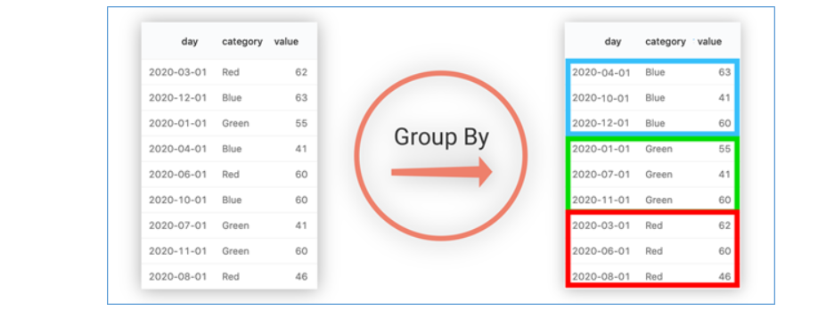

如上图所示，基于category进行分组，相同颜色的分在同一组中。

在select_expr中，如果出现category字段，则没有问题，因为同一组中category值一样，但是返回day就有问题了，day的结果不一样。

Hive => 把SQL语句翻译成底层的MR程序

SQL语句 => Hive（解释器、编译器、优化器、执行器）=> MR程序

## 扩展：group by工作原理（了解）

面试题：请简述你在Hive中遇到过哪些问题？Hive有哪些优化手段？

数据倾斜概念：简单来说就是一个大的任务会划分为多个MapTask，在Map阶段会执行分区、排序、规约操作，但是如果某个分区的数据较多（超过了其他所有分区），在Reduce阶段拉取数据时，会导致某个Reduce长时间无法完成。Reduce无法完成也会导致最终的任务无法完成，我们把这种情况就称之为==数据倾斜==！

Map

​           男                      Reduce（男）   99%  长时间无法完成

Map

​           女                      Reduce（女）   1%     很快完成

Map

> 在group by分组是最容易出现数据倾斜问题的

答：① 分区、分桶  ② 开启Map端聚合（Map把数据划分为一个一个MapTask任务，Reduce通常是进行数据合并，默认情况下，所有的分组聚合操作都是发生在Reduce这一端，如果数据量比较大的情况下，就会导致耗时较长或者任务长时间无法完成）

> Map端聚合 => 还可以解决未来数据倾斜的问题


Map聚合 => 优化手段

默认设置了`set hive.map.aggr=true`，会在mapper端先group by一次，最后把结果merge起来，为了减少reducer处理的数据量。

```powershell
select rank, isonline, count(1) as value from city group by rank, isonline;
```

我们都知道Hive底层跑的是MR程序，相当于把SQL语句翻译成MR进行计算。

假设city数据表空间大小（HDFS占用空间） =  256MB

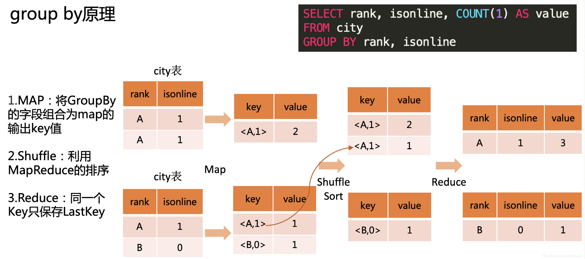

Map阶段：

MapTask任务，读取源数据，得到k1，v1（k1行号，v1相当于数据表中的一行数据）

调用map()方法，进行数据拆解，由k1，v1 得到 k2，v2（k2分组rank+isonline，v2行数，默认为1）

经过分区、排序、规约，得到分好区、排好序、规好约的文件

Reduce阶段：

Reduce端，主动拉取属于自己分区的数据，把数据进行分组聚合操作，相同k2的数据汇总在一起，得到k3和v3，k3就是rank + isonline，v3每个组总行数。

## 5、having子句

在SQL中增加HAVING子句原因是，WHERE关键字无法与聚合函数一起使用。

① where子句 ② group by分组 ③ having子句

==HAVING子句可以让我们筛选分组后的各组数据,并且可以在Having中使用聚合函数，因为此时where，group by已经执行结束，结果集已经确定。==

```powershell
-- 统计死亡病例数大于10000的州
select state,sum(deaths) as cnts
from t_usa_covid19_p
where count_date = "2021-01-28"
group by state
having cnts > 10000;
```

having与where的区别:

□ having是在分组后对数据进行过滤

□ where是在分组前对数据进行过滤

□ having后面可以使用聚合函数   having cnts > 10000;

□ where后面不可以使用聚合        where发生的时候，数据还没有进行聚合呢！

## 6、limit子句

LIMIT子句可用于约束SELECT语句返回的行数。

LIMIT接受一个或两个数字参数，这两个参数都必须是非负整数常量。

第一个参数指定要返回的第一行的偏移量（从 Hive 2.0.0开始），第二个参数指定要返回的最大行数。当给出单个参数时，它代表最大行数，并且偏移量默认为0。

```powershell
select * from t_usa_covid19_p
where count_date = "2021-01-28"
  and state ="California"
limit 5;
```

# 二、HQL排序查询与高级查询

## 1、SORT/ORDER/CLUSTER BY/DISTRIBUTE BY

## [面试题]：请说明四个by排序查询有何区别？

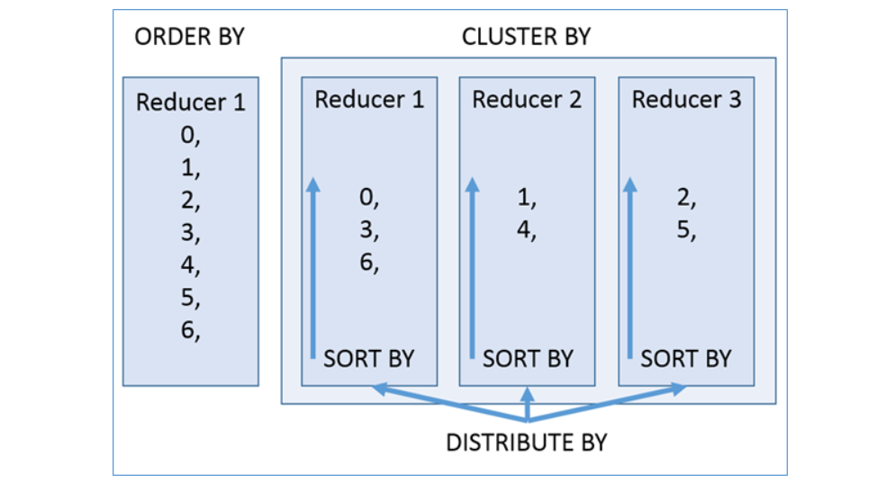

order by：全局排序，只有一个Reduce，数量比较大，性能最差

cluster by：按照同一个字段进行分区（分散为多个Reduce），区内有序（只能是升序排列）

distribute by + sort by：distribute by就是按照某个字段分区，sort by可以按照某个字段排序（既可以升序也可以降序）

### ☆ ORDER BY

全局数据有序

Hive SQL中的ORDER BY语法类似于SQL语言中的ORDER BY语法。==会对输出的结果进行全局排序，因此底层使用MapReduce引擎执行的时候，只会有一个reducetask执行。也因此，如果输出的行数太大，会导致需要很长的时间才能完成全局排序。==

默认排序顺序为升序（ASC），也可以指定为DESC降序。

在Hive 2.1.0和更高版本中，支持在“ order by”子句中为每个列指定null类型结果排序顺序。ASC顺序的默认空排序顺序为NULLS FIRST，而DESC顺序的默认空排序顺序为NULLS LAST。

> 在Hive中，默认会认为NULL空值为最小值

```powershell
---order by
--根据字段进行排序
select * from t_usa_covid19_p
where count_date = "2021-01-28"
and state ="California"
order by deaths; --默认asc null first

select * from t_usa_covid19_p
where count_date = "2021-01-28"
and state ="California"
order by deaths desc; --指定desc null last

--强烈建议将LIMIT与ORDER BY一起使用。避免数据集行数过大
--当hive.mapred.mode设置为strict严格模式时，使用不带LIMIT的ORDER BY时会引发异常。
select * from t_usa_covid19_p
where count_date = "2021-01-28"
  and state ="California"
order by deaths desc
limit 3;
```

> Hive中如果计算的数量较大，造成内存溢出 => return code 1

### ☆ CLUSTER BY

Hive SQL中的==CLUSTER BY==语法可以指定根据后面的字段将数据分区，每个区内再根据这个字段==asc正序排序（不允许指定排序规则）==，概况起来就是：==根据同一个字段，分区排序==。

cluster by 字段名称，主要做了两件事：① 按照这个字段分区 ② 针对每个区中的数据按照这个字段进行升序排序（记住，只能做到升序排序）

> 注意：使用了cluster by必须人为指定分组的数量 => Reduce数量

分组的规则hash散列。`hash(col_name) % reduce task nums`

sno学生编号

1 % 3 = 1

2 % 3 = 2

3 % 3 = 0

假设只需要分为2个组 => 2个reduce

hash(1) % 2 = 1

hash(2) % 2 = 0

hash(3) % 2 = 1

分为几个区取决于==reduce task==的个数。下面在Hive beeline客户端中针对student表进行演示。

```powershell
--cluster by
select * from student;
--不指定reduce task个数
--日志显示：Number of reduce tasks not specified. Estimated from input data size: 1
select * from student cluster by sno;

--手动设置reduce task个数
set mapreduce.job.reduces = 2;
select * from student cluster by sno;
```

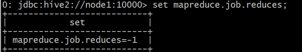

默认情况下，reduce task的个数由Hive在编译期间自己决定。

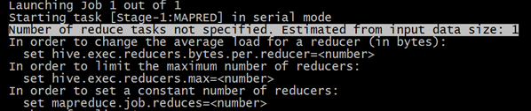

设置set mapreduce.job.reduces = 2;

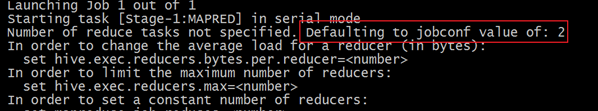

执行结果如下：分为两个部分，每个部分内正序排序。

95001 % 2 = 1

95002 % 2 = 0

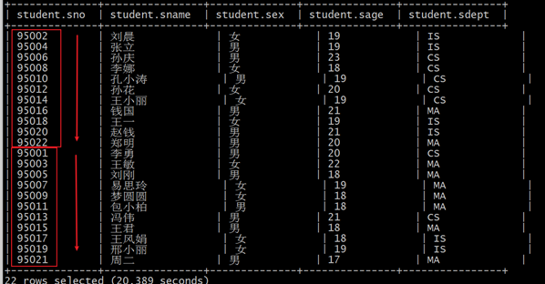

假如说，现在想法如下：把学生表数据根据性别分为两个部分，每个分组内根据年龄的倒序排序。你会发现CLUSTER BY无法完成了。而order by更不能在这里使用，因为它是全局排序，一旦使用order by，编译期间就会强制把reduce task个数设置为1。无法满足分组的需求。

### ☆ DISTRIBUTE BY + SORT BY

如果说CLUSTER BY的功能是分组排序（同一个字段），那么DISTRIBUTE BY + SORT BY就相当于把cluster by的功能一分为二：**DISTRIBUTE BY负责分区，SORT BY负责分组内排序**，并且可以是不同的字段。如果DISTRIBUTE BY +SORT BY的字段一样，可以得出下列结论：

CLUSTER BY=DISTRIBUTE BY +SORT BY（字段一样）

```sql
--手动设置reduce task个数
set mapreduce.job.reduces = 2;

--案例：把学生表数据根据性别分为两个部分，每个分组内根据年龄的倒序排序。
select * from student distribute by sex sort by sage desc;
```

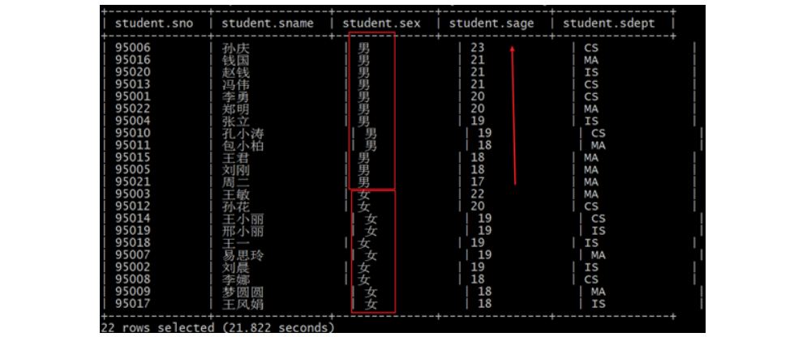

```powershell
--下面两个语句执行结果一样
select * from student distribute by sno sort by sno;
select * from student cluster by sno;
```

### ☆ 小结

	order by会对输入做全局排序，因此只有一个reducer，会导致当输入规模较大时，需要较长的计算时间。
	sort by不是全局排序，其在数据进入reducer前完成排序。因此，如果用sort by进行排序，并且设置mapred.reduce.tasks>1，则sort by只保证每个reducer的输出有序，不保证全局有序。
	distribute by(字段)根据指定字段将数据分到不同的reducer，分发算法是hash散列。
	cluster by(字段) 除了具有distribute by的功能外，还会对该字段进行排序。
如果distribute和sort的字段是同一个时，此时，cluster by = distribute by + sort by


## 2、Union联合查询

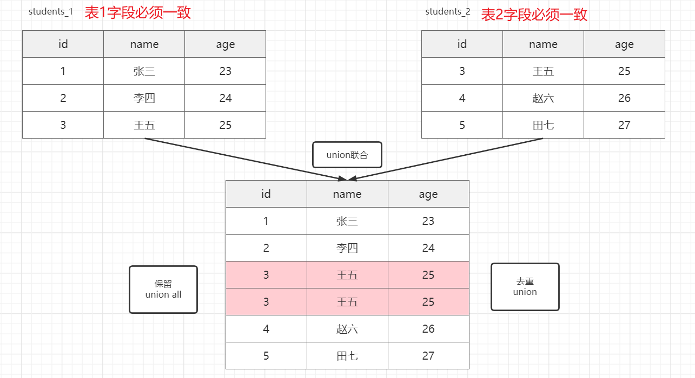

> 注意：字段一致，主要代表字段的数量要统一，否则语法会报错！

UNION用于将来自多个SELECT语句的结果合并为一个结果集。语法如下：

```sql
select_statement UNION [ALL | DISTINCT] select_statement UNION [ALL | DISTINCT] select_statement ...
```

==使用DISTINCT关键字与只使用UNION默认值效果一样，都会删除重复行。==

==使用ALL关键字，不会删除重复行，结果集包括所有SELECT语句的匹配行（包括重复行）。==

1.2.0之前的Hive版本仅支持UNION ALL，在这种情况下不会消除重复的行。

==每个select_statement返回的列的数量和名称必须相同。==

MySQL有一个概念：分库/分表 => 10万条数据，table1 2万  table2 2万  table3 2万  ...

在MySQL中优化中，有这样一个概念：分库分表

把数据分散在多个数据库与多个数据表中，减轻单表压力

```powershell
--union
--使用DISTINCT关键字与使用UNION默认值效果一样，都会删除重复行。
select num,name from student_local
UNION
select num,name from student_hdfs;
--和上面一样
select num,name from student_local
UNION DISTINCT
select num,name from student_hdfs;

--使用ALL关键字会保留重复行。
select num,name from student_local
UNION ALL
select num,name from student_hdfs;

--如果要将ORDER BY，SORT BY，CLUSTER BY，DISTRIBUTE BY或LIMIT应用于单个SELECT
--请将子句放在括住SELECT的括号内
SELECT sno,sname FROM (select sno,sname from student_local LIMIT 2) subq1
UNION
SELECT sno,sname FROM (select sno,sname from student_hdfs LIMIT 3) subq2

--如果要将ORDER BY，SORT BY，CLUSTER BY，DISTRIBUTE BY或LIMIT子句应用于整个UNION结果
--请将ORDER BY，SORT BY，CLUSTER BY，DISTRIBUTE BY或LIMIT放在最后一个之后。
select sno,sname from student_local
UNION
select sno,sname from student_hdfs
order by sno desc;
```

## 3、Common Table Expressions（CTE）

CTE也可以理解为==子查询==的一种，只不过CTE语句中的子查询要先执行。


CTE/窗口函数

MySQL8.0以及Hive中存在！

> MySQL8.0以后增加了两个比较突出功能：① 窗口函数 ② CTE表达式


CTE介绍

==公用表达式（CTE）==是一个临时结果集，该结果集是从WITH子句中指定的简单查询派生而来的，该查询紧接在SELECT或INSERT关键字之前。 =>  子查询

CTE仅在单个语句的执行范围内定义。一个或多个CTE可以在Hive SELECT，INSERT， CREATE TABLE AS SELECT或CREATE VIEW AS SELECT语句中使用。

基本语法：

```powershell
with 临时表名称 as (
	select 查询语句
)
select * from 临时表名称 where xxx;

等价于子查询

select * from (select * from 数据表) as 临时表 where xxx;

PS：
CTE与子查询虽然都是子查询操作的一种，但是相对而言，CTE表达式性能更高，先把select查询结果写入到临时表，二次、三次甚至多次查询都可以反复使用已经创建好的临时表，不需要重复计算。
select * from (select * from 数据表) as 临时表 where xxx; 子查询有所不同，每次在使用到子查询()内的查询结果时，()中的select需要重复计算，所以性能相对于CTE要略低一些。
```

案例：每个国家顾客评价最高的商店所在城市（topN问题）

​								   rank

 中国     广州        6         2

==中国     深圳        9         1==

==法国     巴黎        7         1==

==法国      波尔多   7         1==

==德国      慕尼黑   3         1==

==日本      东京       8         1==

==俄罗斯  莫斯科    7         1==

> topN问题以后首先就要想到使用CTE表达式

> 求每个班级中成绩最高的前3名，求每个部门薪资最高的那个员工信息...

>  分组 + 排序 + 排名（只要最高的，只要第1名）=> CTE表达式中，然后select筛选！！！

with语句 + 窗口函数（partition by order by + 排名函数 => dense_rank()/rank()）

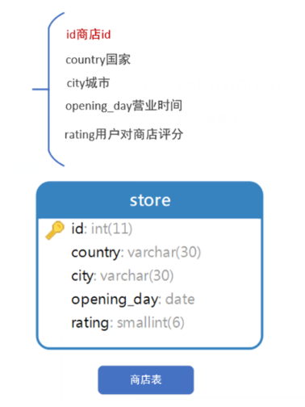

```powershell
WITH ranking AS (
  SELECT
    country,
    city,
    dense_rank() OVER(PARTITION BY country ORDER BY rating DESC) AS `rank`
  FROM store
)
SELECT
  country,
  city
FROM ranking
WHERE `rank` = 1;

注意：并列且不连续用rank()，并列且连续用dense_rank()，具体使用哪种，根据业务实现
```

① 通过在CTE中使用窗口函数来获取每个国家/地区按评分的商店排名

② 在外部查询中直接查询每个国家分数最高的店铺所在城市

# 三、Hive JOIN连接查询（重点）

在**Hive**中，当下版本3.1.2总共支持**6种join语法**。分别是：

**inner** join（内连接）、**left** join（左外连接）、**right** join（右外连接）、**full outer** join（全外连接）、**left semi** join（左半开连接）、**cross** join（交叉连接，也叫做笛卡尔积）。

## 1、数据集准备

为了更好的练习、学习掌握Hive中的join语法，下面我们去创建3张表并且加载数据到表中。

表1：**employee 员工表**；

表2：**employee_address 员工住址信息表**；

表3：**employee_connection 员工联系方式表**；

```sql
--table1: 员工表
CREATE TABLE employee(
   id int,
   name string,
   deg string,
   salary int,
   dept string
 ) row format delimited
fields terminated by ',';

--table2:员工住址信息表
CREATE TABLE employee_address (
    id int,
    hno string,
    street string,
    city string
) row format delimited
fields terminated by ',';

--table3:员工联系方式表
CREATE TABLE employee_connection (
    id int,
    phno string,
    email string
) row format delimited
fields terminated by ',';

--加载数据到表中
load data local inpath '/root/hivedata/employee.txt' into table employee;
load data local inpath '/root/hivedata/employee_address.txt' into table employee_address;
load data local inpath '/root/hivedata/employee_connection.txt' into table employee_connection;
```

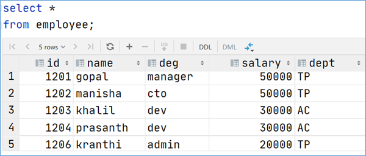

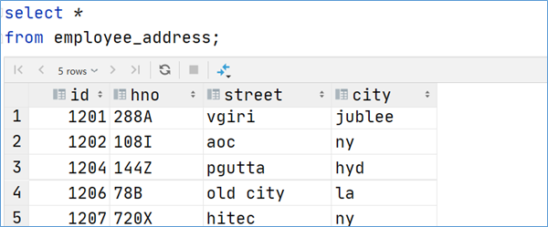

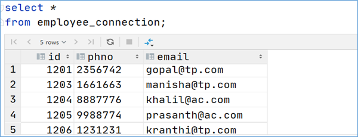

## 2、Hive inner join（简写为join）

内连接 是最常见的一种连接，它也被称为普通连接，而关系模型提出者E.FCodd（埃德加•科德）最早称之为自然连接。其中inner可以省略。`inner join == join` 等价于早期的连接语法。

基本语法：

```powershell
select * from 数据表A inner join 数据表B on A表.字段 = B表.字段;
简写为
select * from 数据表A join 数据表B on A表.字段 = B表.字段;
```

内连接，只有进行连接的两个表中都存在==与连接条件相匹配的数据==才会被留下来。

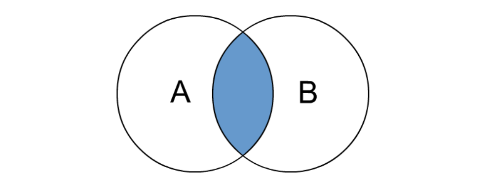

```powershell
--1、inner join
select e.id,e.name,e_a.city,e_a.street
from employee e inner join employee_address e_a
on e.id =e_a.id;
--等价于 inner join=join
select e.id,e.name,e_a.city,e_a.street
from employee e join employee_address e_a
on e.id =e_a.id;

--等价于 隐式连接表示法
select e.id,e.name,e_a.city,e_a.street
from employee e , employee_address e_a
where e.id =e_a.id;
```

运行结果：

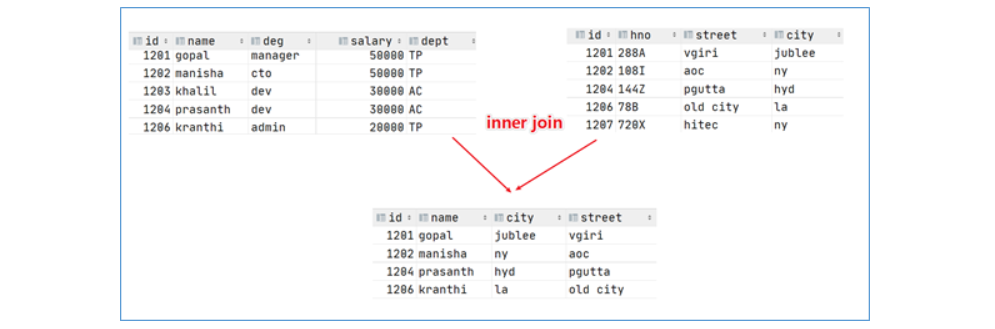

## 3、Hive left join

`left join`中文叫做是左外连接(Left Outer Jion)或者`左连接`，其中outer可以省略，left outer join是早期的写法。

left join的核心就在于left左。左指的是join关键字左边的表，简称左表。

通俗解释：==join时以左表的全部数据为准，右边与之关联；左表数据全部返回，右表关联上的显示返回，关联不上的显示null返回。==

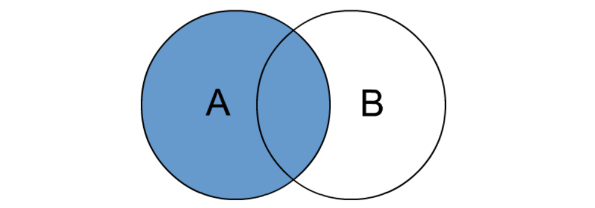

```powershell
--2、left join
select e.id,e.name,e_conn.phno,e_conn.email
from employee e left join employee_connection e_conn
on e.id =e_conn.id;

--等价于 left outer join
select e.id,e.name,e_conn.phno,e_conn.email
from employee e left outer join  employee_connection e_conn
on e.id =e_conn.id;
```

## 4、Hive right join

`right join`中文叫做是右外连接(Right Outer Jion)或者`右连接`，其中outer可以省略。

right join的核心就在于Right右。右指的是join关键字右边的表，简称右表。

通俗解释：==join时以右表的全部数据为准，左边与之关联；右表数据全部返回，左表关联上的显示返回，关联不上的显示null返回。==

很明显，right join和left join之间很相似，重点在于以哪边为准，也就是一个方向的问题。

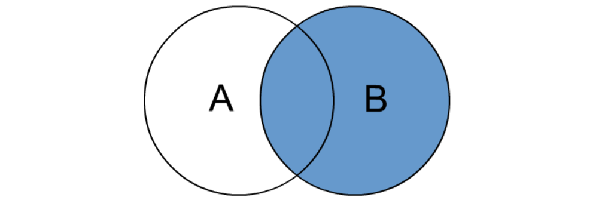

```powershell
--3、right join
select e.id,e.name,e_conn.phno,e_conn.email
from employee e right join employee_connection e_conn
on e.id =e_conn.id;

--等价于 right outer join
select e.id,e.name,e_conn.phno,e_conn.email
from employee e right outer join employee_connection e_conn
on e.id =e_conn.id;
```

运行结果：

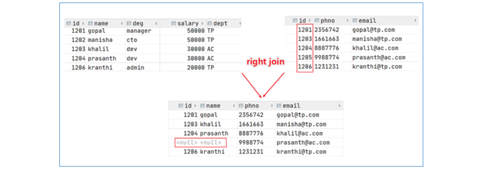

## 5、Hive full outer join

`full outer join 等价 full join`,中文叫做全外连接或者全连接。

包含左、右两个表的全部行，不管另外一边的表中是否存在与它们匹配的行在功能上，它等价于==对这两个数据集合分别进行左外连接和右外连接，然后再使用消去重复行的操作将上述两个结果集合并为一个结果集==。

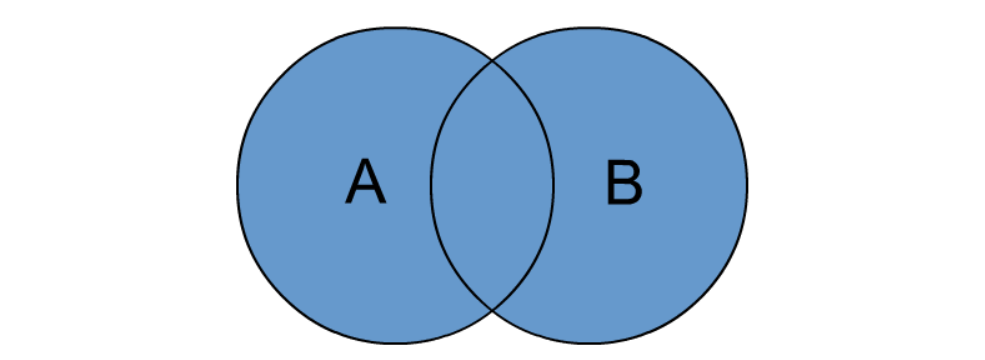

```powershell
--4、full outer join
select e.id,e.name,e_a.city,e_a.street
from employee e full outer join employee_address e_a
on e.id =e_a.id;
--等价于
select e.id,e.name,e_a.city,e_a.street
from employee e full join employee_address e_a
on e.id =e_a.id;
```

运行结果：

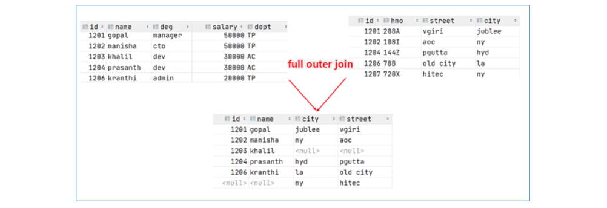

## 6、Hive left semi join

`左半开连接`（LEFT SEMI JOIN）会返回左边表的记录，前提是其记录对于右边的表满足ON语句中的判定条件。

> 从效果上来看有点像inner join之后只返回左表的结果。

```powershell
--5、left semi join
select *
from employee e left semi join employee_address e_addr
on e.id =e_addr.id;

--相当于 inner join 只不过效率高一些
select e.*
from employee e inner join employee_address e_addr
on e.id =e_addr.id;
```

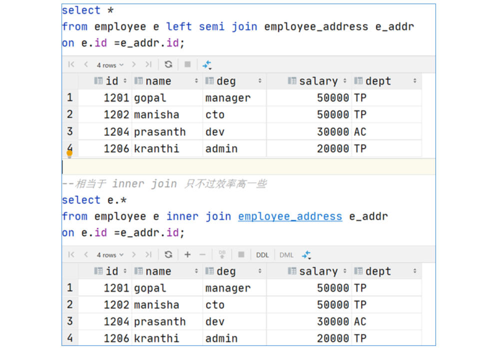

## 7、Hive cross join

`交叉连接cross join`，将会返回被连接的两个表的笛卡尔积，返回结果的行数等于两个表行数的乘积。对于==大表来说，cross join慎用==。

> cross join本身没有任何意义，但是其是所有连接查询的基础！

基本语法：

```powershell
select * from A表 cross join B表;

返回结果：
字段数：A表字段 + B表字段
记录数：A表记录数 * B表记录数（笛卡尔积）
```

在SQL标准中定义的cross join就是无条件的inner join。返回两个表的笛卡尔积,无需指定关联键。

在HiveSQL语法中，cross join 后面可以跟where子句进行过滤，或者on条件过滤。

```powershell
--6、cross join
--下列A、B、C 执行结果相同，但是效率不一样：
--A:
select a.*,b.* from employee a,employee_address b where a.id=b.id;

--B:
select * from employee a cross join employee_address b on a.id=b.id;
select * from employee a cross join employee_address b where a.id=b.id;

--C:
select * from employee a inner join employee_address b on a.id=b.id;

--一般不建议使用B，因为如果有WHERE子句的话，往往会先进行笛卡尔积返回数据然后才根据WHERE条件从中选择。
--因此，如果两个表太大，将会非常非常慢，不建议使用。
```

## 扩展：Hive JOIN底层原理

Hive => Hive Join => MR => MapReduce执行原理：

① Map阶段：构建（key(tag),value）,key这里后面的数字是tag，后面在reduce阶段用来区分来自于那个表的数据，对key求hashcode设为hivekey；

Map阶段 => 得到k1，v1 => （key(tag), value）=> key连接字段（uid，其他字段结果）=> tag标记数据表，将来4个字段到底谁放在前面谁放在后面。想个办法，给每个表添加一个标记，前面的就是0，后面的就是1

② Shuffle机制：如果key在不同机器上，会通过网络传输把hivekey相同的数据汇集到一台机器；

③ Reduce阶段：把tag=1的内容，都加到tag=0的后面，合并输出。

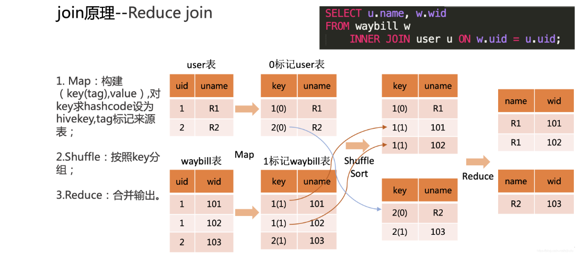

uid, uname, uid, wid

uid                    wid

1（R1）            uid = 1      101

1（R1）            uid = 1      102

2（R2）            uid = 2      103

## 8、Hive JOIN使用注意事项（了解）

总体来说，随着Hive的版本发展，join语法的功能也愈加丰富。当下我们课程使用的是3.1.2版本，有以下几点需要注意：

a)   允许使用复杂的联接表达式

```sql
SELECT a.* FROM a JOIN b ON (a.id = b.id)
SELECT a.* FROM a JOIN b ON (a.id = b.id AND a.department = b.department)
SELECT a.* FROM a LEFT OUTER JOIN b ON (a.id <> b.id)
```

b)   同一查询中可以连接2个以上的表

```sql
SELECT a.val, b.val, c.val FROM a JOIN b ON (a.key = b.key1) JOIN c ON (c.key = b.key2)
```

c)   如果每个表在联接子句中使用相同的列，则Hive将多个表上的联接转换为单个MR作业

A join B join C

A join B => 1个MR，结果 join C => 1个MR

```sql
SELECT a.val, b.val, c.val FROM a JOIN b ON (a.key = b.key1) JOIN c ON (c.key = b.key1)
--由于联接中仅涉及b的key1列，因此被转换为1个MR作业来执行
SELECT a.val, b.val, c.val FROM a JOIN b ON (a.key = b.key1) JOIN c ON (c.key = b.key2)
--会转换为两个MR作业，因为在第一个连接条件中使用了b中的key1列，而在第二个连接条件中使用了b中的key2列。第一个map / reduce作业将a与b联接在一起，然后将结果与c联接到第二个map / reduce作业中。
```

d)   join时的最后一个表会通过reducer流式传输，并在其中缓冲之前的其他表，因此，将大表放置在最后有助于减少reducer阶段缓存数据所需要的内存

select *from A表 join B表 on A.id = B.id;

A表 大表

B表 小表

Hive底层：小表缓冲在内存，大表拆分若干个小表，然后在进行关联。

> Hive优化有这样一条：==大表和小表进行连接，则小表放在前面，大表放在后面！==

大表(100GB) join 小表（10GB => 128MB/128MB），得到一个大表，再次和小表 join，相当于大表全程参与了！

```sql
SELECT a.val, b.val, c.val FROM a JOIN b ON (a.key = b.key1) JOIN c ON (c.key = b.key1)
--由于联接中仅涉及b的key1列，因此被转换为1个MR作业来执行，并且表a和b的键的特定值的值被缓冲在reducer的内存中。然后，对于从c中检索的每一行，将使用缓冲的行来计算联接。
SELECT a.val, b.val, c.val FROM a JOIN b ON (a.key = b.key1) JOIN c ON (c.key = b.key2)
--计算涉及两个MR作业。其中的第一个将a与b连接起来，并缓冲a的值，同时在reducer中流式传输b
的值。
在第二个MR作业中，将缓冲第一个连接的结果，同时将c的值通过reducer流式传输。
```

e)   在join的时候，可以通过语法STREAMTABLE提示指定要流式传输的表。如果省略STREAMTABLE提示，则Hive将流式传输最右边的表。

/*+ STREAMTABLE(a) */ 强制按照某个方案执行，默认传输最后一个，但是给了此参数，则强制将此表作为流式传输的表。强制==大表==

```sql
SELECT /*+ STREAMTABLE(a) */ a.val, b.val, c.val FROM a JOIN b ON (a.key = b.key1) JOIN c ON (c.key = b.key1)
--a,b,c三个表都在一个MR作业中联接，并且表b和c的键的特定值的值被缓冲在reducer的内存中。然后，对于从a中检索到的每一行，将使用缓冲的行来计算联接。如果省略STREAMTABLE提示，则Hive将流式传输最右边的表。
```

f)   join在WHERE条件之前进行。=> 现有join然后才有where

g)   如果除一个要连接的表之外的所有表都很小，则可以将其作为仅map作业执行

```sql
SELECT /*+ MAPJOIN(b) */ a.key, a.value FROM a JOIN b ON a.key = b.key
--不需要reducer。对于A的每个Mapper，B都会被完全读取。限制是不能执行FULL / RIGHT OUTER JOIN b。
```

还有一些其他相关的使用注意事项，可以参考官方

https://cwiki.apache.org/confluence/display/Hive/LanguageManual+Joins

# 三、Hive参数配置

## 1、配置属性概述

Hive作为一款复杂的数据仓库软件，除了一些默认的属性行为之外，还支持用户配置属性进行修改，使得在某些场景下满足用户的需求。

作为用户我们需要掌握两件事：

一是：`Hive有哪些属性支持修改，修改了有什么功能`；

二是：`Hive支持哪种方式进行修改，修改是临时生效还是永久生效的`。

==Hive配置属性的规范列表是在HiveConf.Java类中管理==的，因此请参考该HiveConf.java文件，以获取Hive当前使用的发行版中可用的配置属性的完整列表。从Hive 0.14.0开始，会从HiveConf.java类中直接生成配置模板文件`hive-default.xml.template`，它是当前版本配置及其默认值的可靠来源。

详细的配置参数大全可以参考Hive官网配置参数，在页面使用ctrl+f进行搜索。

https://cwiki.apache.org/confluence/display/Hive/Configuration+Properties

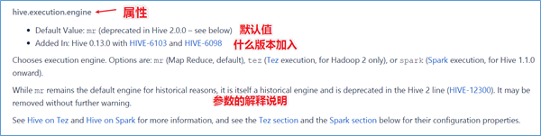

## 2、修改配置属性方式

配置属性的方式一共有两种情况：==永久配置 + 临时配置==

记住：

文件型配置 => 永久配置

命令型配置 => 临时配置（会话级别）

#### 方式1：hive-site.xml配置文件（永久配置）

在$HIVE_HOME/conf路径下，可以添加一个hive-site.xml文件，把需要定义修改的配置属性添加进去，这个配置文件会影响到这个Hive安装包的任何一种服务启动、客户端使用方式，可以理解为是Hive的全局配置。

比如我们指定使用MySQL作为Hive元数据的存储介质，那么就需要把Hive连接MySQL的相关属性配置在hive-site.xml文件中，这样不管是本地模式还是远程模式启动，不管客户端本地连接还是远程连接，都将访问同一个元数据存储介质，大家使用的元数据都是一致的。

```xml
<configuration>
    <!-- 存储元数据mysql相关配置 -->
    <property>
        <name>javax.jdo.option.ConnectionURL</name>
        <value> jdbc:mysql://node1:3306/hive?createDatabaseIfNotExist=true&amp;useSSL=false&amp;useUnicode=true&amp;characterEncoding=UTF-8</value>
    </property>

    <property>
        <name>javax.jdo.option.ConnectionDriverName</name>
        <value>com.mysql.jdbc.Driver</value>
    </property>

    <property>
        <name>javax.jdo.option.ConnectionUserName</name>
        <value>root</value>
    </property>

    <property>
        <name>javax.jdo.option.ConnectionPassword</name>
        <value>hadoop</value>
    </property>
    
    <property>
        <name>官网查看到的参数</name>
        <value>设置为你期望的参数值</value>
    </property>
</configuration>

注意：配置完成后，一定要重启Hive，否则配置无法生效！！！
```

#### 方式2：set命令（临时配置）

在Hive CLI或Beeline中使用**set命令**为set命令之后的所有SQL语句设置配置参数，这个也是==会话级别==的。

这种方式也是用户日常开发中==使用最多的一种配置参数方式==。因为Hive倡导一种：**谁需要、谁配置、谁使用**的一种思想，避免你的属性修改影响其他用户的修改。

获取已有配置：

```powershell
set hive.exec.dynamic.partition;
```

设置Hive属性：

```powershell
#启用hive动态分区，需要在hive会话中设置两个参数：
set hive.exec.dynamic.partition=true;
set hive.exec.dynamic.partition.mode=nonstrict;
```

## 3、小结

配置方式的优先级顺序：set参数>hive-site.xml配置文件。

日常的开发使用中，如果不是核心的需要全局修改的参数属性，建议大家使用set命令进行设置。

另外，Hive也会读入Hadoop的配置，因为Hive是作为Hadoop的客户端启动的，Hive的配置会覆盖Hadoop的配置。

# 四、Hive内置运算符（掌握几个重点）

运算符就是日常生活中的加减乘除这样一些操作。

## 1、Hive内置运算符

随着Hive版本的不断发展，在Hive SQL中支持的、内置的运算符也越来越多。可以使用下面的命令查看当下支持的运算符和函数，并且查看其详细的使用方式。

https://cwiki.apache.org/confluence/display/Hive/LanguageManual+UDF

也可以使用课程附件中的中文版本运算符函数说明文档进行查看。

```powershell
--显示所有的函数和运算符
show functions;
--查看运算符或者函数的使用说明
describe function +;
--使用extended 可以查看更加详细的使用说明
describe function extended +;
```

## 2、取整操作: div

在Hive中不仅支持+、-、*、/操作，其还支持整除操作（取整操作）

```powershell
--取整操作: div  给出将A除以B所得的整数部分。例如17 div 3得出5。
select 17 div 3;
```

## 3、regexp正则匹配(regexp与rlike等价，支持正则)

```powershell
select * from t_student where name rlike '^[\\u4e00-\\u9fa5]{3}$';  -- 匹配姓名为3个字的同学信息
```

# 五、Hive函数入门（当做手册）

## 1、函数概述

如同RDBMS中标准SQL语法一样，Hive SQL也内建了不少函数，满足于用户在不同场合下的数据分析需求，提高开发SQL数据分析的效率。

可以使用==show functions==查看当下版本支持的函数，并且可以通过===**describe function extended funcname**==来查看函数的使用方式和方法。

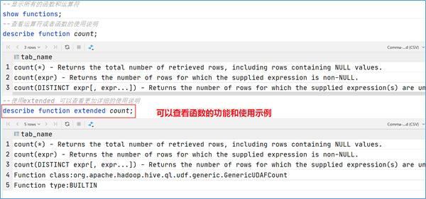

## 2、函数分类概述

Hive的函数很多，除了自己内置所支持的函数之外，还支持用户自己定义开发函数。

针对==**内置的函数**==，可以根据函数的应用类型进行归纳分类，比如：数值类型函数、日期类型函数、字符串类型函数、集合函数、条件函数等；

针对==**用户自定义函数**==，可以根据函数的输入输出行数进行分类，比如：UDF、UDAF、UDTF。

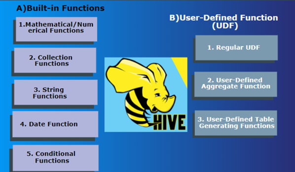

**UDF**（User-Defined-Function）普通函数，一进一出

**UDAF**（User-Defined Aggregation Function）聚合函数，多进一出

**UDTF**（User-Defined Table-Generating Functions）表生成函数，一进多出

如何判断一个函数属于UDF、UDAF还是UDTF呢？

答：`describe function extended 函数名称`

## 3、内置函数分类

所谓的**内置函数（buildin）**指的是Hive开发实现好，直接可以使用的函数,也叫做内建函数。

官方文档地址：https://cwiki.apache.org/confluence/display/Hive/LanguageManual+UDF

内置函数根据应用归类整体可以分为以下8大种类型，我们将对其中重要的，使用频率高的函数使用进行详细讲解。

进行详细讲解。

### ☆ String Functions 字符串函数

```powershell
--字符串长度函数：length(str | binary)
select length("angelababy");

--字符串连接函数：concat(str1, str2, ... strN)
select concat("angela","baby");

--字符串截取函数：substr(str, pos[, len]) 或者  substring(str, pos[, len])
select substr("angelababy",-2); --pos是从1开始的索引，如果为负数则倒着数
select substr("angelababy",2,2);

--正则表达式替换函数：regexp_replace(str, regexp, rep)
select regexp_replace('100-200', '(\\d+)', 'num');

--分割字符串函数: split(str, regex)
select split('apache hive', '\\s+');
```

### ☆ Date Functions 日期函数

```powershell
--获取当前UNIX时间戳函数: unix_timestamp，时间戳就是从格林制时间1970年-1月-1日 00:00:00到当前时间秒数
select unix_timestamp();

--UNIX时间戳转日期函数: from_unixtime
select from_unixtime(1618238391);
select from_unixtime(0, 'yyyy-MM-dd HH:mm:ss');

--日期转UNIX时间戳函数: unix_timestamp
select unix_timestamp("2011-12-07 13:01:03");

--日期转年函数: year
select year('2009-07-30 04:17:52');

--日期转月函数: month
select month('2009-07-30 04:17:52');

--日期比较函数: datediff  日期格式要求'yyyy-MM-dd HH:mm:ss' or 'yyyy-MM-dd'
select datediff('2012-12-08','2012-05-09');

--日期增加函数: date_add
select date_add('2012-02-28',10);

--日期减少函数: date_sub
select date_sub('2012-01-1',10);
```

### ☆ Mathematical Functions 数学函数

```powershell
--取整函数: round  返回double类型的整数值部分 （遵循四舍五入）
select round(3.1415926);
--保留2位小数
select round(3.1415926,2);

--向上取整函数: ceil
select ceil(3.1415926);

--向下取整函数: floor
select floor(3.1415926);
select floor(-3.1415926);

--取随机数函数: rand 每次执行都不一样 返回一个0到1范围内的随机数，包含0但是不包含1
select rand();
```

### ☆ Collection Functions 集合函数

array：数组

map：字典

```powershell
--取map集合keys函数: map_keys(Map<K.V>)
select map_keys(`map`("id",10086,"name","zhangsan","age",18));

--取map集合values函数: map_values(Map<K.V>)
select map_values(`map`("id",10086,"name","zhangsan","age",18));

--数组排序函数:sort_array(Array<T>)
select sort_array(`array`(12,2,32));
```

> MySQL/Hive中，如果有关键字出现，可以使用``反撇号进行阔起来。

### ☆ Conditional Functions 条件函数

```powershell
--空值判断函数: isnull( a )
select isnull("allen");
select isnull(null);

--空值转换函数: nvl(T value, T default_value)
select nvl("allen","itcast");
select nvl(null,"itcast");

--返回第一个不为null的参数: coalesce( a, b, c )
select coalesce( null, null, 'itheima' );
```

### ☆ Data Masking Functions 数据脱敏函数（了解）

脱敏：把一个敏感数据隐藏

```powershell
--对前n个进行脱敏替换
select mask_first_n("abc123DEF",4);

--mask_last_n(string str[, int n])
select mask_last_n("abc123DEF",4);
```

### ☆ Misc Functions 其他杂项函数（了解）

```powershell
--取哈希值函数:hash
select hash("allen");

--MD5加密: md5(string/binary)
select md5("allen");
```

> 扩展一下：这么多函数，如果不太记得某个函数作用或者有哪些参数了，应该怎么办呢？
>
> 答：可以通过describe function extended 函数名称;

## 4、用户自定义函数分类

虽然说Hive内置了很多函数，但是不见得一定可以满足于用户各种各样的分析需求场景。为了解决这个问题，Hive推出来用户自定义函数功能，让用户实现自己希望实现的功能函数。

**用户自定义函数简称UDF**，源自于英文user-defined function。自定义函数总共有3类，是根据函数输入输出的行数来区分的，分别是：


**UDF**（User-Defined-Function）普通函数，一进一出

**UDAF**（User-Defined Aggregation Function）聚合函数，多进一出

**UDTF**（User-Defined Table-Generating Functions）表生成函数，一进多出


**UDF分类标准扩大化**

> 虽然说UDF叫做用户自定义函数，其分类标准主要针对的是用户编写开发的函数。

> 但是这套UDF分类标准可以扩大到Hive的所有函数中：**包括内置函数和自定义函数**。因为不管是什么类型的行数，一定满足于输入输出的要求，那么从输入几行和输出几行上来划分没有任何毛病。千万不要被UD（User-Defined）这两个字母所迷惑，照成视野的狭隘。

比如Hive官方文档中，针对聚合函数的标准就是内置的UDAF类型。

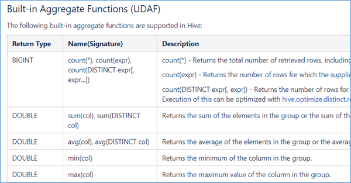

### ☆ UDF 普通函数

==UDF函数==通常把它叫做普通函数，最大的特点是一进一出，也就是输入一行输出一行。比如round这样的取整函数，接收一行数据，输出的还是一行数据。

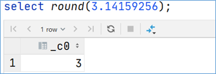

### ☆ UDAF聚合函数

==UDAF函数==通常把它叫做聚合函数，A所代表的单词就是Aggregation聚合的意思。最大的特点是多进一出，也就是输入多行输出一行。比如count、sum这样的函数。

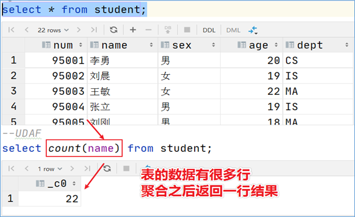

```sql
•count:统计检索到的总行数。
•sum:求和
•avg:求平均
•min:最小值
•max:最大值
•数据收集函数（去重）: collect_set(col)
•数据收集函数（不去重）: collect_list(col)
```

```sql
select sex from student;

select collect_set(sex) from student;
select collect_list(sex) from student;
```

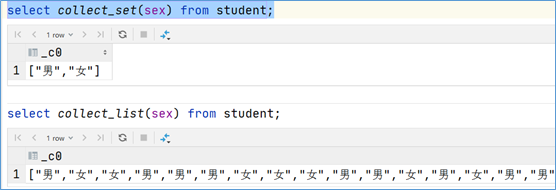

### ☆ UDTF 表生成函数

==UDTF函数==通常把它叫做表生成函数，T所代表的单词是Table-Generating表生成的意思。最大的特点是一进多出，也就是输入一行输出多行。

之所以叫做表生成函数，原因在于这类型的函数作用==返回的结果类似于表==（多行数据嘛），同时，UDTF函数也是我们接触比较少的函数，陌生。比如explode函数。

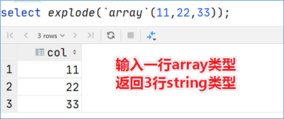

在内置函数中，有一个比较有争议，容易出错的函数 => split()函数

split函数属于UDF、UDAF、UDTF函数呢？

答：split属于UDF的，因为数组也算一个元素