# Hive高级查询

# 一、UDTF之explode函数

## 1、explode语法功能

对于UDTF表生成函数，很多人难以理解什么叫做输入一行，输出多行。

为什么叫做表生成？能够产生表吗？下面我们就来学习Hive当做内置的一个非常著名的UDTF函数，名字叫做**explode函数**，中文戏称之为“爆炸函数”，可以炸开数据。

explode函数接收==map或者array类型==的数据作为参数，然后把参数中的每个元素炸开变成一行数据。一个元素一行。这样的效果正好满足于输入一行输出多行。

```powershell
explode(a) - separates the elements of array a into multiple rows, or the elements of a map into multiple rows and columns 
```

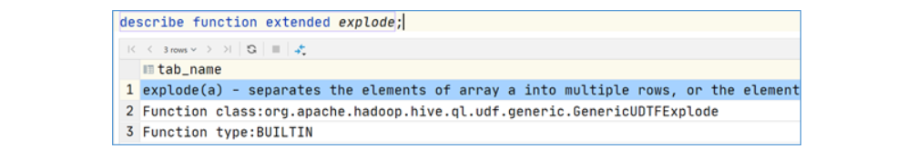

explode(array)将array列表里的每个元素生成一行；

explode(map)将map里的每一对元素作为一行，其中key为一列，value为一列；

一般情况下，==explode函数可以直接使用即可，也可以根据需要结合lateral view侧视图使用。==

## 2、explode函数使用

```powershell
select explode(`array`(11,22,33)) as item;
select explode(`map`("id",10086,"name","zhangsan","age",18));
```

运行结果：

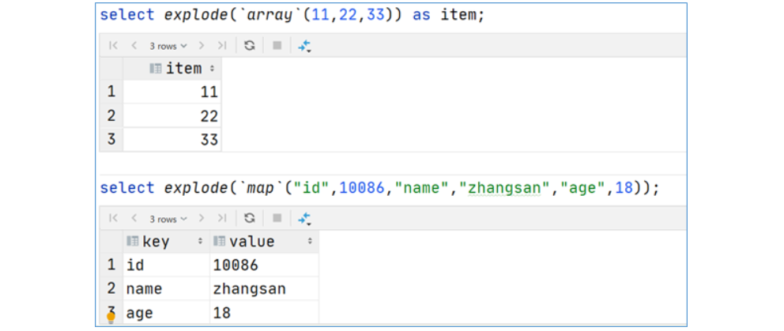

### ☆ 案例：NBA总冠军球队名单

业务需求

有一份数据《The_NBA_Championship.txt》，关于部分年份的NBA总冠军球队名单：

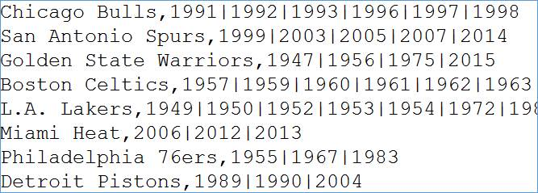

第一个字段表示的是球队名称，第二个字段是获取总冠军的年份，`字段之间以，分割`；

获取总冠军`年份之间以|进行分割`。


需求：使用Hive建表映射成功数据，对数据拆分，要求拆分之后数据如下所示

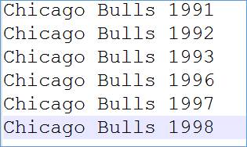

并且最好根据年份的==倒序==进行排序。

代码实现：

```powershell
--step1:建表
create table the_nba_championship(
    team_name string,
    champion_year array<string>
) row format delimited
fields terminated by ','
collection items terminated by '|';

--step2:加载数据文件到表中
load data local inpath '/root/The_NBA_Championship.txt' into table the_nba_championship;

--step3:验证
select * from the_nba_championship;
```

运行结果：

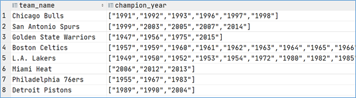

#### □ explode使用限制

在select条件中，如果==只有explode函数表达式==，程序执行是没有任何问题的；

但是如果在select条件中，==包含explode和其他字段，就会报错==。错误信息为：

org.apache.hadoop.hive.ql.parse.SemanticException:UDTF's are not supported outside the SELECT clause, nor nested in expressions

那么如何理解这个错误呢？==为什么在select的时候，explode的旁边不支持其他字段的同时出现？==

#### □ explode语法限制原因

1、 explode函数属于UDTF函数，即表生成函数；

2、 ==explode函数执行返回的结果可以理解为一张虚拟的表，其数据来源于源表；==

3、==在select中只查询源表数据没有问题，只查询explode生成的虚拟表数据也没问题==

4、 ==但是不能在只查询源表的时候，既想返回源表字段又想返回explode生成的虚拟表字段==

5、 通俗点讲，<font color='red'>有两张表，不能只查询一张表但是返回分别属于两张表的字段；</font>

6、 从SQL层面上来说应该对两张表进行关联查询

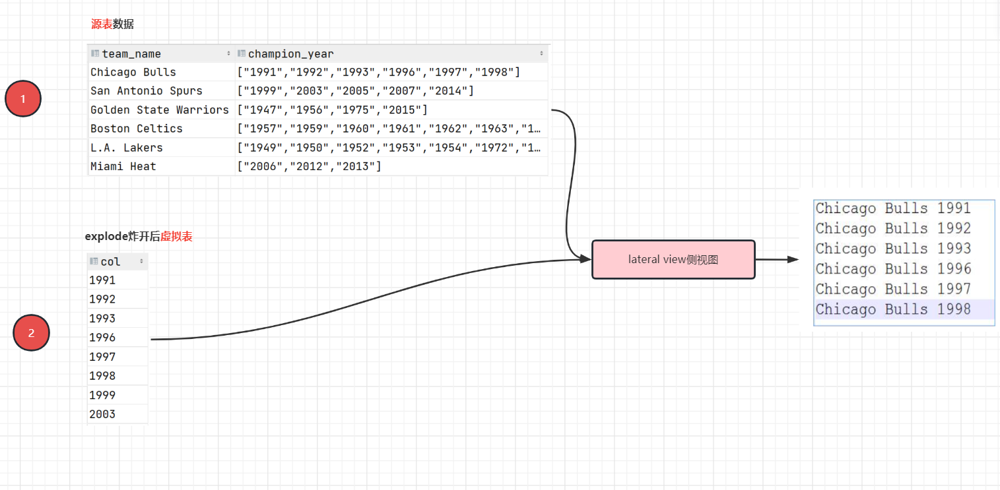

7、 Hive专门提供了语法==lateral View侧视图==，专门用于搭配explode这样的UDTF函数，以满足上述需要。

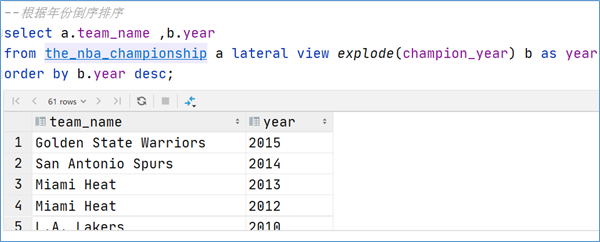

# 二、Lateral View侧视图

### ☆ 基本概念

==**Lateral View**==是一种特殊的语法，主要用于==**搭配UDTF类型功能的函数一起使用**==，用于解决UDTF函数的一些查询限制的问题。

侧视图的原理是==将UDTF的结果构建成一个类似于视图的表（虚拟表），然后将原表中的每一行和UDTF函数输出的每一行进行连接（inner join），生成一张新的虚拟表==。这样就避免了UDTF的使用限制问题。使用lateral view时也可以对UDTF产生的记录设置字段名称，产生的字段可以用于group by、order by 、limit等语句中，不需要再单独嵌套一层子查询。

>  一般只要使用UDTF，就会固定搭配lateral view使用。

官方链接：https://cwiki.apache.org/confluence/display/Hive/LanguageManual+LateralView

### ☆ UDTF配合侧视图使用

针对上述NBA冠军球队年份排名案例，使用explode函数+lateral view侧视图，可以完美解决：

```sql
--lateral view侧视图基本语法如下
select …… from tabelA lateral view UDTF(xxx) 别名 as col1,col2,col3……;

select a.team_name ,b.year
from the_nba_championship a lateral view explode(champion_year) b as year

--根据年份倒序排序
select a.team_name ,b.year
from the_nba_championship a lateral view explode(champion_year) b as year
order by b.year desc;
```

# 三、行列转换应用与实现

## 1、工作应用场景

实际工作场景中经常需要实现对于Hive中的表进行行列转换操作，例如统计得到每个小时不同维度下的UV、PV、IP的个数，而现在为了构建可视化报表，得到每个小时的UV、PV的线图，观察访问趋势，我们需要构建如下的表结构：

www.itheima.com

访问日志数据

192.168.31.63   www.itheima.com/news/1.html  访问时间  HTTP  GET/POST => Flume专门采集日志文件

每天UV总数 => 日活（指标）

每一条数据 => 大概1.5KB ~ 3KB左右 => 日增3G ~ 5G

> UV ：User View，每天访问站点人数（独立人数，去重） => Cookie（不同浏览器Cookie有所不同）

> PV ：Page View，每个页面访问次数

> IP ：独立IP

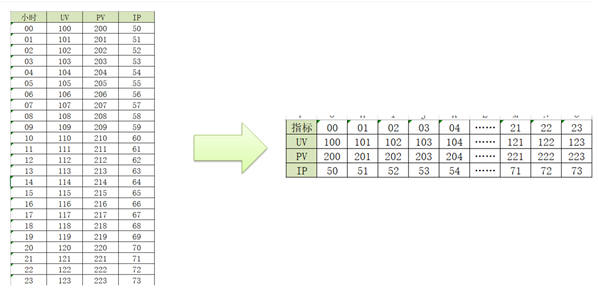

在Hive中，我们可以通过函数来实现各种复杂的行列转换。

## 2、需求一：多行转单列

原始数据表


目标数据表

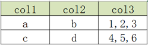

count()/max()/min()/sum()/avg()

> 思考一个问题：group by通常和聚合函数一起使用，但是目前为止，好像没有一个聚合函数，可以把1、2、3汇总为1，2，3这样效果。

#### □ concat函数

功能：用于实现字符串拼接，不可指定分隔符
语法：

```sql
concat(element1,element2,element3……)
```

测试：

```sql
select concat("it","cast","And","heima");
+-----------------+
| itcastAndheima  |
+-----------------+
```

> 特点：如果任意一个元素为null，结果就为null

```sql
select concat("it","cast","And",null);
```

#### □ concat_ws函数

功能：用于实现字符串拼接，可以指定分隔符
语法：

```sql
concat_ws(SplitChar，element1，element2……)
```

测试：

```sql
select concat_ws("-","itcast","And","heima");
+-------------------+
| itcast-And-heima  |
+-------------------+
```

特点：任意一个元素不为null，结果就不为null

```sql
select concat_ws("-","itcast","And",null);
+-------------+
| itcast-And  |
+-------------+
```

#### □ collect_list函数（也是聚合函数的一种）

功能：用于将一列中的多行合并为一行，不进行去重
语法：

```sql
collect_list（colName）
```

测试：

```sql
select collect_list(col1) from row2col1;
+----------------------------+
| ["a","a","a","b","b","b"]  |
+----------------------------+
```

#### □ collect_set函数（也是聚合函数的一种）

功能：用于将一列中的多行合并为一行，并进行去重
语法：

```sql
collect_set（colName）
```

测试：

```sql
select collect_set(col1) from row2col1;
+------------+
| ["b","a"]  |
+------------+
```

□ 代码实现

创建原始数据表，加载数据

```sql
--建表
create table row2col2(
   col1 string,
   col2 string,
   col3 int
)row format delimited fields terminated by '\t';

--加载数据到表中
load data local inpath '/export/data/r2c2.txt' into table row2col2;
```

SQL实现转换

```sql
select
  col1,
  col2,
  concat_ws(',', collect_list(cast(col3 as string))) as col3
from
  row2col2
group by
  col1, col2;
  
答疑：为什么一定要把col3一列转换为字符串
答：因为concat_ws只能合并字符串类型的数据
```

运行结果：

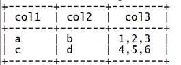


## 3、需求二：单列转多行

原始数据表：


目标数据表：

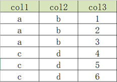

#### □ explode函数

功能：用于将一个==集合或者数组==中的每个元素展开，将每个元素变成一行
语法：

```sql
explode( Map | Array)
```

测试：

```sql
select explode(split("a,b,c,d",","));
```

运行结果：

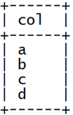

#### □ 代码实现

创建原始数据表，加载数据

```sql
--切换数据库
use db_function;

--创建表
create table col2row2(
   col1 string,
   col2 string,
   col3 string
)row format delimited fields terminated by '\t';


--加载数据
load data local inpath '/export/data/c2r2.txt' into table col2row2;
```

SQL实现转换

```sql
select
  col1,
  col2,
  lv.col3 as col3
from
  col2row2
    lateral view
  explode(split(col3, ',')) lv as col3;
```

 运行结果：

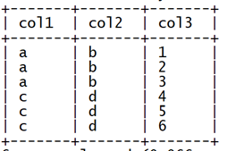

# 四、JSON数据处理

### ☆ 应用场景

JSON数据格式是数据存储及数据处理中最常见的结构化数据格式之一，很多场景下公司都会将数据以JSON格式存储在HDFS中，当构建数据仓库时，需要对JSON格式的数据进行处理和分析，那么就需要在Hive中对JSON格式的数据进行解析读取。

例如，当前我们JSON格式的数据如下：

基本语法：

```json
{"key":"value", "key":"value", "key":"value", "key":"value", ...}
 注意：JSON格式对引号要求比较高，如果key或者value是字符串类型的，只能使用双引号引起来！！！
```

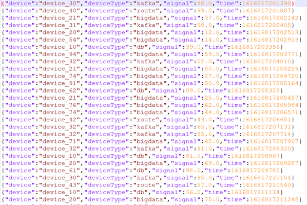

每条数据都以JSON形式存在，每条数据中都包含4个字段，分别为==设备名称【device】、设备类型【deviceType】、信号强度【signal】和信号发送时间【time】==，现在我们需要将这四个字段解析出来，在Hive表中以每一列的形式存储，最终得到以下Hive表：

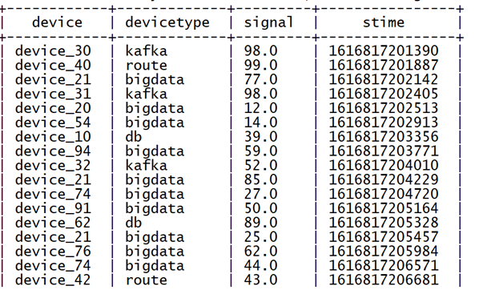

> 扩展：在数据表中，日期和时间也可以以数字形式存在，这个数字是从1970-1-1 00:00:00到当前时间的秒数，我们把这个数字叫做时间戳！

> 为什么日期时间类型不适用date，而采用时间戳格式，相对而言，int占用4个字节，date = '2022-12-30'占用更多的字节，所以把时间以数字形式保存，更加节省空间！

### ☆ 处理方式（二选一）

Hive中为了实现JSON格式的数据解析，提供了两种解析JSON数据的方式，在实际工作场景下，可以根据不同数据，不同的需求来选择合适的方式对JSON格式数据进行处理。

	方式一：使用JSON函数进行处理
Hive中提供了两个专门用于解析JSON字符串的函数：get_json_object、json_tuple，这两个函数都可以实现将JSON数据中的每个字段独立解析出来，构建成表。

	方式二：使用Hive内置的JSON Serde加载数据
Hive中除了提供JSON的解析函数以外，还提供了一种专门用于加载JSON文件的Serde来实现对JSON文件中数据的解析，在创建表时指定Serde，加载文件到表中，会自动解析为对应的表格式。

### ☆ JSON函数：get_json_object

功能：

用于解析JSON字符串，可以从JSON字符串中返回指定的某个对象列的值

语法：

```powershell
get_json_object(json_txt, path) - Extract a json object from path

参数：
第一个参数：指定要解析的JSON字符串
第二个参数：指定要返回的字段，通过$.columnName的方式来指定path
```

特点：每次只能返回JSON对象中一列的值

使用：

创建表

```sql
--切换数据库
use db_itheima;

--创建表
create table tb_json_test1 (
  json string
);
```

加载数据

```sql
--加载数据
load data local inpath '/export/data/device.json' into table tb_json_test1;
```

查询数据

```sql
select * from tb_json_test1;
```

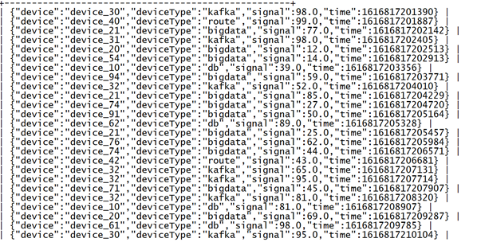

获取设备名称字段

```sql
select
       json,
       get_json_object(json,"$.device") as device
from tb_json_test1;
```

运行结果：

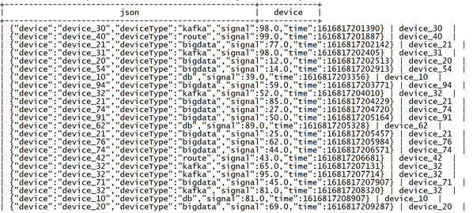

获取设备名称及信号强度字段

```sql
select
       --获取设备名称
       get_json_object(json,"$.device") as device,
       --获取设备信号强度
       get_json_object(json,"$.signal") as signal
from tb_json_test1;
```

运行结果：

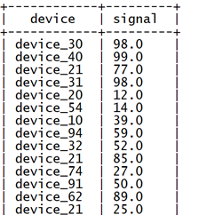

实现需求：

```sql
select
       --获取设备名称
       get_json_object(json,"$.device") as device,
       --获取设备类型
       get_json_object(json,"$.deviceType") as deviceType,
       --获取设备信号强度
       get_json_object(json,"$.signal") as signal,
       --获取时间
       get_json_object(json,"$.time") as stime
from tb_json_test1;
```

运行结果：

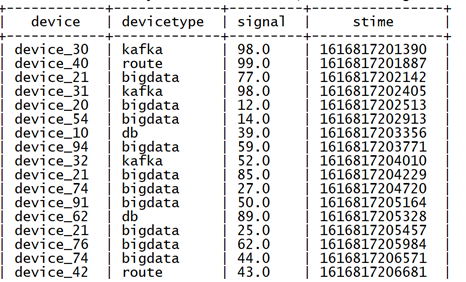

### ☆ JSON函数：json_tuple

功能：

用于实现JSON字符串的解析，可以通过指定多个参数来解析JSON返回多列的值

语法：

```powershell
json_tuple(jsonStr, p1, p2, ..., pn) 
like get_json_object, but it takes multiple names and return a tuple

第一个参数：指定要解析的JSON字符串
第二个参数：指定要返回的第1个字段
...
第N+1个参数：指定要返回的第N个字段
```

特点：

	功能类似于get_json_object，但是可以调用一次返回多列的值 => 属于UDTF类型函数
	返回的每一列都是字符串类型
	还可以搭配lateral view一起使用

使用案例：获取设备名称及信号强度字段

```sql
select
       --返回设备名称及信号强度
       json_tuple(json,"device","signal") as (device,signal)
from tb_json_test1;
```

运行结果：

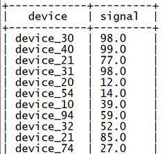

实现需求：

```sql
select
       --解析所有字段
       json_tuple(json,"device","deviceType","signal","time") as (device,deviceType,signal,stime)
from tb_json_test1;
```

运行结果：

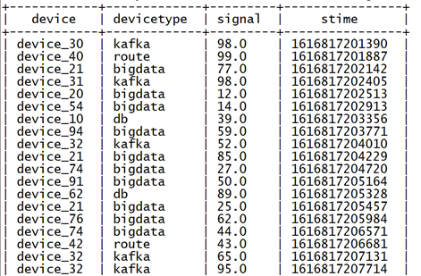

### ☆ JSONSerde

功能：

上述解析JSON的过程中是将数据作为一个JSON字符串加载到表中，再通过JSON解析函数对JSON字符串进行解析，灵活性比较高，但是对于如果整个文件就是一个JSON文件，在使用起来就相对比较麻烦。Hive中为了简化对于JSON文件的处理，内置了一种专门用于解析JSON文件的Serde解析器，==在创建表时，只要指定使用JSONSerde解析表的文件，就会自动将JSON文件中的每一列进行解析==。

使用：

创建表

```sql
--切换数据库
use db_itheima;

--创建表
create table tb_json_test2 (
   device string,
   deviceType string,
   signal double,
   `time` bigint
 )
ROW FORMAT SERDE 'org.apache.hive.hcatalog.data.JsonSerDe'
STORED AS TEXTFILE;
```

> 更多SERDE：https://cwiki.apache.org/confluence/display/Hive/LanguageManual+DDL

加载数据

```sql
load data local inpath '/export/data/device.json' into table tb_json_test2;
```

查询数据

```sql
select * from tb_json_test2;
```

运行结果：

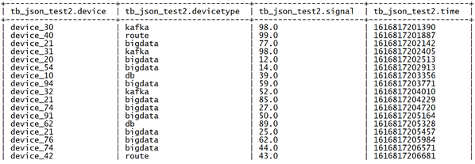

### ☆ 总结

不论是Hive中的JSON函数还是自带的JSONSerde，都可以实现对于JSON数据的解析，工作中一般根据数据格式以及对应的需求来实现解析。如果数据中==每一行只有个别字段是JSON格式字符串，就可以使用JSON函数来实现处理==，但是如果数据加载的文件整体就是JSON文件，==每一行数据就是一个JSON数据，那么建议直接使用JSONSerde==来实现处理最为方便。

# 五、Window functions 窗口函数（重点）

## 1、窗口函数概述

窗口函数如果在MySQL中使用，必须把MySQL版本升级到8.0以上！


==窗口函数（Window functions）==是一种SQL函数，非常适合于数据分析，因此也叫做OLAP函数，其最大特点是：==输入值是从SELECT语句的结果集中的一行或多行的“窗口”中获取的。==你也可以理解为窗口有大有小（行有多有少）。

通过OVER子句，窗口函数与其他SQL函数有所区别。==如果函数具有OVER子句，则它是窗口函数。如果它缺少OVER子句，则它是一个普通的聚合函数。==

窗口函数可以简单地解释为类似于聚合函数的计算函数，但是通过GROUP BY子句组合的常规聚合会隐藏正在聚合的各个行，最终输出一行，==窗口函数聚合后还可以访问当中的各个行，并且可以将这些行中的某些属性添加到结果集中==。


窗口函数基本语法：

窗口函数最重要的有两部分内容 => ==聚合函数/排名函数/分析函数() + over()==

```powershell
select 
	字段名称1,
	字段名称2,
	聚合函数()/排名函数()/分析函数() over()  -- over()不写任何内容代表数据表中所有数据
	聚合函数()/排名函数()/分析函数() over(partition by 字段分组)  -- 类似group by
	聚合函数()/排名函数()/分析函数() over(partition by 字段分组 order by 排序)  -- 组内排序
from 数据表;
```


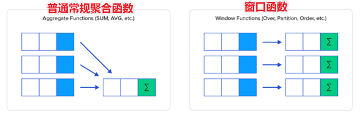

为了更加直观感受窗口函数，我们通过sum聚合函数进行普通常规聚合和窗口聚合，一看效果。

```sql
----sum+group by普通常规聚合操作------------
select sum(salary) as total from employee group by dept;

----sum+窗口函数聚合操作------------
select id,name,deg,salary,dept,sum(salary) over(partition by dept) as total from employee;
```

运行结果：

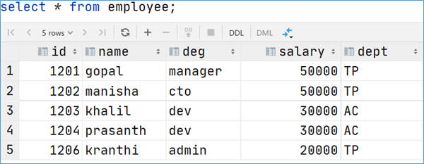

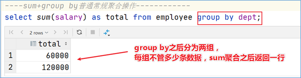

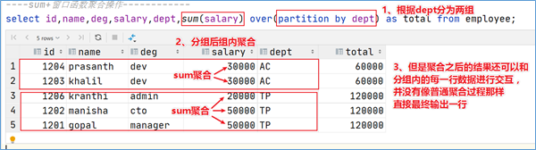

## 2、窗口函数语法

```powershell
聚合函数()/分析函数()/排名函数() over(partition by xxx order by yyy)
```

## 3、案例：网站用户页面浏览次数分析

在网站访问中，经常使用cookie来标识不同的用户身份，通过cookie可以追踪不同用户的页面访问情况，有下面两份数据：

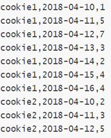

字段含义：cookieid 、访问时间、pv数（页面浏览数）=> pageview

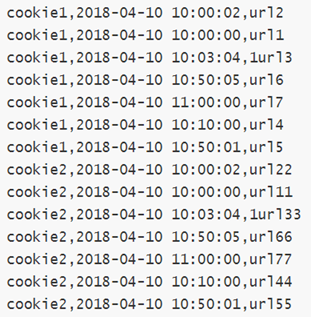

字段含义：cookieid、访问时间、访问页面url

在Hive中创建两张表表，把数据加载进去用于窗口分析。

```sql
---建表并且加载数据
create table website_pv_info(
   cookieid string,
   createtime string,   --day
   pv int
) row format delimited
fields terminated by ',';

create table website_url_info (
    cookieid string,
    createtime string,  --访问时间
    url string          --访问页面
) row format delimited
fields terminated by ',';


load data local inpath '/root/hivedata/website_pv_info.txt' into table website_pv_info;
load data local inpath '/root/hivedata/website_url_info.txt' into table website_url_info;

select * from website_pv_info;
select * from website_url_info;
```

案例：几个入门案例

```powershell
--需求：求出网站总的pv数 所有用户所有访问加起来
--sum(...) over( )对表所有行求和
select cookieid,createtime,pv,
       sum(pv) over() as total_pv
from website_pv_info;

--需求：求出每个用户总pv数
--sum(...) over( partition by... )，同组内所行求和
select cookieid,createtime,pv,
       sum(pv) over(partition by cookieid) as total_pv
from website_pv_info;

--需求：求出每个用户截止到当天，累积的总pv数
--sum(...) over( partition by... order by ... )，在每个分组内，连续累积求和
select cookieid,createtime,pv,
       sum(pv) over(partition by cookieid order by createtime) as current_total_pv
from website_pv_info;
```

## 4、over()窗口表达式

`聚合函数()、排名函数()、分析函数()  +  over()`

我们知道，在==sum(...) over( partition by... order by ... )语法完整==的情况下，进行的累积聚合操作，默认累积聚合行为是：==从第一行聚合到当前行==。

over() ：整个数据表就是一个窗口

over(partition by) ：针对整个数据表中，按照某个字段进行分组，每个分组就是一个窗体

over(partition by + order by) ：如果order by存在的情况下，代表获取截止当前行的窗体


Window expression窗口表达式给我们提供了一种控制行范围的能力，比如向前2行，向后3行。

语法如下：

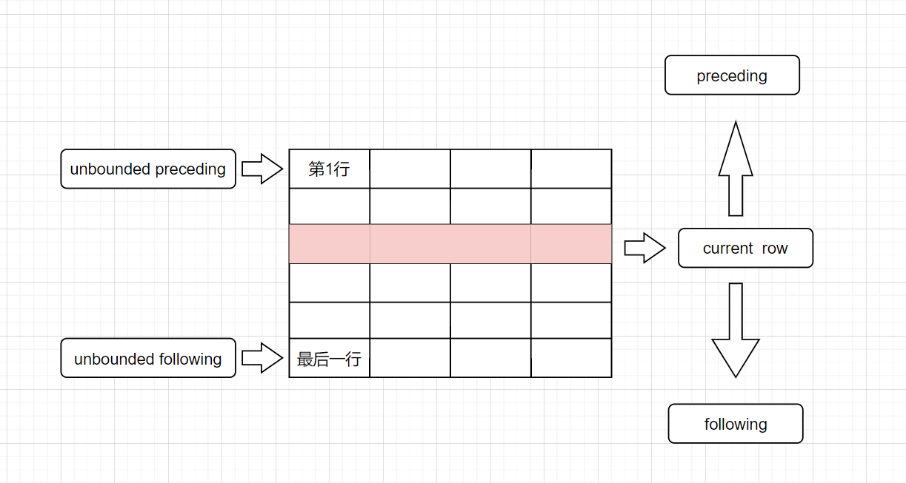

```sql
关键字是rows between，包括下面这几个选项
- preceding：往前
- following：往后
- current row：当前行
- unbounded：边界
- unbounded preceding 表示从前面的起点
- unbounded following：表示到后面的终点
```

```sql
---窗口表达式
--第一行到当前行
select cookieid,createtime,pv,
       sum(pv) over(partition by cookieid order by createtime rows between unbounded preceding and current row) as pv2
from website_pv_info;

--向前3行至当前行
select cookieid,createtime,pv,
       sum(pv) over(partition by cookieid order by createtime rows between 3 preceding and current row) as pv4
from website_pv_info;

--向前3行 向后1行
select cookieid,createtime,pv,
       sum(pv) over(partition by cookieid order by createtime rows between 3 preceding and 1 following) as pv5
from website_pv_info;

--当前行至最后一行
select cookieid,createtime,pv,
       sum(pv) over(partition by cookieid order by createtime rows between current row and unbounded following) as pv6
from website_pv_info;

--第一行到最后一行 也就是分组内的所有行
select cookieid,createtime,pv,
       sum(pv) over(partition by cookieid order by createtime rows between unbounded preceding and unbounded following) as pv6
from website_pv_info;
```

## 5、rows between与range between

区别：

① rows between只和行号有关

② range between只和order by后面的字段值有关，是在这个值的基础上框选数据

准备一个数据集：

```sql
create table t_rows_range(
	 id int
)
row format delimited
fields terminated by ',';
```

案例：

```sql
select
    id,
    sum(id) over(order by id rows between 1 preceding and 1 following) as rows_sum,
    sum(id) over(order by id range between 1 preceding and 1 following) as range_sum
from t_rows_range;
```

运行结果：

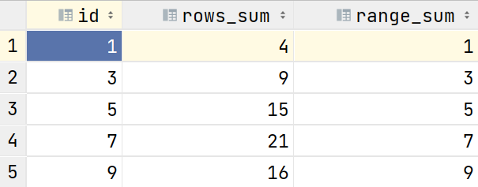

==解析==：

① rows只和行号有关，当光标指向第2行，则向上1行，向下1行，则相当于1 + 3 + 5 = 9

② range只和order by后面的字段值有关，当光标指向第2行，id = 3时，1 preceding代表找id = 2, 1 following代表找id = 4的结果进行累加，因为id为2和4的都不存在，则最终结果为3

## 6、排名函数（重点 => 求TopN）

`聚合函数()/排名函数() + over()`

==row_number()==：在每个分组中，为每行分配一个从1开始的唯一序列号，递增，不考虑重复；

==rank()==: 在每个分组中，为每行分配一个从1开始的序列号，考虑重复，挤占后续位置；

==dense_rank()==: 在每个分组中，为每行分配一个从1开始的序列号，考虑重复，不挤占后续位置；

​                 rank    dense_rank   row_number

小明   90     1               1                     1

小丽   90     1               1                     2

小红   80     3               2                     3

rank() over()  ：有并列但是编号不连续

dense_rank() over() ：有并列且编号连续

row_number() over() ：编号连续但是没有并列情况（行号）

案例：

```powershell
--需求：找出每个用户访问pv最多的Top3 重复并列的不考虑
SELECT * from
(SELECT
    cookieid,
    createtime,
    pv,
    ROW_NUMBER() OVER(PARTITION BY cookieid ORDER BY pv DESC) AS seq
FROM website_pv_info) tmp where tmp.seq < 4;
```

## 7、NTILE分析函数（分成几份）

​								评分

广东 深圳  店铺1  9   1

广东 深圳  店铺2  8   2

​												NTILE(2) OVER(partition by city order by rating desc) 

广东 深圳  店铺3  7   3

广东 深圳  店铺4  6   4


分析函数() + over()

```powershell
--把每个分组内的数据分为3桶
SELECT
    cookieid,
    createtime,
    pv,
    NTILE(3) OVER(PARTITION BY cookieid ORDER BY createtime) AS rn2
FROM website_pv_info
ORDER BY cookieid,createtime;

注意：
partition by中的order by排序：相当于组内排序
最后这个order by：相当于全局排序（针对产生的结果，最终排序）

6  分成  3份，每份2条记录
7  分成  3份，第1份有3条记录，其他两份都是2条记录
8  分成  3份，第1份、2份有3条记录，另外一份有2条记录
```

案例：

```powershell
--需求：统计每个用户pv数最多的前3分之1组。
--理解：将数据根据cookieid分 根据pv倒序排序 排序之后分为3个部分 取第一部分
SELECT * from
(SELECT
     cookieid,
     createtime,
     pv,
     NTILE(3) OVER(PARTITION BY cookieid ORDER BY pv DESC) AS rn
 FROM website_pv_info) tmp where rn =1;
 
NTILE一般是均分，比如有一个partition by中有6条记录，则2条记录（1个NTILE组）
```

## 8、窗口分析函数

1  LAG		2  当前行	  3  LEAD

==LAG(col,n,DEFAULT)==用于统计窗口内往上第n行值（滞后）

第一个参数为列名，第二个参数为往上第n行（可选，默认为1），第三个参数为默认值（当往上第n行为NULL时候，取默认值，如不指定，则为NULL）；

==LEAD(col,n,DEFAULT)== 用于统计窗口内往下第n行值（领先）

第一个参数为列名，第二个参数为往下第n行（可选，默认为1），第三个参数为默认值（当往下第n行为NULL时候，取默认值，如不指定，则为NULL）；

==FIRST_VALUE== 取分组内排序后，截止到当前行，第一个值；

==LAST_VALUE== 取分组内排序后，截止到当前行，最后一个值 => 容易踩坑；

```powershell
-----------窗口分析函数----------
--LAG
SELECT cookieid,
       createtime,
       url,
       ROW_NUMBER() OVER(PARTITION BY cookieid ORDER BY createtime) AS rn,
       LAG(createtime,1,'1970-01-01 00:00:00') OVER(PARTITION BY cookieid ORDER BY createtime) AS last_1_time,
       LAG(createtime,2) OVER(PARTITION BY cookieid ORDER BY createtime) AS last_2_time
FROM website_url_info;

--LEAD
SELECT cookieid,
       createtime,
       url,
       ROW_NUMBER() OVER(PARTITION BY cookieid ORDER BY createtime) AS rn,
       LEAD(createtime,1,'1970-01-01 00:00:00') OVER(PARTITION BY cookieid ORDER BY createtime) AS next_1_time,
       LEAD(createtime,2) OVER(PARTITION BY cookieid ORDER BY createtime) AS next_2_time
FROM website_url_info;

--FIRST_VALUE
SELECT cookieid,
       createtime,
       url,
       ROW_NUMBER() OVER(PARTITION BY cookieid ORDER BY createtime) AS rn,
       FIRST_VALUE(url) OVER(PARTITION BY cookieid ORDER BY createtime) AS first1
FROM website_url_info;

--LAST_VALUE
SELECT cookieid,
       createtime,
       url,
       ROW_NUMBER() OVER(PARTITION BY cookieid ORDER BY createtime) AS rn,
       LAST_VALUE(url) OVER(PARTITION BY cookieid ORDER BY createtime rows between unbounded preceding and unbounded following) AS last1
FROM website_url_info;
```

> 很多小伙伴，对LEAD和LAG感觉比较简单，但是不知道在实际工作中有何用途。
>
> 强调一下：在实际工作中，指标运算 => 同比或者环比通常都是通过LEAD或者LAG来进行实现。
>
> 同比：今年与去年相同日期比较，今年2024-05-01出行人数 与 2023-05-01进行比较
>
> 环比：今天和昨天日期相比
