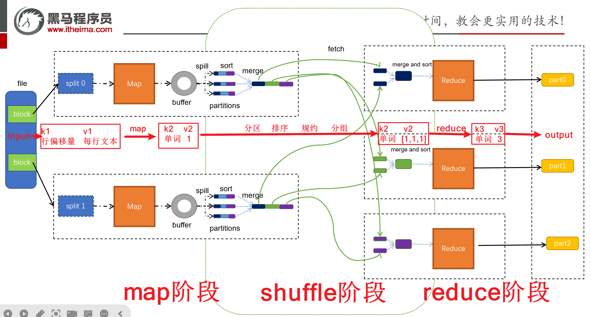
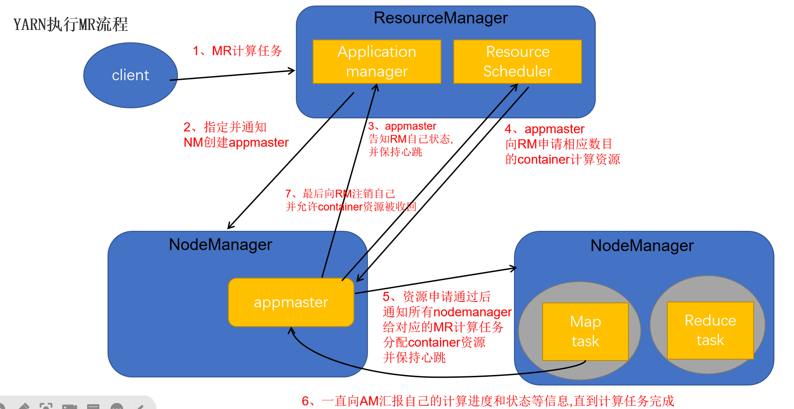
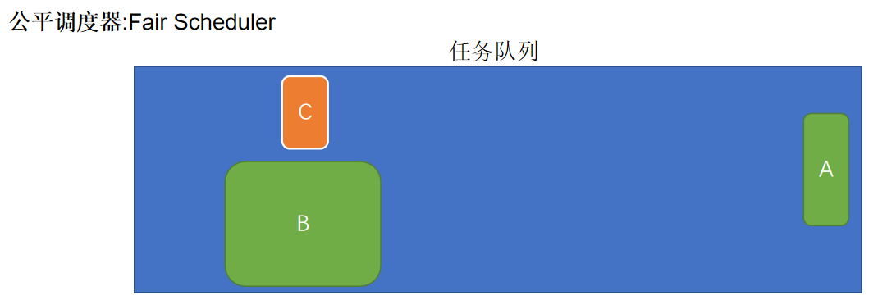
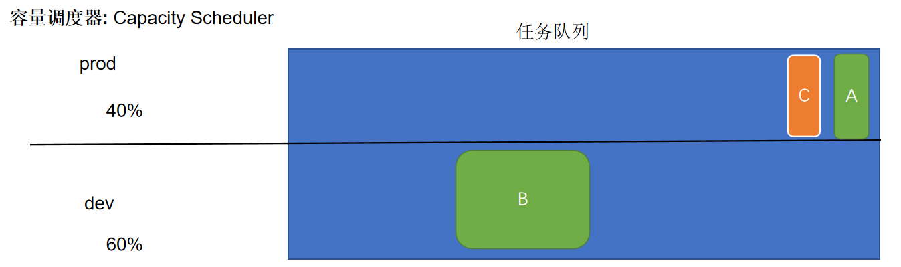
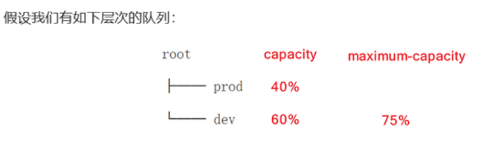

## MapReduce&YARN高阶原理

## MR

### 单词统计流程

```properties
已知文件内容:  
    hadoop hive hadoop spark hive 
    flink hive linux hive mysql

input结果: 
        k1(行偏移量)   v1(每行文本内容)
        0   		 hadoop hive hadoop spark hive 
        30   		 flink hive linux hive mysql
map结果:
        k2(split切割后的单词)  v2(拼接1)     
        hadoop  			 1
        hive   				 1
        hadoop  			 1
        spark  				 1
        hive   				 1
        flink  				 1
        hive   				 1
        linu  				 1
        hive   				 1
        mysql  				 1
分区/排序/规约/分组结果:
        k2(排序分组后的单词)   v2(每个单词数量的集合)
        flink   		    [1]
        hadoop  			[1,1]
        hive    			[1,1,1,1]
        linux   			[1] 
        mysql   			[1]
        spark   			[1]
reduce结果:
        k3(排序分组后的单词)   v3(聚合后的单词数量)
        flink 				 1
        hadoop 				 2
        hive   				 4
        linux  				 1
        mysql  				 1
        spark  				 1
output结果:   注意: 输出目录一定不要存在,否则报错
        flink   1
        hadoop  2
        hive    4
        linux   1
        mysql   1
        spark   1
```


### [面试]MR底层原理



#### map阶段

```properties
第一阶段是把输入目录下文件按照一定的标准逐个进行逻辑切片，形成切片规划。默认情况下Split size 等于 Block size。每一个切片由一个MapTask处理（当然也可以通过参数单独修改split大小）
第二阶段是对切片中的数据按照一定的规则解析成对。默认规则是把每一行文本内容解析成键值对。key是每一行的起始位置(单位是字节)，value是本行的文本内容。（TextInputFormat）
第三阶段是调用Mapper类中的map方法。上阶段中每解析出来的一个，调用一次map方法。每次调用map方法会输出零个或多个键值对
第四阶段是按照一定的规则对第三阶段输出的键值对进行分区。默认是只有一个区。分区的数量就是Reducer任务运行的数量。默认只有一个Reducer任务
第五阶段是对每个分区中的键值对进行排序。首先，按照键进行排序，对于键相同的键值对，按照值进行排序。比如三个键值对<2,2>、<1,3>、<2,1>，键和值分别是整数。那么排序后的结果是<1,3>、<2,1>、<2,2>。
如果有第六阶段，那么进入第六阶段；如果没有，直接输出到文件中
第六阶段是对数据进行局部聚合处理，也就是combiner处理。键相等的键值对会调用一次reduce方法。经过这一阶段，数据量会减少。本阶段默认是没有的。

注意: 不要死记硬背,要结合自己的理解,转换为自己的话术,用于面试
```

#### shuffle阶段

```properties
shuffle是Mapreduce的核心，它分布在Mapreduce的map阶段和reduce阶段。一般把从Map产生输出开始到Reduce取得数据作为输入之前的过程称作shuffle。
Collect阶段：将MapTask的结果输出到默认大小为100M的环形缓冲区，保存的是key/value，Partition分区信息等
Spill阶段：当内存中的数据量达到一定的阀值(80%)的时候，就会将数据写入本地磁盘，在将数据写入磁盘之前需要对数据进行一次排序的操作，如果配置了combiner，还会将有相同分区号和key的数据进行排序
Merge阶段：把所有溢出的临时文件进行一次合并操作，以确保一个MapTask最终只产生一个中间数据文件
Copy阶段： ReduceTask启动Fetcher线程到已经完成MapTask的节点上复制一份属于自己的数据，这些数据默认会保存在内存的缓冲区中，当内存的缓冲区达到一定的阀值的时候，就会将数据写到磁盘之上
Merge阶段：在ReduceTask远程复制数据的同时，会在后台开启两个线程对内存到本地的数据文件进行合并操作。
Sort阶段：在对数据进行合并的同时，会进行排序操作，由于MapTask阶段已经对数据进行了局部的排序，ReduceTask只需保证Copy的数据的最终整体有效性即可。 

注意: 不要死记硬背,要结合自己的理解,转换为自己的话术,用于面试
```

#### reduce阶段

```properties
第一阶段是Reducer任务会主动从Mapper任务复制其输出的键值对。Mapper任务可能会有很多，因此Reducer会复制多个Mapper的输出。

第二阶段是把复制到Reducer本地数据，全部进行合并，即把分散的数据合并成一个大的数据。再对合并后的数据排序。

第三阶段是对排序后的键值对调用reduce方法。键相等的键值对调用一次reduce方法，每次调用会产生零个或者多个键值对。最后把这些输出的键值对写入到HDFS文件中。

注意: 不要死记硬背,要结合自己的理解,转换为自己的话术,用于面试
```

## YARN

### [面试]YARN组成

```powershell
答：
① Resource Manager ：负责资源的分配与调度，接收客户端请求、监控NodeManager以及AppMaster
② Node Manager ：NM，管理本机资源，处理Resource Manager与AppMaster相关命令
③ AppMaster ：全称Application Master，运行在NodeManager节点中，负责向RM申请资源并分配给内部任务，负责任务的监控、容错以及销毁等工作（每个Job任务都有一个对应的AppMaster）
```

### [面试]YARN执行MR流程



YARN角色划分：

物理层面两大角色：Resource Manager、Node Manager

逻辑层面引入角色：AppMaster角色（任务管理者），随任务而来随任务而走，运行在NodeManager

```powershell
① 客户端提交任务到Yarn集群中的RM。Yarn集群接收到这个任务后，会从各个nodemanager（NM）节点中, 随机找到一台有资源的节点, 用于启动AppMaster程序, 启动后, AppMaster汇报给resourcemanager（RM），并建立心跳机制
② AppMaster会根据任务的需求，主动向resourcemanager（RM）申请资源,  RM根据各个NM节点的情况，准备好相关的资源信息, 等待AppMaster的拉取
③ AppMaster程序获取到了相关的资源后, 连接对应nodemanager（NM）节点, 让其创建任务所需的资源容器（Container），然后让其在容器中启动对应的MapTask和ReduceTask，同时反向注册回AppMaster（建立心跳机制，让AppMaster可以时刻感知到任务执行状态）。
④ 接下来AppMaster开始监控任务的执行，各个任务定时向AppMaster汇报自己的状态和进度，以便当任务失败时可以重启任务；当任务执行结束，AppMaster也会通知RM回收所有的资源与自己。
```

### [面试]YARN三种调度器

```properties
调度器的配置在yarn-site.xml查找,如果没有就去yarn-default.xml中找
网址: https://hadoop.apache.org/docs/stable/hadoop-yarn/hadoop-yarn-common/yarn-default.xml
配置项和默认值如下yarn.resourcemanager.scheduler.class=org.apache.hadoop.yarn.server.resourcemanager.scheduler.capacity.CapacityScheduler
```

#### 先进先出调度器


```properties
FIFO Scheduler: 把应用按提交的顺序排成一个队列，在进行资源分配的时候，先给队列中最头上的应用进行分配资源，待最头上的应用需求满足后再给下一个分配，以此类推。
好处:  能够保证每一个任务都能拿到充足的资源, 对于大任务的运行非常有好处
弊端:  如果先有大任务后有小任务,会导致后续小任务无资源可用, 长期处于等待状态
应用:  测试环境
```

#### 公平调度器



```properties
Fair Scheduler :不需要保留集群的资源，因为它会动态在所有正在运行的作业之间平衡资源 , 当一个大job提交时，只有这一个job在运行，此时它获得了所有集群资源；当后面有小任务提交后，Fair调度器会分配一半资源给这个小任务，让这两个任务公平的共享集群资源。

好处:  保证每个任务都有资源可用, 不会有大量的任务等待在资源分配上
弊端: 如果大任务非常的多, 就会导致每个任务获取资源都非常的有限, 也会导致执行时间会拉长
应用: CDH商业版本的hadoop
```

#### 容量调度器



```properties
Capacity Scheduler: 为每个组织分配专门的队列和一定的集群资源，这样整个集群就可以通过设置多个队列的方式给多个组织提供服务了。在每个队列内部，资源的调度是采用的是先进先出(FIFO)策略。
好处: 可以保证多个任务都可以使用一定的资源, 提升资源的利用率
弊端: 如果遇到非常的大的任务, 此任务不管运行在那个队列中, 都无法使用到集群中所有的资源,  导致大任务执行效率比较低,当任务比较繁忙的时候, 依然会出现等待状态
应用: apache开源版本的hadoop
```

#### 小结（背诵）

* ==FIFO scheduler:  先进先出的调度器 (一般不使用, 除非整个集群就你自己用)==
  * 措施: 将提交过来任务全部放置到一个队列,  然后按照先进先出的特点进行资源分配, 会先满足第一个任务, 满足后, 接着在满足第二个, 以此类推
  * 弊端: 如果第一个任务比较大, 有可能将整个集群中所有的资源都占用了, 导致后续的任务长时间等待, 这样是非常不友好
  * 好处: 保证每一个任务拿到最大的资源
* ==Capacity Scheduler : 容量调度器  (有的, apache官方版本 默认采用容量调度方案)==
  * 措施:  可以提前定义多个队列(每个队列依然是FIFO特性), 每个队列可以使用集群中部分资源, 可以通过设置每个队列的比例, 当提交任务的时候, 需要指定将任务提交到那个队列中来, 还支持资源抢占模式
  * 好处:  
    * 可以让多个任务都拥有一部分资源, 不会因为某个任务将全部资源占用, 而导致其他任务没有资源可用, 同时通过资源抢占, 可以让大的任务拥有更多的一些资源(一般拿不到100%资源)
  * 弊端: 
    * 如果遇到超大任务, 由于无法获取到资源中所有资源, 可能会导致任务执行效率会有所降低

* ==**Fair Scheduler:** 公平调度器 (有的, CDH(cloudera)商业版本hadoop默认采用调度方案)==
  * 措施: 当任务到达队列后, 集群会将所有的资源都交给第一个任务, 让其获取最大的资源 以达到快速运行, 在此运行过程中, 如果有了新的任务到来, 会让其先前释放出最多50%资源, 交给下一个任务来运行, 当下一个任务执行完成后, 如果发现上一个任务依然没有跑完, 还会在此将资源交给上一个任务
  * 注意: 在找上一个任务获取资源的时候, 采用 先等待 后强制措施
  * 好处:
    *  可以保证让所有任务都拿到相对公平的资源, 保证大家都可以运行
  * 弊端: 
    * 如果任务量比较庞大, 就会导致每个任务获取资源都非常的有限, 也会导致执行时间会拉长

示例:

>调度器的使用是通过**yarn-site.xml**配置文件中的
>**yarn.resourcemanager.scheduler.class**参数进行配置的，默认采用**Capacity Scheduler**调度器
>下面是一个简单的Capacity调度器的配置文件，文件名为**capacity-scheduler.xml**。
>
>
>
>在这个配置中，在root队列下面定义了两个子队列prod和dev，分别占40%和60%的容量
>
>```xml
>    <property>
>        <!-- 队列分为两份 prod 和 dev    -->
>        <name>yarn.scheduler.capacity.root.queues</name>
>        <value>prod,dev</value>
>    </property>
>       <property>
>        <!--prod占比 40%-->
>        <name>yarn.scheduler.capacity.root.prod.capacity</name>
>        <value>40</value>
>    </property>
>    <property>
>        <!--dev占比 60%-->
>        <name>yarn.scheduler.capacity.root.dev.capacity</name>
>        <value>60</value>
>    </property>
>    <property>
>        <!-- dev的最大占比 75%-->
>        <name>yarn.scheduler.capacity.root.dev.maximum-capacity</name>
>        <value>75</value>
>    </property>
>```
>
>prod由于没有设置maximum-capacity属性，它有可能会占用集群全部资源。
>dev的maximum-capacity属性被设置成了75%，所以即使prod队列完全空闲dev也不会占用全部集群资源，也就是说，prod队列仍有25%的可用资源用来应急。

### [扩展] 使用yarn命令查看日志信息

```powershell
1）查看所有yarn日志
yarn application -list -appStates ALL

Total number of applications (application-types: [], states: [NEW, NEW_SAVING, SUBMITTED, ACCEPTED, RUNNING, FINISHED, FAILED, KILLED] and tags: []):1
                Application-Id      Application-Name        Application-Type          User           Queue                   State             Final-State             Progress                        Tracking-URL
application_1673666139292_0001            word count               MAPREDUCE          root         default                FINISHED               SUCCEEDED                 100% http://node1:19888/jobhistory/job/job_1673666139292_0001

2）查看具体某个任务信息
yarn logs -applicationId application_1673666139292_0001
```

yarn日志存储位置：（远程存储yarn日志）

```powershell
1）查看yarn-site.xml，确定log配置目录
<property>
      <name>yarn.nodemanager.remote-app-log-dir</name>
      <value>/app-logs</value>
</property>

说明：以上配置完成后，上传到node2、node3，然后重启整个集群
scp yarn-site.xml node2:$PWD
scp yarn-site.xml node3:$PWD

2）查看日志文件信息（注意日期和时间）
[hdfs@node1 root]$ hdfs dfs -ls /app-logs/root/bucket-logs-tfile/0001
Found 1 items
drwxrwx---   - hdfs hadoop          0 2022-05-02 04:18 /app-logs/root/bucket-logs-tfile/0001/application_1673668518162_0001
 
3）查看日志详情
yarn logs -applicationId application_1493700892407_0007
```


