# Hive存储与压缩对比

## 1、TEXTFILE格式

默认格式，数据不做压缩，磁盘开销大，数据解析开销大。可结合Gzip、Bzip2使用(系统自动检查，执行查询时自动解压)，但使用这种方式，hive不会对数据进行切分，从而无法对数据进行并行操作。

大数据项目 => ODS、RPT层喜欢采用TEXTFILE，如果引入了Sqoop工具，则两端也可以采用ORC格式


## 2、ORC格式

==ORC==的全称是(Optimized Row Columnar)，ORC文件格式是一种Hadoop生态圈中的列式存储格式，它的产生早在2013年初，最初产生自Apache Hive，用于降低Hadoop数据存储空间和加速Hive查询速度。它并不是一个单纯的列式存储格式，仍然是首先根据行组分割整个表，在每一个行组内进行按列存储。

优点如下：

ORC是列式存储，有多种文件压缩方式，并且有着很高的压缩比。

因此，在Hive中使用ORC作为表的文件存储格式，不仅节省HDFS存储资源，查询任务的输入数据量减少，使用的MapTask也就减少了。

ORC可以支持复杂的数据结构（比如Map等）。

==ORC文件也是以二进制方式存储的，所以是不可以直接读取，ORC文件也是自解析的==。

### ☆ 了解ORC结构

一个orc文件可以分为若干个Stripe，一个stripe可以分为三个部分：

indexData：某些列的索引数据（数据目录 => 数据）

rowData :真正的数据存储

StripFooter：stripe的元数据信息

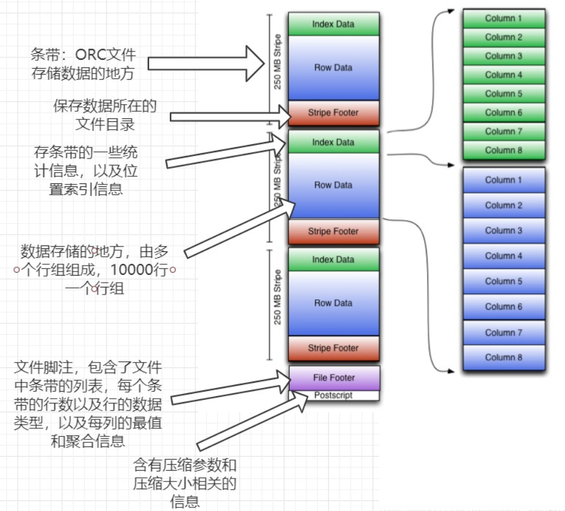

1）Index Data：一个轻量级的index，默认是每隔1W行做一个索引。这里做的索引只是记录某行的各字段在Row Data中的offset。

2）Row Data：存的是具体的数据，先取部分行，然后对这些行按列进行存储。对每个列进行了编码，分成多个Stream来存储。

3）Stripe Footer：存的是各个stripe的元数据信息。

每个文件有一个File Footer，这里面存的是每个Stripe的行数，每个Column的数据类型信息等；每个文件的尾部是一个PostScript，这里面记录了整个文件的压缩类型以及FileFooter的长度信息等。在读取文件时，会seek到文件尾部读PostScript，从里面解析到File Footer长度，再读FileFooter，从里面解析到各个Stripe信息，再读各个Stripe，即从后往前读。

**特别注意：ORC格式的表还支持事务ACID，但是支持事务的表必须为分桶表，所以适用于更新大批量的数据，不建议用事务频繁的更新小批量的数据**

## 3、PARQUET格式

==Parquet==是面向分析型业务的列式存储格式，由Twitter和Cloudera合作开发，2015年5月从Apache的孵化器里毕业成为Apache顶级项目。

==Parquet文件是以二进制方式存储的，所以是不可以直接读取的，文件中包括该文件的数据和元数据，因此Parquet格式文件是自解析的。==

通常情况下，在存储Parquet数据的时候会按照Block大小设置行组的大小，由于一般情况下每一个Mapper任务处理数据的最小单位是一个Block，这样可以把每一个行组由一个Mapper任务处理，增大任务执行并行度。

### ☆ 了解PARQUET格式

Parquet文件的格式如下图所示：

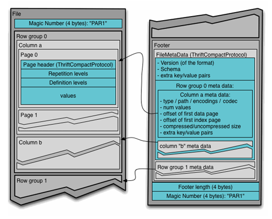

简图：

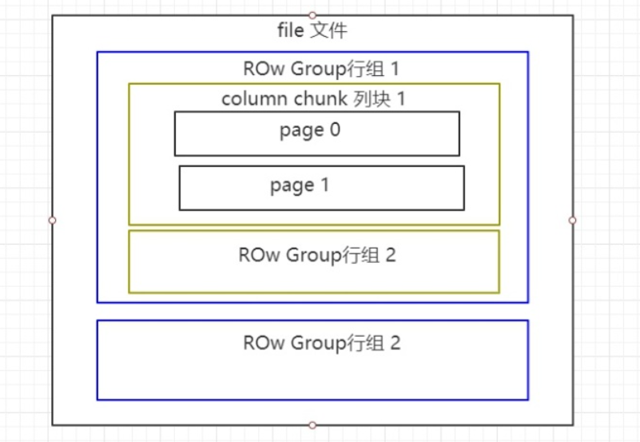

Parquet文件是以二进制方式存储的，所以不可以直接读取，和ORC一样，文件的元数据和数据一起存储，所以Parquet格式文件是自解析的。

① 行组(Row Group)：每一个行组包含一定的行数，在一个HDFS文件中至少存储一个行组，类似于orc的stripe的概念。

② 列块(Column Chunk)：在一个行组中每一列保存在一个列块中，行组中的所有列连续的存储在这个行组文件中。一个列块中的值都是相同类型的，不同的列块可能使用不同的算法进行压缩。

③ 页(Page)：每一个列块划分为多个页，一个页是最小的编码的单位，在同一个列块的不同页可能使用不同的编码方式。

## 4、文件格式存储对比

从存储文件的压缩比和查询速度两个角度对比。

测试数据 参见附件资料log.data。

### ☆ TEXTFILE

创建表，存储数据格式为TEXTFILE。

```sql
create table log_text (
track_time string,
url string,
session_id string,
referer string,
ip string,
end_user_id string,
city_id string
)
ROW FORMAT DELIMITED FIELDS TERMINATED BY '\t'
STORED AS TEXTFILE ;
```

加载数据：

```sql
load data local inpath '/root/hivedata/log.data' into table log_text;
```

查看表中数据大小：

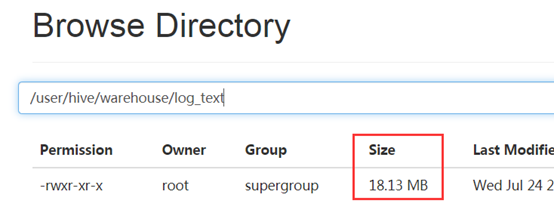

### ☆ ORC

创建表，存储数据格式为ORC。

```sql
create table log_orc(
track_time string,
url string,
session_id string,
referer string,
ip string,
end_user_id string,
city_id string
)
ROW FORMAT DELIMITED FIELDS TERMINATED BY '\t'
STORED AS orc;
```

向表中加载数据：

```sql
insert into table log_orc select * from log_text ;
```

查看表中数据大小：

```powershell
dfs -du -h /user/hive/warehouse/log_orc;
```

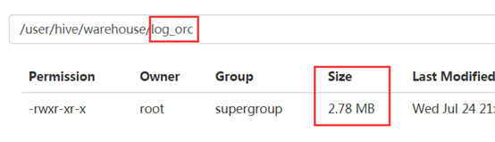

### ☆ PARQUET

创建表，存储数据格式为parquet。

```sql
create table log_parquet(
track_time string,
url string,
session_id string,
referer string,
ip string,
end_user_id string,
city_id string
)
ROW FORMAT DELIMITED FIELDS TERMINATED BY '\t'
STORED AS PARQUET;	
```

向表中加载数据：

```sql
insert into table log_parquet select * from log_text ;
```

查看表中数据大小

```sql
dfs -du -h /user/hive/warehouse/log_parquet;
```

运行结果：

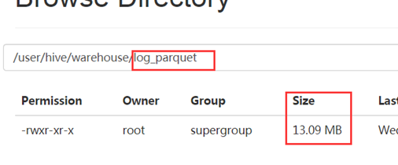

### ☆ 小结

存储文件的压缩比总结：ORC > Parquet >  TextFile

## 5、存储文件查询速度对比

可以针对三张表，使用sql统计表数据个数。查看执行时间。

```sql
select count(*) from log_text;
```

运行结果：

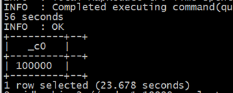

```sql
select count(*) from log_orc;
```

运行结果：

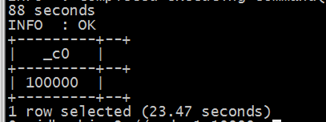

```sql
select count(*) from log_parquet;
```

 运行结果：

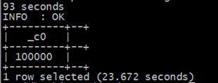

## 6、存储格式和压缩的整合

### ☆ 非压缩ORC文件

建表语句：

```sql
create table log_orc_none(
    track_time string,
    url string,
    session_id string,
    referer string,
    ip string,
    end_user_id string,
    city_id string
)
ROW FORMAT DELIMITED FIELDS TERMINATED BY '\t'
STORED AS orc tblproperties ("orc.compress"="NONE");
```

插入数据：

```sql
insert into table log_orc_none select * from log_text ;
```

查看插入后数据：

```sql
dfs -du -h /user/hive/warehouse/log_orc_none;
```

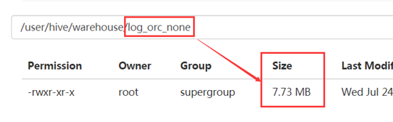

### ☆ Snappy压缩ORC文件

建表语句：

```sql
create table log_orc_snappy(
    track_time string,
    url string,
    session_id string,
    referer string,
    ip string,
    end_user_id string,
    city_id string
)
ROW FORMAT DELIMITED FIELDS TERMINATED BY '\t'
STORED AS orc tblproperties ("orc.compress"="SNAPPY");
```

插入数据：

```sql
insert into table log_orc_snappy select * from log_text ;
```

查看插入后数据：

```sql
dfs -du -h /user/hive/warehouse/log_orc_snappy;
```

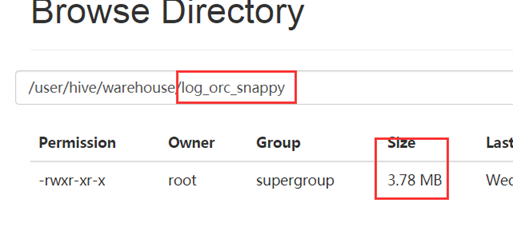

上一节中默认创建的ORC存储方式，导入数据后的大小为比Snappy压缩的还小。原因是orc存储文件默认采用ZLIB压缩。比snappy压缩的小。

在实际的项目开发当中，hive表的数据存储格式一般选择：orc或parquet。压缩方式一般选择snappy。


存在问题：有小伙伴可能会问，为什么ORC存储在刚才的实验中，只有2.78MB。但是ORC + Snappy经过实验竟然占用3.78MB空间大小，为什么压缩以后反而更大了？

答：因为底层压缩算法不同，如果直接以ORC方式存储，其底层采用Zlib压缩算法，其压缩率比Snappy更高，但是其压缩和解压缩速度相对于Snappy而言，要慢很多。
