# day07_Spark Core课程笔记

今日内容:

* 1- RDD的持久化: checkpoint
* 2- RDD的共享变量: 广播变量 和  累加器
* 3- RDD的内核调度: 
  * RDD的依赖关系
  * DAG执行流程图
  * 划分Stage
  * shuffle机制
  * 调度流程
  * 并行度
  * combinerByKey算子使用

## 1. RDD的基本介绍

### 1.1 什么是RDD

RDD: 弹性分布式数据集

出现目的: 为了能够支持更加高效的迭代计算操作

背景说明:

```properties
早期的计算模型:  单机计算模型
	例如: MySQL / Excel
	单机的计算模型
	仅适用于: 小量数据集的处理操作
	在计算操作的时候, 只有一个进程, 在一个进程中通过不断的迭代完成最终的计算操作

随着不断的发展, 整个社会数据量都在不断的增大, 原有单机的计算模型无法应对未来的数据处理需要, 怎么办呢? 分布式计算模型

	核心: 采用多节点处理, 将一个任务拆分为N多个子任务, 分别运行在不同的节点上进行并行的处理,各个节点计算完成后, 将结果汇总处理即可 (分而治之)
	
	诞生了相关的分布式计算框架: MR Spark Flink  Storm ......


	MR和Spark都是一个大规模的分布式计算引擎, 都可以处理大规模的数据;
		MR存在的弊端: 1- 执行效率低  2- 迭代计算不方便
		
	正因为MR存在一些弊端, 对于市场来说, 迫切需要一款能够解决MR痛点的架构:
		1- 解决多次磁盘的IO问题, 整个计算尽可能都在内存中处理, 减少IO
		2- 提供一个更加高效的迭代计算引擎
	
	RDD的出现就是为了解决这个问题
	
```

MR的迭代模型:

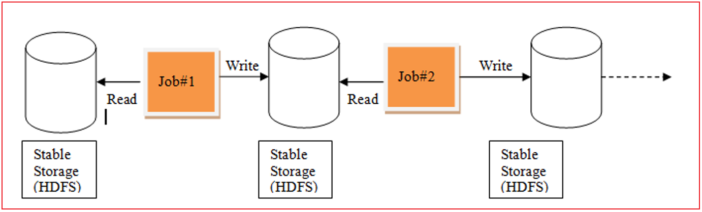

Spark的迭代计算模型:

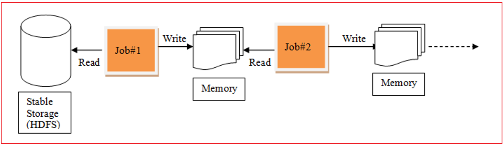

​	RDD是一个抽象的数据模型, RDD本身并不存储任何的数据, 仅仅是一个数据传输的管道, 在这个管道中,作为使用者, 只需要告知给RDD应该从哪里读, 中间需要进行什么样的转换逻辑操作, 以及最后需要将结果输出到什么位置即可, 一旦启动后, RDD会根据用户设定的规则, 完成整个处理操作


### 1.2 RDD的五大特性和五大特点

* 五大特性:

```properties
1- (必须的) RDD可分区的
2- (必须的) 每一个RDD都是由一个计算函数产生的
3- (必须的) RDD之间是存在着依赖关系
4- (可选的) 对于KV类型的数据, 是存在分区函数,对于KV类型的RDD默认是基于Hash 分区方案
5- (可选的) 移动数据不如移动计算(让计算程序离数据越近越好)
```

* RDD的五大特点:

```properties
1- RDD是可分区的: 分区是一种逻辑分区, 仅仅定义分区的规则,并不是直接对数据进行分区操作, 因为RDD本身不存储数据
2- RDD是只读的: 每一个RDD都是不可变的, 如果想要改变, 处理后会得到一个新的RDD, 原有RDD保存原样
3- RDD之间存在依赖关系: 每个RDD之间都是有依赖关系的, 也称为血缘关系, 一般分为两种依赖(宽依赖/窄依赖)
4- RDD可以设置cache(缓存): 当计算过程中, 一个RDD被多个RDD所依赖的时候, 可以将这个RDD结果缓存起来, 这样后续使用这个RDD的时候, 可以直接获取, 不需要重新计算
5- RDD的checkpoint(检查点): 与缓存类似, 都是可以将中间某一个RDD的结果保存起来, 只不过checkpoint支持持久化保存
```


## 2. 如何构建RDD

构建RDD对象的方式主要有二种

```properties
1- 通过parallelized Collections构建RDD:  并行本地集合方式  (测试)

2- 通过 External Data构建RDD: 加载外部文件的方式 (测试/开发)
```

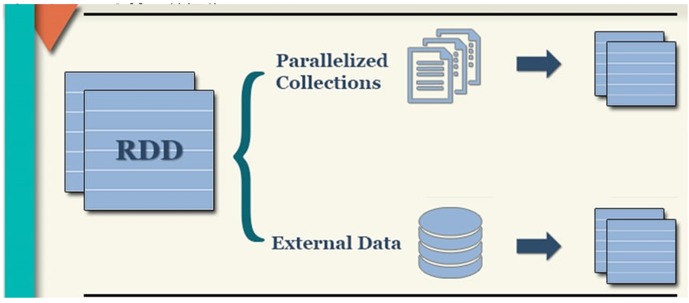

### 2.1 通过并行化本地的方式构建RDD

代码实现

```properties
from pyspark import SparkContext, SparkConf
import os
# 锁定远端环境, 确保环境统一
os.environ['SPARK_HOME'] = '/export/server/spark'
os.environ['PYSPARK_PYTHON'] = '/root/anaconda3/bin/python3'
os.environ['PYSPARK_DRIVER_PYTHON'] = '/root/anaconda3/bin/python3'


if __name__ == '__main__':
    print("如何构建RDD方式一: 并行本地集合")

    # 1. 创建SparkContext核心对象
    conf = SparkConf().setAppName("create_rdd_01").setMaster("local[2]")
    sc = SparkContext(conf=conf)

    # 2. 读取数据集: 本地集合
    rdd_init = sc.parallelize([1, 2, 3, 4, 5, 6, 7, 8, 9, 10],3)


    # 3. 打印结果数据
    print(rdd_init.collect())

    print(rdd_init.getNumPartitions()) # 获取这个RDD有多少个分区

    print(rdd_init.glom().collect()) # 获取每个分区中的数据

    # 4- 释放资源
    sc.stop()

```

相关的API:

```properties
查看分区数量API:
	rdd.getNumPartitions()

查看每个分区数据的API:
	rdd.glom().collect()

构建RDD的API:
	parallelize(参数1,参数2)
		参数1: 设置本地列表
		参数2: 设置有多少个分区
```

通过本地列表的方式构建RDD, 其RDD初始的分区数量如何确定:

```properties
1- 默认与setMaster设置的线程的数量保持一致: 比如 local[3] 表示默认有三个分区, 如果集群模式 默认为2

2- local[*]: * 对应的数值是与当前节点的CPU核心数保持一致

3- 如果想要改变RDD的分区数量:
	方式一: 在local模式下, 直接修改 setMaster中的local N 即可, 
	方式二: 修改 parallelize的参数2的设置, 设置多少, 那么就有多少个分区,一般建议小于setMaster设置
```


### 2.2 通过读取外部数据源方式

代码演示:

```properties
from pyspark import SparkContext, SparkConf
import os
# 锁定远端环境, 确保环境统一
os.environ['SPARK_HOME'] = '/export/server/spark'
os.environ['PYSPARK_PYTHON'] = '/root/anaconda3/bin/python3'
os.environ['PYSPARK_DRIVER_PYTHON'] = '/root/anaconda3/bin/python3'


if __name__ == '__main__':
    print("如何构建RDD方式二: 读取外部数据集")

    # 1. 创建SparkContext核心对象
    conf = SparkConf().setAppName("create_rdd_02").setMaster("local[*]")
    sc = SparkContext(conf=conf)

    # 2. 读取数据集:
    rdd_init = sc.textFile("file:///export/data/workspace/ky06_pyspark/_02_SparkCore/data/")


    # 3. 打印结果
    print(rdd_init.collect())

    print(rdd_init.getNumPartitions())

    print(rdd_init.glom().collect())
    """
        [
            [
                'hadoop hive hive hadoop sqoop', 
                'sqoop kafka hadoop sqoop hive hive', 
                'hadoop hadoop hive sqoop kafka kafka'
            ], 
            [
                'kafka hue kafka hbase hue hadoop hadoop hive', 
                'sqoop sqoop kafka hue hue kafka'
            ]
        ]
        
        [
            ['hadoop hive hive hadoop sqoop', 'sqoop kafka hadoop sqoop hive hive'], 
            ['hadoop hadoop hive sqoop kafka kafka'], 
            ['kafka hue kafka hbase hue hadoop hadoop hive'], 
            [], 
            ['sqoop sqoop kafka hue hue kafka']]

    """
    # 4- 释放资源
    sc.stop()

```

说明: 分区数据确认, 以当前看到的现象为准

```properties
1- 与setMaster关系不大, 但是当设置为1的时候, 有用, 往大没有用

2- 可以在textFile中设置最小分区数量, 但是实际这个RDD的分区数量可能会大于等于设置最小分区数

3- 默认的情况下, 读取多个文件的时候, 有多少个文件, 一般会至少产生多少个分区
```


处理小文件的操作:

```properties
from pyspark import SparkContext, SparkConf
import os
# 锁定远端环境, 确保环境统一
os.environ['SPARK_HOME'] = '/export/server/spark'
os.environ['PYSPARK_PYTHON'] = '/root/anaconda3/bin/python3'
os.environ['PYSPARK_DRIVER_PYTHON'] = '/root/anaconda3/bin/python3'


if __name__ == '__main__':
    print("如何构建RDD方式三: 读取外部数据集--小文件处理")

    # 1. 创建SparkContext核心对象
    conf = SparkConf().setAppName("create_rdd_03").setMaster("local[*]")
    sc = SparkContext(conf=conf)

    # 2. 读取外部的文件数据集:
    # wholeTextFiles 专门用于处理小文件的API, 默认情况下, 尽可能技术那好分区的数量
    rdd_init = sc.wholeTextFiles(path='file:///export/data/workspace/ky06_pyspark/_02_SparkCore/data/',minPartitions=2)

    # 3. 打印结果
    print(rdd_init.collect())

    print(rdd_init.getNumPartitions())

    print(rdd_init.glom().collect())
    """
        [
            [
                ('file:/export/data/workspace/ky06_pyspark/_02_SparkCore/data/words.txt', 'hadoop hive hive hadoop sqoop\r\nsqoop kafka hadoop sqoop hive hive\r\nhadoop hadoop hive sqoop kafka kafka\r\nkafka hue kafka hbase hue hadoop hadoop hive\r\nsqoop sqoop kafka hue hue kafka'), 
                ('file:/export/data/workspace/ky06_pyspark/_02_SparkCore/data/a.txt', 'hadoop hive hive hadoop sqoop\r\nsqoop kafka hadoop sqoop hive hive\r\nhadoop hadoop hive sqoop kafka kafka\r\nkafka hue kafka hbase hue hadoop hadoop hive\r\nsqoop sqoop kafka hue hue kafka'), 
                ('file:/export/data/workspace/ky06_pyspark/_02_SparkCore/data/b.txt', 'hadoop hive hive hadoop sqoop\r\nsqoop kafka hadoop sqoop hive hive\r\nhadoop hadoop hive sqoop kafka kafka\r\nkafka hue kafka hbase hue hadoop hadoop hive\r\nsqoop sqoop kafka hue hue kafka')
            ], 
            [
                ('file:/export/data/workspace/ky06_pyspark/_02_SparkCore/data/c.txt', 'hadoop hive hive hadoop sqoop\r\nsqoop kafka hadoop sqoop hive hive\r\nhadoop hadoop hive sqoop kafka kafka\r\nkafka hue kafka hbase hue hadoop hadoop hive\r\nsqoop sqoop kafka hue hue kafka'), 
                ('file:/export/data/workspace/ky06_pyspark/_02_SparkCore/data/d.txt', 'hadoop hive hive hadoop sqoop\r\nsqoop kafka hadoop sqoop hive hive\r\nhadoop hadoop hive sqoop kafka kafka\r\nkafka hue kafka hbase hue hadoop hadoop hive\r\nsqoop sqoop kafka hue hue kafka'), 
                ('file:/export/data/workspace/ky06_pyspark/_02_SparkCore/data/e.txt', 'hadoop hive hive hadoop sqoop\r\nsqoop kafka hadoop sqoop hive hive\r\nhadoop hadoop hive sqoop kafka kafka\r\nkafka hue kafka hbase hue hadoop hadoop hive\r\nsqoop sqoop kafka hue hue kafka')
            ]
        ]
   
    """
    # 4- 释放资源
    sc.stop()

```

减少分区的数量, 可以减少整个Spark应用程序的线程数量, 默认情况下, 一个分区对应着一个线程


扩展:  RDD的分区数量是如何确定的

```properties
1- 分区数量(线程数量) 一般设置为CPU核数2~3倍

2- RDD的分区数量,取决于多个因素: 调用任务设置CPU核数, 调用对于API设置分区数量, 以及本身读取文件分区数量
	2.1 当初始化SparkContext的时候, 其实确定了一个基本的并行度参数:
		参数: spark.default.parallelism
		值: 默认为CPU核数, 如果是集群至少为2,如果是Local[N]模式, 取决于 N, N为多少, 即为多少并行度
	
	2.2 如果调用者通过parallelism API来构建RDD:
		分区数量:
			如果没有指定分区数, 就使用spark.default.parallelism
			如果指定分区数量, 取决于自己设置的分区数

	2.3 如果调用者通过textFile(path,minPartition): 分区确定
		取决于以下几个参数:
			defaultMinPartition:
				值: 
					如果没有指定 minPartition,此值为: min(spark.default.parallelism,2)
					如果设置minPartition,取决于自己设置的分区数
				
				对于读取本地文件来说: 判断标准
					RDD分区数 = max(本地文件分片数, defaultMinPartition)
				对于读取HDFS文件: 判断标准
					RDD分区数 = max(文件的Block块数量, defaultMinPartition)
```


## 3. RDD算子相关的操作

​	RDD算子: 指的是RDD对象中提供了非常多的具有特殊功能的函数, 我们一般将这样的函数称为算子(大白话: 指的RDD的API)


相关的算子的详细官方文档: https://spark.apache.org/docs/3.1.2/api/python/reference/pyspark.html#rdd-apis

### 3.1 RDD算子的分类

整个RDD算子, 共分为二大类: Transformation(转换算子) 和 Action(动作算子)

```properties
转换算子: 
	1- 所有的转换算子在执行完成后, 都会返回一个新的RDD
	2- 所有的转换算子都是LAZY(惰性),并不会立即执行, 此时可以认为通过转换算子来定义RDD的计算规则
	3- 转换算子必须遇到Action算子才会触发执行

动作算子: 
	1- 动作算子在执行后, 不会返回一个RDD, 要不然没有返回值, 要不就返回其他的
	2- 动作算子都是立即执行, 一个动作算子就会产生一个Job执行任务,运行这个动作算子所依赖的所有的RDD
```

相关的转换算子:

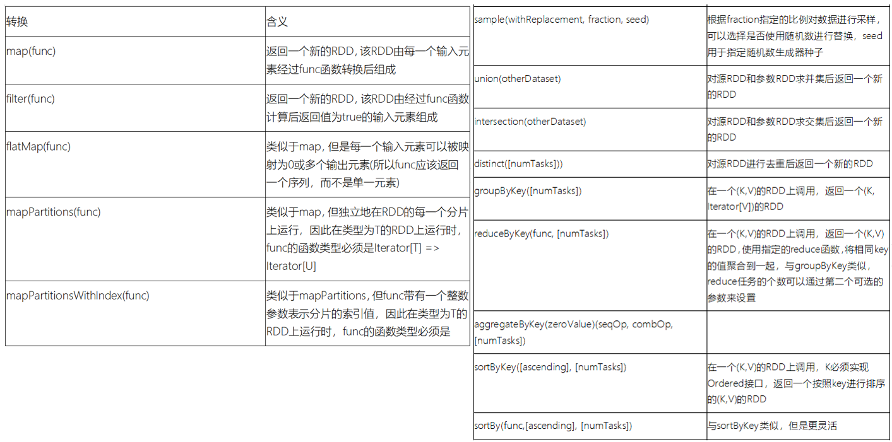

相关的动作算子:

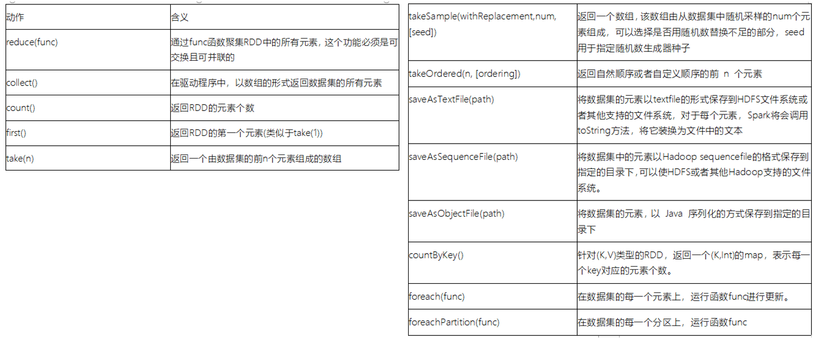

### 3.2 RDD的转换算子

值类型的算子:

* map算子: 
  * 格式: rdd.map(fn)
  * 说明: 根据传入的函数, 对数据进行一对一的转换操作, 传入一行, 返回一行

```properties
rdd = sc.parallelize([1,2,3,4,5,6,7,8,9,10])

需求: 请对每一个元素进行 +1 返回
rdd.map(lambda num: num + 1).collect()

结果:
	[2, 3, 4, 5, 6, 7, 8, 9, 10, 11]
```

* groupBy算子:
  * 格式: groupBy(fn)
  * 说明: 根据传入的函数对数据进行分组操作

```properties
rdd = sc.parallelize([1,2,3,4,5,6,7,8,9,10])

需求: 请将数据分为奇数和偶数二部分

def jo(num):
    if num % 2 == 0:
        return 'o'
    else:
        return 'j'

rdd.groupBy(jo).collect()
结果:
	[
		('j', <pyspark.resultiterable.ResultIterable object at 0x7f1a1bc22490>),
        ('o', <pyspark.resultiterable.ResultIterable object at 0x7f1a1bc0a2b0>)
    ]
mapValues(list): 将 kv中value转换为list

rdd.groupBy(jo).mapValues(list).collect()
结果:
	[
		('j', [1, 3, 5, 7, 9]), 
		('o', [2, 4, 6, 8, 10])
	]


思考: 上述的函数, 是否有简单的写法呢? 或者说直接使用lambda如何写呢?
rdd.groupBy(lambda num: 'o' if num % 2 == 0 else 'j' ).mapValues(list).collect()
结果:
	[
		('j', [1, 3, 5, 7, 9]), 
		('o', [2, 4, 6, 8, 10])
	]
```

* filter算子
  * 格式: filter(fn)
  * 说明: 过滤算子, 可以根据函数中指定的过滤条件, 对数据进行过滤操作, 条件返回True表示保留, 返回False表示过滤掉

```properties
rdd = sc.parallelize([1,2,3,4,5,6,7,8,9,10])

需求: 请将 <=3的数据过滤掉
rdd.filter(lambda num: num > 3).collect()
结果:
	[4, 5, 6, 7, 8, 9, 10]
```

* flatMap算子:
  * 格式: flatMap(fn)
  * 说明: 在map算子的基础上, 在加入一个压扁的操作, 主要适用于一行中包含多个内容的操作, 实现一转多的操作

```properties
rdd = sc.parallelize(['张三 李四 王五 赵六','田七 周八 李九'])

需求: 将其转换为一个个的姓名
rdd.flatMap(lambda line: line.split(' ')).collect()
或者
rdd.flatMap(lambda line: line.split()).collect()
结果:
	['张三', '李四', '王五', '赵六', '田七', '周八', '李九']
```

双值类型算子:

* union(并集) 和 intersection(交集)
  * 格式: rdd1.union|intersection(rdd2)

```properties
rdd1 = sc.parallelize([3,1,5,7,9])
rdd2 = sc.parallelize([5,8,2,4,0])

结果:
	并集:
		rdd1.union(rdd2).collect()
		结果:
		[3, 1, 5, 7, 9, 5, 8, 2, 4, 0]
		
		去重操作: 
		rdd1.union(rdd2).distinct().collect()
		结果:
		[8, 4, 0, 1, 5, 9, 2, 3, 7]
		
	交集:
		rdd1.intersection(rdd2).collect()
		结果:
		[5]
```

KV类型相关的算子:

* groupByKey算子:
  * 格式: groupByKey()
  * 说明: 根据key进行分组操作

```properties
rdd = sc.parallelize([('c01','张三'),('c02','李四'),('c02','王五'),('c03','赵六'),('c02','田七'),('c02','周八'),('c03','李九')])

需求: 根据班级分组统计
rdd.groupByKey().collect()
结果:
[
	('c01', <pyspark.resultiterable.ResultIterable object at 0x7f1a1bc0af10>), 
	('c02', <pyspark.resultiterable.ResultIterable object at 0x7f1a1bc0af40>), 
	('c03', <pyspark.resultiterable.ResultIterable object at 0x7f1a1bc0afd0>)
]
rdd.groupByKey().mapValues(list).collect()
结果:
[
	('c01', ['张三']), 
	('c02', ['李四', '王五', '田七', '周八']), 
	('c03', ['赵六', '李九'])]

rdd.groupByKey().mapValues(list).map(lambda kv: (kv[0],len(kv[1]))).collect()

结果:
[('c01', 1), ('c02', 4), ('c03', 2)]
```

* reduceByKey()
  * 格式:  reduceByKey(fn)
  * 说明: 根据key进行分组, 将一个组内的value数据放置到一个列表中, 对这个列表基于 传入函数进行聚合计算操作

```properties
rdd = sc.parallelize([('c01','张三'),('c02','李四'),('c02','王五'),('c03','赵六'),('c02','田七'),('c02','周八'),('c03','李九')])

需求: 统计每个班级有多少个人
rdd.map(lambda kv:(kv[0],1)).reduceByKey(lambda agg,curr: agg + curr).collect()
结果:
[('c01', 1), ('c02', 4), ('c03', 2)]


如果不转为1:
rdd.reduceByKey(lambda agg,curr: agg + curr).collect()    
结果: 
[('c01', '张三'), ('c02', '李四王五田七周八'), ('c03', '赵六李九')]
```

* sortByKey()算子
  * 格式: sortByKey(ascending = True|False)
  * 说明: 根据key进行排序操作, 默认按照key进行升序排序, 如果需要倒序, 设置 ascending  为False

```properties
rdd = sc.parallelize([('c03','张三'),('c05','李四'),('c01','王五'),('c09','赵六'),('c02','田七'),('c07','周八'),('c06','李九')])

根据班级序号排序
rdd.sortByKey().collect()
结果: 
[('c01', '王五'), ('c02', '田七'), ('c03', '张三'), ('c05', '李四'), ('c06', '李九'), ('c07', '周八'), ('c09', '赵六')]

rdd.sortByKey(ascending=False).collect()
结果:
[('c09', '赵六'), ('c07', '周八'), ('c06', '李九'), ('c05', '李四'), ('c03', '张三'), ('c02', '田七'), ('c01', '王五')]


思考:
rdd = sc.parallelize([('c03','张三'),('c05','李四'),('c011','王五'),('c09','赵六'),('c02','田七'),('c07','周八'),('c06','李九')])

rdd.sortByKey().collect()       
结果: 字典序 由于key是字符串
[('c011', '王五'), ('c02', '田七'), ('c03', '张三'), ('c05', '李四'), ('c06', '李九'), ('c07', '周八'), ('c09', '赵六')]
```

* countByKey() 和 countByValue()
  * 严格意义上应该是属于action算子
  * 说明:
    * countByKey() 根据key进行分组 统计每个分组下有多少个元素
    * countByValue() 根据value进行分组, 统计相同value有多少个

```properties
rdd = sc.parallelize([('c01','张三'),('c02','李四'),('c02','王五'),('c03','赵六'),('c02','田七'),('c02','周八'),('c03','李九')])

rdd.countByKey()
defaultdict(<class 'int'>, {'c01': 1, 'c02': 4, 'c03': 2})

rdd.countByValue() 将列表找那个每一个元素, 作为一个整体来统计相同的value有多少个
defaultdict(<class 'int'>, {('c01', '张三'): 1, ('c02', '李四'): 1, ('c02', '王五'): 1, ('c03', '赵六'): 1, ('c02', '田七'): 1, ('c02', '周八'): 1, ('c03', '李九'): 1})

rdd = sc.parallelize([1,2,1,2,3,1,2,4])

rdd.countByValue()                     
defaultdict(<class 'int'>, {1: 3, 2: 3, 3: 1, 4: 1})
```

### 3.3 RDD的动作算子

* collect() 算子
  * 格式: collect()
  * 作用: 收集各个分区的数据, 将数据汇总到一个大的列表返回

* reduce() 算子
  * 格式: reduce(fn)
  * 作用: 根据传入的函数对数据进行聚合操作

```properties
rdd = sc.parallelize([1,2,3,4,5,6,7,8,9,10])

rdd.reduce(lambda agg,curr: agg + curr)
结果: 55
```

* first()算子
  * 格式: first()
  * 说明: 获取第一个元素

```properties
rdd = sc.parallelize([1,2,3,4,5,6,7,8,9,10])
rdd.first()
1
```

* take() 算子
  * 格式: take(N)
  * 说明: 获取前N个元素, 类似于limit操作

```properties
rdd = sc.parallelize([1,2,3,4,5,6,7,8,9,10])
rdd.take(5)
结果
[1, 2, 3, 4, 5]
```

* top() 算子
  * 格式: top(N, [fn])
  * 说明:  对数据集进行倒序排序操作, 如果是kv类型, 默认是针对key进行排序, 获取前N个元素
  * fn: 可以自定义排序, 根据谁来排序

```properties
rdd = sc.parallelize([1,2,3,4,5,6,7,8,9,10])
rdd.top(3)
结果:
[10, 9, 8]


rdd = sc.parallelize([('c03','张三'),('c05','李四'),('c011','王五'),('c09','赵六'),('c02','田七'),('c07','周八'),('c06','李九')])

rdd.top(3)
结果:
[('c09', '赵六'), ('c07', '周八'), ('c06', '李九')]


rdd = sc.parallelize([('c03',5),('c05',9),('c011',2),('c09',6),('c02',80),('c07',12),('c06',10)])

rdd.top(3,lambda kv: kv[1])
结果:
[('c02', 80), ('c07', 12), ('c06', 10)]
```

* count()算子
  * 格式: count()
  * 说明: 统计多少个

```properties
rdd = sc.parallelize([('c03',5),('c05',9),('c011',2),('c09',6),('c02',80),('c07',12),('c06',10)])

rdd.count()
7
```

* foreach()算子
  * 格式: foreach(fn)
  * 说明: 对数据集进行遍历操作, 遍历后做什么, 取决于传入的函数

```properties
rdd = sc.parallelize([('c03',5),('c05',9),('c011',2),('c09',6),('c02',80),('c07',12),('c06',10)])

rdd.foreach(lambda kv: print(kv))
('c03', 5)
('c05', 9)
('c011', 2)
('c09', 6)
('c02', 80)
('c07', 12)
('c06', 10)
```

* takeSample()算子

  * 格式: takeSample(True|False, N,seed(种子值))
    * 参数1: 是否允许重复采样
    * 参数2: 采样多少个, 如果允许重复采样, 采样个数不限制, 否则最多等于本身数量个数
    * 参数3: 设置种子值, 值可以随便写, 一旦写死了, 表示每次采样的内容也是固定的(可选的) 如果没有特殊需要, 一般不设置

  * 作用: 数据抽样

```properties
rdd = sc.parallelize([1,2,3,4,5,6,7,8,9,10])

rdd.takeSample(True,5)
[9, 9, 4, 8, 9]
rdd.takeSample(True,5)
[3, 8, 1, 3, 9]
rdd.takeSample(False,5)
[6, 1, 8, 7, 3]
rdd.takeSample(False,5)
[5, 7, 6, 3, 8]
rdd.takeSample(False,20)
[2, 10, 7, 5, 8, 9, 3, 4, 6, 1]
rdd.takeSample(False,5) 
[8, 3, 10, 7, 9]

rdd.takeSample(False,5,2)  
[6, 10, 4, 5, 7]
rdd.takeSample(False,5,2)
[6, 10, 4, 5, 7]
rdd.takeSample(False,5,2)
[6, 10, 4, 5, 7]
rdd.takeSample(False,3,2)
[6, 10, 4]
```

### 3.4 RDD的重要算子

* 1- 基本函数

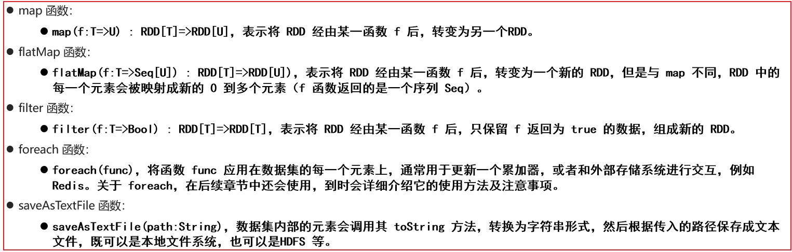

* 分区函数

```properties
	在Spark中, 对于map算子和foreach算子都提供了分区函数, 分别为mapPartitions() 和 foreachPartition()
	
	map算子 和 foreach算子 是针对RDD中每一个元素, 而分区函数, 则是针对每个分区的整个数据集
	
	假设有一份数据集:
		rdd = sc.parallelize([1,2,3,4,5,6,7,8,9,10],3)
	
	查看各个分区的结果:
		rdd.glom().collect()
		结果:
			[
				[1, 2, 3], 
				[4, 5, 6], 
				[7, 8, 9, 10]
			]
		
	执行相关的操作: 需求 将每一个元素 + 1 返回
	
    def fn1(elm):
        print(elm)
        return elm + 1
	
	rdd.map(fn1).collect()
	
	思考: fn1会被触发执行多少次呢? 10次, 在第一个分区触发了3次, 在第二个分区触发了3次, 在第三个分区触发了4次
	
	假设: 
		如果在fn1函数中, 执行连接数据库的操作, 然后读取数据库中数据, 处理后, 将连接数据库的连接关闭, 请问这个打开连接和关闭连接会被触发多少次呢? 至少会被触发执行10次(有多少条数据, 就会触发多少次),每一次创建和关闭都要花费时间,而且对资源也是一种浪费,造成效率比较底下
	
	思考: 打开连接和关闭连接, 由于业务要求, 必须放置到函数中, 但是又想提升效率, 如何处理呢?
	
	处理方案: 采用分区函数, 将map替换为mapPartitions  分区函数针对每个分区来统一处理的
	
	
	同样案例:
	rdd = sc.parallelize([1,2,3,4,5,6,7,8,9,10],3)
	# 函数中接收的arr 其实就是每个分区的全部数据集
    def fn2(arr):
        arr2 = []
        for elm in arr:
            arr2.append(elm + 1)
        return arr2
   	
   	rdd.mapPartitions(fn2).collect()
   	
   	
   	此时 fn2 仅会被调用3次
```

演示分区函数:

```properties
演示MapPartitions() 和 map():

rdd = sc.parallelize([1,2,3,4,5,6,7,8,9,10],3)
def fn1(elm):
    print(elm)
    return elm + 1
	
rdd.map(fn1).collect()	


# 函数中接收的arr 其实就是每个分区的全部数据集
def fn2(arr):
    arr2 = []
    for elm in arr:
        arr2.append(elm + 1)
    return arr2
   	
rdd.mapPartitions(fn2).collect()

简单写法:
def fn2(arr):
    for elm in arr:
        yield elm + 1
   	
rdd.mapPartitions(fn2).collect()


演示 foreach 和 foreachPartition

rdd = sc.parallelize([1,2,3,4,5,6,7,8,9,10],3)
查看各个分区的结果:
rdd.glom().collect()
结果:
[
    [1, 2, 3], 
    [4, 5, 6], 
    [7, 8, 9, 10]
]

执行操作: 打印每一个元素

def fn1(num):
    print(num)

rdd.foreach(fn1)

def fn2(arr):
    for i in arr:
        print(i)

rdd.foreachPartition(fn2)


总结: 
	建议 在使用map和foreach的时候, 建议更换为mapPartitions 和 foreachPartition, 尤其是在函数中存在一些与资源相关的操作. 比如说: 文件操作  数据库的操作 ....
	
	
	分区函数: 作用在每一个分区上
	非分区函数: 作用在每个分区的每一个数据上
```


* 3- 重分区函数
  * 重新对RDD分区数量进行调整

```properties
repartition(N):
	作用: 改变RDD的分区数量,得到一个新的RDD, 可以增大分区, 也可以减少分区, 但是会产生shuffle

演示: 
rdd = sc.parallelize([1,2,3,4,5,6,7,8,9,10],3)
查看各个分区的结果:
rdd.glom().collect()
结果:
[
    [1, 2, 3], 
    [4, 5, 6], 
    [7, 8, 9, 10]
]

尝试增大分区:
rdd.repartition(5).glom().collect()

结果:
[
	[], 
	[1, 2, 3], 
	[7, 8, 9, 10], 
	[4, 5, 6], 
	[]
]

尝试减少分区:
rdd.repartition(2).glom().collect()
结果:
	[
		[1, 2, 3, 7, 8, 9, 10], 
		[4, 5, 6]
	]
	

coalesce(N)函数: 
	作用: 改变RDD的分区数量, 得到一个新的RDD,默认只能进行减少分区操作, 而且没有shuffle
	

演示: 
rdd = sc.parallelize([1,2,3,4,5,6,7,8,9,10],3)
查看各个分区的结果:
rdd.glom().collect()
结果:
[
    [1, 2, 3], 
    [4, 5, 6], 
    [7, 8, 9, 10]
]

尝试增大分区:
rdd.coalesce(5).glom().collect()
结果: 无法增大, 依然是3个分区
[
	[1, 2, 3], 
	[4, 5, 6], 
	[7, 8, 9, 10]
]
# 参数2: 表示是否有shuffle, 默认为false, 但是只能减少分区
rdd.coalesce(5,True).glom().collect()
结果:
[
	[], 
	[1, 2, 3], 
	[7, 8, 9, 10], 
	[4, 5, 6], 
	[]
]

尝试减少分区:
rdd.coalesce(2).glom().collect()

结果:
[
	[1, 2, 3], 
	[4, 5, 6, 7, 8, 9, 10]
]


说明: 
	repartition本质上是coalesce的一种当参数2为True的简写方案, 因为repartition底层调用coalesce函数, 将其参数2设置为True
	
	联系: 
		repartition底层调用coalesce,只是将coalesce的参数2设置为True
		两个函数都是可以进行重分区操作的
	
	区别:
		repartition: 既可以增大分区, 也可以减少分区, 触发shuffle
		coalesce: 默认只能减少分区, 无法增大分区, 不触发shuffle, 如果要增大分区, 需要设置参数2为True, 但是会有shuffle
		

专门针对KV类型重分区函数: partitionBy(N,[FN])

作用: 改变RDD的分区数量, 得到一个新的RDD  可以增大分区 也可以减少分区, 但是会产生shuffle

默认: 根据key进行hash取模划分操作, 如果不满意这个分区方案, 可以通过参数3自定义分区规则

注意: 自定义分区规则返回的必须是一个int类型的数据, 表示分区的编号, 编号从0开始


演示: 
rdd = sc.parallelize([(1,'01'),(2,'02'),(3,'03'),(4,'04'),(5,'05'),(6,'06'),(7,'07'),(8,'08'),(9,'09'),(10,'10')],5)

结果:
rdd.glom().collect()
[
	[(1, '01'), (2, '02')], 
	[(3, '03'), (4, '04')], 
	[(5, '05'), (6, '06')], 
	[(7, '07'), (8, '08')], 
	[(9, '09'), (10, '10')]
]

尝试重分区操作:
rdd.partitionBy(5).glom().collect()
[
	[(5, '05'), (10, '10')], 
	[(1, '01'), (6, '06')], 
	[(2, '02'), (7, '07')], 
	[(3, '03'), (8, '08')], 
	[(4, '04'), (9, '09')]
]

希望: <= 5  放置在一个分区, 剩余放置到另一个分区上

rdd.partitionBy(2,lambda key: 0 if  key <= 5 else 1 ).glom().collect()
[
	[(1, '01'), (2, '02'), (3, '03'), (4, '04'), (5, '05')], 
	[(6, '06'), (7, '07'), (8, '08'), (9, '09'), (10, '10')]
]
```

* 4- 聚合函数

```properties
单值类型的聚合函数: 
	格式: 
		reduce(fn): 根据传入的函数对数据进行聚合计算
		fold(defaultAgg,fn): 根据传入的函数对数据进行聚合计算, 同时支持给agg设置初始值
		aggregate(defaultAgg,fn1,fn2): 根据传入的函数对数据进行聚合计算, 参数1 设置agg的初始值, fn1对各个分区内的数据进行聚合计算, fn2 负责将各个分区的聚合结果进行汇总聚合
		


案例: 
rdd = sc.parallelize([1,2,3,4,5,6,7,8,9,10],3)
查看各个分区的结果:
rdd.glom().collect()
结果:
[
    [1, 2, 3], 
    [4, 5, 6], 
    [7, 8, 9, 10]
]

需求: 求和计算, 求所有数据的之和

def  fn(agg,curr):
    print(agg)
    return agg + curr

rdd.reduce(fn)
结果: 55


rdd.fold(10,fn)  参数1是给agg赋初始值
结果: 95


def  fn1(agg,curr):
    return agg + curr

def  fn2(agg,curr):
    return agg - curr

rdd.aggregate(10,fn1,fn2)
结果: 95


总结:
	当fn1和fn2执行逻辑是一样的时候, 可以简写为 reduce 或者 fold 
	当初始值为分区的第一个的时候, 简写为reduce
	
	
	reduce --> fold --> aggregate  
	
	在实际使用的, 能用reduce解决的, 优先使用reduce, 如果不行, 尝试 fold, 如果fold也不行, 尝试aggregate
```

reduce执行逻辑:

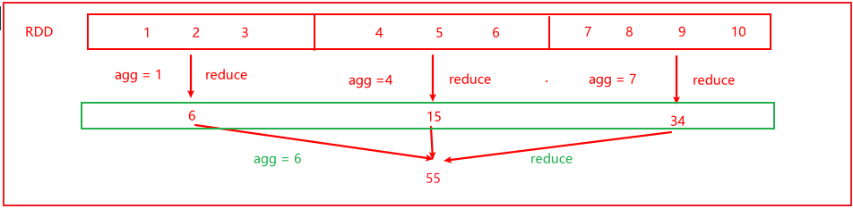

fold执行逻辑:

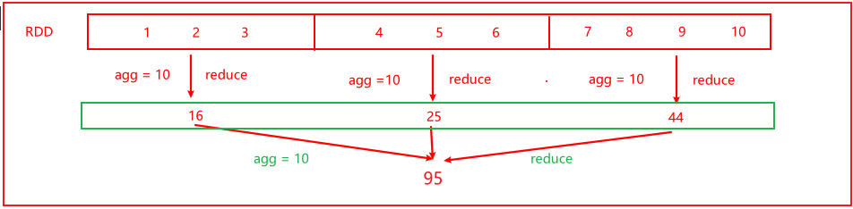

aggregate执行逻辑:

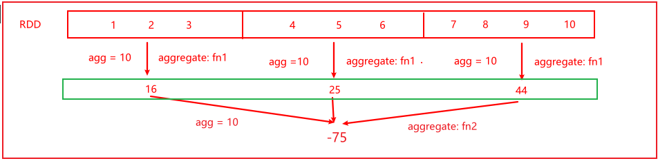

```properties
kv类型的聚合函数:
	格式:
		reduceByKey(fn)
		foldByKey(defaultAgg,fn)
		aggregateBykey(defaultAgg,fn1,fn2)
	
	以上三个与单值类型是一样的, 只是在单值的基础上加了分组的操作而已, 针对的每个分组内数据进行聚合计算
	
	额外还有一个: groupByKey() 仅分组, 不聚合计算
	

思考点: groupByKey() + 聚合函数  和 reduceByKey() 都是可以完成分组聚合统计, 谁的效率更高一些呢? reduceByKey()
```

reduceByKey:

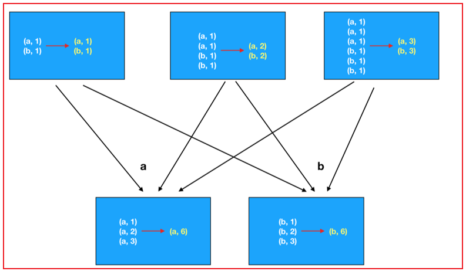

groupByKey + 聚合方案:

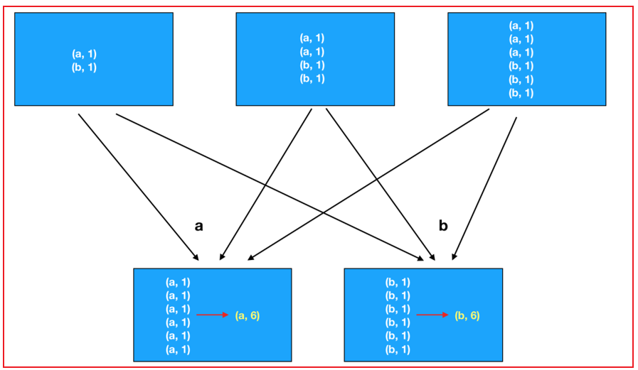

* 5- 关联函数

```properties
关联函数, 主要是针对KV类型的数据, 根据Key进行关联操作

相关的算子: 
	join: 实现两个RDD的内连接 (取公共部分)
	leftOuterJoin: 实现两个RDD的左连接(左边RDD的数据都要, 右边取匹配上, 匹配不上为Null)
	rightOuterJoin: 实现两个RDD的右连接(右边RDD的数据都要, 左边取匹配上, 匹配不上为Null)
	fullOuterJoin:: 实现两个RDD的满外连接(左右两边的RDD数据都要, 匹配不上用NULL替代)


演示: 
rdd1 = sc.parallelize([('c01','张三'),('c02','李四'),('c01','王五'),('c03','赵六'),('c02','田七'),('c03','周八'),('c04','李九')])
rdd2 = sc.parallelize([('c01','狂野1期'),('c02','狂野2期'),('c03','狂野3期'),('c05','狂野5期')])

执行: 

rdd1.join(rdd2).collect()
[
	('c01', ('张三', '狂野1期')), 
	('c01', ('王五', '狂野1期')), 
	('c02', ('李四', '狂野2期')), 
	('c02', ('田七', '狂野2期')), 
	('c03', ('赵六', '狂野3期')), 
	('c03', ('周八', '狂野3期'))
]

rdd1.leftOuterJoin(rdd2).collect()
[
	('c04', ('李九', None)), 
	('c01', ('张三', '狂野1期')), 
	('c01', ('王五', '狂野1期')), 
	('c02', ('李四', '狂野2期')), 
	('c02', ('田七', '狂野2期')), 
	('c03', ('赵六', '狂野3期')), 
	('c03', ('周八', '狂野3期'))
]

rdd1.rightOuterJoin(rdd2).collect()
[
	('c05', (None, '狂野5期')), 
	('c01', ('张三', '狂野1期')), 
	('c01', ('王五', '狂野1期')), 
	('c02', ('李四', '狂野2期')), 
	('c02', ('田七', '狂野2期')), 
	('c03', ('赵六', '狂野3期')), 
	('c03', ('周八', '狂野3期'))
]

rdd1.fullOuterJoin(rdd2).collect()

[
	('c04', ('李九', None)), 
	('c05', (None, '狂野5期')), 
	('c01', ('张三', '狂野1期')),
    ('c01', ('王五', '狂野1期')), 
    ('c02', ('李四', '狂野2期')), 
    ('c02', ('田七', '狂野2期')), 
    ('c03', ('赵六', '狂野3期')), 
    ('c03', ('周八', '狂野3期'))
]
```


## 4. 综合案例

### 4.0 配置Spark Core的Python模板

模板内容:

```properties
from pyspark import SparkContext, SparkConf
import os
# 锁定远端环境, 确保环境统一
os.environ['SPARK_HOME'] = '/export/server/spark'
os.environ['PYSPARK_PYTHON'] = '/root/anaconda3/bin/python3'
os.environ['PYSPARK_DRIVER_PYTHON'] = '/root/anaconda3/bin/python3'


if __name__ == '__main__':
    print("Spark的Python模板")
```

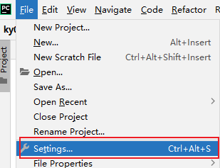

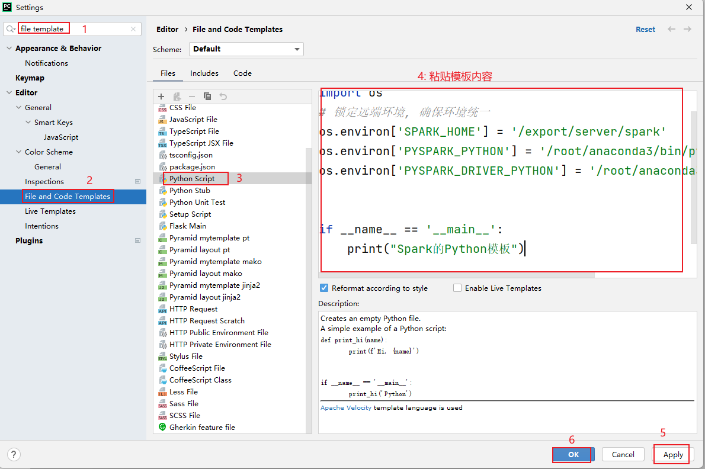

### 4.1 搜狗案例

数据集介绍:


```properties
访问时间    用户id           []里面是用户输入搜索内容   url结果排名 用户点击页面排序  用户点击URL


字段与字段之间的分隔符号为 \t和空格 (制表符号)

需求一:  统计每个关键词出现了多少次  (jieba分词器)

需求二:  统计每个用户每个搜索词点击的次数

需求三:  统计每个小时点击次数


清洗需求: 
	需要先对数据进行清洗转换处理操作, 清洗掉为空的数据, 以及数据字段个数不足6个的数据, 并且将每一行的数据放置到一个元组中, 元组中每一个元素就是一个字段的数据
```


准备工作:

* 1- 将数据文件拷贝到项目的data目录中:

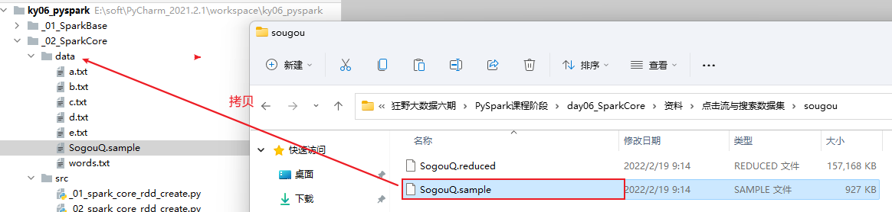

* 2- 创建一个python的脚本, 编写相关的代码: 清洗转换操作

```properties
from pyspark import SparkContext, SparkConf
import os

# 锁定远端环境, 确保环境统一
os.environ['SPARK_HOME'] = '/export/server/spark'
os.environ['PYSPARK_PYTHON'] = '/root/anaconda3/bin/python3'
os.environ['PYSPARK_DRIVER_PYTHON'] = '/root/anaconda3/bin/python3'
"""
    清洗需求: 
	    需要先对数据进行清洗转换处理操作, 清洗掉为空的数据, 
	    以及数据字段个数不足6个的数据, 并且将每一行的数据放置到一个元组中, 
	    元组中每一个元素就是一个字段的数据
"""
if __name__ == '__main__':
    print("Spark的Python模板")

    # 1. 创建SparkContext核心对象
    conf = SparkConf().setAppName('sougou').setMaster('local[*]')
    sc = SparkContext(conf=conf)

    # 2. 读取外部文件数据
    rdd = sc.textFile(name='file:///export/data/workspace/ky06_pyspark/_02_SparkCore/data/SogouQ.sample')

    # 3. 执行相关的操作:
    # 3.1 执行清洗操作
    rdd_filter = rdd.filter(lambda line: line.strip() != '' and len(line.split()) == 6)

    rdd_map = rdd_filter.map(lambda line: (
        line.split()[0],
        line.split()[1],
        line.split()[2][1:-1],
        line.split()[3],
        line.split()[4],
        line.split()[5]
    ))

    print(rdd_map.take(5))
```


* 3- 完成相关的需求:

  * 需求一:  统计每个关键词出现了多少次  (jieba分词器)

  ```properties
  如何实现中文分词呢? 借助第三方的分词工具
  	Java语言:  IK分词器
  	Python语言: jieba分词器
  
  如何使用jieba分词器呢?
  第一步: 需要在系统中安装jieba分词库: local模式只需要在node1安装即可, 如果集群模式运行, 需要在各个节点都要安装
  	命令: pip install -i https://pypi.tuna.tsinghua.edu.cn/simple jieba
  
  第二步: 直接在代码中测试使用
  from pyspark import SparkContext, SparkConf
  import os
  import jieba
  
  # 锁定远端环境, 确保环境统一
  os.environ['SPARK_HOME'] = '/export/server/spark'
  os.environ['PYSPARK_PYTHON'] = '/root/anaconda3/bin/python3'
  os.environ['PYSPARK_DRIVER_PYTHON'] = '/root/anaconda3/bin/python3'
  
  if __name__ == '__main__':
      print("测试jieba分词器")
      # ['我', '毕业', '于', '清华大学']
      print(list(jieba.cut('我毕业于清华大学'))) # 默认模式
      # ['我', '毕业', '于清华', '清华', '清华大学', '华大', '大学']
      print(list(jieba.cut('我毕业于清华大学',cut_all=True))) # 全模式(最细粒度模式)
      # ['我', '毕业', '于', '清华', '华大', '大学', '清华大学']
      print(list(jieba.cut_for_search('我毕业于清华大学'))) # 搜索引擎模式
  
  ```

  * 需求实现

  ```properties
  def xuqiu1():
      # 需求一:  统计每个关键词出现了多少次, 获取前10个
      res = rdd_map \
          .flatMap(lambda field_tuple: jieba.cut(field_tuple[2])) \
          .map(lambda keyWord: (keyWord, 1)) \
          .reduceByKey(lambda agg, curr: agg + curr) \
          .sortBy(lambda res_tup: res_tup[1], ascending=False).take(10)
      print(res)
  ```

  * 需求二:  统计每个用户每个搜索词点击的次数

  ```properties
  def xuqiu2():
      res = rdd_map \
          .map(lambda field_tuple: ((field_tuple[1], field_tuple[2]), 1)) \
          .reduceByKey(lambda agg, curr: agg + curr) \
          .top(10, lambda res_tup: res_tup[1])
      print(res)
  ```

  * 需求三:  统计每个小时点击次数 (留为作业)


### 4.2 点击流日志分析案例

点击流日志数据结构说明:  Nginx日志  访问网站的日志数据

```properties
1- ip地址: 
2- 用户标识cookie信息(- - 标识没有)
3- 访问时间(时间,时区)
4- 请求方式(get / post /Head ....)
5- 请求的URL路径
6- 请求的协议
7- 请求状态码: 200 成功
8- 响应的字节长度
9- 来源的URL( - 标识直接访问, 不是从某个页面跳转来的)
10- 访问的浏览器标识
```

需求说明:

```properties
需求一: 统计网站的总pv(访问量) 和  uv(独立访客数)

需求二: 统计请求URL的TOP10


清洗需求: 将不符合日志流的 日志数据过滤掉
```


代码实现操作:

```properties
from pyspark import SparkContext, SparkConf
import os

# 锁定远端环境, 确保环境统一
os.environ['SPARK_HOME'] = '/export/server/spark'
os.environ['PYSPARK_PYTHON'] = '/root/anaconda3/bin/python3'
os.environ['PYSPARK_DRIVER_PYTHON'] = '/root/anaconda3/bin/python3'

if __name__ == '__main__':
    print("点击流的日志分析案例:")
    # 1- 创建SparkContext对象
    conf = SparkConf().setAppName('sougou').setMaster('local[*]')
    sc = SparkContext(conf=conf)

    # 2- 读取外部数据集
    rdd = sc.textFile(name='file:///export/data/workspace/ky06_pyspark/_02_SparkCore/data/access.log')

    # 3- 执行相关的操作

    # 3.1 对数据进行清洗过滤操作: 过滤为空的数据, 以及缺少字段的数据
    rdd_filter = rdd.filter(lambda line: line.strip() != '' and len(line.split()) >= 12)

    # 3.2 执行相关的需求:
    # 需求一: 统计网站的总pv(访问量)和uv(独立访客数)
    print(rdd_filter.count()) # pv
    print(rdd_filter.map(lambda line: line.split()[0]).distinct().count()) # uv

    #需求二: 统计请求URL的TOP10
    res = rdd_filter\
        .map(lambda line: (line.split()[6],1))\
        .reduceByKey(lambda agg,curr: agg + curr)\
        .sortBy(lambda res_tup: res_tup[1],ascending=False)\
        .take(10)

    print(res)
```


## 5. RDD的持久化

### 5.1 RDD的缓存

```properties
缓存: 
	一般当一个RDD的计算非常的耗时|昂贵(计算规则比较复杂),或者说这个RDD需要被重复(多方)使用,此时可以将这个RDD计算完的结果缓存起来, 便于后续的使用, 从而提升效率
	通过缓存也可以提升RDD的容错能力, 当后续计算失败后, 尽量不让RDD进行回溯所有的依赖链条, 从而减少重新计算时间

注意:
	缓存仅仅是一种临时的存储, 缓存数据可以保存到内存(executor内存空间),也可以保存到磁盘中, 甚至支持将缓存数据保存到堆外内存中(executor以外的系统内容)
	由于临时存储, 可能会存在数据丢失, 所以缓存操作, 并不会将RDD之间的依赖关系给截断掉(丢失掉),因为当缓存失效后, 可以基于原有依赖关系重新计算
	
	缓存的API都是LAZY的, 如果需要触发缓存操作, 必须后续跟上一个action算子, 一般建议使用count
	
	如果不添加action算子, 只有当后续遇到第一个action算子后, 才会触发缓存
```

如何使用缓存:

```properties
设置缓存的API:
	rdd.cache(): 执行缓存操作 仅能将数据缓存到内存中
	rdd.persist(缓存的级别(位置)): 执行缓存操作, 默认将数据缓存到内存中, 当然也可以自定义缓存位置

手动清理缓存的API: 
	rdd.unpersist()

默认情况下, 当整个Spark应用程序执行完成后, 缓存也会自动失效的, 自动删除

常用的缓存级别: 
	MEMORY_ONLY : 仅缓存到内存中
	DISK_ONLY: 仅缓存到磁盘
	MEMORY_AND_DISK: 内存 + 磁盘  优先缓存到内存中, 当内存不足的时候, 剩余数据缓存到磁盘中
	OFF_HEAP: 缓存到堆外内存
	
	最为常用的: MEMORY_AND_DISK
```

演示缓存的使用操作:

```properties
import time

import jieba
from pyspark import SparkContext, SparkConf, StorageLevel
import os

# 锁定远端环境, 确保环境统一
os.environ['SPARK_HOME'] = '/export/server/spark'
os.environ['PYSPARK_PYTHON'] = '/root/anaconda3/bin/python3'
os.environ['PYSPARK_DRIVER_PYTHON'] = '/root/anaconda3/bin/python3'
"""
    清洗需求: 
	    需要先对数据进行清洗转换处理操作, 清洗掉为空的数据, 
	    以及数据字段个数不足6个的数据, 并且将每一行的数据放置到一个元组中, 
	    元组中每一个元素就是一个字段的数据
"""


def xuqiu1():
    # 需求一:  统计每个关键词出现了多少次, 获取前10个
    res = rdd_map \
        .flatMap(lambda field_tuple: jieba.cut(field_tuple[2])) \
        .map(lambda keyWord: (keyWord, 1)) \
        .reduceByKey(lambda agg, curr: agg + curr) \
        .sortBy(lambda res_tup: res_tup[1], ascending=False).take(10)
    print(res)


def xuqiu2():
    res = rdd_map \
        .map(lambda field_tuple: ((field_tuple[1], field_tuple[2]), 1)) \
        .reduceByKey(lambda agg, curr: agg + curr) \
        .top(10, lambda res_tup: res_tup[1])
    print(res)


if __name__ == '__main__':
    print("Spark的Python模板")

    # 1. 创建SparkContext核心对象
    conf = SparkConf().setAppName('sougou').setMaster('local[*]')
    sc = SparkContext(conf=conf)

    # 2. 读取外部文件数据
    rdd = sc.textFile(name='file:///export/data/workspace/ky06_pyspark/_02_SparkCore/data/SogouQ.sample')

    # 3. 执行相关的操作:
    # 3.1 执行清洗操作
    rdd_filter = rdd.filter(lambda line: line.strip() != '' and len(line.split()) == 6)

    rdd_map = rdd_filter.map(lambda line: (
        line.split()[0],
        line.split()[1],
        line.split()[2][1:-1],
        line.split()[3],
        line.split()[4],
        line.split()[5]
    ))

    # 由于 rdd_map 被多方使用了, 此时可以将其设置为缓存
    rdd_map.persist(storageLevel=StorageLevel.MEMORY_AND_DISK).count()

    # 3.2 : 实现需求
    # 需求一:  统计每个关键词出现了多少次, 获取前10个
    # 快速抽取函数:  ctrl + alt + M
    xuqiu1()
    
    # 当需求1执行完成, 让缓存失效
    rdd_map.unpersist().count()

    # 需求二:统计每个用户每个搜索词点击的次数
    xuqiu2()

    time.sleep(100)
```


没有设置缓存的DAG执行流程图:

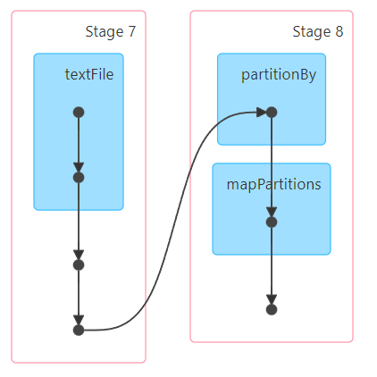

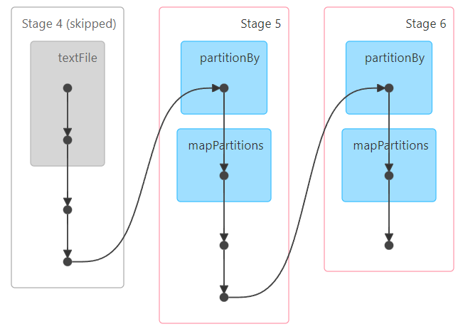

当设置了缓存后:

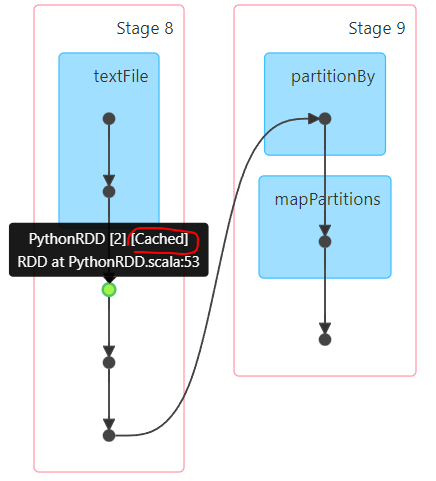

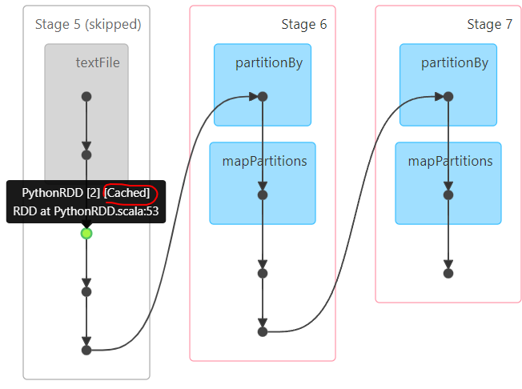

或者从此位置中查看是否有缓存:

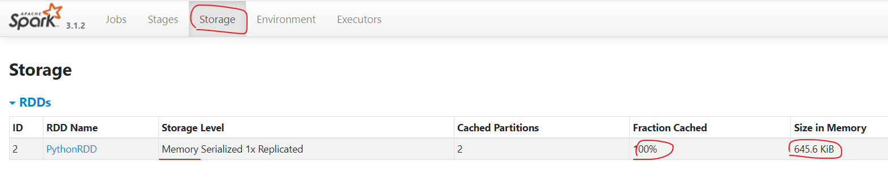

### 5.2 RDD的checkpoint检查点

```properties
	checkpoint比较类似于缓存操作, 只不过缓存是将数据保存到内存 或者 磁盘上, 而checkpoint是将数据保存到磁盘或者HDFS(主要)上
	checkpoint提供了更加安全可靠的持久化的方案, 确保RDD的数据不会发生丢失, 一旦构建checkpoint操作后, 会将RDD之间的依赖关系(血缘关系)进行截断,后续计算出来了问题, 可以直接从检查点的位置恢复数据
	
	主要作用: 容错 也可以在一定程度上提升效率(性能) (不如缓存)
		在后续计算失败后, 从检查点直接恢复数据, 不需要重新计算


相关的API: 
	第一步: 设置检查点保存数据位置
		sc.setCheckpointDir('路径地址')
	
	第二步: 在对应RDD开启检查点
		rdd.checkpoint()
		rdd.count()
	
	注意: 
		如果运行在集群模式中, checkpoint的保存的路径地址必须是HDFS, 如果是local模式 可以支持在本地路径
		checkpoint数据不会自动删除, 必须同时手动方式将其删除掉
```

代码演示:

```properties
import time

from pyspark import SparkContext, SparkConf
import os

# 锁定远端环境, 确保环境统一
os.environ['SPARK_HOME'] = '/export/server/spark'
os.environ['PYSPARK_PYTHON'] = '/root/anaconda3/bin/python3'
os.environ['PYSPARK_DRIVER_PYTHON'] = '/root/anaconda3/bin/python3'

if __name__ == '__main__':
    print("演示checkpoint相关的操作")

    # 1- 创建SparkContext对象
    conf = SparkConf().setAppName('sougou').setMaster('local[*]')
    sc = SparkContext(conf=conf)

    # 开启检查点, 设置检查点的路径
    sc.setCheckpointDir('/spark/chk') # 默认的地址为HDFS
    # 2- 获取数据集
    rdd = sc.parallelize(['张三 李四 王五 赵六', '田七 周八 李九 老张 老王 老李'])

    # 3- 执行相关的操作:  以下操作仅仅是为了让依赖链条更长, 并没有太多的实际意义
    rdd1 = rdd.flatMap(lambda line: line.split())

    rdd2 = rdd1.map(lambda name: (name, 1))

    rdd3 = rdd2.map(lambda name_tuple: (f'{name_tuple[0]}_itcast', name_tuple[1]))

    rdd3 = rdd3.repartition(3)

    rdd4 = rdd3.map(lambda name_tuple: name_tuple[0])

    # RDD4设置检查点:
    rdd4.checkpoint()
    rdd4.count()


    rdd5 = rdd4.flatMap(lambda name: name.split('_'))
    rdd5 = rdd5.repartition(4)

    rdd6 = rdd5.map(lambda name: (name, 1))

    rdd_res = rdd6.reduceByKey(lambda agg, curr: agg + curr)

    print(rdd_res.collect())

    time.sleep(1000)
```


没有使用检查点之前的DAG流程图:

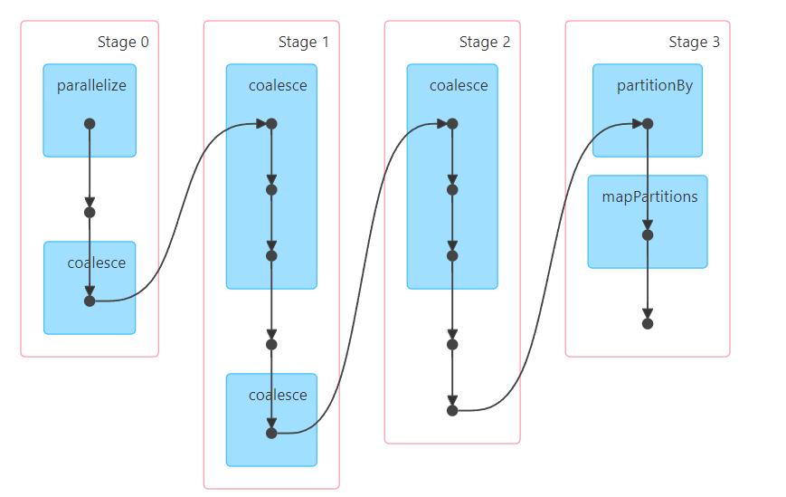

当使用检查点后的执行流程图:

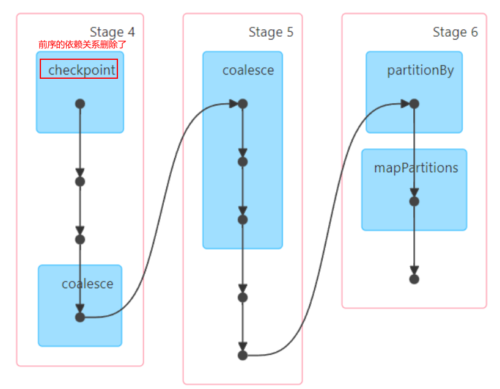

面试题: Spark提供了两种持久化的方案, 一种缓存操作, 一种为checkpoint方案, 请问有什么区别呢?

```properties
1- 存储位置不同: 
	缓存: 存储在内存或者磁盘 或者 堆外内存中
	检查点: 可以将数据存储在磁盘 或者 HDFS上, 在集群模式下, 仅能保存到HDFS上

2- 血缘关系: 
	缓存: 不会截断RDD之间的血缘关系, 因为缓存数据有可能会失效, 当失效后, 需要重新回溯计算操作
	检查点: 会截断RDD的之间的血缘关系, 因为检查点将数据保存到更加安全可靠的位置, 认为数据不会发生丢失问题, 当执行失败的时候, 也不需要重新回溯计算
	
3- 生命周期:
	缓存: 当程序执行完成后, 或者手动调度unpersist 缓存都会被删除
	检查点: 即使程序退出后, 检查点的数据依然是存在的, 不会删除, 需要手动删除的
```

思考: 既然持久化的方案有二种, 那么在生产环境中, 应该使用什么方案呢?

````properties
	一般建议将两种持久化的方案一同作用于项目环境中, 先设置缓存 然后再设置检查点, 最后统一触发执行(底层: 会将数据先缓存好, 然后将缓存好的数据, 保存到checkpoint对应的路径中, 后续在使用的时候, 优先从缓存中读取, 如果缓存中没有, 会从checkpoint中获取, 同时再把读取数据放置到缓存中)
	
	不建议: 先设置检查点, 然后设置缓存, 最后统一触发(虽然读取的时候, 没啥区别, 但是在保存数据的时候, 会存在两次磁盘IO操作, 而上面的只有一次磁盘IO操作)
	
	不能: 先设置缓存, 然后立即触发,在设置检查点, 然后立即触发,  这种方案不管是缓存还是检查点一般只能生效其中一个(优先缓存)
````

测试:

```properties
import time

from pyspark import SparkContext, SparkConf, StorageLevel
import os

# 锁定远端环境, 确保环境统一
os.environ['SPARK_HOME'] = '/export/server/spark'
os.environ['PYSPARK_PYTHON'] = '/root/anaconda3/bin/python3'
os.environ['PYSPARK_DRIVER_PYTHON'] = '/root/anaconda3/bin/python3'

if __name__ == '__main__':
    print("演示checkpoint相关的操作")

    # 1- 创建SparkContext对象
    conf = SparkConf().setAppName('sougou').setMaster('local[*]')
    sc = SparkContext(conf=conf)

    # 开启检查点, 设置检查点的路径
    sc.setCheckpointDir('/spark/chk') # 默认的地址为HDFS
    # 2- 获取数据集
    rdd = sc.parallelize(['张三 李四 王五 赵六', '田七 周八 李九 老张 老王 老李'])

    # 3- 执行相关的操作:  以下操作仅仅是为了让依赖链条更长, 并没有太多的实际意义
    rdd1 = rdd.flatMap(lambda line: line.split())

    rdd2 = rdd1.map(lambda name: (name, 1))

    rdd3 = rdd2.map(lambda name_tuple: (f'{name_tuple[0]}_itcast', name_tuple[1]))

    rdd3 = rdd3.repartition(3)

    rdd4 = rdd3.map(lambda name_tuple: name_tuple[0])

    # 设置缓存操作
    rdd4.persist(storageLevel=StorageLevel.MEMORY_AND_DISK)

    # 设置检查点:
    rdd4.checkpoint()

    # 统一触发
    rdd4.count()

    rdd5 = rdd4.flatMap(lambda name: name.split('_'))
    rdd5 = rdd5.repartition(4)

    rdd6 = rdd5.map(lambda name: (name, 1))

    rdd_res = rdd6.reduceByKey(lambda agg, curr: agg + curr)

    print(rdd_res.collect())

    time.sleep(1000)
```

正常的执行流程图:

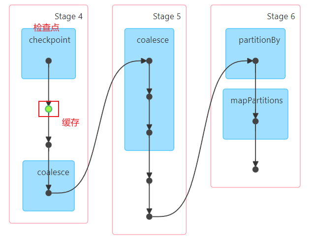


## 6. RDD的共享变量

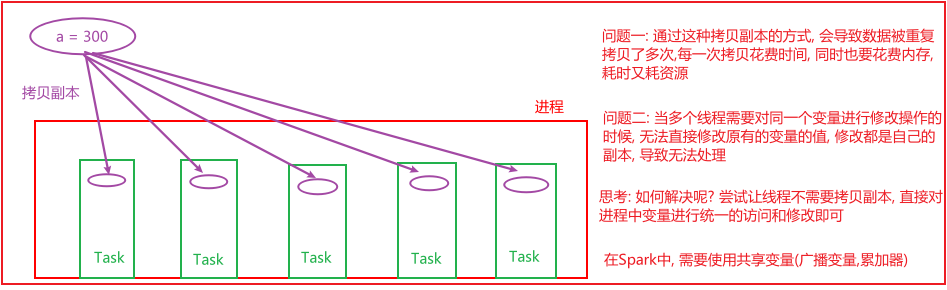


### 6.1 广播变量

```properties
	在Driver端定义一个共享的变量,如果不使用广播变量, 各个线程在运行的时候, 都需要将这个变量拷贝到自己的线程中, 对网络传输, 内存的使用都是一种浪费, 而且影响效率
	如果使用广播变量, 会将变量在每个executor上放置一份, 各个线程直接读取executor上的变量即可, 不需要拉取到Task中, 减少副本的数量, 对网络和内存都降低了, 从而提升效率
	
	广播变量是只读的, 各个Task只能读取数据, 不能修改
	

相关的API: 
	设置广播变量: 广播变量的对象 = sc.broadcast(变量值)
	获取广播变量: 广播变量的对象.value
```

基本使用:

```properties
from pyspark import SparkContext, SparkConf
import os

# 锁定远端环境, 确保环境统一
os.environ['SPARK_HOME'] = '/export/server/spark'
os.environ['PYSPARK_PYTHON'] = '/root/anaconda3/bin/python3'
os.environ['PYSPARK_DRIVER_PYTHON'] = '/root/anaconda3/bin/python3'

if __name__ == '__main__':
    print("演示广播变量相关使用")

    # 1. 创建SparkContext对象:
    conf = SparkConf().setAppName('sougou').setMaster('local[*]')
    sc = SparkContext(conf=conf)

    # a = 100
    broadcast = sc.broadcast(100)

    # 2- 初始化数据:
    rdd = sc.parallelize([1, 2, 3, 4, 5, 6, 7])

    # 3- 处理数据:

    # 需求: 请为每一个元素累加一个值
    def fn1(num):
        return num + broadcast.value

    rdd_res = rdd.map(fn1)

    print(rdd_res.collect())
```


### 6.2 累加器

```properties
	Spark提供累加器, 可以用于实现全局累加计算的操作, 比如全局共计操作了多少个数据, 可以使用累加器实现
	
	累加器是由Driver端设置初始值, 在各个Task中进行累加操作, 最终在Driver端获取结果
	
	Task只能累加操作, 不能读取累加器的值


相关的API:
	1- 在Driver端设置累加器初始值:
		acc = sc.accumulator(初始值)
	2- 在Task(RDD)中: 执行累加操作
		acc.add(累加值)
	3- 在Driver中获取值
		acc.value
```

代码演示:

```properties
from pyspark import SparkContext, SparkConf
import os

# 锁定远端环境, 确保环境统一
os.environ['SPARK_HOME'] = '/export/server/spark'
os.environ['PYSPARK_PYTHON'] = '/root/anaconda3/bin/python3'
os.environ['PYSPARK_DRIVER_PYTHON'] = '/root/anaconda3/bin/python3'

if __name__ == '__main__':
    print("演示累加器相关的操作:")

    # 1. 创建SparkContext对象:
    conf = SparkConf().setAppName('sougou').setMaster('local[*]')
    sc = SparkContext(conf=conf)

    # 定义一个累加的变量
    # agg = 0
    acc = sc.accumulator(0)

    # 2- 初始化数据:
    rdd = sc.parallelize([1, 2, 3, 4, 5, 6, 7])

    # 3- 执行相关的操作:
    # 需求: 对每个元素进行 +1 返回, 在执行操作的过程汇总, 需要统计共计对多少个数据进行 +1操作
    def fn1(num):
        acc.add(1)
        return num + 1

    rdd_res = rdd.map(fn1)


    # 3- 获取结果
    print(rdd_res.collect())

    print(acc.value)
```


小问题:

```properties
	如果后续多次调用action算子, 会导致累加器重复累加操作
	
	主要原因: 每一次调度action算子, 都会触发一个Job任务执行, 每一个Job任务都要重新对象其所依赖的所有RDD进行整个计算操作, 从而导致累加器重复累加
	
	解决方案:
		在调用累加器后的RDD上, 对其设置缓存操作, 即可解决问题, 但是不能单独设置checkpoint, checkpoint和累加器无法直接共用, 可以通过缓存 + 累加器的思路来解决
```


## 7. RDD的内核调度

```properties
RDD的内核调度: 
	1- 确定需要构建多少分区(线程)
	2- 如何构建DAG执行流程图
	3- 如何划分Stage阶段
	4- Driver底层是如何运转的
```


### 7.1 RDD的依赖关系

RDD的依赖: 指的一个RDD的形成可能是有一个或者多个RDD得出, 此时这个RDD和之前的RDD之间产生依赖关系


在Spark中, RDD之间的依赖关系,主要有二种依赖关系:

* 1- 窄依赖:

```properties
目的: 为了实现并行计算操作, 并且提高容错的能力
指的: 一个RDD上的一个分区的数据, 只能完整的交付给下一个RDD的一个分区(完全继承),不能分隔
```

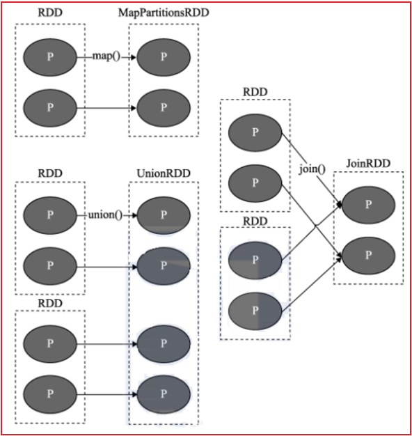

* 2- 宽依赖:

```properties
目的: 划分stage的依据
指的: 上一个RDD的某一个分区的数据被下游的一个RDD的多个分区的所接收, 中间必然存在shuffle操作(是否存在shuffle操作是判定宽窄依赖关系的重要依据)

注意: 一旦有了shuffle操作, 后续的RDD的执行必须等待前序的RDD(shuffle)执行完成,才能执行
```

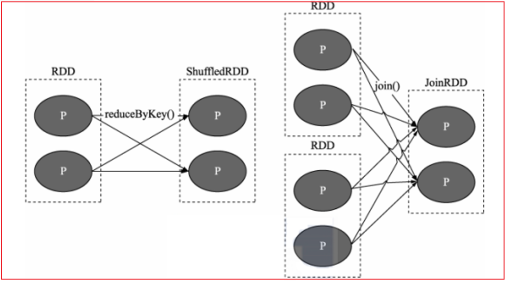


说明:

```properties
	在Spark中, 每一个算子是否会执行shuffle操作, 其实Spark在设计算子的时候, 就已经规划好了, 比如说: Map算子就不会触发shuffle, reduceByKey算子一定会触发shuffle操作
	
	如果想知道这个算子是否会触发shuffle操作, 可以通过在运行的时候, 查看默认4040 WEB UI界面. 在界面中对应Job的DAG执行流程图中, 如果这个图被划为为了多个stage, 那么就说明这个算子会触发shuffle. 或者也可以查看这个算子源码. 一般在源码的说明信息中也会有一定的标记是否有shuffle
	
	在实际使用中, 不需要纠结哪些算子会存在shuffle, 以需求实现为目标, 虽然shuffle的存在, 会影响一定的效率,但是以完成需求为准则, 该用那个算子, 就使用那个算子即可, 不要过分纠结
```

### 7.2 DAG和STAGE

DAG: 有向无环图

主要描述一段执行任务, 从开始一直往下 执行, 不允许出现回调的操作


在Spark的应用程序中, 程序中有一个action算子, 就会触发一个Job任务,所以说一个Spark应用程序中可以有多个Job任务


对于每一个Job任务, 都会产生一个DAG执行流程图, 那么这个执行流程图是如何形成的呢?

```properties
第一步: 当Spark应用遇到一个action算子后, 就会触发一个Job任务执行, 首先会将这个action算子所依赖的所有的RDD全部都加载进行, 形成一个完整的stage阶段

第二步: 根据RDD之间的宽窄依赖关系, 从后往前进行回溯,如果遇到窄依赖, 就放置在一起, 形成一个stage, 如果遇到宽依赖, 就拆分为两个阶段,直到回溯完成, 形成最终的DAG执行流程图
```

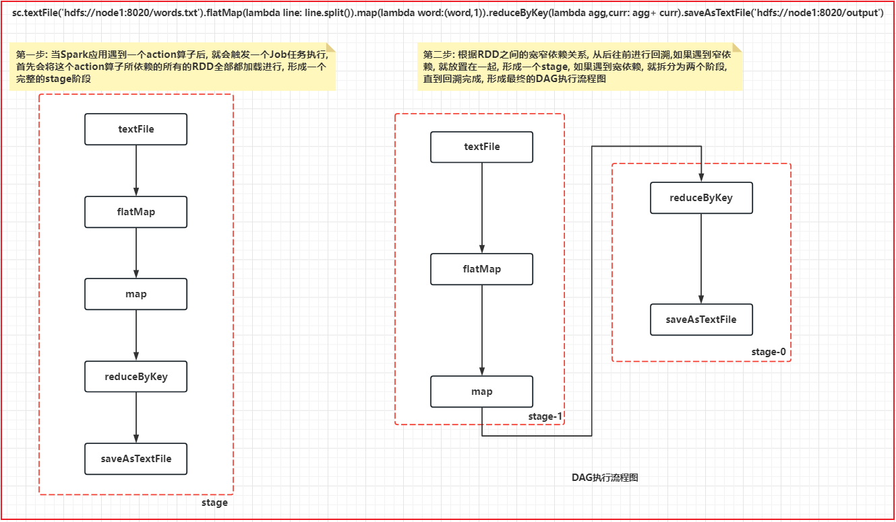


细化剖析Stage内部的流程

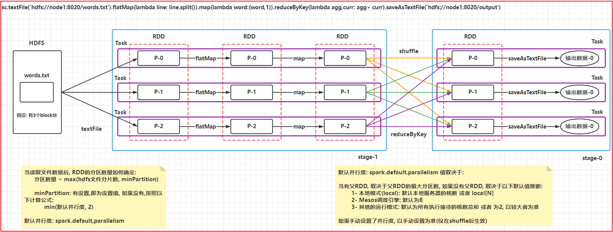

### 7.3 RDD的shuffle

Spark中shuffle的发展历程:

```properties
1- 在1.1版本以前, Spark采用Hash shuffle (优化前 和 优化后)

2- 在1.1版本的时候, Spark推出了Sort shuffle

3- 在1.5版本的时候, Spar推出了钨丝计划(优化为主)

4- 在1.6版本的时候, 将钨丝计划合并到SortShuffle中

5- 在2.0版本的时候, 将Hash shuffle剔除, 将Hash Shuffle方案被Sort Shuffle
```

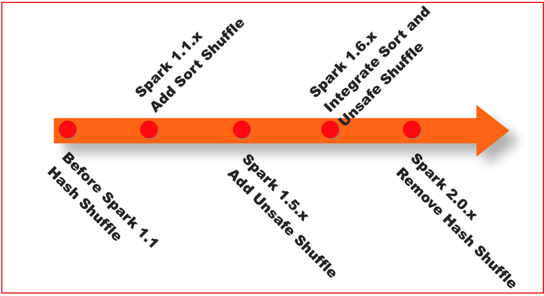

* 在优化前的Hash Shuffle:

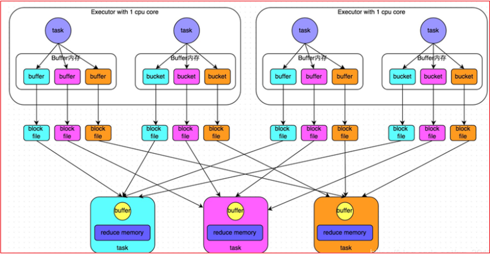

```properties
存在问题:
	上游的RDD的每一个分区对应每一个线程, 都会产生与下游相同分区的文件数量, 导致输出文件数据过多(造成小文件问题)
	同时导致下游各个分区去拉取数据的时候, 需要拉取的文件数过多, 频繁的打开文件/关闭你文件, 对IO影响比较大
```

* 优化后的Hash shuffle

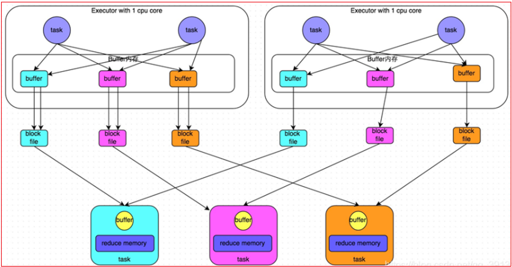

```properties
	经过优化后, 由原来让线程输出等量分区的文件数变更为由executor来输出与下游的RDD分区数等量的文件数, 从而大大降低了文件数量的产生, 从而减少IO操作, 减少打开和关闭文件的次数, 提升效率
```

* SortShuffle:

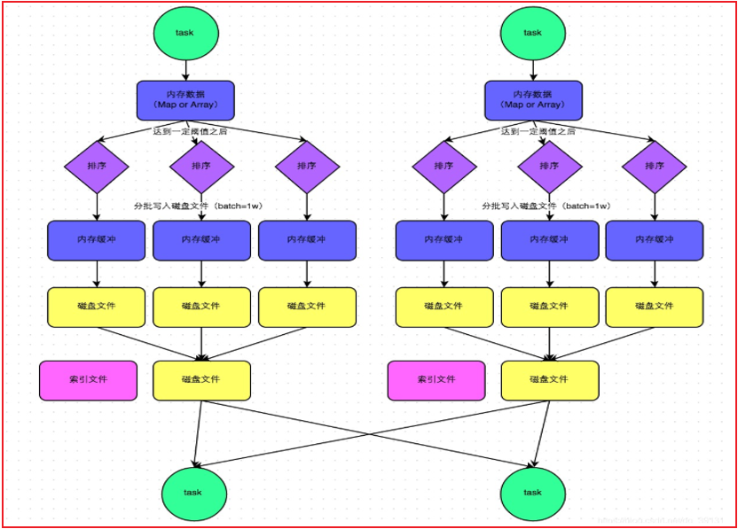

```properties
Sort Shuffle执行流程 与 MR有非常高的相似度:
	每个线程(分区)处理后, 将数据写入到内存中, 当内存数据达到一定的阈值后, 触发溢写操作,在一些的时候, 需要对数据进行分区/排序, 将数据写入到磁盘上, 形成一个个文件, 当整个溢写完成后, 将多个小文件合并为一个大文件, 同时会为这个大文件提供一个索引文件, 方便下游读取对应分区的数据
	

Sort shuffle 存在两种运行的机制: 普通机制  和 byPass机制

普通机制: 
	每个线程(分区)处理后, 将数据写入到内存中, 当内存数据达到一定的阈值后, 触发溢写操作,在一些的时候, 需要对数据进行分区/排序, 将数据写入到磁盘上, 形成一个个文件, 当整个溢写完成后, 将多个小文件合并为一个大文件, 同时会为这个大文件提供一个索引文件, 方便下游读取对应分区的数据
	
bypass机制使用条件: 
	1- 上游的分区的数量不能超过200个(默认)
	2- 上游不能进行提前聚合操作(提前聚合意味着要进行分组操作, 而分组的前提是要对数据进行排序, 将相关的数据放置在一起)

bypass机制: 在普通的机制基础上, 去除了排序操作

两种机制, bypass的运行效率在某些条件下, 可能要优于普通机制
```


### 7.4 Job的调度流程

核心描述: 在Driver内部, 是如何调度任务

```properties
1- 当Spark应用程序启动后, 此时首先会创建SparkContext对象, 此对象在创建的时候, 底层同时也会创建DAGScheduler 和 TaskScheduler:
	DAGScheduler: 负责DAG流程图生成, Stage阶段划分, 每个阶段运行多少个线程
	TaskScheduler: 负责每个阶段的Task线程的分配工作, 以及将对应线程任务提交到Executor上运行

2- 遇到Action算子后,就会产生一个Job任务, SparkContext对象将任务提交到DAGScheduler,DAGScheduler接收到任务后, 就会产生一个DAG执行流程图, 划分stage,并且确定每个stage中需要运行多少个线程,将每个阶段的线程放置到一个TaskSet集合中,提交给TaskScheduler

3- TaskScheduler接收到各个阶段的TaskSet后, 开始进行任务的分配工作,确认每个线程应该运行在那个executor上(尽可能保持均衡),然后将任务提交给对应executor上(底层由调度队列), 让executor启动线程执行任务即可,阶段是一个一个的运行, 无法并行执行的

4- Driver负责监听各个executor执行状态即可, 等待任务执行完成
```

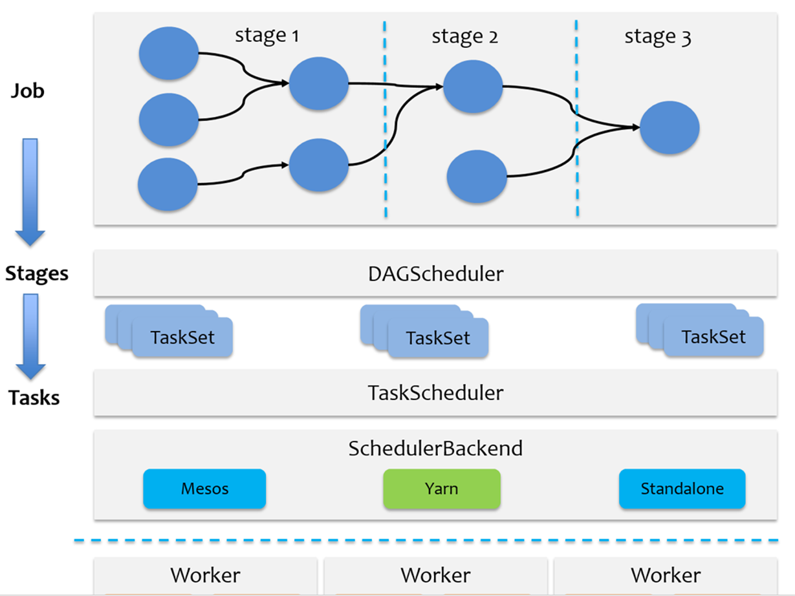

### 7.5 Spark的并行度

整个Spark应用中, 影响程序并行度的因素有以下两个原因:

* 1- 资源的并行度: Executor数量 和 CPU核心数 以及 内存大小
* 2- 数据的并行度: Task的线程数 和 分区数量

```properties
目的: 在合适的资源上, 运行合适的数据

当资源比较充足的时候, 但是数据的并行度无法达到, 虽然不会影响效率 但是会浪费资源
当数据的并行度充足的时候, 而资源不足, 会导致本来可以并行计算的, 变成串行执行, 影响效率

推荐值: 
	一个CPU上运行 2~3个线程, 一个CPU需要配置3~5GB内存, 从而充分压榨CPU性能
	一个线程, 建议处理1~3GB数据, 处理时间10~20分钟, 如果想要时间减少, 那么让每一个线程处理数据量减少
```

如何设置并行度呢? 

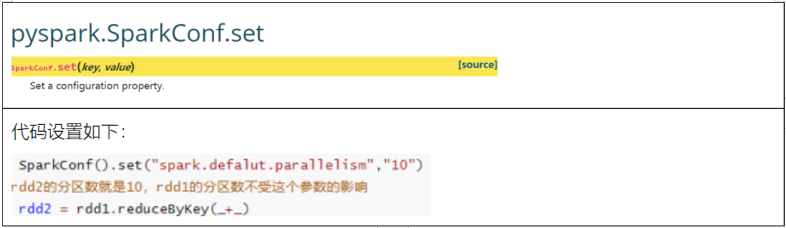

```properties
说明: 并行度设置, 需要在shuffle后生效, shuffle前的分区数量, 默认取决于初始数据源的时候确定的分区数量(上一个父RDD的分区数量)
```

### 7.6 了解CombinerByKey

```properties
combinerByKey: 是Spark中比较底层的高级API
	此API 是 aggregateByKey的底层实现, aggregateByKey是foldByKey底层实现, foldByKey是reduceByKey底层实现

语法: 
	combinerByKey(fn1,fn2,fn3)
		fn1:  通过一个函数初始化 agg的值
		fn2: 针对每个分区下的每组数据进行聚合计算操作
		fn3: 针对每个分区中每组的计算后的结果进行汇总聚合操作


需求:
	假设有如下的数据集:  [('c01','张三'),('c02','李四'),('c01','王五'),('c03','赵六'),('c02','田七'),('c03','周八'),('c01','李九'),('c02','老张'),('c01','老李')]
	
	结果为: 
	[
        ('c01',['张三','王五','李九','老李']),
        ('c02',['李四','田七','老张']),
        ('c03',['赵六','周八'])
	]
	
	对key进行分组, 将一组内的数据合并为一个列表
```

代码实现:

```properties
from pyspark import SparkContext, SparkConf
import os

# 锁定远端环境, 确保环境统一
os.environ['SPARK_HOME'] = '/export/server/spark'
os.environ['PYSPARK_PYTHON'] = '/root/anaconda3/bin/python3'
os.environ['PYSPARK_DRIVER_PYTHON'] = '/root/anaconda3/bin/python3'

if __name__ == '__main__':
    print("演示combinerByKey作用:")

    # 1. 创建SparkContext对象:
    conf = SparkConf().setAppName('sougou').setMaster('local[*]')
    sc = SparkContext(conf=conf)

    # 2- 初始化数据:
    rdd = sc.parallelize([('c01','张三'),('c02','李四'),('c01','王五'),('c03','赵六'),('c02','田七'),('c03','周八'),('c01','李九'),('c02','老张'),('c01','老李')],2)

    # 3. 执行相关的操作
    """
        [
            ('c01',['张三','王五','李九','老李']),
            ('c02',['李四','田七','老张']),
            ('c03',['赵六','周八'])
        ]
    """
    def fn1(data):
        return [data]

    def fn2(agg,curr):
        agg.append(curr)
        return agg

    def fn3(agg,curr):
        agg.extend(curr)
        return agg

    rdd_res = rdd.combineByKey(fn1,fn2,fn3)

    print(rdd_res.collect())

```

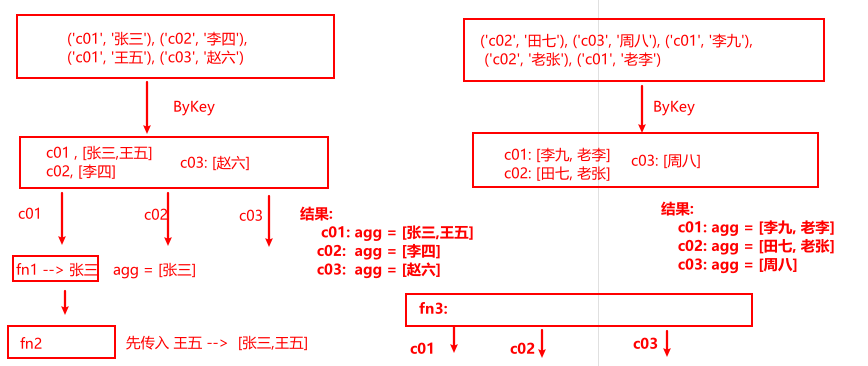


此处需要配合视频来看, 单独视频 会给大家上传到网盘资料中

