# day12_SparkSql课程笔记

今日内容:

* 1- Spark On Hive
* 2- Spark SQL的分布式执行引擎
* 3- Spark SQL的运行机制
* 4- Spark SQL的综合案例

## 1. Spark SQL基本概念

### 1.1 了解什么是Spark SQL

​	Spark SQL是Spark多种组件中其中一个, 主要是用于处理大规模的结构化数据

```properties
什么是结构化数据:
	一份数据集, 每一行都是有固定的列, 每一列的类型都是一致的, 我们将这种数据集称为结构化的数据

例如: MySQL表数据
1 张三 20
2 李四 18
3 王五 21
```

为什么要学习Spark SQL呢?

```properties
1- 会SQL的人, 一定比会大数据的人多
2- Spark SQL既可以编写SQL语句, 也可以编写代码, 甚至支持混合使用
3- Spark SQL 和 Hive进行集成, 集成后, 可以替换掉Hive原有MR的执行引擎, 提升效率
```

Spark SQL的特点:

```properties
1- 融合性: 既可以使用标准SQL语言 也可以使用代码, 同时也支持混合使用

2- 统一的数据访问: 可以通过Spark SQL来对接不同的数据库, 通过统一的API即可操作多个数据库

3- HIVE的兼容性: Spark SQL 可以和 HIVE进行整合, 整合后替换执行引擎为Spark,核心: 基于HIVE的MetaStore, 替换HiveServer2

4- 标准化连接: Spark SQL 也支持 JDBC/ODBC的连接方式
```


### 1.2 Spark SQL发展历史

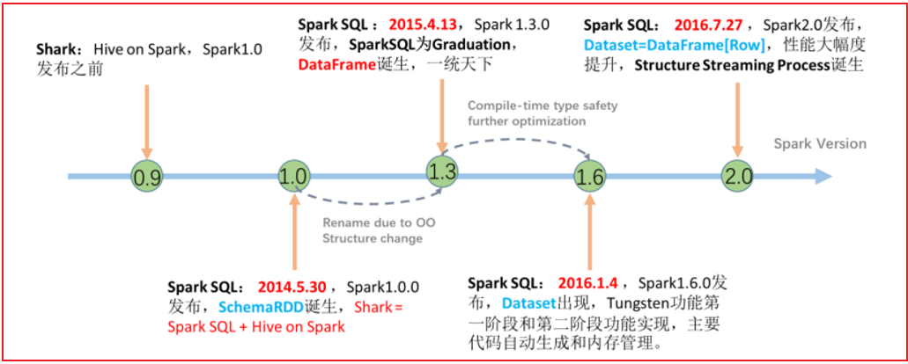

```properties
说明: 
	Spark 2.0以后, 整个内部的数据类型只有一个DataSet类型
	
	DataSet是一个有泛型约束的dataFrame对象,但是呢, 我们后续通过Python来操作, Python不支持泛型约束,所以为了能够支持在类似于Python这种不支持泛型的语言中使用Spark SQL, 所以Spark SQL在不同语言的客户端的API上都保留DataFrame的API, 这样对于无泛型约束的语言依然是可用的, 但是一旦开始运行, 其内部最终也会转回为DataSet类型
```


### 1.3 Spark SQL与Hive异同

相同点:

```properties
1- 都是分布式计算的引擎
2= 都可以处理大规模的数据
3- 都可以基于yarn集群运行
```

不同点:

```properties
1- Spark SQL是基于内存计算, 而Hive SQL是基于磁盘来进行计算的
2- Spark SQL没有元数据管理的服务(自己维护),而Hive SQL是有metastore的元数据管理服务项
3- Spark SQL底层执行Spark RDD程序, 而Hive SQL 底层执行MR
4- Spark SQL可以编写SQL 也可以编写代码, 但是Hive SQL仅能编写SQL语句
```


### 1.4 Spark SQL的数据结构对比

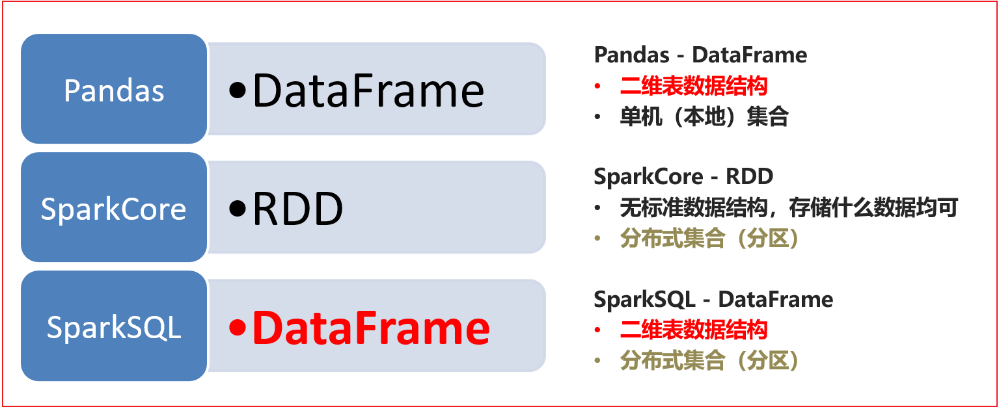

```properties
说明:
	pandas的df: 二维表, 处理单机化数据
	Spark Core:处理任何的数据结构, 处理大规模的分布式数据
	Spark SQL: 二维表, 处理大规模的分布式数据
```

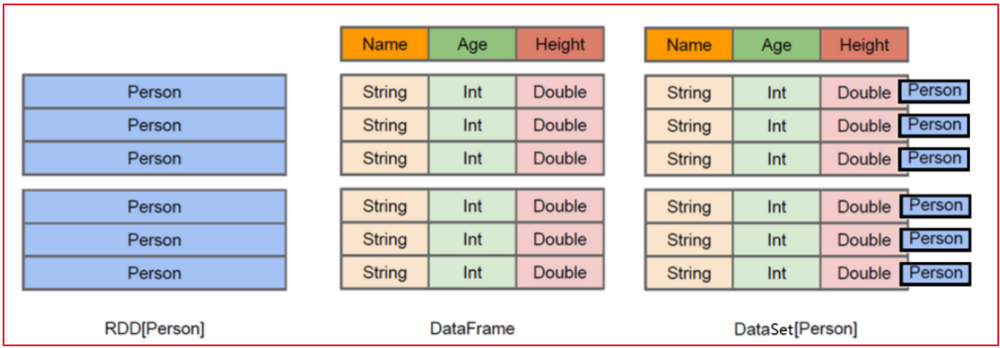

```properties
RDD: 存储直接就是对象, 比如在图中, 存储就是一个Person的对象, 但是里面有什么数据靠内心, 不太清楚

DataFrame: 将Person中各个字段的数据, 进行格式化存储,形成一个dataFrame,可以直接看到数据

dataSet: 将Person对象中数据都按照结构化的方式存储好, 同时保留对象的类型,从而知道来源于一个Person的对象

由于Python不支持泛型,所以无法使用DataSet类型, 客户端仅支持dataFrame类型
```


## 2. Spark SQL的入门案例

### 2.1 Spark SQL的统一入门

​	从Spark SQL开始, 需要更换核心对象, 因为SparkContext对象是SparkCore核心对象, 无法支持Spark SQL编写的, Spark框架专门提供了一个用于支持Spark SQL的编程入口类: SparkSession,   此类同时也可以获取原有的SparkContext对象


如何构建一个SparkSession对象呢?

```properties
from pyspark import SparkContext, SparkConf
from pyspark.sql import SparkSession
import os

# 锁定远端环境, 确保环境统一
os.environ['SPARK_HOME'] = '/export/server/spark'
os.environ['PYSPARK_PYTHON'] = '/root/anaconda3/bin/python3'
os.environ['PYSPARK_DRIVER_PYTHON'] = '/root/anaconda3/bin/python3'

if __name__ == '__main__':
    print("演示: 如何创建SparkSession核心对象")

    # 1. 创建SparkSession对象
    spark = SparkSession.builder.appName('create_spark_session').master('local[*]').getOrCreate()


    # 2. 获取SparkContext对象
    sc = spark.sparkContext


    # 3. 执行相关的操作: Spark SQL  还是 Spark RDD

    # 4. 释放资源
    sc.stop()
    spark.stop()
```

### 2.2 Spark SQL的入门案例

需求: 有如下结构化数据, 要求查询在北京地区的学员有那些?

数据集:

```properties
1,张三,男,北京
2,李四,女,上海
3,王五,女,北京
4,赵六,男,广州
5,田七,男,北京
6,周八,女,杭州
```

代码实现:

```properties
from pyspark import SparkContext, SparkConf
from pyspark.sql import SparkSession
import os

# 锁定远端环境, 确保环境统一
os.environ['SPARK_HOME'] = '/export/server/spark'
os.environ['PYSPARK_PYTHON'] = '/root/anaconda3/bin/python3'
os.environ['PYSPARK_DRIVER_PYTHON'] = '/root/anaconda3/bin/python3'

if __name__ == '__main__':
    print("Spark SQL的入门案例")

    # 1. 创建SparkSession对象
    spark = SparkSession.builder.appName('spark_sql_init').master('local[*]').getOrCreate()

    # 2.读取外部文件数据
    """
        path: 指定读取数据的路径
        header: 数据集是否含有头信息,默认为False(如果为true, 会将数据集第一行设置为表头)
        inferSchema: 是否需要自动识别每一列的数据类型,默认为false 
        sep: 设置字段与字段之间的分隔符号, 默认为 csv为 逗号
    """
    df = spark.read.csv(
        path='file:///export/data/workspace/ky06_pyspark/_03_SparkSql/data/stu.txt',
        header=True,
        inferSchema=True,
        sep=' ',
        encoding='UTF-8'
    )

    #df.printSchema() # 查看字段结构信息
    #df.show() # 显示数据, 默认显示前20行

    # 3- 执行相关的操作:
    # 3.1 使用SQL 的形式
    df.createTempView('stu')

    df_res = spark.sql("""
        select
            *
        from stu where address = '北京'
    """)

    df_res.show()

    # 3.2  代码的形式
    df.where("address = '北京'").show()

    # 3- 释放资源
    spark.stop()

```

## 3. DataFrame详解

### 3.1 DataFrame基本介绍

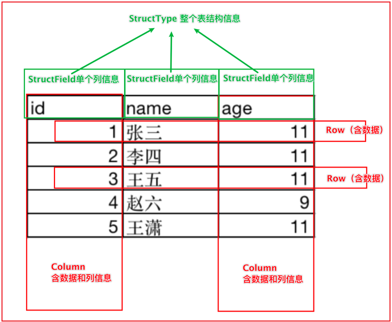

```properties
一个dataFrame表示是一个二维的表, 一个二维表, 必然存在 行 列 表结构描述信息

表结构描述信息(元数据):  StructType
	字段: StructField  
		定义: 字段的名称, 字段的类型, 字段是否可以为Null

认为: 在一个StructType对象下, 由多个StructField组成的, 构建了一个完整的元数据信息

行: Row对象

列: Column对象


注意: dataFrame本质上就是一个RDD, 只是对RDD进行包装, 在其基础上添加schema元数据信息,从而处理结构化数据
```

如何构建表结构信息: 

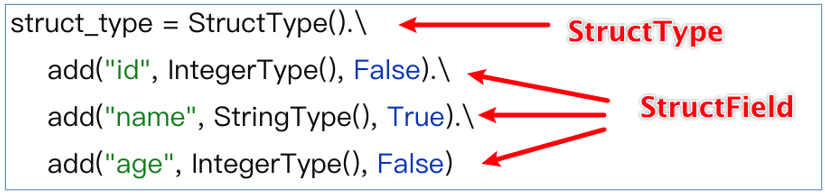

### 3.2 DataFrame的构建方式

* 方式一: 通过RDD得到一个dataFrame

```properties
from pyspark import SparkContext, SparkConf
from pyspark.sql import SparkSession
from pyspark.sql.types import *
import os

# 锁定远端环境, 确保环境统一
os.environ['SPARK_HOME'] = '/export/server/spark'
os.environ['PYSPARK_PYTHON'] = '/root/anaconda3/bin/python3'
os.environ['PYSPARK_DRIVER_PYTHON'] = '/root/anaconda3/bin/python3'

if __name__ == '__main__':
    print("如何获取DF对象方式一: 通过RDD得到DF对象")

    # 1. 创建SparkSession对象
    spark = SparkSession.builder.master('local[*]').appName('get_df_01').getOrCreate()

    sc = spark.sparkContext

    # 2- 构建RDD的数据集
    rdd = sc.parallelize(['张三 20', '李四 18', '王五 23'])

    # 3. 对数据进行处理操作
    # [('张三', '20'), ('李四', '18'), ('王五', '23')]
    rdd_map = rdd.map(lambda name_age:(name_age.split()[0],int(name_age.split()[1])))

    # 4. 将RDD转换为DF
    # 4.1 方案一:

    # schema元数据定义方式一:
    schema = StructType()\
        .add('name', StringType())\
        .add('age', IntegerType())

    # schema元数据定义方式二:
    schema = StructType(fields=[
        StructField('name',StringType(),True),
        StructField('age',IntegerType(),False)
    ])

    df = spark.createDataFrame(data=rdd_map,schema=schema)
    df.printSchema()
    df.show()

    df = spark.createDataFrame(data=rdd_map,schema='name string,age integer')
    df.printSchema()
    df.show()

    df = spark.createDataFrame(data=rdd_map, schema=['name','age']) # 自动类型推断, 但是一般推断类型比较大
    df.printSchema()
    df.show()

    # 4.2  方案二: 
    df = rdd_map.toDF(schema=schema)
    df.printSchema()
    df.show()

    df = rdd_map.toDF(schema='name string,age integer')
    df.printSchema()
    df.show()

    df = rdd_map.toDF(schema=['name','age'])
    df.printSchema()
    df.show()
```

场景:  当我们数据是半结构化的数据, 或者结构不完整的数据, 此时先通过Spark RDD程序来读取数据集, 将数据集基于RDD的算子完成预处理操作, 将数据转换为结构化的数据, 最后通过Spark SQL来进行最终统计处理操作


* 方式二: 如何将Pandas的DF转换为Spark SQL的DF对象

```properties
import pandas as pd
from pyspark import SparkContext, SparkConf
from pyspark.sql import SparkSession
import os

# 锁定远端环境, 确保环境统一
os.environ['SPARK_HOME'] = '/export/server/spark'
os.environ['PYSPARK_PYTHON'] = '/root/anaconda3/bin/python3'
os.environ['PYSPARK_DRIVER_PYTHON'] = '/root/anaconda3/bin/python3'

if __name__ == '__main__':
    print("如何基于pandas的DF转换为Spark SQL的DF对象")

    # 1- 创建SparkSession对象
    spark = SparkSession.builder.appName('pd_df_spark_df').master('local[*]').getOrCreate()

    # 2- 基于pandas 构建一个DF对象
    pd_df = pd.DataFrame({
        'id':[1,2,3,4],
        'name': ['张三','李四','王五','赵六'],
        'address':['北京','上海','深圳','广州']
    })

    # 3- 将pandas df 转换为 spark df
    # 字段名可以自动识别到pandas的字段类型, 对于数据类型, 当不设置schema的时候, 会进行自动推断
    spark_df = spark.createDataFrame(pd_df,schema='id int,name string,address string')

    spark_df.printSchema()
    spark_df.show()
```

* 方式三: 内部初始化数据的方式, 来直接得到一个DF对象

```properties
from pyspark import SparkContext, SparkConf
from pyspark.sql import SparkSession
import os

# 锁定远端环境, 确保环境统一
os.environ['SPARK_HOME'] = '/export/server/spark'
os.environ['PYSPARK_PYTHON'] = '/root/anaconda3/bin/python3'
os.environ['PYSPARK_DRIVER_PYTHON'] = '/root/anaconda3/bin/python3'

if __name__ == '__main__':
    print("方式三: 通过内部初始化, 直接创建DF对象")

    # 1. 创建SparkSession对象
    spark = SparkSession.builder.master('local[*]').appName('create_df').getOrCreate()

    # 2- 创建DF
    df = spark.createDataFrame(
        data=[(1,'张三','北京'),(2,'李四','上海'),(3,'王五','广州'),(4,'赵六','深圳')],
        schema='id int,name string,address string'
    )

    df.printSchema()
    df.show()
```

* 方式四: 通过读取外部文件的方式, 获取DF对象

```properties
格式:
	sparkSession.read
	    .format('text|csv|parquest|orc|jdbc|...') # 读取外部文件的格式(方式)
		.option('k','v') # 可选项  可以设置读取数据的参数信息
		.schema(structType | String) # 设置表结构信息
		.load('读取文件的路径....') # 读取外部文件的路径, 支持 HDFS 或者 本地
```

演示: 采用text方式来读取数据

```properties
from pyspark import SparkContext, SparkConf
from pyspark.sql import SparkSession
import os

# 锁定远端环境, 确保环境统一
os.environ['SPARK_HOME'] = '/export/server/spark'
os.environ['PYSPARK_PYTHON'] = '/root/anaconda3/bin/python3'
os.environ['PYSPARK_DRIVER_PYTHON'] = '/root/anaconda3/bin/python3'

if __name__ == '__main__':
    print("演示: 读取外部文件--->text")

    # 1- 创建SparkSession对象
    spark = SparkSession.builder.appName('read_text').master('local[*]').getOrCreate()

    # 2- 读取外部文件数据集
    # 当采用Text读取方式来读取外部文件的数据, 仅会产生一列数据, 一行数据为一列, 默认的列名为value 支持修改列名, 数据类型必须为string
    df = spark.read\
        .format('text')\
        .schema('dept string')\
        .load(path='file:///export/data/workspace/ky06_pyspark/_03_SparkSql/data/dept.txt')

    # 3- 打印 查看结果
    df.printSchema()
    df.show()
```

演示: CSV读取方式

```properties
from pyspark import SparkContext, SparkConf
from pyspark.sql import SparkSession
import os

# 锁定远端环境, 确保环境统一
os.environ['SPARK_HOME'] = '/export/server/spark'
os.environ['PYSPARK_PYTHON'] = '/root/anaconda3/bin/python3'
os.environ['PYSPARK_DRIVER_PYTHON'] = '/root/anaconda3/bin/python3'

if __name__ == '__main__':
    print("方式四: 读取外部文件的方式 ---> csv")

    # 1- 创建SparkSession对象
    spark = SparkSession.builder.appName('read_text').master('local[*]').getOrCreate()

    # 2- 读取外部文件数据
    df = spark.read\
        .format('csv')\
        .option('sep',' ')\
        .option('inferSchema', True)\
        .option('header',True)\
        .option('encoding','utf-8')\
        .load(path='file:///export/data/workspace/ky06_pyspark/_03_SparkSql/data/dept.txt')
    """
        CSV可以读取到多列的数据, 默认会根据逗号进行切割处理 一个作为一列来展示
        
        CSV相关的参数说明: 
            sep: 指定字段之间的分隔符号, 默认为逗号
            header: 是否存在头信息, 默认为False 如果为True 表示将文件的第一行作为表头
            inferSchema: 是否自动识别字段的类型, 默认为False
            encoding: 读取数据的编码集, 默认为utf-8
    
    """
    
    
    # 3- 打印查看内容
    df.printSchema()
    df.show()
```

演示: 读取Json的数据

Json的文件内容

```json
{'id': 1,'name': '张三','age': 20}
{'id': 2,'name': '李四','age': 18,'address': '北京'}
{'id': 3,'name': '王五','age': 23}
{'id': 4,'name': '赵六','age': 25,'address': '上海'}
```

代码演示:

```properties
from pyspark import SparkContext, SparkConf
from pyspark.sql import SparkSession
import os

# 锁定远端环境, 确保环境统一
os.environ['SPARK_HOME'] = '/export/server/spark'
os.environ['PYSPARK_PYTHON'] = '/root/anaconda3/bin/python3'
os.environ['PYSPARK_DRIVER_PYTHON'] = '/root/anaconda3/bin/python3'

if __name__ == '__main__':
    print("方式四: 读取外部文件 ---> Json")

    # 1- 创建SparkSession对象
    spark = SparkSession.builder.appName('read_text').master('local[*]').getOrCreate()

    # 2- 读取外部文件数据
    df = spark.read\
        .format('json')\
        .schema('id int,name string,age int,address string')\
        .load(path='file:///export/data/workspace/ky06_pyspark/_03_SparkSql/data/stu.json')
    """
        通过json方式来读取数据, 也支持多列读取, 当没有设置schema的时候, 自动识别文件数据,将key当做字段名称
        将Json中内容转换为结构化的数据,没有值的, 用Null替代,当然也支持自定义schema信息
        同时也可以基于schema约束字段的顺序
        
        需要注意: schema中设置的字段名字 需要和Json文件中key值保持一致, 否则无法匹配
    """
    
    
    # 3- 打印数据
    df.printSchema()
    df.show()
```


请注意: 在以上所有的外部读取方式中, 都有简单的写法

```properties
格式:
	df = sparkSession.read.读取格式(相关参数...)

例如:
	df = spark.read.csv(
        path='file:///export/data/workspace/ky06_pyspark/_03_SparkSql/data/dept.txt',
        sep=' ',
        inferSchema=True,
        header=True,
        encoding='utf-8'
    )
```


### 3.3 DataFrame的相关API

操作dataFrame一般有二种操作的方式, 一种为SQL方式, 另一种为DSL方式

```properties
SQL方式: 通过编写SQL语句完成统计分析操作

DSL方式: 领域特定语言  指的通过DF的特有API完成计算操作(通过代码形式)


从使用角度来说: SQL可能更加的方便一些,  当适应了DSL写法后, 你会发现DSL要比SQL更加好用(类似于面向过程编程)


Spark的官方角度: 推荐采用DSL方案

```

关于DSL相关的API:

* show(参数1,参数2): 用于展示DF中的数据, 默认仅展示前20行

  * 参数1: 设置默认展示多少行, 默认值为20
  * 参数2: 是否为阶段列, 默认只输出20个字符的长度, 过长不显示, 要现实的话, 请填入: truncate=True

  * 一般这两个参数很少会设置

* printSchema(): 用于打印当前这个DF的表结构信息

* select(): 类似于SQL语句中select, SQL中select后面可以写啥, 这里也同样可以实现

* filter/where: 用于对数据进行过滤操作, 一般在Spark SQL中主要使用where

* groupBy() 用于执行分组

* orderBy() 用于执行排序

* …….

```properties
注意:
	Spark SQL的DSL API 都是非常简单的, 基本都与SQL的关键词保持一致, 一般大家认为DSL比较难的地方: 不知道如何传递参数,因为DSL API的参数变化多样, 每个函数支持的参数方式也不一样
	
	DSL主要支持以下几种传递的方式: 列表 | str | column
		str格式:  '字段'
		column: 
			df对象中包含的字段:  df['字段']
			执行过程新产生字段:  F.col('字段')
		列表: 
			['字段1','字段2','字段3'...]
			[column1,column2,column3...]
		
	如何识别函数支持哪几种传递方式呢?
```

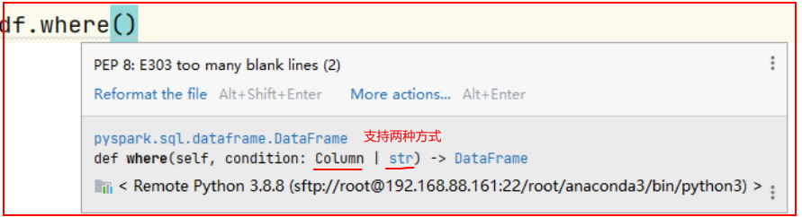

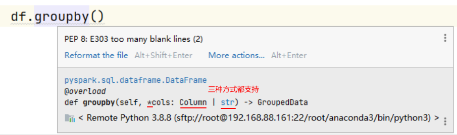

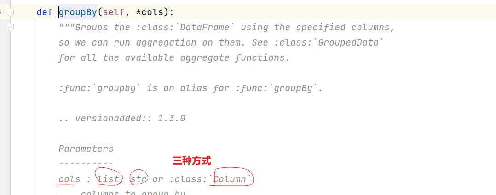


为了能够支持在编写DSL方案的时候, 支持在DSL中使用SQL函数, 专门提供了一个SQL函数库,直接加载使用即可

```properties
导入这个SQL函数库:
	import pyspark.sql.functions as F

后续, 通过F 调用对应的函数即可,  而且Spark SQL所支持的函数, 都可以通过以下地址查询到:
https://spark.apache.org/docs/3.1.2/api/sql/index.html
```


关于SQL的操作方式:

* 如何创建一个表(视图):

```properties
df.createTempView('视图名称') # 创建一个临时的视图(表名)   常用
df.createOrReplaceTempView('视图名称') # 创建一个临时视图, 如果视图存在, 直接替换
df.createGlobalTempView('视图名称') # 注册一个全局视图, 运行在一个Spark应用中多个spark会话都是可以使用的, 在使用全局的视频的时候, 必须添加:  global_temp.视图名称  才可以加载到

临时会话, 仅在当前这个spark session会话中使用


上述的创建视图的方式也可以通过SQL形式来创建:

create [template] view 视图名称 .....

create or replace [template] view 视图名称 ....

```

* 如何书写SQL语句:

```properties
spark.sql('sql语句')
```


### 3.4 Spark SQL的shuffle分区设置

​	Spark SQL底层本质上还是Spark的RDD程序, 认为Spark Sql组件就是一款翻译软件,用于将SQL/DSL翻译为Spark RDD程序, 执行运行

​	Spark SQL中同样也是存在shuffle分区的, 在执行shuffle分区后, shuffle分区数量默认为200个, 但是实际中, 一般都是需要调整这个分区的,因为当数据量比较少的时候, 200个分区相对比较大, 但是当数据量比较大的时候, 200个分区显得比较小


如何调整shuffle分区数量呢? spark.sql.shuffle.partitions

```properties
方案一: 直接修改spark-defaults.conf 配置文件  全局设置  默认值为200   不建议修改
		设置为 :  
			spark.sql.shuffle.partition  100
方案二: 在客户端通过spark-submit 命令提交的时候, 动态设置shuffle的分区数量: 比较常用(部署 上线,基于spark-submit提交运行的时候)
		设置为: 
			--conf 'spark.sql.shuffle.partitions=100'
方案三: 直接在代码中设置 :  主要在测试 开发环境中使用, 直接右键运行 但是一般在上线部署的时候, 会将其删除, 统一在spark-submit中配置  优先级最高
		设置为: 
			sparkSession.conf.set('spark.sql.shuffle.partitions',100)
			
			或者:
			sparkSession.builder\
				.appName()\
				.master()\
				.config('spark.sql.shuffle.partitions',4)\
				.getOrCreate()
```

### 3.5 Spark SQL的相关清洗API

* 去重API: dropDuplicates

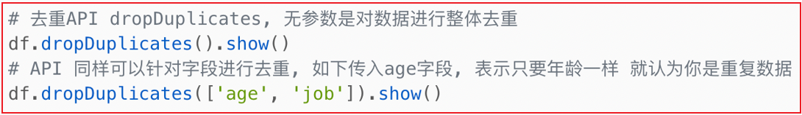

* 删除缺失值的API: dropna

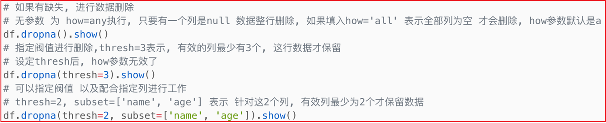

* 替换缺失值的API: fillna

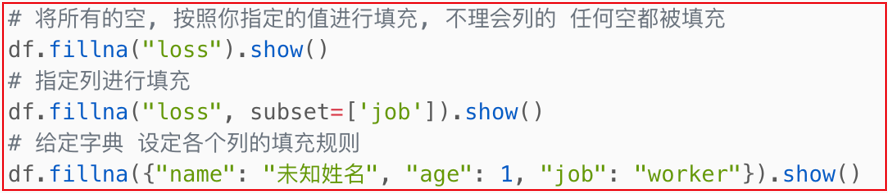


代码演示:

```properties
from pyspark import SparkContext, SparkConf
from pyspark.sql import SparkSession
import os

# 锁定远端环境, 确保环境统一
os.environ['SPARK_HOME'] = '/export/server/spark'
os.environ['PYSPARK_PYTHON'] = '/root/anaconda3/bin/python3'
os.environ['PYSPARK_DRIVER_PYTHON'] = '/root/anaconda3/bin/python3'

if __name__ == '__main__':
    print("演示清洗API")

    # 1. 创建SparkSession对象
    spark = SparkSession.builder.appName('movie_demo').master('local[*]').getOrCreate()
    # 2- 读取外部文件数据
    df = spark.read.csv(
        path='file:///export/data/workspace/ky06_pyspark/_03_SparkSql/data/clear.txt',
        header=True,
        inferSchema=True,
        sep=','
    )
    df.printSchema()
    df.show()
    # 3- 执行相关的操作
    # 3.1 去重API
    df.dropDuplicates().show() # 整体去重, 如果整个一行内容和其他行完全一致, 那么删除后续行, 保留第一行

    df.dropDuplicates(subset=['address','sex']).show() # 判断 address 和 sex两列, 如果一致, 删除后续行, 保留第一行

    # 3.2 删除缺失值的API
    df.dropna().show() # 判断所有的字段, 只要某一行的某个字段为null, 整个一行都会被删除

    df.dropna(thresh=3).show() # 至少保证每一行中有三行是有效, 如果不满足 删除整行数据

    df.dropna(thresh=2,subset=['id','name','address']).show() # 至少保证在 id name address这三列中有二列是有效的, 如果不满足. 删除整行数据

    # 思考: 我想删除一整行都是为null的数据, 如果只有某个为null 不需要删除
    df.dropna(how='all').show()

    # 3.3 替换缺失值的API
    df.fillna(value=0).show() # 将所有int类型的字段的Null 赋值为默认值 (说明: 具体覆盖什么类型的字段, 取决于传入默认值的类型)

    df.fillna(value='未知',subset=['name','address']).show()

    # 常用插入方式
    df.fillna(value={'id':0,'name':'未知姓名','address':'未知地址','sex':'未知性别','age':18}).show()
```

### 3.6 Spark SQL的数据写出操作

统一的输出的语法:

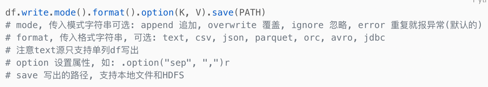


* 演示1: 输出到文件中  json   csv  orc  text ….

```properties
from pyspark import SparkContext, SparkConf
from pyspark.sql import SparkSession
import os

# 锁定远端环境, 确保环境统一
os.environ['SPARK_HOME'] = '/export/server/spark'
os.environ['PYSPARK_PYTHON'] = '/root/anaconda3/bin/python3'
os.environ['PYSPARK_DRIVER_PYTHON'] = '/root/anaconda3/bin/python3'

if __name__ == '__main__':
    print("演示: 数据写出操作")

    # 1. 创建SparkSession的对象
    spark = SparkSession.builder.appName('df_write').master('local[*]').getOrCreate()

    # 2. 内部初始化相关的数据集
    df = spark.createDataFrame(
        data=[(1,'张三',20),(2,'李四',18),(3,'王五',25),(4,'赵六',23),(5,'田七',24)],
        schema='id int,name string,age int'
    )

    # 3. 对数据执行相关的操作: 筛选出年龄大于20岁
    df = df.where('age > 20')

    # 4- 将数据写出到HDFS中

    # df.write\
    #     .mode('overwrite')\
    #     .format('csv')\
    #     .option('sep','|')\
    #     .option('header',True)\
    #     .save(path='hdfs://node1:8020/spark/output/put1')

    # df.write \
    #     .mode('overwrite') \
    #     .format('json') \
    #     .save(path='hdfs://node1:8020/spark/output/put2')

    # df.write \
    #     .mode('overwrite') \
    #     .format('orc') \
    #     .save(path='hdfs://node1:8020/spark/output/put3')

    df.write.csv(
        path='hdfs://node1:8020/spark/output/put4',
        header=True,
        sep=',',
        encoding='GBK',
        mode='overwrite'
    )

    """
        mode: 输出模式
            可选的值: 
                append:  追加模式, 将结果数据追加到指定位置下, 如果位置不存在, 会创建
                overwrite: 覆盖模式  将数据覆盖到指定的位置下, 不管位置是否存在, 都是先删除, 然后在添加
                error: 错误, 将数据添加到指定的位置下, 如果指定的位置以存在, 直接报错, 否则正常创建添加
                ignore: 忽略, 将数据添加到指定的位置下, 如果执行的位置下已经有了, 那么直接忽略当前的写入
    
    """
```

* 可以将结果数据输出到Hive的表中

```properties
df.write.mode().saveAsTable(参数1,参数2)

参数1: 表名 如果需要指定数据库 可以写成  库名.表名
参数2: 输出格式
```

目前, 输出到HIVE的操作, 无法进行演示, 因为当前Spark SQL还没有和HIVE进行整合


* 将结果数据基于JDBC方案, 输出到关系型数据库, 例如说: MySQL

```properties
from pyspark import SparkContext, SparkConf
from pyspark.sql import SparkSession
import os

# 锁定远端环境, 确保环境统一
os.environ['SPARK_HOME'] = '/export/server/spark'
os.environ['PYSPARK_PYTHON'] = '/root/anaconda3/bin/python3'
os.environ['PYSPARK_DRIVER_PYTHON'] = '/root/anaconda3/bin/python3'

if __name__ == '__main__':
    print("演示: 数据写出操作")

    # 1. 创建SparkSession的对象
    spark = SparkSession.builder.appName('df_write').master('local[*]').getOrCreate()

    # 2. 内部初始化相关的数据集
    df = spark.createDataFrame(
        data=[(1, '张三', 20), (2, '李四', 18), (3, '王五', 25), (4, '赵六', 23), (5, '田七', 24)],
        schema='id int,name string,age int'
    )

    # 3. 对数据执行相关的操作: 筛选出年龄大于20岁
    df = df.where('age > 20')

    # 4- 将数据写出到MySQL
    """
        建库语句: create database day10_pyspark char set 'utf8';
        
        建表语句: 
        create table day10_pyspark.stu(
             id int,
             name varchar(20),
             age int
        );
    """
    df.write.jdbc(
        url='jdbc:mysql://node1:3306/day10_pyspark?useUnicode=true&characterEncoding=utf8',
        table='stu',
        mode='append',
        properties={'user': 'root', 'password': '123456'}
    )

	
	如果由程序自动构建mysql的表, 或者采用overwrite模式, 请注意, 数据类型选择上会较大
	
	比如说: 字符串类型, 正常varchar, 但是系统创建表的时候, 会选择text
	
	一般建议是自己建表, 然后可以采用append的模式添加数据
```


可能出现的错误:

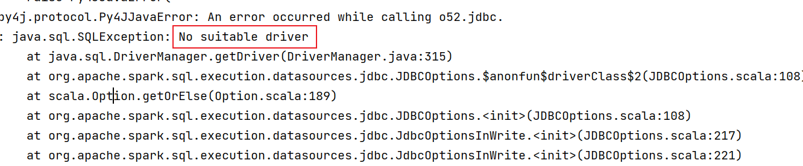

```properties
原因: 缺少连接Mysql数据库的驱动jar包

如何放置驱动包呢? 
	1- 放置位置一: 当Spark-submit提交的运行环境为Spark集群环境的时候, 以及运行模式为local,默认从spark的jars目录下加载相关的jar包
		目录位置: /export/server/spark/jars/
	
	2- 放置位置二: 当我们使用pycharm运行代码的时候, 基于python的环境来运行的,需要在python的环境中可以加载到相关的jar包
		目录位置: /root/anaconda3/lib/python3.8/site-packages/pyspark/jars/
	
	3- 放置位置三: 当我们选择提交模式on yarn模式, 需要保证此jar包在HDFS上对应的目录下
		目录位置: hdfs://node1:8020/spark/jars
		
	
	请注意: 以上三个位置, 主要是用于放置一些spark可能会经常使用的jar包, 对于一些不经常使用的jar包, 在后续通过spark-submit提交运行的时候, 会采用 --jars 参数 指定额外的第三方的一些jar包
```

## 4. 综合案例

### 4.1 WordCount案例实现

准备工作: 

向HDFS上传一个words.txt的文件, 上传到HDFS的: /spark/wd/input

```properties
words.txt文件的内容:

hadoop hive hive hadoop sqoop
sqoop kafka hadoop sqoop hive hive
hadoop hadoop hive sqoop kafka kafka
kafka hue kafka hbase hue hadoop hadoop hive
sqoop sqoop kafka hue hue kafka


首先: 在HDFS上创建此目录
hdfs dfs -mkdir -p /spark/wd/input

上传操作:
hdfs dfs -put words.txt /spark/wd/input
```


构建Python程序, 完成WordCount案例 : 通过RDD转换为DF

```properties
from pyspark import SparkContext, SparkConf
from pyspark.sql import SparkSession
import os

# 锁定远端环境, 确保环境统一
os.environ['SPARK_HOME'] = '/export/server/spark'
os.environ['PYSPARK_PYTHON'] = '/root/anaconda3/bin/python3'
os.environ['PYSPARK_DRIVER_PYTHON'] = '/root/anaconda3/bin/python3'

if __name__ == '__main__':
    print("方式一: 完成综合案例的WordCount实现")

    # 1. 创建SparkSession对象
    spark = SparkSession.builder.appName('read_text').master('local[*]').getOrCreate()

    sc = spark.sparkContext

    # 2. 读取外部文件数据  通过RDD读取数据

    rdd = sc.textFile('hdfs://node1:8020/spark/wd/input/words.txt')

    # 3. 执行相关的操作
    # 3.1 将数据转换为结构化的数据
    rdd_flatMap = rdd.flatMap(lambda line: line.split(' '))

    # 将每一个单词, 转换为一个元组
    rdd_map = rdd_flatMap.map(lambda word:(word,))

    # 3.2 将RDD转换为DF
    df = spark.createDataFrame(rdd_map, schema='words string')

    df.printSchema()
    df.show()

    # 3.3 统计每个单词有多少个
    # SQL
    df.createTempView('t1')
    spark.sql("""
        select
            words,
            count(1) as cnt
        from t1 group by words
    """).show()

    # DSL : 使用大写的groupByKey
    df.groupBy('words').count().show()
```

* 方式二:  直接基于DF来完成WordCount案例

```properties
from pyspark import SparkContext, SparkConf
from pyspark.sql import SparkSession
import pyspark.sql.functions as F
import os

# 锁定远端环境, 确保环境统一
os.environ['SPARK_HOME'] = '/export/server/spark'
os.environ['PYSPARK_PYTHON'] = '/root/anaconda3/bin/python3'
os.environ['PYSPARK_DRIVER_PYTHON'] = '/root/anaconda3/bin/python3'

if __name__ == '__main__':
    print("演示: WordCount案例实现方式二")

    # 1. 创建SparkSession对象
    spark = SparkSession.builder.appName('WordCount_02').master('local[*]').getOrCreate()
    # 2- 读取外部文件数据
    df = spark.read\
        .format('text')\
        .schema(schema='line string')\
        .load(path='hdfs://node1:8020/spark/wd/input/words.txt')
    df.createTempView('t1')
    # 3- 执行相关的操作
    # 3.1 SQL方式
    df1 = spark.sql("""
        select 
            words,
            count(1) as cnt
        from (select explode(split(line,' ')) as words from t1) as t2
        group by words
    """)

    df1 = spark.sql("""
            with t2 as (
                select explode(split(line,' ')) as words from t1
            )
            select 
                words,
                count(1) as cnt
            from t2 group by words
    """)

    df1 = spark.sql("""
           select   
                words,
                count(1) as cnt
           from t1 lateral view explode(split(line,' ')) t2 as words  
           group by words
    """)
    
    df1.show()
    
    # 3.2 DSL方式
    df.select(
        F.explode(F.split('line',' ')).alias('words')
    ).groupBy('words').count().withColumnRenamed('count','cnt').show()

    df.select(
        F.explode(F.split('line', ' ')).alias('words')
    ).groupBy('words').agg(
        F.count('words').alias('cnt')
    ).show()

```

### 4.2 电影分析案例

数据集的介绍:


```properties
数据说明 :  userid , movieid,score,datestr

字段的分隔符号为:  \t
```

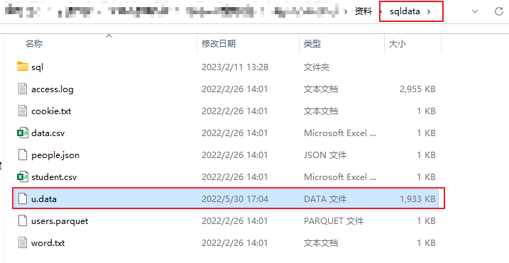

需求如下:

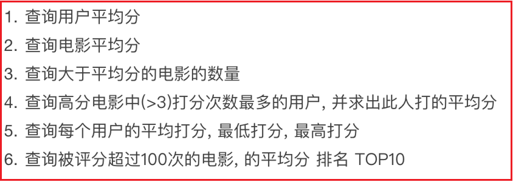

准备工作:

* 1- 将数据放置到项目的data目录下

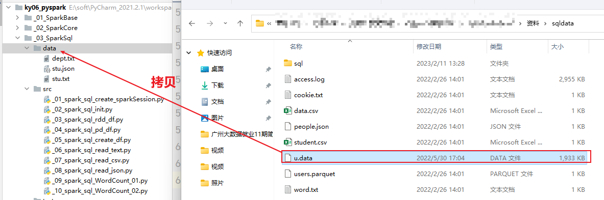

* 2- 编写程序, 完成读取外部数据操作

```properties
from pyspark import SparkContext, SparkConf
from pyspark.sql import SparkSession
import os

# 锁定远端环境, 确保环境统一
os.environ['SPARK_HOME'] = '/export/server/spark'
os.environ['PYSPARK_PYTHON'] = '/root/anaconda3/bin/python3'
os.environ['PYSPARK_DRIVER_PYTHON'] = '/root/anaconda3/bin/python3'

if __name__ == '__main__':
    print("演示: Spark SQL的综合案例 ---> 电影评分案例")

    # 1. 创建SparkSession对象
    spark = SparkSession.builder.appName('movie_demo').master('local[*]').getOrCreate()
    # 2- 读取外部文件数据
    df = spark.read.csv(
        path='file:///export/data/workspace/ky06_pyspark/_03_SparkSql/data/u.data',
        schema='userid string,movieid string,score int,datestr string',
        sep='\t'
    )
    # 3- 处理相关的核心数据
    df.printSchema()
    df.show()

```

需求实现:

* 1- 查询用户平均分:

```properties
def xuqiu1():
    # SQL
    spark.sql("""
        select
            userid,
            round(avg(score),2) as u_s_avg
        from t1 group by userid order by u_s_avg desc
    """).show()
    # DSL
    df.groupBy('userid').agg(
        F.round(F.avg('score'), 2).alias('u_s_avg')
    ).orderBy('u_s_avg', ascending=False).show()
```

* 2- 查询电影平均分: 作业

```properties

```

* 3- 查询大于平均分的电影的数量 : 作业

```properties

```

* 4- 查询高分电影中(>3)打分次数最多的用户, 并且求出此人打的平均分

```properties
def xuqiu4():
    # SQL
    # 3.4.1 先查询有哪些高分电影呢 ?
    df_hight_movie = spark.sql("""
        select
            movieid,
            round(avg(score),2) as m_avg
        from t1 group by movieid having m_avg > 3
    """)
    df_hight_movie.createTempView('hight_movie')
    # 3.4.2 基于高分电影信息, 找到有那些用户参与了打分  打分次数最多的用户
    df_top_user = spark.sql("""
        select
            userid,
            count(1) as u_cnt
        from t1 join hight_movie on t1.movieid = hight_movie.movieid
        group by t1.userid order by u_cnt desc limit 1
    """)
    df_top_user.createTempView('top_user')
    # 3.4.3 求这个用户在整个数据集打的平均分
    spark.sql("""
        select
            round(avg(score),2) as  s_avg
        from t1 where userid = (select userid from top_user)
    """).show()
    # 合并刚刚分析过程:
    spark.sql("""
        with hight_movie as(
            select
                movieid,
                round(avg(score),2) as m_avg
            from t1 group by movieid having m_avg > 3
        ),
        top_user as (
            select
                userid,
                count(1) as u_cnt
            from t1 join hight_movie on t1.movieid = hight_movie.movieid
            group by t1.userid order by u_cnt desc limit 1
        )
        select
            round(avg(score),2) as s_avg
        from t1 where userid = (select userid from top_user)
    """).show()
    # DSL
    # 3.4.1 先查询有哪些高分电影
    df_hight_movie = df.groupBy('movieid').agg(
        F.round(F.avg('score'), 2).alias('m_avg')
    ).where('m_avg > 3')
    # 3.4.2 基于高分电影信息, 找到有那些用户参与了打分  打分次数最多的用户
    df_top_user = df.join(df_hight_movie, 'movieid').groupBy('userid').agg(
        F.count('userid').alias('u_cnt')
    ).orderBy('u_cnt', ascending=False).limit(1)
    # 3.4.3 求这个用户在整个数据集打的平均分
    df.where(df['userid'] == df_top_user.first()['userid']).select(
        F.round(F.avg('score')).alias('s_avg')
    ).show()
```

* 5- 查询每个用户的平均打分, 最低打分, 最高打分 – 作业

```properties

```

* 6- 查询被评分超过100次的电影的平均分排名TOP10

```properties
def xuqiu6():
    # 查询每部电影的评分次数以及平均分, 并且过滤出评分超过100次电影, 对平均分进行倒序排序, 取出前10
    # SQL
    spark.sql("""
        select
            movieid,
            count(1) as m_cnt,
            round(avg(score),2) as s_avg
        from t1 group by  movieid having  m_cnt > 100 order by s_avg desc  limit 10
    """).show()
    # DSL
    df.groupBy('movieid').agg(
        F.count('movieid').alias('m_cnt'),
        F.round(F.avg('score'), 2).alias('s_avg')
    ).where('m_cnt > 100').orderBy('s_avg', ascending=False).limit(10).show()
```


## 5. Spark SQL函数定义

### 5.1 如何使用窗口函数

回顾:

```properties
窗口函数格式:
	分析函数 over(partition by xxx order by xxx [asc|desc] [rows between xxx and xxx])

学习的相关分析函数有那些? 
	第一类: row_number() rank() dense_rank() ntile()
	第二类: 和聚合函数组合使用  sum() avg() max() min() count()
	第三类: lag() lead() first_value() last_value()
```

如何在Spark SQL中使用呢?

* SQL中:  与HIVE中应用基本没啥区别, 更多关注的是DSL写法

```properties
from pyspark import SparkContext, SparkConf
from pyspark.sql import SparkSession
import pyspark.sql.functions as F
from pyspark.sql import Window as win
import os

# 锁定远端环境, 确保环境统一
os.environ['SPARK_HOME'] = '/export/server/spark'
os.environ['PYSPARK_PYTHON'] = '/root/anaconda3/bin/python3'
os.environ['PYSPARK_DRIVER_PYTHON'] = '/root/anaconda3/bin/python3'

if __name__ == '__main__':
    print("演示: 如何在Spark SQL中使用窗口函数...")

    # 1- 创建SparkSession对象
    spark = SparkSession.builder.appName('df_write').master('local[*]').getOrCreate()

    # 2-读取外部文件的数据
    df = spark.read.csv(
        path='file:///export/data/workspace/ky06_pyspark/_03_SparkSql/data/pv.csv',
        header=True,
        inferSchema=True
    )
    df.createTempView('t1')
    # 3- 执行相关的操作
    # 需要: 统计每个cookie中, pv数量排名前二内容是哪些? (分组TOPN 问题)
    # SQL
    spark.sql("""
        with t2 as(
            select
                *,
                row_number() over (partition by cookieid order by pv desc) as rank1
            from t1 
        )
        select  * from  t2 where rank1 <=2
    """).show()

    # DSL:
    df.select(
        '*',
        F.row_number().over(win.partitionBy('cookieid').orderBy(F.desc('pv'))).alias('rank1')
    ).where('rank1 <= 2').show()
```

### 5.2 SQL函数的分类说明

整个SQL函数, 主要是分为以下三大类:

* UDF函数: 用户自定义函数
  * 表示: 一进一出
  * 整个函数中, 大多数的函数都是属于一进一出的函数: split() substr() 
* UDAF函数: 用户自定义聚合函数
  * 表示: 多进一出
  * 例如: sum() avg() count() ….
* UDTF函数: 用户自定义表生成函数
  * 表示: 一进多出
  * 指的: 进去一行数据, 最终产生多行 或者多列的数据
  * 例如: explode


在SQL中提供的内置函数, 都是属于以上三类中某一类函数


思考: 提供了那么多的函数, 为啥还需要自定义函数呢?

```properties
扩充函数. 在实际使用中, 并不能保证所有的操作可能用的函数都已经提前的内置好, 尤其是很多具有特殊业务处理功能, 其实并没有相对应函数 , 提供的函数更多是以公共的功能为主函数, 此时需要进行自定义, 从而扩充新的功能
```

​	在Spark SQL中, 对于自定义函数, 原生支持的粒度并不是特别好, 目前原生的PY方案仅支持自定义UDF函数, 无法自定义UDAF函数和UDTF函数, 在1.6版本之后, Java 和scala语言支持了自定义UDAF函数,但是Python并不支持,Spark官方提供了解决的方案: 基于pandas来自定义UDF 和 UDAF函数. 但是对于UDTF函数, Spark是不支持自定义,但是Spark支持HIVE的函数定义, 所以可以通过HIVE自定义函数来解决

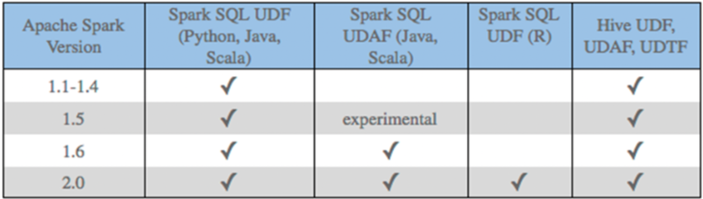

```properties
	虽然Python支持自定义UDF函数, 但是其效率并不是特别的高效, 因为在使用的时候, 传递一行处理一行, 返回一行的操作, 这样会带来非常大的序列化开销问题, 以及网络开销问题, 导致原生UDF函数效率不好
	
	早期解决方案: 基于 scala/Java来编写自定义UDF函数, 然后基于Python使用即可
	
	目前主要解决方案: 引入Arrow框架, 可以基于内存来完成数据传输工作, 可以大大降低了序列化开销问题, 提供传输的效率, 解决了原生问题, 同时还可以基于pandas的自定义函数, 利用pandas函数优势, 完成各种处理操作
	
	所以后期主推的方案: 基于pandas 自定义函数, 然后底层基于arrow完成数据传输工作
```


### 5.3 Spark SQL原生自定义函数

如何自定义原生函数流程(非常重要):

```properties
第一步: 在Python中创建一个python的函数, 在这个函数中书写自定义函数的功能逻辑代码即可

第二步: 将Python函数注册到Spark SQL中, 成为Spark SQL的函数
	注册方式一: udf对象 = sparkSession.udf.register(参数1,参数2,参数3)
		参数1: UDF函数的名称, 此名称用于后续在SQL语法中使用 , 可以任意定义名称, 但是要符合定义名称规范
		参数2: python函数的名称, 表示将哪个python的函数注册为Spark SQL的函数
		参数3: 返回值的类型, 用于表示当前这个Python的函数返回的类型对应的Spark SQL的数据类型
		udf对象: 此对象主要是用于DSL中
	
	注册方式二:  udf对象 = F.udf(参数1,参数2)
		参数1: python函数的名称, 表示将哪个python的函数注册为Spark SQL的函数
		参数2: 返回值的类型, 用于表示当前这个Python的函数返回的类型对应的Spark SQL的数据类型
		udf对象: 此对象主要是用于DSL中
		
		说明: 此种方式还支持语法糖写法:  @F.udf(returnType=返回值类型) 需要放置到对应函数上面
第三步: 在Spark SQL的DSL/SQL中进行使用即可
```


演示操作: 请自定义一个函数, 完成对数据统一添加一个后缀名的操作

```properties
from pyspark import SparkContext, SparkConf
from pyspark.sql import SparkSession
from pyspark.sql.types import *
import pyspark.sql.functions as F
import os

# 锁定远端环境, 确保环境统一
os.environ['SPARK_HOME'] = '/export/server/spark'
os.environ['PYSPARK_PYTHON'] = '/root/anaconda3/bin/python3'
os.environ['PYSPARK_DRIVER_PYTHON'] = '/root/anaconda3/bin/python3'

if __name__ == '__main__':
    print("演示原生的自定义函数:")

    # 1- 创建SparkSession对象
    spark = SparkSession.builder.appName('df_write').master('local[*]').getOrCreate()

    # 2- 初始化一些数据
    df = spark.createDataFrame(
        data=[(1,'张三','北京'),(2,'李四','上海'),(3,'王五','广州'),(4,'赵六','深圳'),(5,'田七','杭州')],
        schema='id int,name string,address string'
    )
    df.createTempView('t1')
    # 3- 执行相关的操作:
    # 请自定义一个函数, 完成对数据统一添加一个后缀名的操作
    # 3.1 定义一个Python的函数, 接收一个数据, 给数据添加一个后缀返回
    @F.udf(returnType=StringType())
    def add_post(data):
        return data+'_boxuegu'

    # 3.2 对函数进行注册操作
    # 注册方式一
    # 当采用注解方式注册函数的使用, 如果依然想在SQL中使用, 可以再次使用方式一注册,但是不需要设置返回值类型了
    spark.udf.register('add_post_sql',add_post)

    # 注册方式二: 还有一种语法糖模式
    #add_post_dsl = F.udf(add_post,StringType())

    # 3.3 使用自定义函数
    # SQL
    spark.sql("""
        select
            *,
            add_post_sql(address) as r1
        from t1
    """).show()

    # DSL
    df.select(
        '*',
        add_post('address').alias('r1')
    ).show()
```

演示操作: 自定义一个函数, 让其返回值的类型为字典 列表 元组

```properties
from pyspark import SparkContext, SparkConf
from pyspark.sql import SparkSession
from pyspark.sql.types import *
import pyspark.sql.functions as F
import os

# 锁定远端环境, 确保环境统一
os.environ['SPARK_HOME'] = '/export/server/spark'
os.environ['PYSPARK_PYTHON'] = '/root/anaconda3/bin/python3'
os.environ['PYSPARK_DRIVER_PYTHON'] = '/root/anaconda3/bin/python3'

if __name__ == '__main__':
    print("演示原生的自定义函数:")

    # 1- 创建SparkSession对象
    spark = SparkSession.builder.appName('df_write').master('local[*]').getOrCreate()

    # 2- 初始化一些数据
    df = spark.createDataFrame(
        data=[(1,'张三 北京'),(2,'李四 上海'),(3,'王五 广州'),(4,'赵六 深圳'),(5,'田七 杭州')],
        schema='id int,name_address string'
    )
    df.createTempView('t1')
    # 3- 执行相关的操作:
    # 需求: 自定义一个函数, 将姓名和地址拆分开
    schema = StructType().add('name',StringType()).add('address',StringType())

    @F.udf(returnType=schema)
    def split_data(data):
        res = data.split(' ')
        #return [res[0],res[1]]
        #return (res[0], res[1])
        return {'name':res[0],'address':res[1]}
    # 使用字典返回, key值 必须和schema中定义字段名称保持一致

    # 注册函数
    spark.udf.register('split_data',split_data)

    # 使用函数
    # SQL
    df1 = spark.sql("""
        select
            *,
            split_data(name_address)['name'] as name,
            split_data(name_address)['address'] as address
        from t1
    """)

    df1.printSchema()
    df1.show()

    # DSL
    df.select(
        '*',
        split_data('name_address')['name'].alias('name'),
        split_data('name_address')['address'].alias('address')
    ).show()
```

### 5.4 Pandas的UDF函数

#### 5.4.1 Apache Arrow框架基本介绍

​	Apache Arrow是Apache旗下的一款顶级的项目, 是一个跨平台的在内存中以列式存储的数据层, 它的设计目标就是作为一个跨平台的数据层, 从而加快大数据分析项目的运行效率

​	Pandas 与PySpark SQL 进行交互的时候, 建立在Apache Arrow上, 带来低开销, 高性能的UDF函数

​	用于Spark程序在JVM和Python的进程中进行有效的高效的传输

​	Arrow并不会自动使用, 在某些情况下, 需要配置一些相关的参数, 需要在代码中进行一些小的调整才可以使用


如何使用Apache Arrow呢?

```properties
1- 安装Apache Arrow的库 : 建议三个节点都要按照
	pip install -i https://pypi.tuna.tsinghua.edu.cn/simple pyspark[sql]    
	
	注意: 以上操作, 仅需要在node1执行即可, 因为此操作要求必须先安装好pyspark 才可以进行安装,但是node2和node3并没有pyspark, 如何解决呢? 
	pip install -i https://pypi.tuna.tsinghua.edu.cn/simple pyarrow==11.0.0
	

2- 让程序使用Arrow框架: 
	sparkSession.conf.set('spark.sql.execution.arrow.pyspark.enabled',True)
```

#### 5.4.2 如何基于Arrow完成Pandas DF 和 Spark SQL DF互转

```properties
from pyspark import SparkContext, SparkConf
from pyspark.sql import SparkSession
import os

# 锁定远端环境, 确保环境统一
os.environ['SPARK_HOME'] = '/export/server/spark'
os.environ['PYSPARK_PYTHON'] = '/root/anaconda3/bin/python3'
os.environ['PYSPARK_DRIVER_PYTHON'] = '/root/anaconda3/bin/python3'

if __name__ == '__main__':
    print("演示: 基于Arrow下, Pandas的DF 和 Spark DF的互转操作")

    # 1- 创建SparkSession对象
    spark = SparkSession.builder.appName('df_write').master('local[*]').getOrCreate()

    # 添加Arrow的相关的配置
    spark.conf.set("spark.sql.execution.arrow.pyspark.enabled",True)

    # 2- 初始化一个Spark SQL的DF对象
    spark_df = spark.createDataFrame(
        data=[(1,'张三','北京'),(2,'李四','上海'),(3,'王五','广州'),(4,'赵六','深圳'),(5,'田七','武汉')],
        schema='id int,name string,address string'
    )

    # 3- 将Spark DF 转换为Pandas的DF
    pd_df = spark_df.toPandas()

    print(pd_df)
    pd_df = pd_df[pd_df['id']>=2]
    # 4- Pandas的DF 如何转换为Spark DF
    df = spark.createDataFrame(pd_df)

    df.show()


```

总结:

```properties
	Pandas df --> Spark df : df = spark.createDataFrame(pd_df)
	
	spark df ---> pandas df: pd_df = spark_df.toPandas()
```


#### 5.4.3 基于Pandas完成UDF函数

​	基于Pandas的UDF函数来转换为Spark SQL的UDF函数, 底层是基于Arrow框架来完成数据传输, 允许向量化(可以充分利用计算机CPU性能)操作,在使用的时候, 主要是通过 一个API:pandas_udf() 来完成对pandas函数的一个包装操作, 将其注册为一个Spark SQL的函数

​	pandas_udf() 其实是Spark SQL中提供的一个SQL函数, 在使用的时候, 需要通过F.pandas_udf()完成注册, 支持代码形式或者采用语法糖模式

​	pandas的UDF函数其实本质上就是python的函数, 只不过函数的传入类型为pandas的类型

​	基于Panads的UDF函数既可以定义UDF函数也可以定义UDAF函数


演示: 如何基于pandas自定义UDF函数

* 自定义Python函数的要求:   SeriesToSeries
  * 表示: 定义一个函数, 这个函数传入的参数类型必须是series, 输出的返回的类型必须也是series类型
  * 需求: 自定义两列数据, 完成 a列和b列的求和计算操作

```properties
import pandas as pd
from pyspark import SparkContext, SparkConf
from pyspark.sql import SparkSession
import pyspark.sql.functions as F
from pyspark.sql.types import  *
import os

# 锁定远端环境, 确保环境统一
os.environ['SPARK_HOME'] = '/export/server/spark'
os.environ['PYSPARK_PYTHON'] = '/root/anaconda3/bin/python3'
os.environ['PYSPARK_DRIVER_PYTHON'] = '/root/anaconda3/bin/python3'

if __name__ == '__main__':
    print("演示: 如何基于Pandas 自定义Spark SQL的UDF函数")

    # 1- 创建SparkSession对象
    spark = SparkSession.builder.appName('pandas_udf').master('local[*]').getOrCreate()

    # 添加Arrow的相关的配置 : 在pandas的 UDF中, 底层默认会采用Arrow来进行数据传输的
    spark.conf.set("spark.sql.execution.arrow.pyspark.enabled", True)

    # 2- 初始化量两列数据集: a 和 b
    df = spark.createDataFrame(
        data=[(1,2),(2,5),(3,2),(4,7),(8,3),(5,2)],
        schema='a int,b int'
    )
    df.createTempView('t1')

    df.printSchema()
    df.show()

    # 3- 执行相关的操作:  自定义函数, 完成对 a 和 b的求和

    # 3.1 自定义一个python函数, 完成对两列数据计算操作
    @F.pandas_udf(returnType=IntegerType())
    def sum_a_b(a:pd.Series,b:pd.Series) -> pd.Series:
        return a + b

    # 3.2 将py函数进行注册:
    # 语法糖模式: 仅支持 DSL
    # 支持在SQL中使用
    spark.udf.register('sum_a_b',sum_a_b)

    # 3.3 在Spark SQL中进行测试使用
    spark.sql("""
        select
            *,
            sum_a_b(a,b) as sum_ab
        from t1
    """).show()

    df.select('a','b',sum_a_b('a','b').alias('sum_ab')).show()
```


演示: 如何基于Pandas实现自定义UDAF函数

* 自定义Python函数的要求: SeriesTo标量

  * 表示: 自定义python函数, 要求传入的数据类型必须为series, 函数的返回类型必须是标量(python的基本数据类型 str  int  float )类型

  * 需求: 对某一列数据求平均值

```properties
import pandas as pd
from pyspark import SparkContext, SparkConf
from pyspark.sql import SparkSession
import pyspark.sql.functions as F
from pyspark.sql.window import Window as win
import os

# 锁定远端环境, 确保环境统一
os.environ['SPARK_HOME'] = '/export/server/spark'
os.environ['PYSPARK_PYTHON'] = '/root/anaconda3/bin/python3'
os.environ['PYSPARK_DRIVER_PYTHON'] = '/root/anaconda3/bin/python3'

if __name__ == '__main__':
    print("演示: pandas的UDAF函数实现")

    # 1- 创建SparkSession对象
    spark = SparkSession.builder.appName('pandas_udf').master('local[*]').getOrCreate()

    # 2- 初始化相关的数据集
    df = spark.createDataFrame(
        data=[(1,39.5),(2,63.5),(3,72.0),(4,85.0),(5,23.0),(6,25.0)],
        schema='id int,score float'
    )
    df.createTempView('t1')

    df.printSchema()
    df.show()

    # 3- 执行相关操作:
    # 需求: 对某一列数据求平均值
    # 3.1 自定义一个python的函数
    @F.pandas_udf(returnType='float')
    def score_avg(score:pd.Series) -> float:
        return score.mean()

    # 3.2 注册函数
    spark.udf.register('score_avg',score_avg)

    # 3.3  使用函数
    spark.sql("""
        select
            round(score_avg(score),2) as score_avg
        from t1
    """).show()

    df.select(score_avg('score').alias('score_avg')).show()

    # 支持在窗口函数中使用
    spark.sql("""
        select
            *,
            score_avg(score) over(order by score) as score_avg
        from t1
    """).show()

    df.select(
        '*',
        score_avg('score').over(win.orderBy('score')).alias('score_avg')
    ).show()
```


#### 5.4.4 基于 Pandas的 UDF函数综合案例

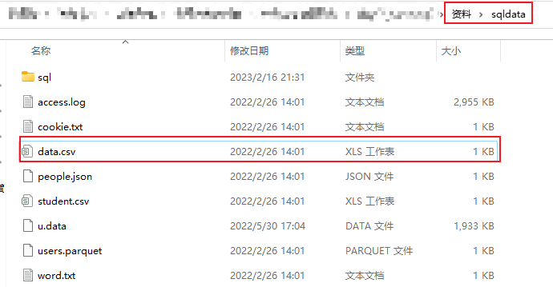

数据说明;

```properties
_c0,对手,胜负,主客场,命中,投篮数,投篮命中率,3分命中率,篮板,助攻,得分
0,勇士,胜,客,10,23,0.435,0.444,6,11,27
1,国王,胜,客,8,21,0.381,0.286,3,9,28
2,小牛,胜,主,10,19,0.526,0.462,3,7,29
3,火箭,负,客,8,19,0.526,0.462,7,9,20
4,快船,胜,主,8,21,0.526,0.462,7,9,28
5,热火,负,客,8,19,0.435,0.444,6,11,18
6,骑士,负,客,8,21,0.435,0.444,6,11,28
7,灰熊,负,主,10,20,0.435,0.444,6,11,27
8,活塞,胜,主,8,19,0.526,0.462,7,9,16
9,76人,胜,主,10,21,0.526,0.462,7,9,28
```

需求说明:

```properties
需求一: 助攻这一列需要加10, 如何实现?  UDF

需求二: 篮板 + 助攻的次数, 思考使用哪种? UDF

需求三: 统计胜 和 父的平均分 UDAF
```


代码实现:

```properties
import pandas as pd
from pyspark import SparkContext, SparkConf
from pyspark.sql import SparkSession
import pyspark.sql.functions  as F
import os

# 锁定远端环境, 确保环境统一
os.environ['SPARK_HOME'] = '/export/server/spark'
os.environ['PYSPARK_PYTHON'] = '/root/anaconda3/bin/python3'
os.environ['PYSPARK_DRIVER_PYTHON'] = '/root/anaconda3/bin/python3'

if __name__ == '__main__':
    print("演示pandas的自定义函数案例:")

    # 1- 创建SparkSession对象
    spark = SparkSession.builder.appName('pandas_udf').master('local[*]').getOrCreate()

    # 2- 读取外部文件数据
    df = spark.read.csv(
        path='file:///export/data/workspace/ky06_pyspark/_03_SparkSql/data/data.csv',
        header=True,
        inferSchema=True
    )
    df.createTempView('t1')

    df.printSchema()
    df.show()

    # 3- 执行相关的操作
    """
    需求一: 助攻这一列需要加10, 如何实现?  UDF
    需求二: 篮板 + 助攻的次数, 思考使用哪种? UDF
    需求三: 统计胜 和 父的平均分 UDAF
    """

    # 3.1  定义函数
    @F.pandas_udf(returnType='int')
    def xuqiu_1(zg:pd.Series) -> pd.Series:
        return zg + 10


    @F.pandas_udf(returnType='int')
    def xuqiu_2(lb:pd.Series,zg:pd.Series) -> pd.Series:
        return lb + zg


    @F.pandas_udf(returnType='float')
    def xuqiu_3(score:pd.Series) -> float:
        return score.mean()

    # 3.2 注册函数
    spark.udf.register('xuqiu_1',xuqiu_1)
    spark.udf.register('xuqiu_2',xuqiu_2)
    spark.udf.register('xuqiu_3',xuqiu_3)

    # 3.3 使用
    # SQL
    spark.sql("""
        select
            *,
            xuqiu_1(`助攻`) as zg_10,
            xuqiu_2(`篮板`,`助攻`) as lb_zg
        from t1
    """).show()

    spark.sql("""
        select
            `胜负`,
            xuqiu_3(`得分`) as avg_df
        from t1
        group by `胜负`
    """).show()

    # DSL
    df.select(
        '*',
        xuqiu_1('助攻').alias('zg_10'),
        xuqiu_2('篮板','助攻').alias('lb_zg')
    ).show()

    df.groupby('胜负').agg(
        xuqiu_3('得分').alias('avg_df')
    ).show()
```


## 6.Spark On Hive

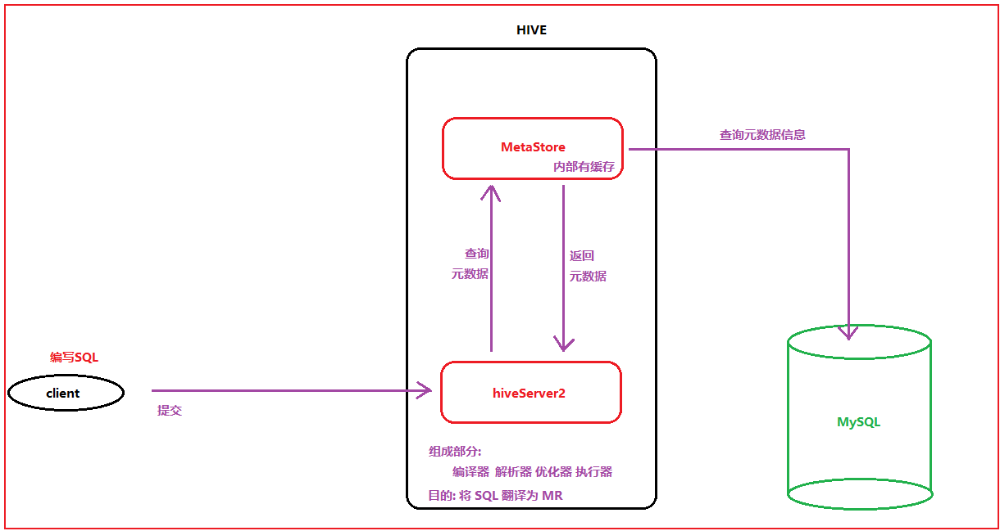

 

### 6.1 集成原理的说明

```properties
	HiveServer2 主要目的: 接收SQL语句, 将SQL进行编译 优化 执行, 将SQL翻译为MR程序, 然后提交给Yarn运行
	MetaStore: 主要是提供了元数据管理服务
	
	Spark On Hive:是为了替换掉Hive的执行引擎, 将原有翻译MR的过程 变更为翻译为Spark RDD程序来运行
	
	所以说: Spark On Hive本质, 就是为了替换掉HiveServer2
	
	一旦替换了HiveServer2. 让Spark 和 Hive的MetaStore进行集成, 基于MetaStore来完成元数据管理服务, 这样不需要我们手动维护schema元数据信息了, 避免维护不统一性, 可以直接读取metastore统一元数据
	
	
	核心目的:  干掉原有HIVE中的HiveServer2, 替换为Spark提供的HiveServer2服务,然后和MetaStore进行整合
	
	对于使用者来说: 为了能够让使用者愿意切换为Spark引擎, Spark在设计这个Spark的HiveServer2的时候, 基本上从使用的角度对用户是无区别的
```

### 6.2 配置说明

* 0 校验:  hive中 hive-site.xml中, 是否有关于metastore的地址配置, 如果没有, 需要新增操作
  * 使用的有N多快照,由学校提供提供统一虚拟机, Hive是安装在node1, 如果是自己安装, 请检查安装在什么位置

```properties
cd /export/server/hive/conf/
vim hive-site.xml 

查看是否有如下配置信息: 如果没有请新增, 如果有保存退出即可
<!-- 远程模式部署metastore metastore地址 -->
<property>
    <name>hive.metastore.uris</name>
    <value>thrift://node1.itcast.cn:9083</value>
</property>
```

* 1- 将hive中hive-site.xml 拷贝到Spark的conf目录下

```properties
cd /export/server/hive/conf/
cp hive-site.xml  /export/server/spark/conf/

校验: 
	cd /export/server/spark/conf/
	ll 查看是否有hive-site.xml
```

* 2- 将MySQL的连接的驱动Jar包拷贝到Spark的jars目录下

```properties
先校验: 在spark的jars目录下是否存在mysql的驱动包
cd /export/server/spark/jars/
ll | grep mysql 

如果能够看到mysql的驱动包, 此步骤略过:  mysql-connector-java-5.x.xx.jar

否则执行: 
cd /export/server/hive/lib/
cp mysql-connector-java-5.1.32.jar /export/server/spark/jars/  # 注意: 不要直接复制, 因为每个人的mysql驱动的jar包的版本可能不一致,导致拷贝不成功, 建议自己尝试写, 通过tab进行提示即可
```

* 3- 启动 Hadoop 和 Hive的metastore服务

```properties
node1执行: start-all.sh   启动hadoop

启动 hive的metastore服务: 
cd /export/server/hive/bin
nohup ./hive --service metastore &

校验:  jps -m
```

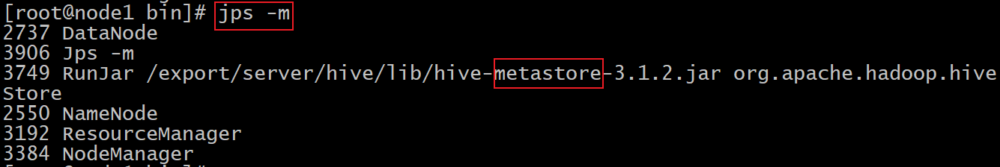

* 4- 测试是否集成成功

```properties
首先: 可以通过spark的bin目录下 提供了一个spark-sql的脚本, 用于进入到spark SQL的编写客户端界面(类似于 ./hive命令)
cd /export/server/spark/bin/
./spark-sql  --master local[*]
```

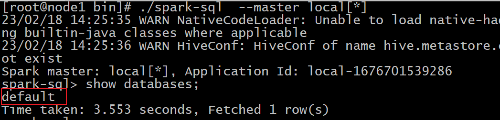

```properties
目前, 无法直接看出是否和Hive的metastore集成成功, 如何解决呢?

解决方案: 
	可以通过 ./hive 进入到hive的客户端, 然后在hive的客户端上, 创建库和表, 以及可以添加数据, 在spark-sql客户端上观察是否可以看得到, 如果可以看到, 那么就说明集成成功了, 当然可以在spark-sql中执行, 在hive的客户端查看是否存在
	
cd /export/server/hive/bin
./hive

执行操作:

hive中执行:
创建库
create database day12_pyspark;
use day12_pyspark;
创建表
create table stu(id int,name string,address string);

添加数据:
insert into table stu values(1,'张三','北京');


查询数据:
select * from stu;
OK
1       张三    北京
3       王五    北京
2       李四    上海
4       赵六    北京

spark客户端执行:
spark-sql> show databases;
day12_pyspark
default

spark-sql> use day12_pyspark;
Time taken: 0.026 seconds
spark-sql> show tables;
day12_pyspark   stu     false

查看数据:
select * from stu;
1       张三    北京

添加数据:
insert into table stu values(2,'李四','上海');
insert into table stu values(3,'王五','北京');
insert into table stu values(4,'赵六','北京');
```

### 6.3 如何在代码中集成HIVE

```properties
核心代码: 
	enableHiveSupport(): 开启和HIVE的整合
	config('hive.metastore.uris','thrift://node1:9083'): 告知给Spark, hive的metastore地址
	config('spark.sql.warehouse.dir','hdfs://node1:8020/user/hive/warehouse'): 可选  指定默认的家目录 此配置一般与HIVE的默认家目录保持一致, 如果不配置, 默认位置本地磁盘, 建议配置
```

代码集成:

```properties
from pyspark import SparkContext, SparkConf
from pyspark.sql import SparkSession
import os

# 锁定远端环境, 确保环境统一
os.environ['SPARK_HOME'] = '/export/server/spark'
os.environ['PYSPARK_PYTHON'] = '/root/anaconda3/bin/python3'
os.environ['PYSPARK_DRIVER_PYTHON'] = '/root/anaconda3/bin/python3'

if __name__ == '__main__':
    print("演示: spark on hive")

    # 1- 创建SparkSession对象
    spark = SparkSession\
        .builder\
        .appName('Spark On Hive')\
        .master('local[*]')\
        .enableHiveSupport()\
        .config('hive.metastore.uris','thrift://node1:9083')\
        .config('spark.sql.warehouse.dir','hdfs://node1:8020/user/hive/warehouse')\
        .config('spark.sql.shuffle.partitions',4)\
        .getOrCreate()

    # 2- 处理数据
    spark.sql("""
        select address,count(1) from day12_pyspark.stu group by address
    """).show()

    df = spark.sql("""
        select * from day12_pyspark.stu
    """)

    df.groupby('address').count().show()
```

## 7. Spark SQL的分布式执行引擎

​	目前, 我们已经完成Spark集成Hive的操作, 但是目前集成后, 如果需要连接Hive, 促使需要启动一个Spark的客户端(代码SparkSession 也可以使用 spark-sql客户端)才可以,这个客户端的底层, 相当于是一个服务端, 用于连接hive的metastore的服务, 进行操作, 并且将SQL转换为spark的RDD程序, 一旦退出这个客户端, 这个服务也就没有了

​	此操作非常类似于在HIVE部署的时候, 有一个本地模式(./hive 在其内部会启动一个hive的hiveserver2)

```properties
大白话: 
	目前在Spark的后台, 并没有一个长期挂载的spark的服务(spark hiveserver2服务),导致每次启动Spark客户端, 都会在内部构建一个服务项, 这种方式, 不合适后续的开发 测试
```


如何启动Spark提供的分布式执行引擎呢?  这个引擎可以理解为Spark的HiveServer2服务(官方: spark的thriftServer)

启动这个服务, 必须要先保证启动好Hadoop 以及 Hive的metastore(**不需要启动 hive的 hiveserver2**)

```properties
cd /export/server/spark/sbin/
./start-thriftserver.sh \
--hiveconf hive.server2.thrift.port=10000 \
--hiveconf hive.server2.thrift.bind.host=node1.itcast.cn \
--hiveconf spark.sql.warehouse.dir=hdfs://node1:8020/user/hive/warehouse \
--master local[*]
```

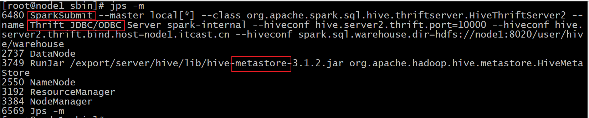

访问界面:  默认 4040

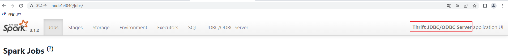


启动后, 可以通过Spark提供的beeline的方式连接这个spark的thrift 服务, 连接后, 直接编写SQL:

```properties
cd /export/server/spark/bin/
./beeline 
输入:
!connect jdbc:hive2://node1:10000
用户名: root
密码: 不需要传入, 直接回车
```

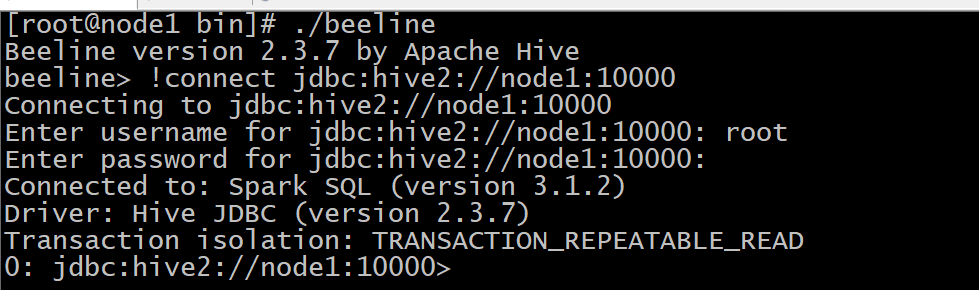

相当于模拟了一个HIVE的客户端, 但是底层执行的Spark SQL , 最终将其转换为Spark RDD程序运行的


方式二: 如果使用datagrip或者 pycharm连接Spark的thrift服务 进行操作:

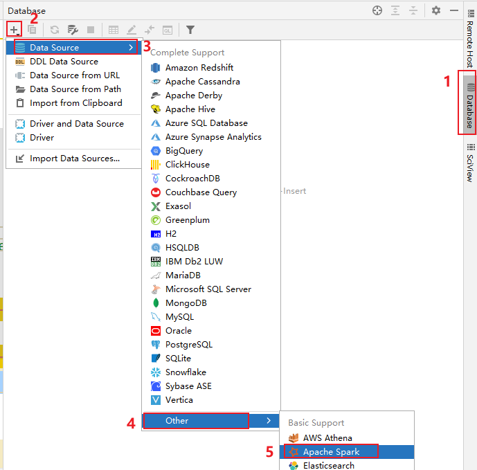

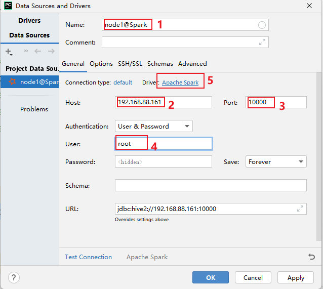

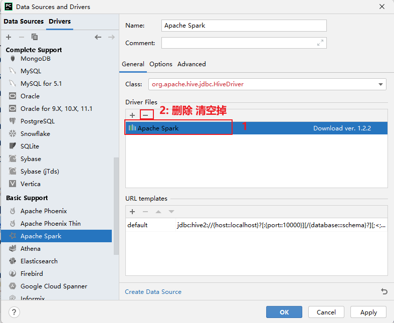

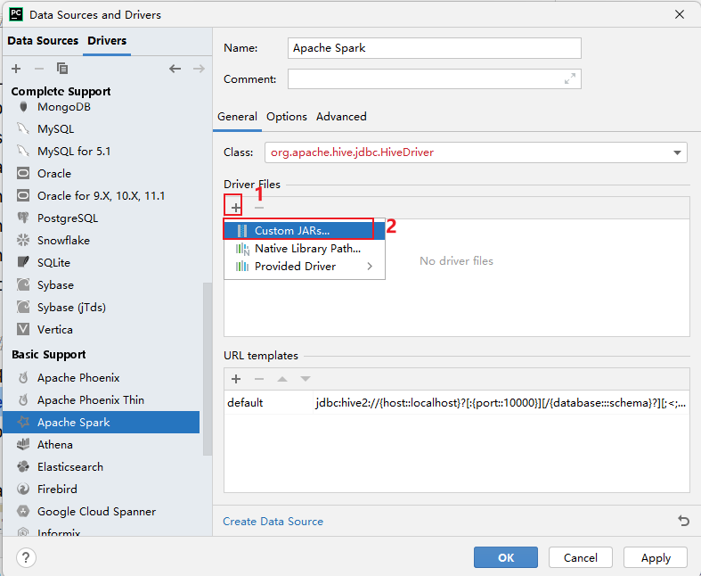

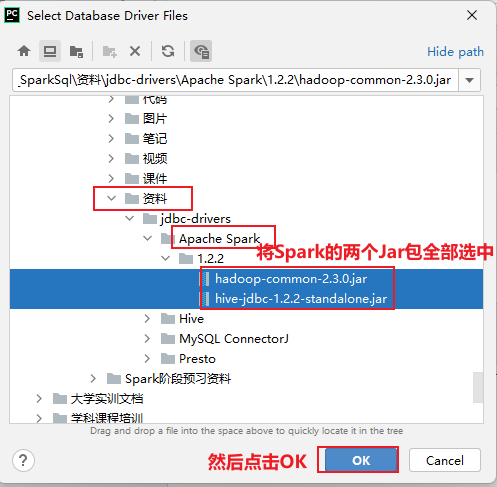

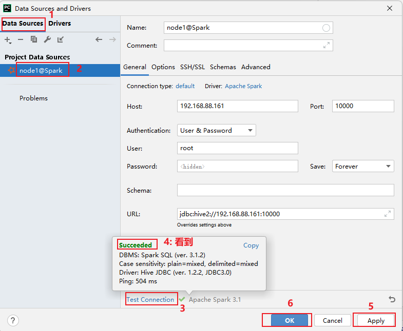

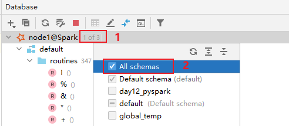


```properties
thrift server服务出现, 只是给我提供了新的方式来书写SQL:   beeline方式 或者 图形化界面方式
	适用于: 纯SQL的开发工作, 开发后, 形成一个个的SQL的脚本, 在部署上线的时候, 采用 spark-sql

最终部署上线, 基于工作流调度的时候: 
	纯SQL脚本可以使用: spark-sql  -f  提交运行
	
	代码方式;  ./spark-submit ....
```


## 8.Spark SQL的运行机制

回顾:  Job的调度流程

```properties
1- Driver程序首先会先创建SparkContext对象, 同时在其底层会创建DAGScheduler 和 TaskScheduler

2- 当Spark程序遇到一个action算子后, 就会触发一个Job任务, 首先通过DAGScheduler形成DAG执行流程图, 划分Stage, 并且确定每个stage中需要运行多少个Task线程, 将每个阶段的Task线程放置到对应的TaskSet的集合中, 最后将各个阶段的TaskSet提交到TaskScheduler

3- TaskScheduler接收到各个阶段的TaskSet后, 然后依次的进行调度执行, 确定每个Task线程需要运行到那个executor(尽量保证负载均衡)

4- 后续Driver负责整个任务进行监控管理即可....
```

​	Spark SQL底层依然是运行的Spark RDD的程序, 所以说Spark RDD程序运行流程, 在Spark SQL中依然是存在的,只不过在这个流程的基础上增加了从SQL翻译为RDD的过程

​	所以: Spark SQL的运行机制, 其实就是在描述如何将Spark SQL翻译为RDD程序

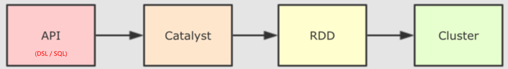

我们说, 整个Spark SQL转换为RDD是基于catalyst优化器实施, 基于这个优化器即可完成整个翻译转换操作


内部catalyst具体的执行流程:

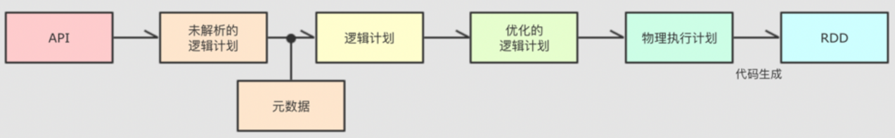

* 大白话: 

```properties
1- 接收客户端提交过来的SQL/DSL, 首先会先校验SQL/DSL的语法是否正确, 如果通过校验, 基于SQL / DSL的执行顺序, 生成一颗抽象语法树(AST)

2- 对AST抽象语法树加入元数据, 确定一种要涉及到那些字段, 字段的类型是什么, 以及涉及表的相关元数据,加入元数据后, 形成一颗优化前的逻辑执行计划

3- 对优化前的逻辑执行计划执行优化操作, 整个优化通过优化器实施的, 在优化器匹配相对应的优化的规则,实施优化, 而优化器提供的上百种的优化手段, 例如 谓词下推  列值裁剪 ... 从而形成最终的优化后逻辑执行计划

4- 由于优化的方案是非常多, 形成了最终的优化后的逻辑执行计划后, 在转换为物理执行计划之前, 需要经过成本模型(代价函数)对其计算进行重新优化判断, 从众多的优化策略中, 选择出一种最优方案, 将其形成物理执行计划

5- 通过物理执行计划匹配Spark SQL提供的RDD代码模块, 底层是基于代码生成器将其转换为最终的RDD程序代码, 然后将其RDD程序提交到集群运行即可

6- 后续整个流程就是基于Job 调度流程 以及交互流程进行运行, 后续部分与RDD是一致的
```

注意: 这套流程, 其实可以理解为 SQL 翻译执行的过程….  较为通用流程


* 专业术语:

```properties
1- sparkSQL底层解析是有RBO 和 CBO优化完成的
2- RBO是基于规则优化, 对于SQL或DSL的语句通过执行引擎得到未执行逻辑计划, 在根据元数据得到逻辑计划, 之后加入列值裁剪或谓词下推等优化手段形成优化的逻辑计划
3- CBO是基于优化的逻辑计划得到多个物理执行计划, 根据代价函数选择出最优的物理执行计划
4- 通过codegenaration代码生成器完成RDD的代码构建
5- 底层依赖于DAGScheduler 和TaskScheduler 完成任务计算执行
```


## 9. Spark SQL综合案例_xls

数据内容: 

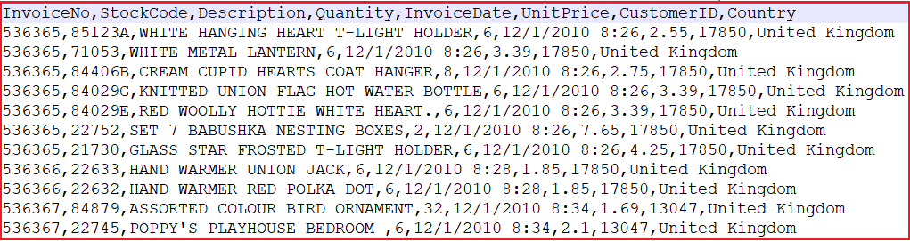

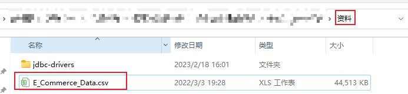

字段说明:

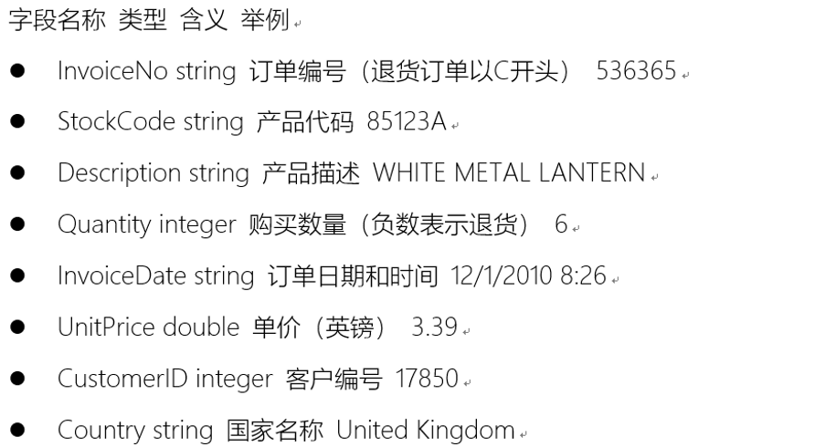

```properties
字段与字段之间的分隔符号为逗号
```

需求说明:

* 清洗需求:

```properties
1- 将客户ID中不为0的数据保留, 为0的数据过滤掉
2- 将商品描述不为空的数据保留, 为空的数据过滤掉
3- 将日期格式转换为 yyyy-MM-dd HH:mm
	原格式:  	
		12/1/2010 8:26  
	转换为: 
		2010-12-01 08:26
```

* 统计需求:

```properties
需求一: 统计各个国家有多少的客户量

需求二: 统计销量最高的10个国家

需求三: 各个国家的总销售额分布情况

需求四:  销售最高的10个商品

需求五:  商品描述的热门关键词TOP300

需求六:  统计退货订单数最多的10个国家

需求七: 商品的平均单价与销售的关系

需求八:  月销售额随时间的变化的趋势

需求九:  日销售随时间的变化趋势

需求十: 各个国家的购买订单量和退货订单量关系
```


### 9.1 完成数据清洗的操作

* 1- 拷贝数据到项目的data目录下, 同时创建一个xls的目录, 便于后续写代码

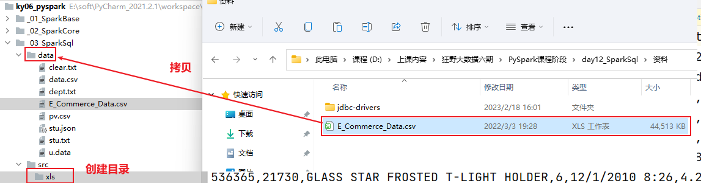

* 2- 创建PY脚本, 编写清洗的代码

```properties
from pyspark import SparkContext, SparkConf
from pyspark.sql import SparkSession
import pyspark.sql.functions as F
import os

# 锁定远端环境, 确保环境统一
os.environ['SPARK_HOME'] = '/export/server/spark'
os.environ['PYSPARK_PYTHON'] = '/root/anaconda3/bin/python3'
os.environ['PYSPARK_DRIVER_PYTHON'] = '/root/anaconda3/bin/python3'

if __name__ == '__main__':
    print("新零售案例实现: 清洗需求")

    # 1. 创建SparkSession对象
    spark = SparkSession\
        .builder\
        .master('local[*]')\
        .appName('xls')\
        .config('spark.sql.shuffle.partitions',4)\
        .getOrCreate()

    # 2- 读取外部文件数据集
    df = spark.read.csv(
        path='file:///export/data/workspace/ky06_pyspark/_03_SparkSql/data/E_Commerce_Data.csv',
        sep=',',
        header=True,
        inferSchema=True
    )
    df.printSchema()
    df.show()


    # 3- 执行处理数据操作:
    # 3.1 将客户ID中不为0的数据保留, 为0的数据过滤掉  以及将商品描述不为空的数据保留, 为空的数据过滤掉
    df = df.where('CustomerID is not null and CustomerID != 0 and Description is not null and Description != ""')

    # 3.2 将日期格式转换为  yyyy-MM-dd HH-mm
    # 日期格式转换: 字符串的日期 --> 时间戳 --> 字符串的日期
    #  字符串日期  --> 时间戳: 时间戳 = unix_timestamp(日期字符串,日期格式)
    # 时间戳   -->  字符串日期 : 日期字符串 = from_unixtime(时间戳, 日期格式)
    df = df.withColumn('InvoiceDate',F.from_unixtime(F.unix_timestamp('InvoiceDate','M/d/yyyy H:mm'),'yyyy-MM-dd HH:mm'))

    # 4- 将清洗后的结果数据, 保存到HDFS上: /xls/output
    df.write.csv(
        path='hdfs://node1:8020/xls/output',
        header=True,
        sep='|',
        encoding='GBK'
    )

    # 5- 释放资源
    spark.stop()


```

### 9.2 指标统计

* 准备工作: 读取数据

```properties
from pyspark import SparkContext, SparkConf
from pyspark.sql import SparkSession
import os

# 锁定远端环境, 确保环境统一
os.environ['SPARK_HOME'] = '/export/server/spark'
os.environ['PYSPARK_PYTHON'] = '/root/anaconda3/bin/python3'
os.environ['PYSPARK_DRIVER_PYTHON'] = '/root/anaconda3/bin/python3'

if __name__ == '__main__':
    print("新零售案例的指标统计工作")

    # 1. 创建SparkSession对象
    spark = SparkSession\
        .builder\
        .master('local[*]')\
        .appName('xls')\
        .config('spark.sql.shuffle.partitions',4)\
        .getOrCreate()

    # 2- 读取外部文件数据
    df = spark.read.csv(
        path='hdfs://node1:8020/xls/output',
        sep='|',
        encoding='GBK',
        header=True,
        inferSchema=True
    )
    df.createTempView('xls_tab')


    df.printSchema()
    df.show()

    # 3- 指标需求实现:

```

* 需求一: 统计各个国家有多少的客户量
  * 大白话: 统计每个国家有多少个客户

```properties
def xuqiu1():
    # SQL
    spark.sql("""
        select
            Country,
            count(distinct CustomerID) as  c_cnt
        from xls_tab group by Country order by c_cnt desc
    """).show()
    # DSL
    df.groupby('Country').agg(
        # 此操作, 如果提示, 不存在此API 或者报错了. 极大可能是node1的pyspark版本并不是3.1.2的
        F.countDistinct('CustomerID').alias('c_cnt')
    ).orderBy('c_cnt', ascending=False).show()
```

* 需求二: 统计销量最高的10个国家
  * 大白话: 统计每个国家的销售的数量, 并取出前10个
* 需求三: 各个国家的总销售额分布情况
  * 大白话: 统计每个国家的销售额(购买数量 * 单价)

* 需求四:  销售最高的10个商品
  * 大白话: 统计每个商品销售的数量, 并且取出前10个

* 需求五:  商品描述的热门关键词TOP300
  * 大白话: 统计每个关键词出现了多少次,取出前300个

```properties
def xuqiu_5():
    # SQL
    spark.sql("""
        select 
            words,
            count(1) as  w_cnt
        from xls_tab lateral view explode(split(Description,' ')) t2 as  words
        group by words order by w_cnt desc limit 300
    """).show()
    # DSL
    df \
        .withColumn('words', F.explode(F.split('Description', ' '))) \
        .groupby('words').agg(
        F.count('words').alias('w_cnt')
    ).orderBy('w_cnt', ascending=False).limit(300).show()
```


* 需求六:  统计退货订单数最多的10个国家
  * 大白话:  统计每个国家的退货的订单数量, 取出前10个

```properties
select
	Country,
	count(1) as o_cnt
from  xls_tab where InvoiceNo like 'C%'
group by Country order by o_cnt desc limit10;
```

* 需求七: 商品的平均单价与销售的关系
  * 大白话: 统计每个商品的平均单价以及销售的数量

```properties

```

* 需求八:  月销售额随时间的变化的趋势
  * 大白话: 统计每个月的销售额(购买数量 * 购买单价)

```properties
def xuqiu_8():
    # SQL
    spark.sql("""
        select
            substr(InvoiceDate,1,7) as month,
            round(sum(Quantity * UnitPrice),2) as total_price
        
        from xls_tab where InvoiceNo not like 'C%'
        group by substr(InvoiceDate,1,7) order by month
    """).show()
    # DSL
    df.where("InvoiceNo not like 'C%'").groupby(F.substring('InvoiceDate', 1, 7).alias('month')).agg(
        F.round(F.sum(F.col('Quantity') * F.col('UnitPrice')), 2).alias('total_price')
    ).orderBy('month').show()
```

* 需求九:  日销售随时间的变化趋势
  * 大白话:  统计每天的销售数量和销售额

* 需求十: 各个国家的购买订单量和退货订单量关系
  * 大白话: 统计每个国家的订单量 和 退货的订单量

```properties
def xuqiu_10():
    # SQL
    spark.sql("""
        select
            Country,
            count(distinct InvoiceNo) as o_cnt,
            count( DISTINCT 
                if(InvoiceNo like 'C%',InvoiceNo,NULL)
            ) as  t_cnt
        from xls_tab group by Country
    """).show()
    # DSL
    df.groupby('Country').agg(
        F.countDistinct('InvoiceNo').alias('o_cnt'),
        F.countDistinct(
            F.expr("if(InvoiceNo like 'C%',InvoiceNo,NULL)")
        ).alias('t_cnt')
    ).show()
```

