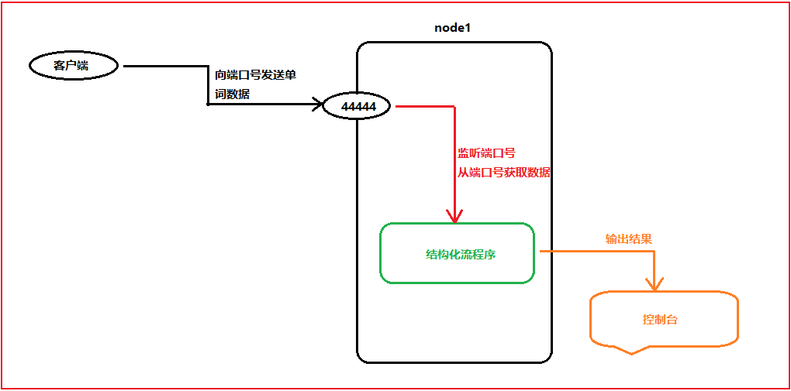
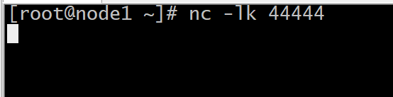
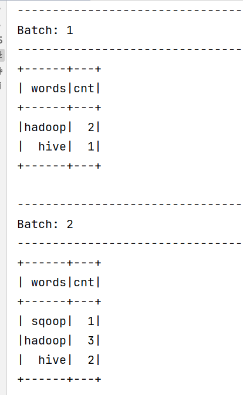
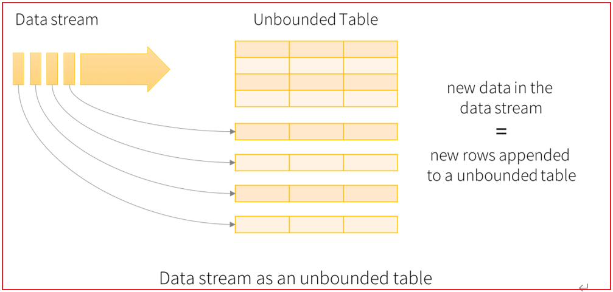
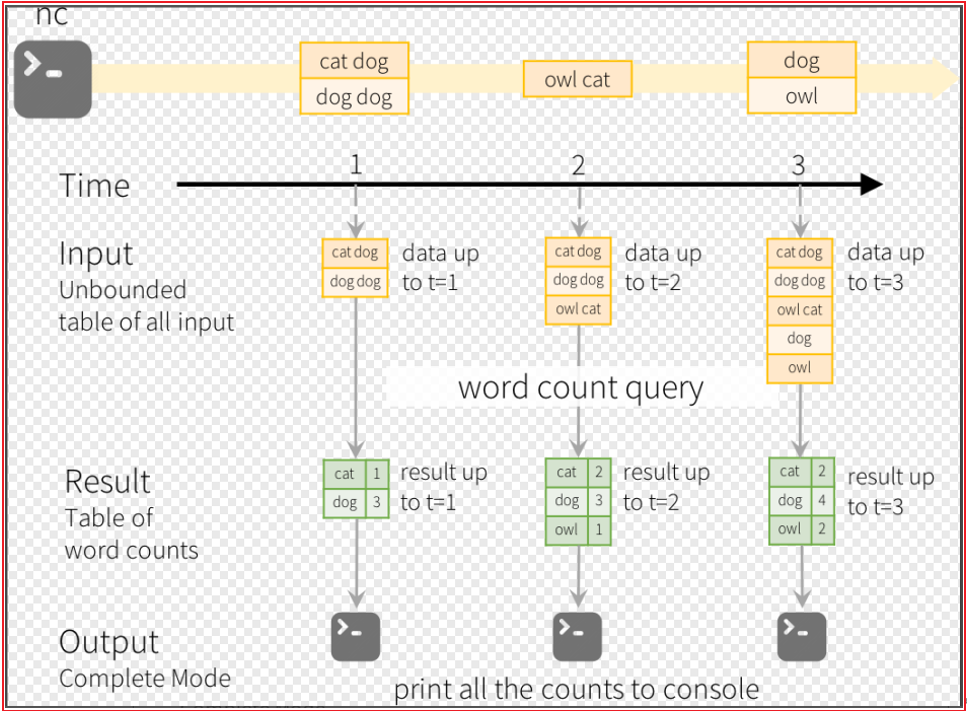
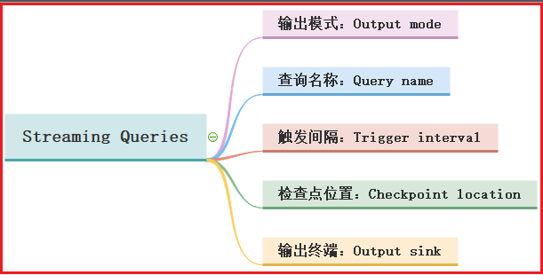
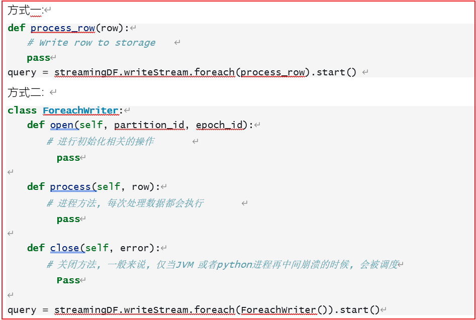
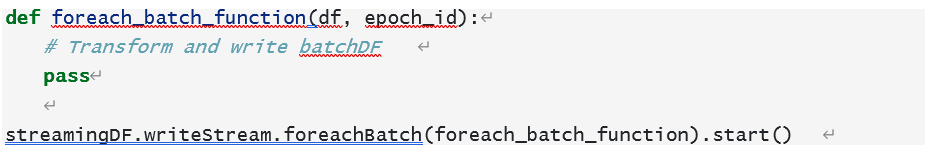
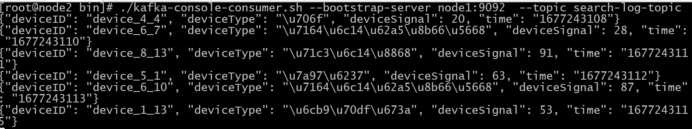

# day15_Spark结构化流课程笔记

今日内容:

* 1- 数据如何写入到Kafka
* 2- 物联网的分析案例

## 1. 有界数据和无界数据

* 有界数据:

```properties
概念: 指的数据有固定的开始 和 固定的结束, 我们将这类数据称为有界数据 (明确数据范围)

对于这种有界的数据来说, 由于数据大小是固定的, 我们对这样的数据进行统计计算的时候, 一般采用批处理方案(离线处理)

数据特点: 
	1- 数据大小都是固定的
	2- 程序处理数据, 一定会结束
```

* 无界数据:

```properties
概念: 指的数据有固定的开始, 但是无法明确结束的位置, 我们将这样的数据集称为无界数据(没有明确的结束)

表示: 数据是源源不断的来, 我们需要源源不断的计算, 来一条处理一条, 程序也不会停止,我们将这样的处理数据模型称为流式的处理方案

数据特点: 
	1- 数据没有明确的结束
	2- 数据是源源不断的来
	3- 程序不会停止, 需要持续不断的计算
```

## 2. 结构化流的基本介绍

​	结构化流是构建在Spark SQL处理引擎之上的一个流式的处理引擎, 主要是针对无界数据的处理操作. 对于结构化流同样也支持多种语言的操作API: Java  Python  Scala  R …

​	Spark的核心是RDD, RDD出现主要目的就是为了提供更加高效的离线迭代计算操作, RDD是针对的有界的数据集,但是为了能够兼容实时计算的处理场景, 提供微批处理模式. 本质上依然还是批处理, 只不过批与批之间的处理间隔时间变短了, 让我们感觉是在进行流式的计算操作. 目前默认的微批可以达到100毫米一次

​	真正的流处理引擎: Flink  Kafka  Storm(早期流处理引擎) Flume(流式数据采集)


## 3. 结构化流的入门案例

需求: 实时的WordCount案例



代码实现:

```properties
from pyspark import SparkContext, SparkConf
from pyspark.sql import SparkSession
import pyspark.sql.functions as F
import os

# 锁定远端环境, 确保环境统一
os.environ['SPARK_HOME'] = '/export/server/spark'
os.environ['PYSPARK_PYTHON'] = '/root/anaconda3/bin/python3'
os.environ['PYSPARK_DRIVER_PYTHON'] = '/root/anaconda3/bin/python3'

if __name__ == '__main__':
    print("结构化流的入门案例:")

    # 1- 创建SparkSession对象
    spark = SparkSession\
        .builder\
        .appName('streaming_init')\
        .master('local[*]')\
        .config('spark.sql.shuffle.partitions',4)\
        .getOrCreate()

    # 2- 对接数据源: 从端口号中获取消息数据(node1的端口号: 44444): df 为无界df
    df = spark.readStream\
        .format('socket')\
        .option('host','node1')\
        .option('port',44444)\
        .load()


    # 3- 处理数据
    df_res = df.withColumn('words',F.explode(F.split('value',' '))).groupby('words').agg(
        F.count('words').alias('cnt')
    )

    # 4- 输出结果
    df_res.writeStream.format('console').outputMode('complete').start().awaitTermination()
```


代码测试操作:

```properties
1- 在 node1打开对应的端口号

	第一步 先下载一个 nc 命令, 通过此命令打开一个端口号, 并且可以通过这个命令向端口号写入数据
	yum -y install nc
	
	执行nc命令, 开启端口号, 写入数据: 
	nc -lk 44444
	
注意: 启动后, 不要着急输入内容, 将程序启动后,再进行输入操作 , 同样也不要在没有开启端口号的情况下直接启动程序

2- 启动Spark的结构化流程序


3- 输入内容, 观察输出结果
```



展示效果:



## 4. 结构化流的编程模型

编程模型



在结构化流中, 我们可以将DF称为无界的DF 或者 无界的表


可以将程序分为三大部分: **输入源** 处理数据  **输出源**



```properties
说明: 
	整个计算的操作, 是一个不断的流式处理的过程, 数据是源源不断的来, 程序也需要源源不断处理数据, 并将处理后的结果实时的进行输出操作, 整个结构化流中, 认为表就是一个无界表(数据源源不断的增加), 而我们这个结构化的表也可以表示无界的DF
```


### 4.1 数据源部分(Source)

结构化流默认提供多种数据源, 从而支持不同的数据源的处理工作, 目前默认提供以下四种数据源:

* 1- File Source: 文件源 一般主要在测试中
  * 作用: 对接文件数据, 监听某个目录下所有的文件, 一旦有了新的文件, 就会立即进行处理操作
* 2- Kafka Source: kakfa的数据源
  * 作用: 对接Kafka 相当于是Kafka的消费者, 从Kafka中获取数据
* 3- Socket Source: 对接网络的数据源 测试
  * 作用: 可以用于监听某个节点上某个端口号的相关数据内容
* 4- Rate Source: 速率源 测试
  * 作用: 可以实现自动生成数据, 主要适用于做一些基准测试工作


#### 4.1.1 File Source

文件数据源,  主要是用于监控某一个目录下的所有的文件, 支持读取方案: CSV  JSON  PARQUET TEXT ORC .....


相关的参数:

| option参数         | 描述说明                                                     |
| ------------------ | ------------------------------------------------------------ |
| maxFilesPerTrigger | 每次触发时要考虑的最大新文件数 (默认: no max)                |
| latestFirst        | 是否先处理最新的新文件, 当有大量文件积压时有用 (默认: false) |
| fileNameOnly       | 是否检查新文件只有文件名而不是完整路径（默认值：false）将此设置为 `true` 时，以下文件将被视为同一个文件，因为它们的文件名“dataset.txt”相同： “file:///dataset.txt” “s3://a/dataset.txt " "s3n://a/b/dataset.txt" "s3a://a/b/c/dataset.txt" |

读取代码格式:

```properties
spark.readStream
	.format('CSV|JSON|PARQUET|ORC....')\
	.option('参数名','参数值')\
	.option('参数名','参数值')\
	.schema(schema=xxxx)\
	.load('监控的目录地址')
```

代码操作:

```properties
from pyspark import SparkContext, SparkConf
from pyspark.sql import SparkSession
import os

# 锁定远端环境, 确保环境统一
os.environ['SPARK_HOME'] = '/export/server/spark'
os.environ['PYSPARK_PYTHON'] = '/root/anaconda3/bin/python3'
os.environ['PYSPARK_DRIVER_PYTHON'] = '/root/anaconda3/bin/python3'

if __name__ == '__main__':
    print("演示结构化流的文件数据源")

    # 1- 创建SparkSession镀锡
    spark = SparkSession.builder\
        .appName('file_source')\
        .master('local[*]')\
        .config('spark.sql.shuffle.partitions',4)\
        .getOrCreate()

    # 2- 读取外部数据源:
    # 注意: 不允许直接写文件名, 必须为一个目录
    df = spark.readStream\
        .format('csv')\
        .option('header',True)\
        .option('inferSchema',True)\
        .option('sep',' ')\
        .schema(schema='id int,name string,sex string,address string')\
        .load(path = 'file:///export/data/workspace/ky06_pyspark/_04_StructuredStreaming/data/*.csv')

    # 3- 处理数据: 暂不做任何的处理

    # 4- 输出打印:
    df.writeStream.format('console').outputMode('append').start().awaitTermination()
```

说明:

```properties
在使用文件数据源的时候, path路径必须为一个目录, 否则会直接报错, 但是可以通过通配符的方式, 实现对目录下某些符合条件的文件数据进行读取

文件数据源会不断的监听这个目录, 当目录下有一个新的可以匹配的上文件, 就会立即进行读取处理操作, 读取过的文件, 就不会在进行读取了
```


#### 4.1.2 Rate Source

​	速率源, 此数据源主要是用于进行基准测试使用, 配置此数据源后, 会自动的生成数据, 同时也可以设置生成的速率, 结果会产生两列数据: 一列为时间戳  另一列为自增的数字

| option参数    | 描述说明                                                     |
| ------------- | ------------------------------------------------------------ |
| rowsPerSecond | 每秒应该生成多少行 : （例如 100，默认值：1）                 |
| rampUpTime    | 在生成速度变为rowsPerSecond之前应该经过多久的加速时间（例如5s，默认0） |
| numPartitions | 生成行的分区号: （例如 10，默认值：Spark 的默认并行度）      |

读取代码的格式:

```properties
spark.readStream.format('rate')\
	.option('参数名','参数值')\
	.option('参数名','参数值')\
	.option('参数名','参数值')\
	.schema(schema=xxx)\
	.load()
```

代码测试:

```properties
from pyspark import SparkContext, SparkConf
from pyspark.sql import SparkSession
import os

# 锁定远端环境, 确保环境统一
os.environ['SPARK_HOME'] = '/export/server/spark'
os.environ['PYSPARK_PYTHON'] = '/root/anaconda3/bin/python3'
os.environ['PYSPARK_DRIVER_PYTHON'] = '/root/anaconda3/bin/python3'

if __name__ == '__main__':
    print("RateSource源")
    # 1- 创建SparkSession镀锡
    spark = SparkSession.builder \
        .appName('file_source') \
        .master('local[*]') \
        .config('spark.sql.shuffle.partitions', 4) \
        .getOrCreate()

    # 2- 设置速率源
    df = spark.readStream\
        .format('rate')\
        .option('rowsPerSecond',10)\
        .option('rampUpTime',5)\
        .option('numPartitions',3)\
        .load()

    # 3- 处理数据: 暂不做任何的处理

    # 4- 输出打印:
    df.writeStream.format('console').outputMode('append').start().awaitTermination()

```


### 4.2 operations:操作

​	此操作指的就是数据处理的内容, 此查找与Spark SQL是完全一致的, 可以使用DSL方案, 也可以使用SQL方案

### 4.3 Sink(输出)操作

在结构化流中定义好df 或者 处理好df后, 调用 writeStream  完成数据写出操作, 在写出的过程中, 同样也可以设置一些相关的属性, 启动流式应用运行



#### 4.3.1 输出模式

​	在进行输出的时候, 必须通过outPutMode来设置输出方案, 输出模式共提供三种输出模式

* 1- append 模式: 增量模式
  * 指的: 当流处理管道中, 有了新的数据后,才会触发输出, 而且Append模式仅支持追加, 不支持聚合操作, 如果执行聚合会直接报错,同时不支持排序操作. 如果存在排序, 也会直接报错
* 2- complete模式: 完全(全量)模式
  * 指的: 每一次都是针对整个所有批次数据进行处理, 由于数据会越来越多, 要求必须对数据进行聚合操作, 否则会直接报错
* 3- update模式: 更新模式
  * 指的: 当处理模式中没有聚合操作的时候, 此模式与append基本是一致的, 但是如果有了聚合操作, 仅输出变更和新增的数据, 但是不支持排序操作

----

演示: append 模式

```properties
from pyspark import SparkContext, SparkConf
from pyspark.sql import SparkSession
import pyspark.sql.functions as F
import os

# 锁定远端环境, 确保环境统一
os.environ['SPARK_HOME'] = '/export/server/spark'
os.environ['PYSPARK_PYTHON'] = '/root/anaconda3/bin/python3'
os.environ['PYSPARK_DRIVER_PYTHON'] = '/root/anaconda3/bin/python3'

if __name__ == '__main__':
    print("演示输出模式: append")

    # 1- 创建SparkSession镀锡
    spark = SparkSession.builder \
        .appName('file_source') \
        .master('local[*]') \
        .config('spark.sql.shuffle.partitions', 4) \
        .getOrCreate()

    # 2- 读取外部数据源: 监听某一个端口号
    df = spark.readStream \
        .format('socket') \
        .option('host', 'node1') \
        .option('port', 44444) \
        .load()


    # 3- 执行相关的操作
    # df_res = df.withColumn('words', F.explode(F.split('value', ' '))).groupby('words').agg(
    #     F.count('words').alias('cnt')
    # )

    df_res = df.withColumn('words', F.explode(F.split('value', ' ')))
    # 4- 输出结果
    df_res.writeStream.format('console').outputMode('append').start().awaitTermination()

```

说明: 当有了聚合计算操作后, 会直接报出如下的错误:

```properties
Append output mode not supported when there are streaming aggregations on streaming DataFrames/DataSets without watermark;

当流式数据帧/数据集上存在无水印的流式聚合时，不支持追加输出模式；

简单理解: 在append模式中, 不支持直接聚合操作
```

说明: 在执行排序操作后, 会直接报出以下错误:

```properties
Sorting is not supported on streaming DataFrames/Datasets, unless it is on aggregated DataFrame/Dataset in Complete output mode;

流式数据帧/数据集不支持排序，除非在完全输出模式下对聚合数据帧/数据库进行排序；
```


演示complete模式:

```properties
from pyspark import SparkContext, SparkConf
from pyspark.sql import SparkSession
import pyspark.sql.functions as F
import os

# 锁定远端环境, 确保环境统一
os.environ['SPARK_HOME'] = '/export/server/spark'
os.environ['PYSPARK_PYTHON'] = '/root/anaconda3/bin/python3'
os.environ['PYSPARK_DRIVER_PYTHON'] = '/root/anaconda3/bin/python3'

if __name__ == '__main__':
    print("演示输出模式: complete")

    # 1- 创建SparkSession镀锡
    spark = SparkSession.builder \
        .appName('file_source') \
        .master('local[*]') \
        .config('spark.sql.shuffle.partitions', 4) \
        .getOrCreate()

    # 2- 读取外部数据源: 监听某一个端口号
    df = spark.readStream \
        .format('socket') \
        .option('host', 'node1') \
        .option('port', 44444) \
        .load()


    # 3- 执行相关的操作
    df_res = df.withColumn('words', F.explode(F.split('value', ' '))).groupby('words').agg(
        F.count('words').alias('cnt')
    ).orderBy('cnt',ascending=False)

    #df_res = df.withColumn('words', F.explode(F.split('value', ' ')))
    # 4- 输出结果
    df_res.writeStream.format('console').outputMode('complete').start().awaitTermination()

```

说明: 当没有聚合操作的时候, 会报出如下的错误:

```properties
Complete output mode not supported when there are no streaming aggregations on streaming DataFrames/Datasets;

当流数据帧/数据集上没有流聚合时，不支持完全输出模式；


```

完全模式下, 支持对数据进行排序操作


演示: update模式

```properties
from pyspark import SparkContext, SparkConf
from pyspark.sql import SparkSession
import pyspark.sql.functions as F
import os

# 锁定远端环境, 确保环境统一
os.environ['SPARK_HOME'] = '/export/server/spark'
os.environ['PYSPARK_PYTHON'] = '/root/anaconda3/bin/python3'
os.environ['PYSPARK_DRIVER_PYTHON'] = '/root/anaconda3/bin/python3'

if __name__ == '__main__':
    print("演示输出模式: update")

    # 1- 创建SparkSession镀锡
    spark = SparkSession.builder \
        .appName('file_source') \
        .master('local[*]') \
        .config('spark.sql.shuffle.partitions', 4) \
        .getOrCreate()

    # 2- 读取外部数据源: 监听某一个端口号
    df = spark.readStream \
        .format('socket') \
        .option('host', 'node1') \
        .option('port', 44444) \
        .load()


    # 3- 执行相关的操作
    df_res = df.withColumn('words', F.explode(F.split('value', ' '))).groupby('words').agg(
        F.count('words').alias('cnt')
    )

    #df_res = df.withColumn('words', F.explode(F.split('value', ' ')))
    # 4- 输出结果
    df_res.writeStream.format('console').outputMode('update').start().awaitTermination()

```

说明: 当对数据进行排序操作的时候, 会直接报出如下的错误:

```properties
Sorting is not supported on streaming DataFrames/Datasets, unless it is on aggregated DataFrame/Dataset in Complete output mode;

流式数据帧/数据集不支持排序，除非在完全输出模式下对聚合数据帧/数据库进行排序；
```


#### 4.3.2 输出终端/位置

默认情况下, Spark的结构化流支持多种输出的方案:

```properties
1- console sink: 将结果输出到控制台, 主要是应用测试中 支持三种方式

2- File Sink: 文件接收器, 将结果输出到某个目录下, 形成文件数据, 仅支持追加方式

3- foreach Sink  或  froeachBatch Sink :  将数据进行遍历处理, 遍历后输出到任何位置 三种方式均支持

4- MemMory Sink:  将结果输出到内存中, 主要目的是进行再次迭代计算, 数据集不能过大, 仅支持append 和 complete模式

5- Kafka  sink  将结果输出到Kafka 类似是Kafka的生产者  三种模式都支持

```

* File Sink相关的操作

```properties
from pyspark import SparkContext, SparkConf
from pyspark.sql import SparkSession
import pyspark.sql.functions as F
import os

# 锁定远端环境, 确保环境统一
os.environ['SPARK_HOME'] = '/export/server/spark'
os.environ['PYSPARK_PYTHON'] = '/root/anaconda3/bin/python3'
os.environ['PYSPARK_DRIVER_PYTHON'] = '/root/anaconda3/bin/python3'

if __name__ == '__main__':
    print("演示File Sink")

    # 1- 创建SparkSession镀锡
    spark = SparkSession.builder \
        .appName('file_source') \
        .master('local[*]') \
        .config('spark.sql.shuffle.partitions', 4) \
        .getOrCreate()

    # 2- 读取外部数据源: 监听某一个端口号
    df = spark.readStream \
        .format('socket') \
        .option('host', 'node1') \
        .option('port', 44444) \
        .load()

    # 3- 执行相关的操作
    # df_res = df.withColumn('words', F.explode(F.split('value', ' '))).groupby('words').agg(
    #     F.count('words').alias('cnt')
    # )

    df_res = df.withColumn('words', F.explode(F.split('value', ' ')))

    df_res.writeStream\
        .format('csv')\
        .outputMode('append')\
        .option('header',True)\
        .option('sep','\001')\
        .option('checkpointLocation','/StructuredStreaming/chk')\
        .start(path='hdfs://node1:8020/StructuredStreaming/output1')\
        .awaitTermination()
```

说明:

```properties
文件输出方案: 
	一个批次对应一个文件, 有多少个批次, 就会产生多少个文件
```

可以通过设置触发器, 调整每一批次产生间隔时间

```properties
from pyspark import SparkContext, SparkConf
from pyspark.sql import SparkSession
import pyspark.sql.functions as F
import os

# 锁定远端环境, 确保环境统一
os.environ['SPARK_HOME'] = '/export/server/spark'
os.environ['PYSPARK_PYTHON'] = '/root/anaconda3/bin/python3'
os.environ['PYSPARK_DRIVER_PYTHON'] = '/root/anaconda3/bin/python3'

if __name__ == '__main__':
    print("演示File Sink  含有触发器")

    # 1- 创建SparkSession镀锡
    spark = SparkSession.builder \
        .appName('file_source') \
        .master('local[*]') \
        .config('spark.sql.shuffle.partitions', 4) \
        .getOrCreate()

    # 2- 读取外部数据源: 监听某一个端口号
    df = spark.readStream \
        .format('rate') \
        .option('rowsPerSecond', 1) \
        .option('rampUpTime', 0) \
        .option('numPartitions', 1) \
        .load()

    # 3- 执行相关的操作
    # df_res = df.withColumn('words', F.explode(F.split('value', ' '))).groupby('words').agg(
    #     F.count('words').alias('cnt')
    # )

    #df_res = df.withColumn('words', F.explode(F.split('value', ' ')))

    df.writeStream\
        .format('csv')\
        .outputMode('append')\
        .option('header',True)\
        .option('sep','\001')\
        .option('checkpointLocation','/StructuredStreaming/chk')\
        .trigger(processingTime='5 seconds')\
        .start(path='hdfs://node1:8020/StructuredStreaming/output1')

    df.writeStream \
        .format('console') \
        .outputMode('append') \
        .trigger(processingTime='5 seconds') \
        .start() \
        .awaitTermination()
```


* foreach sink  和 foreachBatch Sink:  允许对输出的数据进行任意的处理操作, 由用户自定义处理逻辑

  * foreach sink:  对输出的数据, 一个个进行处理操作
    * 使用方式主要有二种

  

  第一组方式

  ```properties
  from pyspark import SparkContext, SparkConf
  from pyspark.sql import SparkSession
  import pyspark.sql.functions as F
  import os
  
  # 锁定远端环境, 确保环境统一
  os.environ['SPARK_HOME'] = '/export/server/spark'
  os.environ['PYSPARK_PYTHON'] = '/root/anaconda3/bin/python3'
  os.environ['PYSPARK_DRIVER_PYTHON'] = '/root/anaconda3/bin/python3'
  
  if __name__ == '__main__':
      print("演示foreach sink的相关操作")
  
      # 1- 创建SparkSession镀锡
      spark = SparkSession.builder \
          .appName('file_source') \
          .master('local[*]') \
          .config('spark.sql.shuffle.partitions', 4) \
          .getOrCreate()
  
      # 2- 读取外部数据源: 监听某一个端口号
      df = spark.readStream \
          .format('socket') \
          .option('host', 'node1') \
          .option('port', 44444) \
          .load()
  
      df.createTempView('t1')
  
      # 3- 处理数据
      df_res = spark.sql("""
          select
              split(value,'-')[0] as name,
              split(value,'-')[1] as address
          from t1
      """)
  
  
      # 4- 输出操作
      def process_row(row):
          print(f'{row.name},{row.address}')
  
      df_res.writeStream\
          .foreach(process_row)\
          .outputMode('append')\
          .trigger(processingTime='10 seconds')\
          .start()\
          .awaitTermination()
  
  
  ```

  第二组方式:

  ```properties
  from pyspark import SparkContext, SparkConf
  from pyspark.sql import SparkSession
  import pyspark.sql.functions as F
  import os
  
  # 锁定远端环境, 确保环境统一
  os.environ['SPARK_HOME'] = '/export/server/spark'
  os.environ['PYSPARK_PYTHON'] = '/root/anaconda3/bin/python3'
  os.environ['PYSPARK_DRIVER_PYTHON'] = '/root/anaconda3/bin/python3'
  
  """
      说明: 
          open: 每一批次每个分区调用一次, 初始化的方法, 当初始化成功, 才能执行process方法, 否则无法执行, 返回True/False 默认为False
              参数1: 表示 分区号
              参数2: 表示 第几批
          process: 针对每一行的数据,当初始化成功后, 每一批的分区上的每一个数据都会触发执行一次
          
          close:  关闭的方法, 每一批次每个分区调用一次, 当这一批次分区中数据处理完成后或者 初始化不成功会执行close方法,
              主要是用于资源关闭处理工作以及日志记录工作
  
  """
  
  class ForeachWriter:
      def open(self,partition_id, epoch_id):
          print(f'open方法正在执行, 正在初始化; {partition_id},{epoch_id}')
          return True
  
      def process(self, row):
          print(f'process方法执行: {row.name},{row.address}')
  
  
      def close(self, error):
          print('释放资源')
  
  
  if __name__ == '__main__':
      print("演示foreach sink的相关操作")
  
      # 1- 创建SparkSession镀锡
      spark = SparkSession.builder \
          .appName('file_source') \
          .master('local[1]') \
          .config('spark.sql.shuffle.partitions', 4) \
          .getOrCreate()
  
      # 2- 读取外部数据源: 监听某一个端口号
      df = spark.readStream \
          .format('socket') \
          .option('host', 'node1') \
          .option('port', 44444) \
          .load()
  
      df.createTempView('t1')
  
      # 3- 处理数据
      df_res = spark.sql("""
          select
              split(value,'-')[0] as name,
              split(value,'-')[1] as address
          from t1
      """)
  
  
      # 4- 输出操作
  
      df_res.writeStream\
          .foreach(ForeachWriter())\
          .outputMode('append')\
          .trigger(processingTime='10 seconds')\
          .start()\
          .awaitTermination()
  
  ```

  foreachBatch Sink: 对输出的数据, 进行一批一批的处理操作

  

  ```properties
  from pyspark import SparkContext, SparkConf
  from pyspark.sql import SparkSession
  import pyspark.sql.functions as F
  import os
  
  # 锁定远端环境, 确保环境统一
  os.environ['SPARK_HOME'] = '/export/server/spark'
  os.environ['PYSPARK_PYTHON'] = '/root/anaconda3/bin/python3'
  os.environ['PYSPARK_DRIVER_PYTHON'] = '/root/anaconda3/bin/python3'
  
  
  if __name__ == '__main__':
      print("演示foreach sink的相关操作")
  
      # 1- 创建SparkSession镀锡
      spark = SparkSession.builder \
          .appName('file_source') \
          .master('local[1]') \
          .config('spark.sql.shuffle.partitions', 4) \
          .getOrCreate()
  
      # 2- 读取外部数据源: 监听某一个端口号
      df = spark.readStream \
          .format('socket') \
          .option('host', 'node1') \
          .option('port', 44444) \
          .load()
  
      df.createTempView('t1')
  
      # 3- 处理数据
      df_res = spark.sql("""
          select
              split(value,'-')[0] as name,
              split(value,'-')[1] as address
          from t1
      """)
  
  
      # 4- 输出操作
      def foreachBatch(df,batch_id):
          # 注意: 参数1的df是一个有界的df, 因为是一批数据, 一批数据有开始和结束范围的  参数2: 批编号
          print(f'第{batch_id}批数据..')
          df.show()
  
  
      df_res.writeStream\
          .foreachBatch(foreachBatch)\
          .outputMode('append')\
          .trigger(processingTime='10 seconds')\
          .start()\
          .awaitTermination()
  
  
  ```

* memory sink: 内存输出  基于内存的数据进行二次迭代计算

```properties
import time

from pyspark import SparkContext, SparkConf
from pyspark.sql import SparkSession
import pyspark.sql.functions as F
import os

# 锁定远端环境, 确保环境统一
os.environ['SPARK_HOME'] = '/export/server/spark'
os.environ['PYSPARK_PYTHON'] = '/root/anaconda3/bin/python3'
os.environ['PYSPARK_DRIVER_PYTHON'] = '/root/anaconda3/bin/python3'


if __name__ == '__main__':
    print("演示memory sink的相关操作")

    # 1- 创建SparkSession镀锡
    spark = SparkSession.builder \
        .appName('file_source') \
        .master('local[1]') \
        .config('spark.sql.shuffle.partitions', 4) \
        .getOrCreate()

    # 2- 读取外部数据源: 监听某一个端口号
    df = spark.readStream \
        .format('socket') \
        .option('host', 'node1') \
        .option('port', 44444) \
        .load()

    df.createTempView('t1')

    # 3- 处理数据
    df_res = spark.sql("""
        select
            split(value,'-')[0] as name,
            split(value,'-')[1] as address
        from t1
    """)


    # 4- 输出操作
    df_res.writeStream\
        .format('memory')\
        .queryName('t2')\
        .outputMode('append')\
        .trigger(processingTime='10 seconds')\
        .start()


    # 后续: 可以对实时数据集的结果 进行二次迭代
    # 此处迭代是针对上述的结果进行批处理  针对当前内存的数据进行处理
    while True:
        spark.sql("""
            select  count(1) as cnt  from  t2
        """).show()
        # 每隔5s 统计一次内存中的数据
        time.sleep(5)
```


#### 4.3.3 设置触发器Trigger

​		触发器Trigger:   决定多久执行一次查询并输出结果

```properties
	Spark的结构化流, 并不是真正意义上实时处理, 是一种微批, Spark 会尽量让这个批次更快, 从而降低延迟性, 提高实时处理性能
	
	触发器: 在结构化流中, 处理完成一批数据后, 等待一会, 在处理下一批数据即可
```

Spark的结构化流主要提供了有那些触发器呢?

- 1- 默认方案:  由Spark 自动决策每一批次的大小, 在运行过程中, 尽可能让每一批次间隔时间变得更短, 提高处理的延迟性问题 (常用)

```properties
df.writeStream
	.format('console')\
	.outputMode('update')\
	.start()\
	.awaitTermination()
```

- 2- 以固定的时间间隔: 在Spark运行的过程中, 当一批数据处理完成后, 下一批数据需要等待固定时间后, 才能进行处理操作 (常用)

```properties
df.writeStream \
  .format("console") \
  .trigger(processingTime='2 seconds') \
  .start()
 
说明:
	1: 如果前一个微批处理在间隔内完成，则引擎将等待间隔结束，然后再启动下一个微批处理。
	2: 如果前一个微批处理的完成时间比间隔时间长（即如果错过了一个间隔边界），那么下一个微批处理将在前一个完成后立即开始（即它不会等待下一个间隔边界）。
	3: 如果没有新数据可用，则不会启动微批处理。
```

- 3- 仅此一次: 在运行的过程中, 程序只需要执行一次, 然后就退出了, 适用于初始化, 以及关闭资源 这类仅需执行一次操作

```properties
df.writeStream \
  .format("console") \
  .trigger(once=True) \
  .start()
```

- 4- 以固定的间隔时间连续处理: 是固定间隔时间的升级版本, 对固定间隔进行优化, 从而减低了延迟性问题(并不成熟 属于实验性)

```properties
df.writeStream
  .format("console")
  .trigger(continuous='1 second')
  .start()

以固定检查点间隔连续, 目前为实验性	查询将以新的低延迟、连续处理模式执行, 不支持聚合操作
和固定时间间隔差不多，就是延迟更低了。
```


#### 4.3.4 CheckPoint检查点目录设置

​	设置检查点, 目的是为了提供容错性, 当程序出现失败了, 可以从检查点的位置, 直接恢复处理即可, 避免出现重复处理的问题

检查点目录主要包含以下几个目录位置: 


```properties
1、偏移量目录【offsets】：记录每个批次中的偏移量。为了保证给定的批次始终包含相同的数据，在处理数据前将其写入此日志记录。此日志中的第 N 条记录表示当前正在已处理，第 N-1 个条目指示哪些偏移已处理完成。
2、提交记录目录【commits】：记录已完成的批次，重启任务检查完成的批次与 offsets 批次记录比对，确定接下来运行的批次；
3、元数据文件【metadata】：metadata 与整个查询关联的元数据，目前仅保留当前job id
4、数据源目录【sources】：sources 目录为数据源(Source)时各个批次读取详情
5、数据接收端目录【sinks】：sinks 目录为数据接收端(Sink)时批次的写出详情
6、记录状态目录【state】：当有状态操作时，如累加聚合、去重、最大最小等场景，这个目录会被用来记录这些状态数据，根据配置周期性地生成.snapshot文件用于记录状态。
```


如何设置检查点:

```properties
方式一: 基于DataStreamWrite设置
streamDF.writeStream.option("checkpointLocation", "path")

方式二: SparkConf设置
sparkConf.set("spark.sql.streaming.checkpointLocation", "path")

```

设置的路径, 强烈建议是HDFS, 如果是本地local 模式, 可以使用本地路径也行


在后续和Kafka对接后, 检查点尤其重要意义:  整合后, Spark不屑使用Kafka的偏移量维护, 将整个生产和消费的偏移量信息维护工作, 交给了自己的checkpoint来处理, 从而确定消息处理准确性


## 5. 流处理中三种消息语义 -- 了解

语义: 是Spark对数据安全性的一种保障

比如某个source或sink, Spark 会承诺其安全性语义支持到什么级别.


- 1、At most once：最多一次，可能出现不消费，数据丢失；

```properties
数据进入spark程序后, 可以保证最多处理其一次, 可能会导致不处理, 或者数据丢失
```

- 2、At least once：至少一次，数据至少消费一次，可能出现多次消费数据；

```properties
凡事进入的数据, 至少保证处理一次, 如果出现某些问题, 那么可能会处理多次(重复处理)  例如 kafka
```

- 3、Exactly once：精确一次，数据当且仅当消费一次，不多不少。

```properties
凡事进入的数据, 绝对保证仅处理一次, 不丢不重
```


spark的组件关于一次性语义的支持:

|                         |                                                              |                          |                                                              |
| ----------------------- | ------------------------------------------------------------ | ------------------------ | ------------------------------------------------------------ |
| ***\*Source\****        | ***\*Options\****                                            | ***\*Fault-tolerant\**** | ***\*Notes\****                                              |
| ***\*File source\****   | path: path to the input directory, and common to all file formats. maxFilesPerTrigger: maximum number of new files to be considered in every trigger (default: no max) latestFirst: whether to process the latest new files first, useful when there is a large backlog of files (default: false) fileNameOnly: whether to check new files based on only the filename instead of on the full path (default: false). With this set to `true`, the following files would be considered as the same file, because their filenames, "dataset.txt", are the same: "file:///dataset.txt" "s3://a/dataset.txt" "s3n://a/b/dataset.txt" "s3a://a/b/c/dataset.txt" maxFileAge: Maximum age of a file that can be found in this directory, before it is ignored. For the first batch all files will be considered valid. If latestFirst is set to `true` and maxFilesPerTrigger is set, then this parameter will be ignored, because old files that are valid, and should be processed, may be ignored. The max age is specified with respect to the timestamp of the latest file, and not the timestamp of the current system.(default: 1 week) cleanSource: option to clean up completed files after processing. Available options are "archive", "delete", "off". If the option is not provided, the default value is "off". When "archive" is provided, additional option sourceArchiveDir must be provided as well. The value of "sourceArchiveDir" must not match with source pattern in depth (the number of directories from the root directory), where the depth is minimum of depth on both paths. This will ensure archived files are never included as new source files. For example, suppose you provide '/hello?/spark/*' as source pattern, '/hello1/spark/archive/dir' cannot be used as the value of "sourceArchiveDir", as '/hello?/spark/*' and '/hello1/spark/archive' will be matched. '/hello1/spark' cannot be also used as the value of "sourceArchiveDir", as '/hello?/spark' and '/hello1/spark' will be matched. '/archived/here' would be OK as it doesn't match. Spark will move source files respecting their own path. For example, if the path of source file is /a/b/dataset.txt and the path of archive directory is /archived/here, file will be moved to /archived/here/a/b/dataset.txt. NOTE: Both archiving (via moving) or deleting completed files will introduce overhead (slow down, even if it's happening in separate thread) in each micro-batch, so you need to understand the cost for each operation in your file system before enabling this option. On the other hand, enabling this option will reduce the cost to list source files which can be an expensive operation. Number of threads used in completed file cleaner can be configured with spark.sql.streaming.fileSource.cleaner.numThreads (default: 1). NOTE 2: The source path should not be used from multiple sources or queries when enabling this option. Similarly, you must ensure the source path doesn't match to any files in output directory of file stream sink. NOTE 3: Both delete and move actions are best effort. Failing to delete or move files will not fail the streaming query. Spark may not clean up some source files in some circumstances - e.g. the application doesn't shut down gracefully, too many files are queued to clean up.  For file-format-specific options, see the related methods in DataStreamReader ([Scala](https://spark.apache.org/docs/latest/api/scala/org/apache/spark/sql/streaming/DataStreamReader.html)/[Java](https://spark.apache.org/docs/latest/api/java/org/apache/spark/sql/streaming/DataStreamReader.html)/[Python](#pyspark.sql.streaming.DataStreamReader)/[R](https://spark.apache.org/docs/latest/api/R/read.stream.html)). E.g. for "parquet" format options see DataStreamReader.parquet().  In addition, there are session configurations that affect certain file-formats. See the [SQL Programming Guide](https://spark.apache.org/docs/latest/sql-programming-guide.html) for more details. E.g., for "parquet", see [Parquet configuration](#configuration) section. | Yes                      | Supports glob paths, but does not support multiple comma-separated paths/globs. |
| ***\*Socket Source\**** | host: host to connect to, must be specified port: port to connect to, must be specified | No                       |                                                              |
| ***\*Rate Source\****   | rowsPerSecond (e.g. 100, default: 1): How many rows should be generated per second.  rampUpTime (e.g. 5s, default: 0s): How long to ramp up before the generating speed becomes rowsPerSecond. Using finer granularities than seconds will be truncated to integer seconds.  numPartitions (e.g. 10, default: Spark's default parallelism): The partition number for the generated rows.  The source will try its best to reach rowsPerSecond, but the query may be resource constrained, and numPartitions can be tweaked to help reach the desired speed. | Yes                      |                                                              |
| ***\*Kafka Source\****  | See the [Kafka Integration Guide](https://spark.apache.org/docs/latest/structured-streaming-kafka-integration.html). | Yes                      |                                                              |

在source中:

```properties
file
rate
kafka

都可以做到精准一次

但是 socket 无法保证的
```

| ***\*Sink\****              | ***\*Supported Output Modes\**** | ***\*Options\****                                            | ***\*Fault-tolerant\****                                     | ***\*Notes\****                                              |
| --------------------------- | -------------------------------- | ------------------------------------------------------------ | ------------------------------------------------------------ | ------------------------------------------------------------ |
| ***\*File Sink\****         | Append                           | path: path to the output directory, must be specified. retention: time to live (TTL) for output files. Output files which batches were committed older than TTL will be eventually excluded in metadata log. This means reader queries which read the sink's output directory may not process them. You can provide the value as string format of the time. (like "12h", "7d", etc.) By default it's disabled.  For file-format-specific options, see the related methods in DataFrameWriter ([Scala](https://spark.apache.org/docs/latest/api/scala/org/apache/spark/sql/DataFrameWriter.html)/[Java](https://spark.apache.org/docs/latest/api/java/org/apache/spark/sql/DataFrameWriter.html)/[Python](#pyspark.sql.streaming.DataStreamWriter)/[R](https://spark.apache.org/docs/latest/api/R/write.stream.html)). E.g. for "parquet" format options see DataFrameWriter.parquet() | Yes (exactly-once)                                           | Supports writes to partitioned tables. Partitioning by time may be useful. |
| ***\*Kafka Sink\****        | Append, Update, Complete         | See the [Kafka Integration Guide](https://spark.apache.org/docs/latest/structured-streaming-kafka-integration.html) | Yes (at-least-once)                                          | More details in the [Kafka Integration Guide](https://spark.apache.org/docs/latest/structured-streaming-kafka-integration.html) |
| ***\*Foreach Sink\****      | Append, Update, Complete         | None                                                         | Yes (at-least-once)                                          | More details in the [next section](#using-foreach-and-foreachbatch) |
| ***\*ForeachBatch Sink\**** | Append, Update, Complete         | None                                                         | Depends on the implementation                                | More details in the [next section](#using-foreach-and-foreachbatch) |
| ***\*Console Sink\****      | Append, Update, Complete         | numRows: Number of rows to print every trigger (default: 20) truncate: Whether to truncate the output if too long (default: true) | No                                                           |                                                              |
| ***\*Memory Sink\****       | Append, Complete                 | None                                                         | No. But in Complete Mode, restarted query will recreate the full table. | Table name is the query name.                                |

在sink中:

```properties
file sink: 支持精确一次
kafka 和 foreach 支持 至少一次
foreach batch 取决于写代码的人实现, 技术高 支持精确一次, 技术低 可能就支持 最多一次 ....
console 和 memory: 完成不支持容错(支持最多一次)
```


注意:

写数据到kafka无法做到精确一次的语言, 不仅仅是spark 我们的flink也是如此的, 如果要保证 需要基于二阶段提交方案解决(后续flink阶段解决)


## 6. Spark 和 Kafka 整合

​	Spark天然支持集成Kafka, 基于Spark读取Kafka中的数据, 同时可以实施精准一次的语义, 作为程序员, 仅需要关心如何处理消息数据即可,   结构化流会将数据读取过来, 转换为一个DF的对象, DF就是一个无界的DF, 是一个无限增大的表

### 6.1 整合Kafka准备工作

说明: Jar包上传的位置说明

```properties
如何放置相关的Jar包?  
	1- 放置位置一: 当spark-submit提交的运行环境为Spark集群环境的时候,以及运行模式为local, 默认从 spark的jars目录下加载相关的jar包,
		目录位置: /export/server/spark/jars
	
	2- 放置位置二: 当我们使用pycharm运行代码的时候, 基于python的环境来运行的, 需要在python的环境中可以加载到此jar包
		目录位置: 
			/root/anaconda3/lib/python3.8/site-packages/pyspark/jars/
	
	3- 放置位置三: 当我们提交选择的on yarn模式 需要保证此jar包在HDFS上对应目录下
		hdfs的spark的jars目录下:  hdfs://node1:8020/spark/jars
		

	请注意: 以上三个位置, 主要是用于放置一些 spark可能会经常使用的jar包, 对于一些不经常使用的jar包, 在后续spark-submit 提交运行的时候, 会有专门的处理方案:  spark-submit --jars  ....
```

建议目前仅在位置一的中放置一份资料中整合的jar包即可, 如果后续报找不到相关的类的时候, 在其他位置进行放置即可


​		注意:  仅仅是偶尔使用一次, 不建议以上这三种放置方案, 建议通过 spark-submit.sh 脚本, 在提交的时候 通过设置 --jars参数 来指定相关的jar即可

### 6.2 从kafka中读取数据

Spark 和Kafka的集成官方文档:

​	https://spark.apache.org/docs/3.1.2/structured-streaming-kafka-integration.html

官网提供的相关示例:

```properties
# 监听一个topic的消息数据
df = spark \
  .readStream \
  .format("kafka") \
  .option("kafka.bootstrap.servers", "host1:port1,host2:port2") \
  .option("subscribe", "topic1") \
  .load()
df.selectExpr("CAST(key AS STRING)", "CAST(value AS STRING)")


# 监听多个topic
df = spark \
  .readStream \
  .format("kafka") \
  .option("kafka.bootstrap.servers", "host1:port1,host2:port2") \
  .option("subscribe", "topic1,topic2") \
  .load()
df.selectExpr("CAST(key AS STRING)", "CAST(value AS STRING)")

# 根据topic的前缀 匹配多个topic进行监听
df = spark \
  .readStream \
  .format("kafka") \
  .option("kafka.bootstrap.servers", "host1:port1,host2:port2") \
  .option("subscribePattern", "topic.*") \
  .load()
df.selectExpr("CAST(key AS STRING)", "CAST(value AS STRING)")
```

* 示例: 从某一个Topic读取消息数据

```properties
from pyspark import SparkContext, SparkConf
from pyspark.sql import SparkSession
import os

# 锁定远端环境, 确保环境统一
os.environ['SPARK_HOME'] = '/export/server/spark'
os.environ['PYSPARK_PYTHON'] = '/root/anaconda3/bin/python3'
os.environ['PYSPARK_DRIVER_PYTHON'] = '/root/anaconda3/bin/python3'

if __name__ == '__main__':
    print("演示如何集成Kafka, 从Kafka中消费数据")

    # 1- 创建SparkSession镀锡
    spark = SparkSession.builder \
        .appName('file_source') \
        .master('local[1]') \
        .config('spark.sql.shuffle.partitions', 4) \
        .getOrCreate()

    # 2- 对接Kafka, 从Kafka中获取消息数据
    df = spark.readStream\
        .format('kafka')\
        .option('kafka.bootstrap.servers','node1:9092,node2:9092,node3:9092')\
        .option('subscribe','stream_topic01')\
        .load()

    # 3- 处理数据
    df = df.selectExpr("CAST(key AS STRING)", "CAST(value AS STRING)",'topic','partition','offset','timestamp','timestampType')

    # 4- 输出
    df.writeStream.format('console').outputMode('append').start().awaitTermination()
```

对接kafka, 接收数据, 返回结果说明:

```properties
key : 发送数据的key值, 如果没有 值为null
value: 发送数据的value值
topic: 表示消息从那个topic来
partition: 表示从那个分片上接收的数据
offset: 数据的消息偏移量
timestamp:  数据的时间
timestampType: 时间类型(意义不大)
```

类型说明:

| **列名**             | **类型**  |
| -------------------- | --------- |
| key                  | binary    |
| value                | binary    |
| topic                | string    |
| partition            | int       |
| offset               | long      |
| timestamp            | timestamp |
| timestampType        | int       |
| headers   (optional) | array     |

集成kafka的消费者的相关的参数配置:

| 选项                               | 值                                                           | 说明                                                         |
| ---------------------------------- | ------------------------------------------------------------ | ------------------------------------------------------------ |
| assign   (三选一)                  | 通过一个Json 字符串的方式来表示:    {"topicA":[0,1],"topicB":[2,4]} | 设置使用特定的TopicPartitions,Kafka源代码只能指定一个"assign"， "subscribe"或"subscribePattern"选项。 |
| subscribe   (三选一)               | 以逗号分隔的主题列表                                         |                                                              |
| subscribePattern(三选一)           | 正则表达式字符串                                             | 订阅匹配符合条件的Topic。Kafka源代码只能指定一个“assign”，“subscribe”或“subscribePattern”选项。 |
| kafka.bootstrap.servers   (必备项) | 以逗号分隔的host:port列表                                    | 指定kafka服务的地址                                          |

可选相关参数:

| **选项**                    | **值**                                                       | **默认值**                               | **支持查询类型**      | **说明**                                                     |
| --------------------------- | ------------------------------------------------------------ | ---------------------------------------- | --------------------- | ------------------------------------------------------------ |
| startingOffsetsByTimestamp  | 通过Json字符串来配置:  """   {"topicA":{"0": 1000, "1": 1000},   "topicB": {"0": 2000, "1": 2000}}   """ | 无（`startingOffsets`将应用的值）        | streaming   and batch | 查询开始时间戳的起始点，一个json字符串，指定每个TopicPartition的起始时间戳。每个分区返回的偏移量是对应分区中时间戳大于或等于给定时间戳的最早偏移量。如果匹配的偏移量不存在，查询将立即失败，以防止从该分区进行意外读取。   注意：对于流式查询，这仅适用于新查询开始时，并且恢复将始终从查询停止的地方开始。查询期间新发现的分区将最早开始。 |
| **startingOffsets**         | "earliest",    "latest" ,    or 通过json字符串 """   {"topicA":{"0":23,"1":-1},"topicB":{"0":-2}}   """ | "latest"   表示流, "earliest" 表示批处理 | streaming   and batch | 查询开始时的起始点，可以是“最早的”(从最早的偏移量开始)，也可以是“最新的”(从最近的偏移量开始)，或者是为每个TopicPartition指定起始偏移量的json字符串。在json中，-2作为偏移量可以用来指代最早的，-1到最新的。注意:对于批量查询，latest(隐式或在json中使用-1)是不允许的。对于流查询，这只适用于新查询开始时，而恢复将总是从查询停止的地方开始。查询期间新发现的分区将最早启动。 |
| endingOffsetsByTimestamp    | json 字符串 """ {"topicA":{"0": 1000,   "1": 1000}, "topicB": {"0": 2000,   "1": 2000}} """ | latest                                   | batch   query         | 批量查询结束时的结束点，为每个TopicPartition指定结束时间戳的json字符串。每个分区返回的偏移量是其时间戳大于或等于对应分区中给定时间戳的最早偏移量。如果匹配的偏移量不存在，则将偏移量设置为latest。       注:endingOffsetsByTimestamp优先于endingOffsets。 |
| **endingOffsets**           | latest   or json string   {"topicA":{"0":23,"1":-1},"topicB":{"0":-1}} | latest                                   | batch   query         | 批量查询结束时的结束点，可以是“latest”(仅引用最新的)，也可以是为每个TopicPartition指定结束偏移量的json字符串。在json中，-1作为偏移量可以用来引用latest， -2(最早的)作为偏移量是不允许的。 |
| failOnDataLoss              | true   or false                                              | true                                     | streaming   and batch | 当数据可能丢失(例如，主题被删除，或者偏移量超出范围)时，查询是否失败。当它不像期望的那样工作时，您可以禁用它。 |
| kafkaConsumer.pollTimeoutMs | long                                                         | 120000                                   | streaming   and batch | 在执行器中从Kafka轮询数据的超时时间(毫秒)。如果没有定义，则返回spark.network.timeout。 |
| fetchOffset.numRetries      | int                                                          | 3                                        | streaming   and batch | 在放弃取回Kafka偏移量之前重试的次数。                        |
| fetchOffset.retryIntervalMs | long                                                         | 10                                       | streaming   and batch | 在重新尝试获取Kafka偏移量之前等待的毫秒数                    |
| maxOffsetsPerTrigger        | long                                                         | none                                     | streaming   and batch | 每个触发间隔处理的最大偏移量的速率限制。指定的偏移量总数将在不同卷的topicPartitions上按比例分割。 |
| minPartitions               | int                                                          | none                                     | streaming   and batch | 从Kafka读取所需的最小分区数。默认情况下，Spark有一个1-1的topicPartitions到Spark分区的映射，从Kafka消费。如果你设置这个选项的值大于你的topicPartitions, Spark会把大的Kafka分区划分成小块。请注意，这个配置就像一个提示:Spark任务的数量将大约为minPartitions。它可以更少或更多，取决于舍入错误或Kafka分区没有接收任何新数据。 |
| groupIdPrefix               | string                                                       | spark-kafka-source                       | streaming   and batch | 由结构化流查询生成的消费者组标识符(group.id)的前缀。如果“kafka.group。Id "被设置时，此选项将被忽略。 |
| kafka.group.id              | string                                                       | none                                     | streaming   and batch | 当从Kafka中读取时，在Kafka消费者中使用的Kafka组id            |
| includeHeaders              | boolean                                                      | false                                    | streaming   and batch | 是否在行中包含卡夫卡头。                                     |

 ```properties
流模式下, 不支持设置endingOffsets(结束偏移量)
df = spark \
  .readStream \
  .format("kafka") \
  .option("kafka.bootstrap.servers", "host1:port1,host2:port2") \
  .option("subscribe", "topic1,topic2") \
  .option("startingOffsets","""{"topic1":{"0":15,"1":-1},"topic2":{"0":-2,"1":4,"2":14}}"""   )
  .load()
  
表示:   对于topic1这个topic来说, 监听这个消息的时候, 对于0号分片 从第15个偏移量开始读取, 1号分片从当前时刻开始监听  对于 topic2这个topic来说, 监听消息的时候, 对于0号分片 , 从 最早开始, 对于1号分片从第4个开始, 对于2号分片, 从第14个偏移量监听

注意: topic有几个分片, 每一个分片都需要指定, 否则会报错, 必须使用官方格式, 不能自己写格式
 ```


如果是Spark SQL 批处理, 也可以对接Kafka:  批处理对接相对少的多

```properties
# 监听一个topic, 消费范围: 最早~最晚
df = spark \
  .read \
  .format("kafka") \
  .option("kafka.bootstrap.servers", "host1:port1,host2:port2") \
  .option("subscribe", "topic1") \
  .load()
df.selectExpr("CAST(key AS STRING)", "CAST(value AS STRING)")

# 监听多个topic, 手动指定每个topic消费的范围
df = spark \
  .read \
  .format("kafka") \
  .option("kafka.bootstrap.servers", "host1:port1,host2:port2") \
  .option("subscribe", "topic1,topic2") \
  .option("startingOffsets", """{"topic1":{"0":23,"1":-2},"topic2":{"0":-2}}""") \
  .option("endingOffsets", """{"topic1":{"0":50,"1":-1},"topic2":{"0":-1}}""") \
  .load()
df.selectExpr("CAST(key AS STRING)", "CAST(value AS STRING)")

# 匹配多个topic, 同时也可以指定消费范围
df = spark \
  .read \
  .format("kafka") \
  .option("kafka.bootstrap.servers", "host1:port1,host2:port2") \
  .option("subscribePattern", "topic.*") \
  .option("startingOffsets", "earliest") \
  .option("endingOffsets", "latest") \
  .load()
df.selectExpr("CAST(key AS STRING)", "CAST(value AS STRING)")
```

### 6.3 数据写入Kafka中

官网案例:

```properties
# 将含有key 和 value数据写入到Kafka中
ds = df \
  .selectExpr("CAST(key AS STRING)", "CAST(value AS STRING)") \
  .writeStream \
  .format("kafka") \
  .option("kafka.bootstrap.servers", "host1:port1,host2:port2") \
  .option("topic", "topic1") \
  .start()

# 将含有key和value的数据 并且在数据中包含key数据写入到Kafka
ds = df \
  .selectExpr("topic", "CAST(key AS STRING)", "CAST(value AS STRING)") \
  .writeStream \
  .format("kafka") \
  .option("kafka.bootstrap.servers", "host1:port1,host2:port2") \
  .start()
```

代码:

```
from pyspark import SparkContext, SparkConf
from pyspark.sql import SparkSession
import os

# 锁定远端环境, 确保环境统一
os.environ['SPARK_HOME'] = '/export/server/spark'
os.environ['PYSPARK_PYTHON'] = '/root/anaconda3/bin/python3'
os.environ['PYSPARK_DRIVER_PYTHON'] = '/root/anaconda3/bin/python3'

if __name__ == '__main__':
    print("演示: 将数据写入到Kafka中")

    # 1- 创建SparkSession镀锡
    spark = SparkSession.builder \
        .appName('file_source') \
        .master('local[1]') \
        .config('spark.sql.shuffle.partitions', 4) \
        .getOrCreate()

    # 2- 对接数据源: 从端口号中获取消息数据
    df = spark.readStream \
        .format('socket') \
        .option('host', 'node1') \
        .option('port', 44444) \
        .load()

    # 3- 处理数据
    df.createTempView('t1')

    df = spark.sql("""
            select
                split(value,'-')[0] as key,
                split(value,'-')[1] as value
            from t1
    """)

    # 4- 输出数据
    df.writeStream.format('console').outputMode('append').start()

    # 对接kafka , 将数据输出到kafka上
    df.writeStream\
        .format('kafka')\
        .option('kafka.bootstrap.servers','node1:9092,node2:9092,node3:9092')\
        .option('topic','stream_topic01')\
        .option('checkpointLocation','/structured/chk')\
        .start()\
        .awaitTermination()

```

不指定topic, 通过df自带topic生产数据:

```properties
from pyspark import SparkContext, SparkConf
from pyspark.sql import SparkSession
import os

# 锁定远端环境, 确保环境统一
os.environ['SPARK_HOME'] = '/export/server/spark'
os.environ['PYSPARK_PYTHON'] = '/root/anaconda3/bin/python3'
os.environ['PYSPARK_DRIVER_PYTHON'] = '/root/anaconda3/bin/python3'

if __name__ == '__main__':
    print("演示: 将数据写入到Kafka中")

    # 1- 创建SparkSession镀锡
    spark = SparkSession.builder \
        .appName('file_source') \
        .master('local[1]') \
        .config('spark.sql.shuffle.partitions', 4) \
        .getOrCreate()

    # 2- 对接数据源: 从端口号中获取消息数据
    df = spark.readStream \
        .format('socket') \
        .option('host', 'node1') \
        .option('port', 44444) \
        .load()

    # 3- 处理数据
    df.createTempView('t1')

    df = spark.sql("""
            select
                split(value,'-')[0] as key,
                split(value,'-')[1] as value,
                split(value,'-')[2] as topic
            from t1
    """)

    # 4- 输出数据
    df.writeStream.format('console').outputMode('append').start()

    # 对接kafka , 将数据输出到kafka上
    df.writeStream\
        .format('kafka')\
        .option('kafka.bootstrap.servers','node1:9092,node2:9092,node3:9092')\
        .option('checkpointLocation','/structured/chk')\
        .start()\
        .awaitTermination()

```

通过测试发现, 如果要通过结构化流写入数据到Kafka中, 对于df中字段名称是有特殊要求

| Column             | Type             |
| ------------------ | ---------------- |
| key (可选的)       | string or binary |
| value (必须的)     | string or binary |
| headers (可选的)   | array            |
| topic (*可选的)    | string           |
| partition (可选的) | int              |

必备参数:

| Option                  | value              | meaning         |
| ----------------------- | ------------------ | --------------- |
| kafka.bootstrap.servers | 服务器名称:端口号* | 指定kafka的地址 |


可选的参数:

| Option         | value   | default    | query type | meaning                                                      |
| -------------- | ------- | ---------- | ---------- | ------------------------------------------------------------ |
| topic          | string  | 没有默认值 | 流 and 批  | 用于设置将数据写入到Kafka中某个topic中, 此项会覆盖原有数据的设置任何主题 |
| includeHeaders | boolean | false      | 流 and 批  | 是否在行中包含Kafka的头信息                                  |

批对接Kafka:

```properties
# 从dataFrame中写入k v 数据到一个指定的kafka topic中
df.selectExpr("CAST(key AS STRING)", "CAST(value AS STRING)") \
  .write \
  .format("kafka") \
  .option("kafka.bootstrap.servers", "host1:port1,host2:port2") \
  .option("topic", "topic1") \
  .save()

# 使用数据中指定的topic将kv数据从df中写入kafka中
df.selectExpr("topic", "CAST(key AS STRING)", "CAST(value AS STRING)") \
  .write \
  .format("kafka") \
  .option("kafka.bootstrap.servers", "host1:port1,host2:port2") \
  .save()
```

## 7.综合案例_物联网分析案例

### 7.1 数据模拟器代码

* 1- 创建一个topic, 放置后续物联网数据: search-log-topic

```properties
./kafka-topics.sh --create --zookeeper node1:2181 --topic search-log-topic --partitions 3 --replication-factor 2
```

* 2- 将模拟器代码放置到项目中


```properties
import json
import random
import sys
import time
import os
from kafka import KafkaProducer
from kafka.errors import KafkaError

# 锁定远端操作环境, 避免存在多个版本环境的问题
os.environ['SPARK_HOME'] = '/export/server/spark'
os.environ["PYSPARK_PYTHON"] = "/root/anaconda3/bin/python"
os.environ["PYSPARK_DRIVER_PYTHON"] = "/root/anaconda3/bin/python"

# 快捷键:  main 回车
if __name__ == '__main__':
    print("模拟物联网数据")

    # 1- 构建一个kafka的生产者:
    producer = KafkaProducer(
        bootstrap_servers=['node1:9092', 'node2:9092', 'node3:9092'],
        acks='all',
        value_serializer=lambda m: json.dumps(m).encode("utf-8")
    )
    # 2- 物联网设备类型
    deviceTypes = ["洗衣机", "油烟机", "空调", "窗帘", "灯", "窗户", "煤气报警器", "水表", "燃气表"]

    while True:
        index = random.choice(range(0, len(deviceTypes)))
        deviceID = f'device_{index}_{random.randrange(1, 20)}'
        deviceType = deviceTypes[index]
        deviceSignal = random.choice(range(10, 100))

        # 组装数据集
        print({'deviceID': deviceID, 'deviceType': deviceType, 'deviceSignal': deviceSignal,
               'time': time.strftime('%s')})

        # 发送数据
        producer.send(topic='search-log-topic',
                      value={'deviceID': deviceID, 'deviceType': deviceType, 'deviceSignal': deviceSignal,
                                       'time': time.strftime('%s')}
        )

        # 间隔时间 5s内随机
        time.sleep(random.choice(range(1, 5)))

```

* 3- 运行前, 需要先在node1节点安装python操作Kafka的库:

```properties
python -m pip install kafka-python -i https://pypi.tuna.tsinghua.edu.cn/simple


帮助文档:
https://kafka-python.readthedocs.io/en/master/usage.html#kafkaproducer
```

* 4- 执行运行, 启动一个消费者, 观察是否可以正常生成数据

```properties
./kafka-console-consumer.sh --bootstrap-server node1:9092  --topic search-log-topic
```




### 7.2 需求说明

求: 各种信号强度>30的设备的各个类型的数量和平均信号强度,先过滤再聚合


示例数据:

```properties
{'deviceID': 'device_4_4', 'deviceType': '灯', 'deviceSignal': 20, 'time': '1677243108'}

deviceID: 设备ID
deviceType: 设备类型
deviceSignal: 设备信号
time: 设备发送时间戳
```

### 7.3 需求实现

```properties
import json
import random
import sys
import time
import os
from kafka import KafkaProducer
from kafka.errors import KafkaError

# 锁定远端操作环境, 避免存在多个版本环境的问题
os.environ['SPARK_HOME'] = '/export/server/spark'
os.environ["PYSPARK_PYTHON"] = "/root/anaconda3/bin/python"
os.environ["PYSPARK_DRIVER_PYTHON"] = "/root/anaconda3/bin/python"

# 快捷键:  main 回车
if __name__ == '__main__':
    print("模拟物联网数据")

    # 1- 构建一个kafka的生产者:
    producer = KafkaProducer(
        bootstrap_servers=['node1:9092', 'node2:9092', 'node3:9092'],
        acks='all',
        value_serializer=lambda m: json.dumps(m).encode("utf-8")
    )
    # 2- 物联网设备类型
    deviceTypes = ["洗衣机", "油烟机", "空调", "窗帘", "灯", "窗户", "煤气报警器", "水表", "燃气表"]

    while True:
        index = random.choice(range(0, len(deviceTypes)))
        deviceID = f'device_{index}_{random.randrange(1, 20)}'
        deviceType = deviceTypes[index]
        deviceSignal = random.choice(range(10, 100))

        # 组装数据集
        print({'deviceID': deviceID, 'deviceType': deviceType, 'deviceSignal': deviceSignal,
               'time': time.strftime('%s')})

        # 发送数据
        producer.send(topic='search-log-topic',
                      value={'deviceID': deviceID, 'deviceType': deviceType, 'deviceSignal': deviceSignal,
                                       'time': time.strftime('%s')}
        )

        # 间隔时间 5s内随机
        time.sleep(random.choice(range(1, 5)))

```

