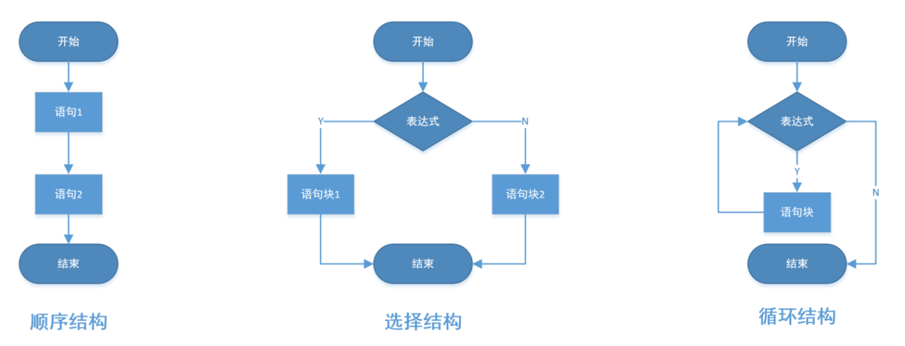
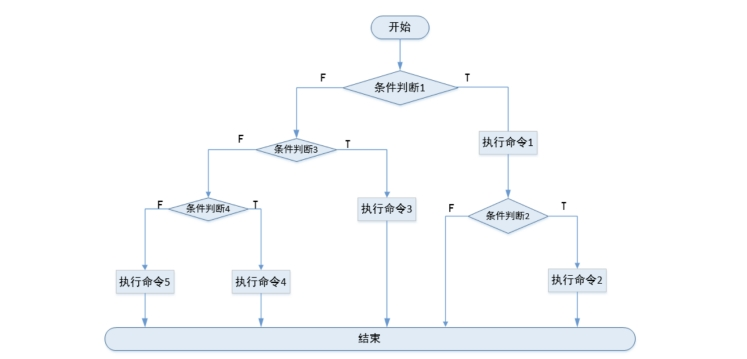

# Shell流程结构

# 一、Shell流程结构

## 1. 什么是流程结构？

流程结构：就是指计算机以什么样的顺序执行这些程序。

## 2. 流程结构分类

程序有三大流程结构分别是：顺序结构、选择结构、循环结构



小结：

Shell脚本一共支持三种流程结构：（顺序结构）、（选择结构）和（循环结构）

# 二、if选择结构

## **1.**  If选择结构

If结构基本语法：

```powershell
if [ condition ];then
	command
	command
fi

或

[ 条件 ] && command
```

案例：上网吧案例，如果用户年龄大于等于18岁，可以正常上网；反之，则好好学习，天天向上！

```powershell
#!/bin/bash
#1.定义一个变量age，用于获取年龄
age=19
#2.使用if结构进行条件判断
if [ $age -ge 18 ]; then
    echo "已成年，可以正常上网"
fi
```

案例：磁盘使用率告警

```powershell
#!/bin/bash

# 获取当前硬盘使用百分比
disk_usage=$(df / | grep / | tr -s ' ' | cut -d ' ' -f5)

# 去掉百分号
disk_usage_no_percent=$(echo "$disk_usage" | tr -d '%')

# 设置硬盘使用警告阈值
threshold=80

# 判断硬盘使用是否超过阈值
if [ $disk_usage_no_percent -gt $threshold ]; then
  echo "警告：磁盘使用超过 $threshold% ! 当前使用：$disk_usage"
fi
```

if...else结构（二选一）基本语法：

```powershell
if [ condition ];then
	command1
else
	command2
fi

或

[ 条件 ] && command1 || command2
```

运行结果：


流程图：流程图就是通过图形的方式描述程序的执行流程！

椭圆形：代表程序的开始或结束

菱形：用于进行条件判断，往往有两个分支，T（True）条件为真 或 F（False）代表条件为假

矩形：用于实现实现普通命令操作

ProcessOn绘图软件

---

案例：上网吧案例，如果用户年龄大于等于18岁，可以正常上网；反之，则好好学习，天天向上！

```powershell
#!/bin/bash
# 1.定义一个变量用于保存年龄
age=19
# 2.使用if...else进行判断
if [ $age -ge 18 ]; then
    echo "已成年，可以正常上网"
else
    echo "未成年，回家好好学习，天天向上"
fi
```


要用到的知识点：获取外部设备（如键盘）输入的信息 => read

```powershell
read  -p  "提示信息，对外展示，和输入数据没有直接关系"  变量
read读取外部信息
-p提示
变量：就是把用户输入的内容保存在变量中
```

案例：上网吧案例，如果用户年龄大于等于18岁，可以正常上网；反之，则好好学习，天天向上！（引入read操作）

```powershell
#!/bin/bash
# 1.提示用户输入年龄信息
read -p "请输入你的年龄：" age
# 2.使用if...else进行判断
if [ $age -ge 18 ]; then
    echo "已成年，可以正常上网"
else
    echo "未成年，回家好好学习，天天向上"
fi
```


if...elif...else结构基本语法：

```powershell
if [ condition1 ];then
		command1   结束
elif [ condition2 ];then
		command2   结束
else
		command3
fi
注释：
如果条件1满足，执行命令1后结束；如果条件1不满足，再看条件2，如果条件2满足执行命令2后结束；如果条件1和条件2都不满足执行命令3结束.

注意事项：if和elif后面都要跟一个then关键字，否则会报错！！！
```

运行原理图：


案例：判断数字位于哪个范围，10以内，10-20之间，20以上

思考：以上题目一共有3种情况，需要多轮判断；

数字小于10 => 10以内

10 <= 数字 <= 20 => 10-20之间

数字大于20 => 20以上

---

最终代码：

```powershell
#!/bin/bash
#1.接收要判断的数字
read -p "请输入一个数字：" num
#2.对num进行判断
if [ $num -lt 10 ]; then
   echo '您输入的数字小于10'
elif [ $num -ge 10 -a $num -le 20 ]; then
   echo '您输入的数字位于10~20之间'
else
   echo '您输入的数字大于20'
fi
```


案例：判断当前主机是否和远程主机是否ping通

前置知识点：

ping -c1 ：让ping命令只返回1次结果

&> /dev/null ：把前面命令的输出，写入到/dev/null空设备中，延伸：只执行命令，但是不显示命令的执行结果

如何判断以上命令执行成功与否？答：可以使用$?

2> &1 ：把错误的信息重定向到标准输出。把错误信息与标准输出一起打印

> &>必须连在一起，是一个整体！！！

> 1代表标准输出（正常输出结果）、2代表标准错误（异常输出结果）、&等价于1 + 2，代表标准输出与标准错误

思路：

```powershell
1. 使用哪个命令实现 ping -c
2. 根据命令的执行结果状态来判断是否通		$?
3. 根据逻辑和语法结构来编写脚本(条件判断或者流程控制)

步骤：
vim ping.sh
#!/bin/bash
#获取远程主机的IP地址（定义变量让用户自己输入）
read -p "请输入你要ping的远程主机IP:" IP

#使用ping命令来判断是否和远程主机互通
ping -c1 $IP &>/dev/null
if [ $? -eq 0 ];then
	echo "当前主机和远程主机$IP是互通的。"	
else
	echo "当前主机和远程主机$IP是不通的。"
fi
```

> 命令执行后，输出信息（标准输出） +  输出错误（标准错误）是可以通过数字表示的，标准输出用1表示，标准错误用2表示，而&（and符号）等价于1 + 2，&> /dev/null就代表把标准输出和标准错误都写入到空设备中.


案例：判断一个进程是否存在

```powershell
思路：
1.查看进程的相关命令 ps -ef、pgrep、ps aux
2.根据命令的返回状态值来判断进程是否存在  $?
3.根据逻辑用脚本语言实现 

#!/bin/bash
# 定义变量
read -p "请输入需要判断的进程名(httpd):" process
# 通过命令来查看进程是否存在
pgrep $process &>/dev/null


# 通过命令执行的状态来判断是否存在
if [ $? -eq 0 ];then
	echo "进程$process存在"
else
	echo "进程$process不存在"
fi
注：pgrep命令：以名称为依据从运行进程队列中查找进程，并显示查找到的进程id
```


案例：判断用户是否存在

前置：

创建一个用户：useradd 用户名称

如何判断用户是否创建成功？答：`id 用户名`

```powershell
#!/bin/bash
read -p "请输入需要判断的用户名：" user
id $user &>/dev/null
test $? -eq 0 && echo "该$user存在" || echo "该$user不存在"
```


小结：if基础结构一共有几种形式？分别是？

3种

① if结构

② if...else结构

③ if...elif...else结构

## 2. if嵌套结构（扩展）

if嵌套就是用于解决多层次判断问题，语法也比较简单，就是一个if语句中又嵌入了一个if语句

疫情期间进入教室学习：经过多层次检测

进入校区（第一层判断，是否有核酸码）

进入教室（第二层判断，体温是否正常）

if [ 核酸码 ]; then

​      if [ 体温是否正常 ]; then

​           进入教室学习

​      fi

fi

```powershell
if [ condition1 ];then
		command1		
		if [ condition2 ];then
			command2
		fi
else
		if [ condition3 ];then
			command3
		elif [ condition4 ];then
			command4
		else
			command5
		fi
fi
注释：
如果条件1满足，执行命令1；如果条件2也满足执行命令2，如果不满足就只执行命令1结束；
如果条件1不满足，不看条件2；直接看条件3，如果条件3满足执行命令3；如果不满足则看条件4，如果条件4满足执行命令4；否则执行命令5
```

运行原理：




案例：判断vsftpd软件包是否安装，如果没有则自动安装（yum源已配好）

前置：

rpm -q指令（query查询） =>  rpm -q 软件名称，就可以判断软件是否已安装

~~~powershell
#!/bin/bash
rpm -q vsftpd &> /dev/null
if [ $? -eq 0 ];then
        echo "vsftpd已经安装"
else
        echo "该软件包没有安装，正在安装...."
        yum install -y vsftpd &> /dev/null

        if [ $? -eq 0 ];then
                echo "vsftpd安装成功"
        else
                echo "vsftpd安装失败"
        fi
fi
~~~


案例：判断当前内核主版本是否为5，且次版本是否大于等于14；如果都满足则输出当前内核版本

前置：

查看操作系统版本 => cat /etc/redhat-release

查看操作系统内核版本 => `uname -r`

为什么要了解Linux内核？答：因为有些软件需要指定的内核版本才能安装。

~~~powershell
思路：
1. 先查看内核的版本号	uname -r
2. 先将内核的版本号保存到一个变量里，然后再根据需求截取出该变量的一部分：主版本和次版本
3. 根据需求进步判断


#!/bin/bash
kernel=`uname -r`
var1=`echo $kernel|cut -d. -f1`
var2=`echo $kernel|cut -d. -f2`
test $var1 -eq 5 -a $var2 -ge 14 && echo $kernel || echo "当前内核版本不符合要求"
或者
[ $var1 -eq 5 -a $var2 -ge 14 ] && echo $kernel || echo "当前内核版本不符合要求"
或者
[[ $var1 -eq 5 && $var2 -ge 14 ]] && echo $kernel || echo "当前内核版本不符合要求"
~~~


小结：

if选择结构是三大流程中使用较多的一种结构，在实际生产环境主要用于进行条件

# 三、case选择结构

作用：case主要用于多分支判断，用于替代多分支的if...elif...else结构

if...elif...else如果是2个分支或3个分支，一般可以使用if...elif...else结构

如果分支判断结构超过3个分支，一般建议采用case多分支结构

## 1. 基本语法

case语句为多选择语句。可以用case语句匹配一个值与一个模式，如果匹配成功，执行相匹配的命令。

基本语法：

```powershell
case var in                   定义变量;var代表是变量名
    pattern 1)                模式1;用 | 分割多个模式，相当于or
        command1         需要执行的语句
    ;;                   	            两个分号代表命令结束
    pattern 2)
        command2
    ;;
    pattern 3)
        command3
    ;;
    *)                                  default，不满足以上模式，默认执行*)下面的语句
        command4
    ;;
esac						         esac表示case语句结束
```

##  2. 场景案例：服务启停脚本实现

生产应用场景：启停脚本

案例1：当给程序传入start、stop、reload三个不同参数时分别执行相应命令。

前置：

条件中可以引入或关系，如start|S)，这句话代表如果用户输入了start或者S，则都会进行匹配！！！

> 如果|出现在条件中，则代表或关系

```powershell
#!/bin/bash
case $1 in
	start|S)
		echo "service is running...."
	;;
	stop|T)
		echo "service is stoped..."
	;;
	reload|R)
		echo "service is restart..."
	;;
	*)
		echo "请输入你要的动作"
	;;
esac

注意：
|代表或含义，比如start|S，代表$1要么匹配start，要么匹配S，只要有一个满足，都会执行下方代码
```


案例2：脚本提示让用户输入需要管理的服务名，然后提示用户需要对服务做什么操作，如启动，关闭，重启等

前置知识点：在命令模式下，回到第一行，输入gg，在输入dG，则代表清空当前文件

```powershell
#!/bin/bash
# 案例：脚本提示让用户输入需要管理的服务名，然后提示用户需要对服务做什么操作，如启动，关闭，重启等
# 1.提示用户输入要管理的服务名称
read -p "请输入要管理的服务名称(如vsftpd)：" service
case $service in
    vsftpd)
        # 2.如果用户输入了ftp软件名称，则继续提示用户输入要执行的操作
        read -p "请输入您要执行的操作：" action
        # 3.引入case语句，实现对软件进行启停操作
        case $action in
            start)
                systemctl start vsftpd
            ;;
            stop)
                systemctl stop vsftpd
            ;;
        esac
    ;;
    firewalld)
        read -p "请输入您要执行的操作：" action
        case $action in
            start)
                systemctl start firewalld
            ;;
            stop)
                systemctl stop firewalld
            ;;
        esac
    ;;
esac
```


# 四、while与for循环

作用：让代码高效重复的执行任务！！！

## 1. while循环结构

**特点：**==条件为真就进入循环；条件为假就退出循环==

### 1.1 语法结构

~~~powershell
while 表达式
	do
		command...
	done
	
while  [ 1 -eq 1 ]
  do
     command
     command
     ...
 done
=========================================================
打印1-5数字

while循环打印：
i=1
while [ $i -le 5 ]
do
	echo $i
	let i++
done

while循环三步走：
第一步：定义一个计数器 => i=0或i=1
第二步：编写[]中的循环条件 => 什么情况下结束循环
第三步：在循环体内部更新计数器的值
~~~

### 1.2 举例说明

1-100累加的和：5050

sum = 1 + 2 + 3 + ... + 98 + 99 + 100

问题：sum = 5050

```powershell
#!/bin/bash
#第一步：定义计数器
i=1
sum=0
#第二步：编写循环条件
while [ $i -le 100 ]
do
  let sum=sum+i
  #第三步：更新计数器的值
  let i++
done
#第四步：当循环结束后，输出最终的sum
echo "1-100的和：$sum"
```

原理说明：

=赋值符号，把右边的结果赋值给左边的变量
sum=sum+i
#第1次循环，i=1，sum+i，相当于0+1 => sum = 1
#第2次循环，i=2，sum+i，相当于1+2 => sum = 1+2
#第3次循环，i=3，sum+i，相当于1+2+3 => sum = 1+2+3
...
#第100次循环，i=100，sum+i，相当于1+2+3+...+99+100 => sum = 1+2+3+...+100


案例1：用while循环计算1-100的偶数和

~~~powershell
#!/bin/bash
#定义变量
sum=0
i=2
#循环打印1-100的偶数和并且计算后重新赋值给sum
while [ $i -le 100 ]
do
	let sum=sum+i
	let i+=2
done
#打印sum的值
echo "1-100的偶数和为:$sum"
~~~


案例2：模拟一个多任务维护界面。当执行程序时先显示总菜单，然后进行选择后做相应维护监控操作。（带界面工具）

前置概念：

① 死循环：死循环（一个依靠自身控制无法终止的程序），死循环本身没有任何意义，但是我们可以把while true与read语句相结合，就可以让代码变得有意义。

```powershell
while true
do
	read -p "提示信息" 变量
	# 下方用于编写要循环的代码
done
```

② EOF定界符，用于定义多行文本（就是一段内容有很多行）

```powershell
cat <<EOF
	要定义的多行文本
EOF（结束符号默认必须顶格写）

cat <<-EOF
	要定义的多行文本
	EOF（结束符号默认必须顶格写，但是如果EOF开头添加了一个-横岗，则结束符可以不顶格，但是必须采用Tab键缩进！！！）
```

案例：

磁盘分区 => fdisk -l

显示磁盘空间 => df -h

查看内存使用 => free -h

查看系统负载 => uptime

退出程序 => exit

```powershell
#!/bin/bash
#打印菜单
cat <<-EOF
	h	显示命令帮助
	f	显示磁盘分区
	d	显示磁盘空间
	m	查看内存使用
	u	查看系统负载
	q	退出程序
EOF

#让用户输入需要的操作
while true
do
read -p "请输入需要操作的选项[f|d]:" var1
case $var1 in
	h)
	cat <<-EOF
        h       显示命令帮助
        f       显示磁盘分区
        d       显示磁盘空间
        m       查看内存使用
        u       查看系统负载
        q       退出程序
	EOF
	;;
	f)
	fdisk -l
	;;
	d)
	df -h
	;;
	m)
	free -m
	;;
	u)
	uptime
	;;
	q)
	exit
	;;
esac
done
```

> 注意：EOF结尾前面只能使用Tab键！！！

### 1.3 系统常规指标

获取CPU指标信息：top指令（可以获取负载、登录用户、系统使用时间、动态进程信息）、uptime（只获取登录用户、系统使用时间、负载信息-1分钟、5分钟、15分钟）

内存指标信息：free -h指令（可以获取总内存、已使用内存、剩余内存信息）

磁盘指标信息：df -h指令（查看磁盘总大小、使用空间大小、剩余空间大小）

扩展：磁盘IO读写（I=Input输入、O=Output输出），主要用于衡量磁盘性能

iostat指令，但是默认情况下，CentOS Stream 9中可能没有这个包，需要额外安装 => sysstat包

```powershell
yum install sysstat -y
[root@node1 ~]# iostat
Linux 5.14.0-511.el9.x86_64 (node1.itcast.cn)   04/09/2025      _x86_64_        (4 CPU)

avg-cpu:  %user   %nice %system %iowait  %steal   %idle
           0.07    0.00    0.60    0.01    0.00   99.32

Device             tps    kB_read/s    kB_wrtn/s    kB_dscd/s    kB_read    kB_wrtn    kB_dscd
dm-0              0.22         2.39        12.69         0.00     290323    1541674          0
sda               0.20         2.88        12.71         0.00     350473    1543813          0

显示内存说明
第1行  Linux 5.14.0-511.el9.x86_64（内核版本）   (node1.itcast.cn)主机名称   04/09/2025时间 _x86_64_CPU型号 （4CPU）几核

第2行 cpu使用信息，avg-cpu:  %user   %nice %system %iowait  %steal   %idle
%user：代表用户进程使用cpu占比
%system：代表系统进程使用cpu占比
%iowait：代表等待处理的io占比，这个值越高代表出现性能瓶颈
%idle：代表cpu空闲率

第3行代表磁盘io信息
sda：代表物理磁盘信息
tps代表每s处理的io信息，衡量磁盘性能
kB_read/s：每s读取的数据信息，单位kB
kB_wrtn/s：每s写入的数据信息，单位kB
kB_read：截止到目前总的读取数据信息，单位kB
kB_wrtn：截止到目前总的写入数据信息，单位kB
```


### 1.4 场景案例：CPU使用率监控与告警

需求：编写一个监控脚本，定时检查系统的 CPU 使用率，如果 CPU 使用率超过设定阈值（临界值=>90%），向指定邮箱发送警报邮件。如果 CPU 使用率恢复到正常范围内，则不发送邮件。邮件内容需包含 CPU 使用率，并且要求中文内容无乱码。

需要提前安装工具`bc`、`sendmail`

```powershell
dnf install bc -y
dnf install sendmail -y

在启动sendmail服务之前，需要更改主机名称，主机名称必须满足FQDN协议，否则会导致邮件无法发送！！！
FQDN主机格式，要求：主机名称/功能 + 公司域名，web.itcast.cn、mysql.itcast.cn、node1.itcast.cn
hostnamectl set-hostname node1.itcast.cn
su

systemctl start sendmail
```

前置知识点：

① 小数运算

```powershell
echo "100 - 98.5" |bc
```

② sendmail邮件发送

```powershell
echo -e "CPU Usage Overload!" | sendmail -t "wangjintao@itcast.cn"
echo -e "CPU Usage Overload! \n Please pay attention in a timely manner!" | sendmail -t "wangjintao@itcast.cn"
以上语句在邮件显示时，会分成2行显示
CPU Usage Overload!
Please pay attention in a timely manner!

echo -e选项说明：
-e代表支持转义字符，如\t相当于一个tab键，\n相当于换行符
```

③  空字符串判断与正则判断

CPU使用率获取时可能出现获取不到的情况，为了避免后续判断出现异常，则可以提前判断cpu空闲率有没有获取到指定信息。-z $cpu_idle

```powershell
-z "$cpu_idle"：判断这个变量是否为空
-z主要判断字符串类型的变量是否为空值！！！
```

```powershell
! "$cpu_idle" =~ ^[0-9]+(\.[0-9]+)?$

=~代表正则判断
变量 =~ 正则表达式（通过字符来表示一个范围）
^(Shift + 6)：托字节，代表以某些内容开始。^[0-9]+代表必须以数字开头
(\.[0-9]+)?$：美元符号，代表以某些内容结尾。(\.[0-9]+)?$代表必须以数字结尾
[0-9]+代表至少有1个数字（+代表1个或者多个）5%、6%、7%、10%、11%、12%
(\.[0-9]+)?代表小数点后至少有1位数字，？代表可能有小数也可能没有小数，比如8.5%
----------------------------------------------------------------------------------------------------------------
^[0-9]+(\.[0-9]+)?$：代表判断是否为数字，如1、2、3；1.0、1.1、1.2这种格式
!代表取反，就是如果数字格式不满足上面格式，则触发

以上正则语句代表，如果$cpu_idle空闲率不是一个数字，则返回为true
```

④ 使用bc进行小数判断

默认情况下，Shell只能对整数类型数字进行大小比较判断操作。但是在Shell脚本中我们可以使用bc进行小数判断。

```powershell
echo "3 > 2" |bc
返回结果比较特殊，如果3>2条件成立，则返回1；反之则返回0
```

特殊情况：什么情况符号两边添加空格，什么时候不加。

答：大部分符号两边都有一个空格，如果是=赋值符号，则不需要空格

⑤ 邮件中文乱码问题

默认情况下，sendmail都是老外开发的，使用的编码格式一般都是ASCII，支持255个字符（包括0-9、A-Z、a-z以及键盘上的其他字符），中文支持不好。这就是所谓乱码

以往老外开发的软件都是基于ASCII，但是软件传入国内以后，发现无法显示中文，研发专门中文编码格式GB2312，后期又升级为GBK（最新的中文编码）

这个软件传入中国台湾，台湾省 => 繁体中文 => Big5编码（支持简体+繁体）

这个软件传入其他国家地区，比如日本省=>jp编码

国际W3C受不了，W3C推出了国际通用编码格式：UTF8（数据库）/UTF-8（网页），一统江湖。


完整代码：

```powershell
#!/bin/bash

# 设置 CPU 使用率阈值（例如：90%）
THRESHOLD=90
# 发送邮件的目标地址
EMAIL="wangjintao@itcast.cn"

while true; do
  # 获取 CPU 空闲率，使用 awk 提取并去掉百分号
  cpu_idle=`top -bn1 |grep "Cpu(s)" |tr -s " " |cut -d" " -f8`

  # 如果 cpu_idle 为空或不是数字，打印调试信息并跳过当前循环
  if [[ -z "$cpu_idle" || ! "$cpu_idle" =~ ^[0-9]+(\.[0-9]+)?$ ]]; then
    echo "无法提取有效的 CPU 空闲率，当前值为：$cpu_idle，跳过本次检查"
    continue
  fi

  # 计算 CPU 使用率（100% - 空闲率）
  cpu_usage=$(echo "100 - $cpu_idle" | bc)

  # 打印调试信息
  echo "当前 CPU 空闲率：$cpu_idle%，CPU 使用率：$cpu_usage%"

  # 使用 bc 进行浮动数值比较
  if [ "$(echo "$cpu_usage >= $THRESHOLD" | bc -l)" -eq 1 ]; then
    # 如果使用率超过阈值，则发送警报邮件
    {
      echo "Subject: CPU 使用率警报"
      echo "To: $EMAIL"
      echo "Content-Type: text/plain; charset=UTF-8"
      echo "Content-Transfer-Encoding: 8bit"
      echo ""
      echo "警告：当前 CPU 使用率已超过 $THRESHOLD%，当前使用率为 ${cpu_usage}%."
    } | sendmail -t
    echo "警报已发送给 $EMAIL，CPU 使用率为 ${cpu_usage}%。"
  fi

  # 每 5 秒钟检查一次
  sleep 5
done
```

> 注：! "$cpu_idle" =~ ^[0-9]+(\.[0-9]+)?$，如果 `$cpu_idle` **不是**一个有效的数字格式（即它既不是整数也不是带有小数点的数字），则执行 `then` 后的操作。

> `echo "$cpu_usage >= $THRESHOLD" | bc -l` 会将表达式 `"$cpu_usage >= $THRESHOLD"` 传递给 `bc` 来进行浮点数计算。如果 `$cpu_usage` 大于等于 `$THRESHOLD`，则返回 "1"，否则返回 "0"。
>
> 然后，`-eq 1` 检查 `bc` 输出是否为 "1"，即判断条件是否成立。

> 常见问题说明：① 容易忽略大小写 ② 容易忽略空格，shell脚本中，选项两边、参数两边、符号两边大部分都有空格

压测命令

```powershell
sudo dnf install stress-ng
```

使用以下命令启动 4 个工作线程来进行 CPU 压测，每个线程会占用一个 CPU 核心：

```powershell
stress-ng --cpu 4 --timeout 60s
--cpu 4 表示启动 4 个进程来占用 CPU，模拟 4 核的压测。
--timeout 60 表示压测持续 60 秒。
```

## 2. for循环结构（重点）

for循环主要用于高效循环以及列表结构的或者数组结构的遍历操作。

遍历：所谓的遍历操作就是把列表 或 数组中的每一个元素查询出来

### 2.1 列表循环

在Shell脚本中，可以通过{}来表示一个范围区间；或者通过空格来表示多个值的情况，都称之为列表！

```powershell
for variable in {list}
do
  command 
  command
  …
done
```

或者

```powershell
for variable in a b c
do
  command
  command
done
```

案例：

```powershell
for var in {1..10};do echo $var;done
for var in 1 2 3 4 5;do echo $var;done
for var in `seq 10`;do echo $var;done
for var in $(seq 10);do echo $var;done
for var in {0..10..2};do echo $var;done
for var in {2..10..2};do echo $var;done
for var in {10..1};do echo $var;done
for var in {10..1..-2};do echo $var;done
for var in `seq 10 -2 1`;do echo $var;done

注：{开始..结束..步长}
步长就是元素与元素之间的差值
{1..10..2}：1 3 5 7 9
`seq 开始...步长...结束`：用于生成列表元素

for var in {1..10};do echo $var;done
等价于
for var in {1..10}
do
	 echo $var
done
```

普及for循环工作原理：

```powershell
for  var   in  {1..5}
do
     echo $var
done

说明：
{1..5} ：本质是列表，列表中一共有5个元素，相当于1、2、3、4、5
默认情况下列表有多少个元素，则for循环就会自动循环多少次
每次循环时，系统会一次自动将列表中的元素放入左边的变量var中

for var in a b c d e
do
     echo $var
done
```


### 2.2 不带列表循环

作用：专门用于接收所有的外部传递过来的参数

sh  脚本.sh   参数1  参数2  参数3

```powershell
for variable
do
    command 
    command
    …
done
```

案例：`vim shell20_variables.sh`

```powershell
#!/bin/bash
echo "脚本后面有 $# 个参数"
for var
do
echo $var
done


执行脚本：
bash shell20_variables.sh 10 20 30 40
```

小结：

① for 变量 in 列表，列表遍历操作

② for 变量没有in，则代表遍历所有外部传入进来的参数

### 2.3 类C风格for循环

① for...in，遍历列表

② 类C风格

```powershell
for (( expr1;expr2;expr3 ))
do
    command
    command
    …
done

for (( i=1;i<=5;i++ ))
do
    echo $i
done


expr1：定义变量并赋初值
expr2：决定是否进行循环（条件）
expr3：决定循环变量如何改变，决定循环什么时候退出

i++ 等价于 i=i +1 等价于 i+=1
+=：相加并赋值，先把表达式进行加法运算，然后把结果赋值给左边的变量
i+=1：先把i和1相加，然后把结果赋值给变量i
i+=2：先把i和2相加，然后把结果赋值给变量i
```

案例：计算1-100之间所有奇数的和

```powershell
思路：
1. 定义一个变量来保存奇数的和	sum=0
2. 找出1-100的奇数，保存到另一个变量里  i
3. 从1-100中找出奇数后，再相加，然后将和赋值给sum变量
4. 遍历完毕后，将sum的值打印出来

#!/bin/bash
#定义一个变量来保存奇数的和
sum=0
#打印1-100的奇数并且相加重新赋值给sum
for i in {1..100..2}
do
	sum=$[ $i + $sum ]
done
#打印1-100的奇数和
echo "1-100的奇数和为:$sum"

#!/bin/bash
#定义一个变量来保存奇数的和
sum=0
#打印1-100的奇数并且相加重新赋值给sum
for (( i=1;i<=100;i+=2))
do
	let sum=sum+$i
	或者
	let sum=sum+i
	或者
	let sum=$sum+$i
done
#打印1-100的奇数和
echo "1-100的奇数和为:$sum"


#!/bin/bash
sum=0
for ((i=1;i<=100;i++))
do
	if [ $[$i%2] -ne 0 ];then
	let sum=sum+$i
	fi
done
echo "1-100的奇数和是:$sum"


#!/bin/bash
sum=0
for ((i=1;i<=100;i++))
do
	[ $[$i%2] -eq 0 ] && true  || let sum=sum+$i
done
echo "1-100的奇数和是:$sum"


延伸：
true	真
:		真
false	 假


方法1：
#!/bin/bash
sum=0
for i in {1..100..2}
do
	sum=$[$i+$sum]
done
echo "1-100的奇数和为:$sum"

方法2：
#!/bin/bash
sum=0
for ((i=1;i<=100;i+=2))
do
	let sum=$i+$sum
done
echo "1-100的奇数和为:$sum"

方法3：
#!/bin/bash
sum=0
for ((i=1;i<=100;i++))
do
	if [ $[$i%2] -ne 0 ];then
	let sum=$sum+$i
	fi
或者
test $[$i%2] -ne 0 && let sum=$sum+$i

done
echo "1-100的奇数和为:$sum"

方法4：
sum=0
for ((i=1;i<=100;i++))
do
	if [ $[$i%2] -eq 0 ];then
	continue
	else
	let sum=$sum+$i
	fi
done
echo "1-100的奇数和为:$sum"

#!/bin/bash
sum=0
for ((i=1;i<=100;i++))
do
	test $[$i%2] -eq 0 && continue || let sum=sum+$i
done
echo "1-100的奇数和是:$sum"
```

注意：有两种情况符号的两边不需要空格

第一种情况：赋值操作，如变量=变量的值

第二种情况：let sum=sum+i，在let中，运算符的两边也不需要添加空格

## 3. 循环中的几个关键词（重点）

作用：以下三个关键词都是用于终止或跳出循环结构。


continue：继续；表示中止本次循环，继而进入下一次循环

一个循环要循环5次，第3次的时候continue，第3次不需要执行，直接进入第4次循环

break：终止；表示终止整个循环结构

一个循环要循环5次，第3次的时候break，则循环直接终止，后面的第4、第5次都不需要执行了

exit：表示终止Shell脚本的执行

一个shell文件，有20行代码，第5行，执行了exit，则整个脚本强制终止


我有5个苹果，中午把这5个苹果都吃掉。吃第1个苹果，吃第2个苹果...吃第5个苹果 => 循环过程

① 比如吃到第3个苹果的时候，发现苹果有虫，这个苹果不吃了，跳过本次循环，继而进入下一次循环 => continue

② 准备吃到第4个苹果的时候，发现已经吃饱了，第4、第5个苹果不吃，终止整个循环 => break


案例1：continue与break

```powershell
#!/bin/bash
for i in {1..5}
do
    if [ $i -eq 3 ]; then
        echo "不好，有虫，这个苹果不吃了"
        continue
    fi
    echo "正在吃第 $i 个苹果"
done
------------------------------------------------------------------------------------------------
#!/bin/bash
for i in {1..5}
do
    if [ $i -eq 4 ]; then
        echo "已经吃饱了，后面的苹果不吃了"
        break
    fi
    echo "正在吃第 $i 个苹果"
done
```

案例2：批量加5个新用户，以u1到u5命名，并统一加一个新组，组名为class，统一改密码为123

回顾用户组相关的文件 => /etc/group（ftp: x :50:）

第1列：组名称

第2列：组密码，默认使用x占位符

第3列：组编号

第4列：组内用户

前置知识点：

grep -w 关键词 文件：用于检查文件中是否包含对应的单词（-w，word代表单词匹配）

useradd itheima =》 ① 创建了一个itheima组 ② 创建itheima账号，然后把itheima账号添加到itheima组里面

useradd -G class itheima =》① 创建itheima账号，然后添加到class组里面

echo 新密码 |passwd --stdin 用户名：给这个用户设置一个密码，--stdin标准输入，管道就是把前面的内容作为后面命令标准 输入

```powershell
思路：
1. 添加用户的命令 			useradd -G
2. 判断class组是否存在	grep -w class /etc/group；echo $?
3. 根据题意，判断该脚本循环5次来添加用户	for循环
4. 给用户设置密码，应该放到循环体里面

#!/bin/bash
#判断class组是否存在
grep -w class /etc/group &>/dev/null
[ $? -ne 0 ] && groupadd class
#批量创建5个用户
for i in {1..5}
do
	useradd -G class u$i
	echo 123|passwd --stdin u$i
done

注：-w 参数用于匹配整个单词

#!/bin/bash
#判断class组是否存在
cut -d: -f1 /etc/group|grep -w class &>/dev/null
[ $? -ne 0 ] && groupadd class

#循环增加用户，循环次数5次，for循环,给用户设定密码
for ((i=1;i<=5;i++))
do
	useradd u$i -G class
	echo 123|passwd --stdin u$i
done


#!/bin/bash
grep -w class /etc/group &>/dev/null
test $? -ne 0 && groupadd class
或者
groupadd class &>/dev/null

for ((i=1;i<=5;i++))
do
useradd -G class u$i && echo 123|passwd --stdin u$i
done
```

案例3：写一个脚本，局域网内，把能ping通的IP和不能ping通的IP分类，并保存到两个文本文件里,这是一个局域网内机器检查通讯的一个思路。

以192.168.88.1~192.168.88.10为例

```powershell
#!/bin/bash
#定义变量
ip=192.168.88
#循环去ping主机的IP
for ((i=1;i<=10;i++))
do
	ping -c1 $ip.$i &>/dev/null
	if [ $? -eq 0 ];then
		echo "$ip.$i is ok" >> /tmp/ip_up.txt
	else
		echo "$ip.$i is down" >> /tmp/ip_down.txt
	fi
	或者
	[ $? -eq 0 ] && echo "$ip.$i is ok" >> /tmp/ip_up.txt || echo "$ip.$i is down" >> /tmp/ip_down.txt
done

[root@server shell03]# time bash ping.sh         

real    0m24.129s
user    0m0.006s
sys     0m0.005s

并行执行：
{程序}&表示将程序放到后台并行执行，如果需要等待程序执行完毕再进行下面内容，需要加wait

#!/bin/bash
#定义变量
ip=192.168.88
#循环去ping主机的IP
for ((i=1;i<=10;i++))
do
{
    ping -c1 $ip.$i &>/dev/null
    if [ $? -eq 0 ];then
            echo "$ip.$i is ok" >> /tmp/ip_up.txt
    else
            echo "$ip.$i is down" >> /tmp/ip_down.txt
    fi
}&
done
wait
echo "ip is ok...."

[root@server ~]# time bash ping.sh 
ip is ok...

real    0m3.091s
user    0m0.001s
sys     0m0.008s
```

## 4. 场景案例：Linux服务器免密登录（面试）

面试：有使用过Shell么？编写过哪些脚本呢？

答：日常巡检、批量免密、批量创建用户、软件安装、指标监控告警

---

作用：让服务器与服务器之间通信不需要通过密码验证

① 生成秘钥对（公钥与私钥）

② 把公钥发送到需要免密的机器

③ 发起登录请求

④ 远程服务器生成随机字符串，然后使用公钥进行加密

⑤ 把加密的字符串返回给登录端，登录端使用私钥进行解密，得到随机字符串

⑥ 把随机字符串发送到服务器，与之前生成的随机字符串进行比对，如果正确，则免密成功，登录服务器

前置知识点：

node1 => 免密登录 => node2

```powershell
ssh-keygen
ssh-copy-id 192.168.88.102
```

案例：

Shell数组：定义一个变量，里面同时保存了多个元素 =>  ()

Shell列表：192.168.88.101  192.168.88.102  192.168.88.103

基本语法：

```powershell
SERVERS=("192.168.88.101" "192.168.88.102" "192.168.88.103")
for SERVER in "${SERVERS[@]}"
do
	echo $SERVER
done
```


```powershell
#!/bin/bash
# 定义服务器 IP 地址列表和用户名
SERVERS=("192.168.88.101" "192.168.88.102" "192.168.88.103")
USER="root"  # 替换为实际的远程用户名

# 生成 SSH 密钥对（如果尚未生成）
[ ! -f "$HOME/.ssh/id_rsa" ] && ssh-keygen -t rsa -N "" -f "$HOME/.ssh/id_rsa"

# 分发公钥到每台服务器
for SERVER in "${SERVERS[@]}"; 
do
    echo "配置免密登录到 $SERVER"
    ssh-copy-id  -o StrictHostKeyChecking=no "$USER@$SERVER"

done
```

遗留一个知识点：expect（让脚本具有交互能力）


# 五、随机数

## 1. 基本语法

~~~powershell
bash默认有一个$RANDOM的变量		默认是0~32767。使用set |grep RANDOM	查看上一次产生的随机数
echo $RANDOM

产生0~1之间的随机数
echo $[$RANDOM%2]

产生0~2之间的随机数
echo $[$RANDOM%3]

产生0~3之间的随机数
echo $[$RANDOM%4]
。。。。
产生0~9内的随机数
echo $[$RANDOM%10]

产生0~100内的随机数
echo $[$RANDOM%101]

产生50-100之内的随机数
echo $[$RANDOM%51+50]

产生三位数的随机数
echo $[$RANDOM%900+100]
~~~

## 2. 案例演示

案例1：写一个脚本，产生一个phonenum.txt文件，随机产生以139开头的手机号1000个，每个一行。

~~~powershell
分析：
1. 产生1000个电话号码，脚本需要循环1000次
2. 139+8位,后8位随机产生，可以让每一位数字都随机产生，$[RANDOM%10] 0-9
3. 将随机产生的数字分别保存到变量里，然后加上139保存到文件里

#!/bin/bash
# random phonenum
# 循环1000次产生电话号码并保存到文件
for i in {1..1000}
do
	n1=$[RANDOM%10]
	n2=$[RANDOM%10]
	n3=$[RANDOM%10]
	n4=$[RANDOM%10]
	n5=$[RANDOM%10]
	n6=$[RANDOM%10]
	n7=$[RANDOM%10]
	n8=$[RANDOM%10]
	echo "139$n1$n2$n3$n4$n5$n6$n7$n8" >> phonenum.txt
done

#!/bin/bash
# random phonenum
# 循环1000次产生电话号码
for ((i=1;i<=1000;i++))
do
	n1=$[$RANDOM%10]
	n2=$[$RANDOM%10]
	n3=$[$RANDOM%10]
	n4=$[$RANDOM%10]
	n5=$[$RANDOM%10]
	n6=$[$RANDOM%10]
	n7=$[$RANDOM%10]
	n8=$[$RANDOM%10]
	echo "139$n1$n2$n3$n4$n5$n6$n7$n8" >> phonenum.txt
done

#!/bin/bash
i=1
while [ $i -le 1000 ]
do
	n1=$[$RANDOM%10]
	n2=$[$RANDOM%10]
	n3=$[$RANDOM%10]
	n4=$[$RANDOM%10]
	n5=$[$RANDOM%10]
	n6=$[$RANDOM%10]
	n7=$[$RANDOM%10]
	n8=$[$RANDOM%10]
	echo "139$n1$n2$n3$n4$n5$n6$n7$n8" >> phonenum.txt
	let i++
done

continue:继续，跳过本次循环，执行下一次循环
break:打断，执行循环体外的代码do..done外
exit:退出程序


#!/bin/bash
for i in {1..1000}
do
	n1=$[$RANDOM%10]
	n2=$[$RANDOM%10]
	n3=$[$RANDOM%10]
	n4=$[$RANDOM%10]
	n5=$[$RANDOM%10]
	n6=$[$RANDOM%10]
	n7=$[$RANDOM%10]
	n8=$[$RANDOM%10]
	echo "139$n1$n2$n3$n4$n5$n6$n7$n8" >> phonenum.txt
done

#!/bin/bash
#create phone num file
for ((i=1;i<=1000;i++))
do
	n1=$[$RANDOM%10]
	n2=$[$RANDOM%10]
	n3=$[$RANDOM%10]
	n4=$[$RANDOM%10]
	n5=$[$RANDOM%10]
	n6=$[$RANDOM%10]
	n7=$[$RANDOM%10]
	n8=$[$RANDOM%10]
	echo "139$n1$n2$n3$n4$n5$n6$n7$n8" |tee -a phonenum.txt
done

#!/bin/bash
count=0
while true
do
	n1=$[$RANDOM%10]
	n2=$[$RANDOM%10]
	n3=$[$RANDOM%10]
	n4=$[$RANDOM%10]
	n5=$[$RANDOM%10]
	n6=$[$RANDOM%10]
	n7=$[$RANDOM%10]
	n8=$[$RANDOM%10]
	echo "139$n1$n2$n3$n4$n5$n6$n7$n8" |tee -a phonenum.txt && let count++
	if [ $count -eq 1000 ];then
		break
	fi
done
~~~

案例2：在上面的1000个手机号里抽奖5个幸运观众，显示出这5个幸运观众。但只显示头3个数和尾号的4个数，中间的都用*代替

思路：

- 确定幸运观众所在的行		       随机生成 RANDOM   $[RANDOM%1000+1]
- 将电话号码提取出来                   head 和 tail  =>  1000行1-1000，$RANDOM%1000+1 => 5
- 显示前3个和后4个数到屏幕     最后将电话号码输出到屏幕   echo ${电话号码部分}

前置：

${字符串变量:开始位置索引，默认从0开始:截取长度}

13975008699

139****8699

${变量:7:4}

~~~powershell
#!/bin/bash
file=/shell02/phonenum.txt
for i in {1..5}
do
	file_num=`wc -l $file |cut -d' ' -f1`
	line=`echo $[$RANDOM%$file_num+1]`
	luck=`head -n $line  $file|tail -1`
	echo "139****${luck:7:4}" && echo $luck >> /shell02/luck_num.txt
done
~~~

案例3：批量创建5个用户，每个用户的密码为一个随机数

思路：

- 循环5次创建用户
- 产生一个密码文件来保存用户的随机密码
- 从密码文件中取出随机密码赋值给用户

~~~powershell
#!/bin/bash
#crate user and set passwd
#产生一个保存用户名和密码的文件
echo user0{1..3}:itcast$[$RANDOM%9000+1000] |tr ' ' '\n'>> user_pass.file
#循环创建5个用户
for ((i=1;i<=5;i++))
do
	user=`head -$i user_pass.file|tail -1|cut -d: -f1`
	pass=`head -$i user_pass.file|tail -1|cut -d: -f2`
	useradd $user
	echo $pass|passwd --stdin $user
done

或者
for i in `cat user_pass.file`
do
	user=`echo $i|cut -d: -f1`
	pass=`echo $i|cut -d: -f2`
	useradd $user
	echo $pass|passwd --stdin $user
done

#!/bin/bash
#crate user and set passwd
#产生一个保存用户名和密码的文件
echo user0{1..3}:itcast$[$RANDOM%9000+1000]#@~|tr ' ' '\n'|tr ':' ' ' >> user_pass.file
#循环创建5个用户
while read user pass
do
useradd $user
echo $pass|passwd --stdin $user
done < user_pass.file
~~~

pwgen工具产生随机密码：

```powershell
基本语法：
pwgen [OPTIONS] [LENGTH [NUMBERS]]
选项：
-c：生成密码时使用大写字母。
-n：生成包含数字的密码。
-b：生成密码时不使用类似易混淆的字符（如 l、1、O、0）

LENGTH：指定密码的长度（默认长度是 8）
NUMBERS：指定要生成的密码数量（默认为 1）

sudo dnf install epel-release -y
sudo dnf install pwgen -y
[root@server shell04]# pwgen -cn1 12
Meep5ob1aesa
[root@server shell04]# echo user0{1..3}:$(pwgen -cn1 12)
user01:Bahqu9haipho user02:Feiphoh7moo4 user03:eilahj5eth2R
[root@server shell04]# echo user0{1..3}:$(pwgen -cn1 12)|tr ' ' '\n'
user01:eiwaShuZo5hi
user02:eiDeih7aim9k
user03:aeBahwien8co
```
